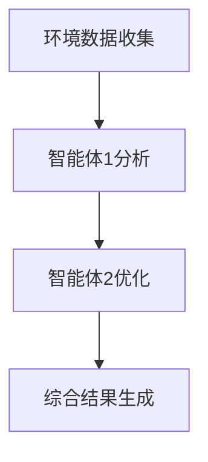
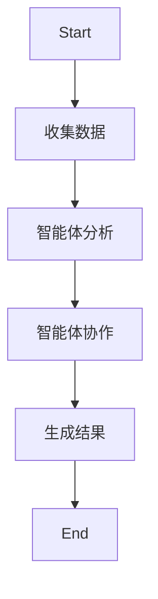
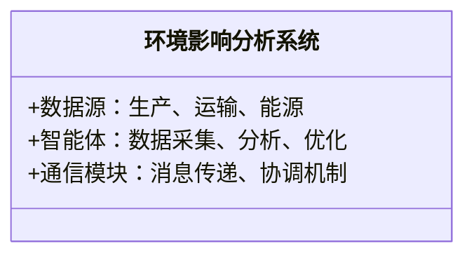
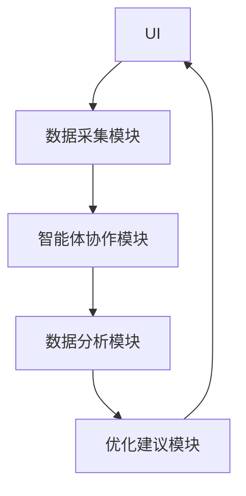
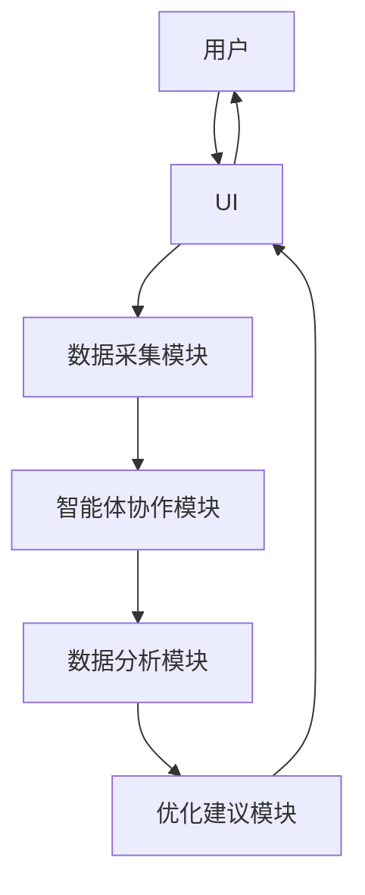

                 


# 智能体协作实现全面的公司环境影响分析

> 关键词：智能体协作，环境影响分析，多智能体系统（MAS），系统架构，算法原理，项目实战

> 摘要：本文深入探讨了智能体协作在公司环境影响分析中的应用。通过分析智能体协作的核心概念、算法原理、系统架构设计以及项目实战，展示了如何利用多智能体系统实现全面的环境影响评估。文章内容丰富，逻辑清晰，旨在为读者提供一个全面的技术视角。

---

## 第1章: 智能体协作与环境影响分析的背景

### 1.1 问题背景与挑战
#### 1.1.1 企业环境影响分析的重要性
企业环境影响分析（EIA）是评估公司运营对环境影响的关键工具。随着全球对可持续发展的关注增加，企业需要更高效的方法来分析其环境足迹，以满足法规要求和提升企业形象。

#### 1.1.2 当前环境影响分析的局限性
传统的环境影响分析方法依赖于静态数据和单一视角，难以捕捉动态变化和多维度影响。例如，仅考虑碳排放而忽视水足迹和资源消耗的综合影响。

#### 1.1.3 智能体协作的优势与潜力
智能体协作通过多智能体系统的分布式计算和自主决策，能够实时分析和优化环境影响，提供更全面和动态的评估结果。

### 1.2 智能体协作的核心概念
#### 1.2.1 智能体的定义与特征
智能体（Agent）是能够感知环境、自主决策并采取行动的实体。其特征包括自主性、反应性、社会性和目标导向性。

#### 1.2.2 智能体协作的定义与分类
智能体协作是指多个智能体通过交互和合作，共同完成复杂任务的过程。根据协作方式，可分为基于规则的协作和基于学习的协作。

#### 1.2.3 环境影响分析的多维度需求
环境影响分析需要考虑碳排放、资源消耗、废弃物处理等多个维度，而智能体协作能够整合这些维度的信息，提供全面的评估。

### 1.3 问题解决与边界
#### 1.3.1 环境影响分析的多维度问题
环境影响分析涉及多个部门和数据源，传统的单点分析方法难以应对复杂性。

#### 1.3.2 智能体协作的解决方案
通过智能体协作，企业可以实时收集、分析和优化环境数据，提供动态的评估结果。

#### 1.3.3 解决方案的边界与外延
智能体协作的边界包括数据源、决策范围和协作智能体的数量，外延则涉及与其他系统的集成和扩展。

---

## 第2章: 智能体协作的核心概念与联系

### 2.1 核心概念原理
#### 2.1.1 智能体协作的基本原理
智能体通过通信和协调，共同完成环境影响分析的任务。每个智能体负责特定的数据收集和分析，然后通过协作生成综合结果。

#### 2.1.2 多智能体系统（MAS）的架构
MAS由多个智能体和环境组成，智能体之间通过通信和协调实现协作。常见的架构包括分布式 MAS 和集中式 MAS。

#### 2.1.3 环境影响分析的智能体模型
环境影响分析的智能体模型包括数据采集智能体、分析智能体和优化智能体，每个智能体负责不同的任务。

### 2.2 核心概念属性对比
#### 2.2.1 智能体与传统算法的对比
智能体具有自主性和目标导向性，而传统算法通常依赖固定的规则和数据。

#### 2.2.2 单智能体与多智能体的对比
单智能体适用于简单任务，而多智能体协作适用于复杂任务，能够提高效率和准确性。

#### 2.2.3 智能体协作的性能对比
多智能体协作在复杂任务中表现优于单智能体，但需要考虑通信和协调的额外开销。

### 2.3 实体关系图（ER图）与流程图
#### 2.3.1 ER实体关系图
```mermaid
erd
  多智能体系统
    端点
      - 智能体ID
      - 环境数据
      - 任务分配
    分析模块
      - 数据分析
      - 优化建议
    通信模块
      - 消息传递
      - 协调机制
```

#### 2.3.2 智能体协作流程图


---

## 第3章: 智能体协作的算法原理

### 3.1 算法原理概述
#### 3.1.1 多智能体协作的基本算法
多智能体协作算法包括分布式规划、协商和任务分配。常用算法有Distributed Planning、Negotiation和Task Assignment。

#### 3.1.2 智能体协作的数学模型
环境影响分析的数学模型可以表示为：
$$
\text{总影响} = \sum_{i=1}^{n} \text{影响}_i
$$

#### 3.1.3 算法流程图


### 3.2 算法实现与代码
#### 3.2.1 环境影响分析的Python实现
```python
class Agent:
    def __init__(self, id):
        self.id = id
        self.data = None

    def collect_data(self, data):
        self.data = data

    def analyze(self):
        return self.data

# 示例用法
agent1 = Agent(1)
agent2 = Agent(2)

agent1.collect_data(100)
agent2.collect_data(200)

result = agent1.analyze() + agent2.analyze()
print(result)
```

#### 3.2.2 智能体协作的代码示例
```python
import threading

class CollaborativeAgent(Agent):
    def __init__(self, id, target):
        super().__init__(id)
        self.target = target
        self.result = 0

    def collaborate(self, agents):
        for agent in agents:
            if agent.id != self.id:
                self.result += agent.analyze()

agent1 = CollaborativeAgent(1, 100)
agent2 = CollaborativeAgent(2, 200)

agent1.collaborate([agent1, agent2])
agent2.collaborate([agent1, agent2])

print(agent1.result)  # 输出 300
print(agent2.result)  # 输出 300
```

### 3.3 算法优化与改进
#### 3.3.1 分布式计算的优化
通过分布式计算，智能体可以并行处理数据，提高计算效率。

#### 3.3.2 协商机制的改进
采用基于市场的协商机制，智能体可以根据优先级和资源分配情况动态调整协作策略。

#### 3.3.3 自适应算法的实现
自适应算法可以根据环境变化自动调整协作策略，提高系统的灵活性和适应性。

---

## 第4章: 系统分析与架构设计

### 4.1 问题场景介绍
环境影响分析系统需要实时收集和处理来自多个部门的数据，包括生产、运输和能源消耗等。

### 4.2 系统功能设计
#### 4.2.1 领域模型类图


#### 4.2.2 系统架构图


### 4.3 系统架构设计
#### 4.3.1 分层架构
系统分为数据采集层、智能体协作层和用户界面层，每一层负责不同的功能。

#### 4.3.2 模块化设计
通过模块化设计，系统可以灵活扩展和维护，每个模块负责特定的功能。

#### 4.3.3 高可用性设计
通过分布式部署和负载均衡，确保系统的高可用性和稳定性。

### 4.4 系统接口设计
#### 4.4.1 智能体协作接口
智能体之间通过标准接口进行通信和协作，确保系统的兼容性和扩展性。

#### 4.4.2 用户界面接口
用户界面提供友好的操作界面，方便用户查看和管理环境影响分析结果。

### 4.5 系统交互设计
#### 4.5.1 交互流程图


---

## 第5章: 项目实战与实现

### 5.1 环境安装
安装Python和相关库，如`mermaid`和`networkx`，用于生成图表和数据可视化。

### 5.2 核心代码实现
#### 5.2.1 数据采集模块
```python
import requests

def collect_data(api_url):
    response = requests.get(api_url)
    return response.json()
```

#### 5.2.2 智能体协作模块
```python
class CollaborativeAgent:
    def __init__(self, id):
        self.id = id
        self.data = None

    def collect_data(self, data):
        self.data = data

    def analyze(self):
        return self.data

    def collaborate(self, agents):
        total = 0
        for agent in agents:
            if agent.id != self.id:
                total += agent.analyze()
        return total
```

#### 5.2.3 数据分析模块
```python
def analyze_results(results):
    return sum(results)
```

### 5.3 代码解读与分析
通过上述代码，智能体可以协作收集和分析数据，生成环境影响分析的综合结果。

### 5.4 案例分析
以某公司为例，展示智能体协作在环境影响分析中的实际应用，包括数据收集、分析和优化建议。

### 5.5 项目小结
总结项目实施的经验和挑战，提出改进建议和未来发展方向。

---

## 第6章: 最佳实践与小结

### 6.1 小结
智能体协作通过多智能体系统的分布式计算和自主决策，能够高效地实现环境影响分析。

### 6.2 最佳实践 tips
- 采用模块化设计，提高系统的灵活性和可维护性。
- 使用分布式计算，提高系统的计算效率。
- 定期更新智能体协作策略，适应环境变化。

### 6.3 注意事项
- 确保智能体之间的通信和协作机制稳定可靠。
- 定期监控和优化系统的性能，避免资源浪费。

### 6.4 拓展阅读
推荐相关书籍和论文，进一步深入学习智能体协作和环境影响分析的知识。

---

## 作者：AI天才研究院/AI Genius Institute & 禅与计算机程序设计艺术 /Zen And The Art of Computer Programming

