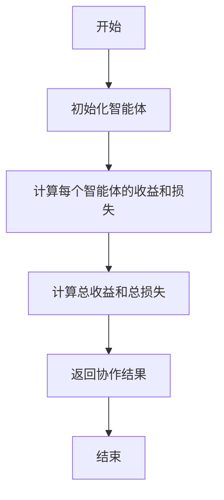
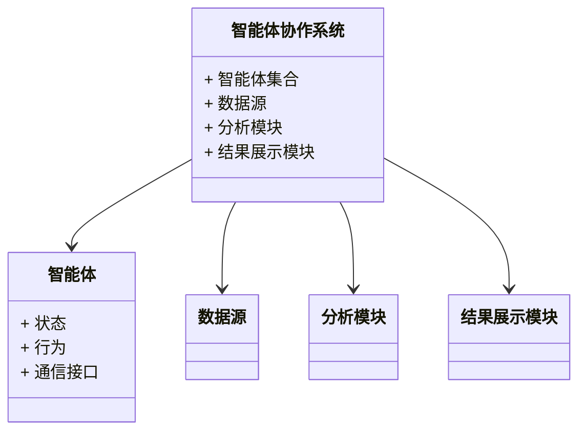

                 


# 智能体协作实现全面的公司社会责任分析

> 关键词：智能体协作，公司社会责任，算法原理，系统架构，项目实战

> 摘要：本文探讨了智能体协作在公司社会责任分析中的应用，详细介绍了智能体协作的基本概念、算法原理、系统架构设计以及项目实战。通过实际案例分析，展示了如何利用智能体协作技术实现对公司社会责任的全面分析，为企业提供科学的决策支持。

---

# 第一部分: 智能体协作与公司社会责任分析的背景介绍

## 第1章: 智能体协作与公司社会责任分析的背景介绍

### 1.1 问题背景与问题描述
公司社会责任（Corporate Social Responsibility，简称CSR）是指企业在追求经济效益的同时，还需要承担对社会、环境和利益相关者的责任。随着全球化和信息化的发展，企业的社会责任问题越来越受到关注。传统的社会责任分析方法往往依赖人工操作，存在效率低、覆盖面窄、数据分散等问题。因此，如何利用智能技术实现对公司社会责任的全面分析，成为一个亟待解决的难题。

智能体协作是一种新兴的技术，它通过多个智能体的协作，能够高效地处理复杂问题。智能体协作在公司社会责任分析中的应用，可以实现对企业社会责任的多维度、多层次分析，从而为企业提供更加全面和精准的决策支持。

### 1.2 智能体协作的核心要素与概念结构
智能体协作的核心要素包括智能体的定义、协作机制、通信协议和任务分配策略。智能体是一个具有感知、决策和执行能力的实体，能够独立完成特定任务。多个智能体通过协作，可以完成复杂问题的解决。

公司社会责任分析的核心概念包括经济责任、法律责任、伦理责任和社会责任。智能体协作可以通过对这些维度的全面分析，帮助企业识别和评估其社会责任的履行情况。

### 1.3 公司社会责任的定义与外延
公司社会责任是指企业在经营过程中，不仅要追求经济效益，还需要关注社会、环境和利益相关者的福祉。具体包括以下方面：
1. **经济责任**：提供高质量的产品和服务，创造就业机会，缴纳 taxes。
2. **法律责任**：遵守法律法规，保护消费者权益。
3. **伦理责任**：遵循商业道德，避免不正当竞争。
4. **社会责任**：关注环境保护、社区发展和员工福利。

### 1.4 智能体协作与公司社会责任的联系
智能体协作在公司社会责任分析中的作用主要体现在以下几个方面：
1. **数据收集与整合**：智能体可以实时收集企业的社会责任相关数据，包括经济、法律、伦理和社会责任等方面的信息。
2. **多维度分析**：通过智能体协作，可以对企业的社会责任进行多维度的分析，发现潜在问题并提出改进建议。
3. **动态监控**：智能体协作可以实现对企业社会责任的动态监控，及时发现和应对新的挑战。

---

## 第2章: 智能体协作的核心概念与联系

### 2.1 智能体协作的核心原理
智能体协作是一种基于分布式计算和人工智能技术的协作机制。智能体通过通信和协作，共同完成复杂任务。智能体协作的核心原理包括以下几个方面：
1. **分布式计算**：智能体可以在不同的计算节点上运行，实现任务的分布式处理。
2. **多智能体通信**：智能体之间通过通信协议进行信息交换，共享数据和知识。
3. **协作任务分配**：智能体根据任务需求和自身能力，动态分配协作任务。
4. **自适应调整**：智能体可以根据环境变化和任务需求，自适应地调整协作策略。

### 2.2 智能体协作的核心要素对比
智能体协作的核心要素包括智能体的类型、协作方式和通信协议等。以下是智能体协作的核心要素对比表：

| **要素**       | **描述**                                                                 |
|----------------|--------------------------------------------------------------------------|
| 智能体类型     | 可分为简单反射型智能体、基于模型的反射型智能体、目标驱动型智能体和效用驱动型智能体。 |
| 协作方式       | 可分为并行协作和串行协作。                                                |
| 通信协议       | 包括基于消息队列的通信协议和基于事件驱动的通信协议。                      |
| 任务分配策略   | 包括轮询分配、负载均衡分配和基于优先级的分配策略。                        |

### 2.3 智能体协作的ER实体关系图
以下是智能体协作的ER实体关系图（使用mermaid）：

```mermaid
erDiagram
    actor 智能体协作系统 {
        role 智能体1
        role 智能体2
        role 智能体3
    }
    actor 智能体协作系统 --> role 智能体1
    actor 智能体协作系统 --> role 智能体2
    actor 智能体协作系统 --> role 智能体3
```

---

## 第3章: 智能体协作的算法原理

### 3.1 智能体协作算法的数学模型
智能体协作算法的数学模型主要由收益函数和损失函数组成。收益函数用于衡量智能体协作带来的收益，损失函数用于衡量协作过程中产生的损失。

收益函数的数学表达式为：
$$ R = \sum_{i=1}^{n} r_i $$
其中，$r_i$ 表示第 $i$ 个智能体的收益。

损失函数的数学表达式为：
$$ L = \sum_{i=1}^{n} l_i $$
其中，$l_i$ 表示第 $i$ 个智能体的损失。

### 3.2 智能体协作算法的实现
以下是智能体协作算法的Python实现代码：

```python
def collaboration_algorithm(smart_agents):
    total_reward = 0
    total_loss = 0
    for agent in smart_agents:
        total_reward += agent.reward
        total_loss += agent.loss
    return total_reward - total_loss

# 示例使用
class SmartAgent:
    def __init__(self, reward, loss):
        self.reward = reward
        self.loss = loss

agent1 = SmartAgent(10, 5)
agent2 = SmartAgent(15, 7)
agent3 = SmartAgent(20, 3)

agents = [agent1, agent2, agent3]
result = collaboration_algorithm(agents)
print("协作结果:", result)
```

### 3.3 算法流程图
以下是算法流程图（使用mermaid）：



---

## 第4章: 智能体协作系统的架构设计

### 4.1 系统问题场景介绍
公司社会责任分析的场景描述如下：
- 企业需要对自身的经济、法律、伦理和社会责任进行分析。
- 分析数据来源广泛，包括企业内部数据、公开数据和第三方数据。
- 分析结果需要动态更新，并提供实时监控。

智能体协作在系统中的应用：
- 智能体负责收集和处理社会责任相关数据。
- 多智能体协作实现对社会责任的多维度分析。

### 4.2 系统功能设计
以下是系统功能设计的类图（使用mermaid）：



以下是系统架构图（使用mermaid）：


---

## 第5章: 智能体协作系统的项目实战

### 5.1 环境安装与配置
为了运行智能体协作系统，需要安装以下环境和库：
- Python 3.8 或更高版本
- numpy、pandas、matplotlib 等数据分析库
- mermaid 图形库

安装命令：
```bash
pip install numpy pandas matplotlib
```

### 5.2 系统核心实现
以下是系统核心实现的Python代码：

```python
import numpy as np
import pandas as pd
import matplotlib.pyplot as plt

class SmartAgent:
    def __init__(self, name, reward, loss):
        self.name = name
        self.reward = reward
        self.loss = loss

    def get_total(self):
        return self.reward - self.loss

# 创建智能体实例
agent1 = SmartAgent("智能体1", 10, 5)
agent2 = SmartAgent("智能体2", 15, 7)
agent3 = SmartAgent("智能体3", 20, 3)

# 计算协作结果
total = 0
for agent in [agent1, agent2, agent3]:
    total += agent.get_total()

print("协作结果:", total)

# 可视化展示
agents = [agent1, agent2, agent3]
names = [agent.name for agent in agents]
values = [agent.get_total() for agent in agents]

plt.bar(names, values)
plt.title("智能体协作结果")
plt.xlabel("智能体名称")
plt.ylabel("协作结果")
plt.show()
```

### 5.3 实际案例分析
以下是一个实际案例的分析：
1. **案例背景**：某企业需要分析其社会责任履行情况。
2. **数据准备**：收集企业的经济、法律、伦理和社会责任相关数据。
3. **算法实现**：使用智能体协作算法对数据进行分析。
4. **结果展示**：生成可视化图表，展示协作结果。

通过上述步骤，企业可以全面了解其社会责任履行情况，并根据分析结果进行相应的改进。

---

## 第6章: 智能体协作的最佳实践与注意事项

### 6.1 最佳实践 tips
- 在智能体协作系统设计中，合理分配任务，确保每个智能体的负载均衡。
- 定期更新智能体的协作策略，以适应环境的变化。
- 使用高效的通信协议，减少协作过程中的延迟。

### 6.2 小结
智能体协作在公司社会责任分析中的应用，不仅可以提高分析效率，还能实现对企业社会责任的全面分析。通过合理设计系统架构和算法，可以为企业提供科学的决策支持。

### 6.3 注意事项
- 智能体协作系统的复杂度较高，需要专业的技术人员进行开发和维护。
- 在实际应用中，需要注意数据隐私和安全问题。
- 系统的可扩展性和可维护性也是设计中需要重点关注的问题。

---

作者：AI天才研究院/AI Genius Institute & 禅与计算机程序设计艺术 /Zen And The Art of Computer Programming

