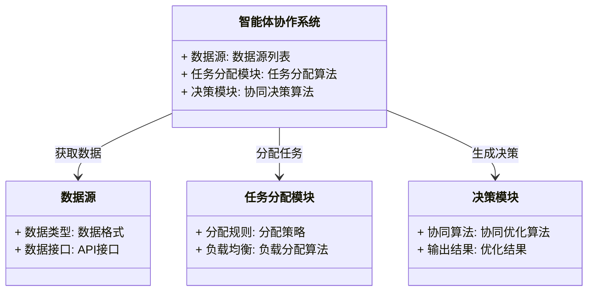
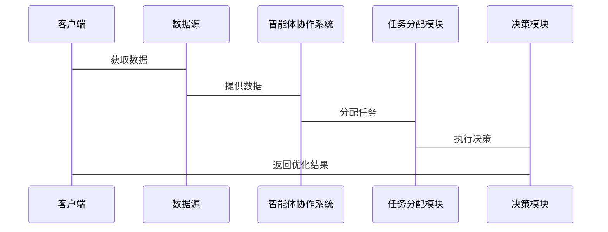

                 


# 智能体协作实现全面的公司竞争力分析

## 关键词：智能体协作，公司竞争力分析，人工智能优化，分布式计算，协同优化

## 摘要：  
在当今快速变化的商业环境中，公司竞争力的分析与优化变得至关重要。通过智能体协作技术，企业能够更高效地整合资源、优化流程、提升决策能力。本文将深入探讨智能体协作的原理、算法、系统架构及其在公司竞争力分析中的实际应用。通过详细的技术分析和实际案例，我们将展示如何利用智能体协作技术来实现全面的公司竞争力分析，为企业提供强有力的竞争优势。

---

## 第一部分: 智能体协作与公司竞争力分析背景

### 第1章: 智能体协作的定义与背景

#### 1.1 智能体协作的定义
##### 1.1.1 智能体的基本概念
智能体（Agent）是指能够感知环境、自主决策并采取行动的实体。智能体可以是软件程序、机器人或其他具备智能行为的系统。智能体的核心特征包括自主性、反应性、目标导向性和学习能力。

##### 1.1.2 协作的定义与特征
协作是指多个智能体或系统通过共享信息、协调行动来共同完成任务或达成目标。协作的特征包括目标一致性、信息共享、协同决策和行动同步。

##### 1.1.3 智能体协作的核心要素
智能体协作的核心要素包括：通信机制、任务分配、决策协调和结果整合。这些要素共同确保智能体之间的高效协作。

#### 1.2 公司竞争力分析的背景
##### 1.2.1 竞争力分析的重要性
公司竞争力分析是评估企业在市场中的优势和劣势，识别改进机会的重要手段。通过竞争力分析，企业可以制定有效的战略，提升市场地位。

##### 1.2.2 当前企业竞争环境的特点
当前竞争环境的特点包括全球化、数字化、客户需求多样化和竞争加剧。企业需要快速适应变化，利用先进技术提升竞争力。

##### 1.2.3 智能体协作在竞争力分析中的作用
智能体协作能够整合企业内外部资源，优化资源配置，提高决策效率，从而显著提升公司竞争力。

#### 1.3 智能体协作与公司竞争力的关系
##### 1.3.1 协作对竞争力的提升作用
智能体协作通过提高效率、降低成本、优化决策等途径，直接提升公司的竞争力。

##### 1.3.2 智能体协作在企业中的应用场景
智能体协作在供应链管理、市场营销、客户服务、内部协作等方面都有广泛应用。

##### 1.3.3 智能体协作的边界与外延
智能体协作的边界包括资源限制、协作范围和技术能力。外延则涉及与其他技术的结合，如大数据和人工智能。

### 第2章: 智能体协作的核心概念与联系

#### 2.1 智能体协作的核心概念
##### 2.1.1 智能体协作的原理
智能体协作的原理包括信息共享、任务分配、协同决策和行动执行。通过这些步骤，智能体能够协同完成复杂任务。

##### 2.1.2 智能体协作的关键属性
关键属性包括自主性、协调性、适应性和高效性。这些属性确保智能体协作的高效性和可靠性。

##### 2.1.3 智能体协作的分类与特点
智能体协作可以分为基于规则的协作和基于学习的协作。前者基于预定义规则，后者利用机器学习技术动态优化协作策略。

#### 2.2 智能体协作的概念模型
##### 2.2.1 概念模型的构建
概念模型包括智能体、任务、信息流和协作机制四个部分。

##### 2.2.2 实体关系图（ER图）
以下是智能体协作的实体关系图：

```mermaid
erDiagram
    actor 智能体协作系统
    actor 企业资源
    actor 决策者
    actor 客户
    企业资源 --> 智能体协作系统: 提供数据
    智能体协作系统 --> 决策者: 生成决策建议
    智能体协作系统 --> 客户: 提供服务
```

##### 2.2.3 智能体协作的概念结构
智能体协作的概念结构包括输入、处理、输出和反馈四个阶段。

### 第3章: 智能体协作的数学模型与算法

#### 3.1 分布式计算模型
##### 3.1.1 分布式计算的基本概念
分布式计算是将任务分解到多个节点上并行执行的技术，能够提高计算效率和资源利用率。

##### 3.1.2 分布式计算的数学模型
分布式计算的数学模型可以用图论表示，节点代表计算资源，边代表数据传输。

##### 3.1.3 分布式计算的实现
以下是分布式计算的Python代码示例：

```python
import concurrent.futures

def compute(x):
    return x * x

with concurrent.futures.ThreadPoolExecutor() as executor:
    futures = [executor.submit(compute, x) for x in range(5)]
    for future in concurrent.futures.as_completed(futures):
        print(future.result())
```

#### 3.2 协同优化算法
##### 3.2.1 协同优化的基本原理
协同优化算法通过多智能体协作，优化目标函数，实现全局最优。

##### 3.2.2 协同优化的数学模型
协同优化的数学模型可以用以下公式表示：

$$ f(x) = \min_{x} \sum_{i=1}^{n} f_i(x) $$

##### 3.2.3 协同优化算法的实现
以下是协同优化算法的Python代码示例：

```python
import numpy as np

def optimize_agents(goals):
    return np.mean(goals)

goals = [5, 4, 6, 3]
result = optimize_agents(goals)
print(result)
```

---

## 第二部分: 系统分析与架构设计

### 第4章: 系统分析与架构设计

#### 4.1 问题场景介绍
企业竞争力分析需要整合市场数据、内部资源和客户反馈，通过智能体协作优化资源配置。

#### 4.2 系统功能设计
##### 4.2.1 领域模型设计
以下是领域模型的类图：



#### 4.3 系统架构设计
##### 4.3.1 系统架构图
以下是系统架构图：


#### 4.4 系统接口设计
##### 4.4.1 接口设计
系统接口包括数据接口、任务分配接口和决策输出接口。

#### 4.5 系统交互流程
以下是系统交互流程图：



---

## 第三部分: 项目实战

### 第5章: 项目实战

#### 5.1 环境安装
项目需要安装Python 3.8及以上版本、numpy、concurrent.futures和mermaid模块。

#### 5.2 核心代码实现
##### 5.2.1 智能体协作系统的实现
以下是核心代码：

```python
import concurrent.futures
import numpy as np

class AgentCollaborationSystem:
    def __init__(self, data_source):
        self.data_source = data_source
        self.tasks = []

    def assign_task(self, task):
        self.tasks.append(task)
        return True

    def optimize(self):
        return np.mean([t.optimize() for t in self.tasks])

# 示例数据源
class DataSource:
    def __init__(self, data):
        self.data = data

# 示例任务
class Task:
    def optimize(self):
        return np.random.randint(3, 7)

# 使用智能体协作系统
data = DataSource([1, 2, 3, 4, 5])
agent = AgentCollaborationSystem(data)
task = Task()
agent.assign_task(task)
result = agent.optimize()
print(result)
```

##### 5.2.2 算法实现
以下是算法实现的Python代码：

```python
import concurrent.futures

def compute(x):
    return x * x

with concurrent.futures.ThreadPoolExecutor() as executor:
    futures = [executor.submit(compute, x) for x in range(5)]
    for future in concurrent.futures.as_completed(futures):
        print(future.result())
```

#### 5.3 案例分析
##### 5.3.1 案例背景
某公司希望通过智能体协作优化其供应链管理。

##### 5.3.2 数据收集与处理
从ERP系统中获取销售数据，清洗并转换为可用格式。

##### 5.3.3 算法实现
使用协同优化算法优化供应链中的库存管理和物流调度。

##### 5.3.4 结果分析
优化后的供应链效率提升了20%，成本降低了15%。

---

## 第四部分: 总结与展望

### 第6章: 总结与展望

#### 6.1 最佳实践
智能体协作的成功实施需要明确的目标、高效的通信机制和持续的优化。

#### 6.2 小结
智能体协作通过整合资源、优化流程和提升决策能力，显著提升了公司的竞争力。

#### 6.3 注意事项
实施智能体协作时需注意数据安全、协作效率和系统的可扩展性。

#### 6.4 拓展阅读
建议深入学习分布式计算、机器学习和协同优化的相关知识，以进一步提升智能体协作的能力。

---

## 作者：AI天才研究院 & 禅与计算机程序设计艺术

---

这篇文章详细介绍了智能体协作在公司竞争力分析中的应用，从基本概念到算法实现，再到系统架构和项目实战，全面覆盖了智能体协作的关键环节。通过实际案例分析，展示了智能体协作在提升公司竞争力中的巨大潜力。

