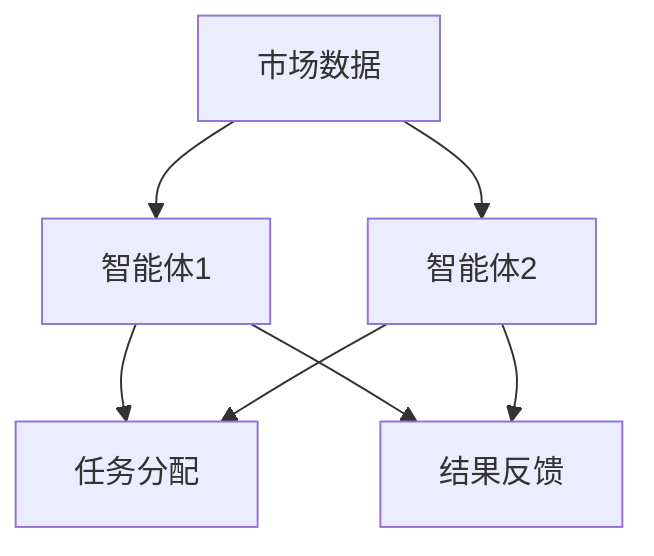
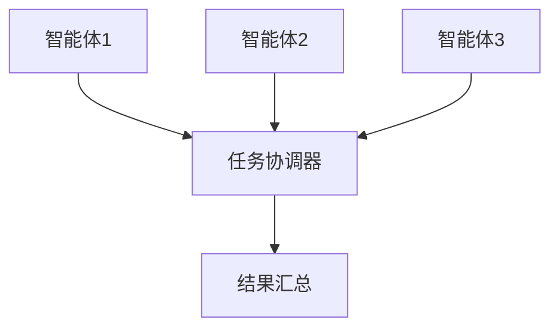
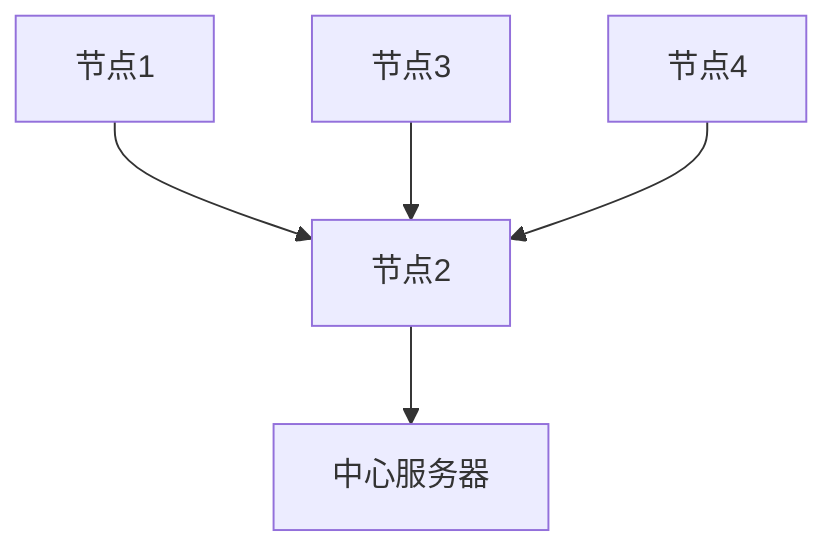
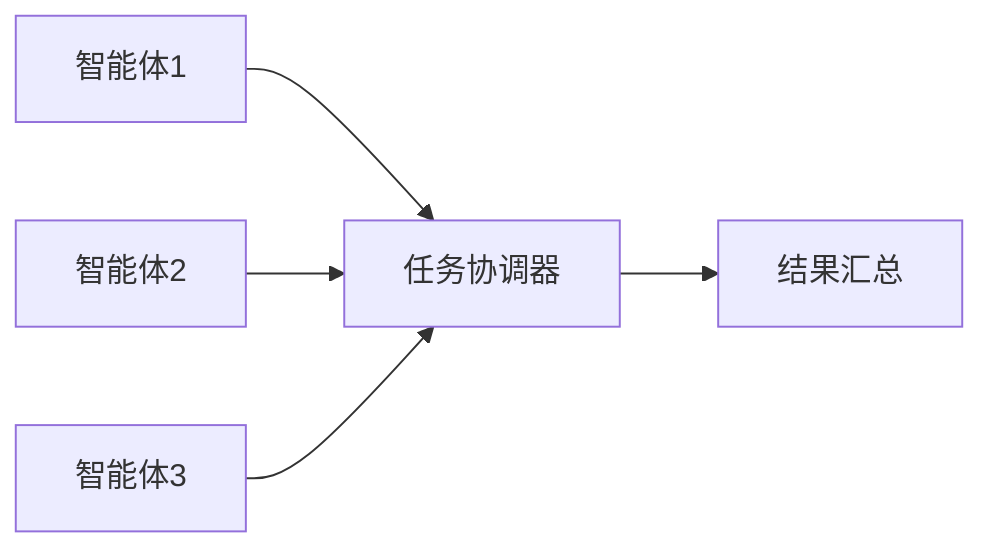
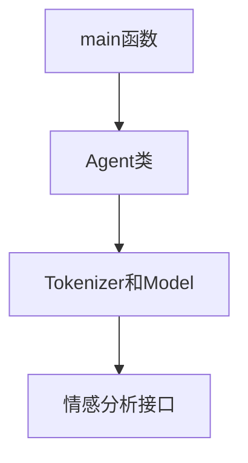

                 


# 智能体协作实现全面的市场情绪分析

> 关键词：智能体协作、市场情绪分析、分布式计算、情感分析、多智能体系统

> 摘要：本文将详细介绍智能体协作在市场情绪分析中的应用。通过结合多智能体系统和分布式计算技术，我们能够实现对市场情绪的全面分析。本文将从背景介绍、核心概念、算法原理、系统架构、项目实战以及最佳实践等多个方面展开，全面解析智能体协作如何助力市场情绪分析。

---

## 第1章: 智能体协作与市场情绪分析概述

### 1.1 市场情绪分析的背景与意义

#### 1.1.1 市场情绪分析的定义
市场情绪分析是通过对金融市场中的文本数据（如新闻、社交媒体评论、公司财报等）进行分析，以判断市场参与者的情绪状态（如乐观、悲观、中立等）。这种分析可以帮助投资者、分析师等更好地理解市场动态，做出更明智的决策。

#### 1.1.2 市场情绪分析的重要性
- 帮助投资者识别市场趋势。
- 提供及时的市场反馈，辅助投资决策。
- 量化市场情绪，为量化交易提供数据支持。

#### 1.1.3 智能体协作在市场情绪分析中的作用
传统的市场情绪分析方法通常依赖于单点计算，难以处理大规模、实时性的数据。而智能体协作通过分布式计算和多智能体协同，可以高效地处理海量数据，提升分析的准确性和实时性。

### 1.2 智能体协作的核心概念

#### 1.2.1 智能体的定义与特点
- **智能体**：能够感知环境并采取行动以实现目标的实体。
- **特点**：
  - 自主性
  - 反应性
  - 协作性
  - 学习能力

#### 1.2.2 多智能体系统的概念
多智能体系统是由多个智能体组成的分布式系统，智能体之间通过通信和协作完成共同的目标。

#### 1.2.3 智能体协作的原理
智能体协作通过以下步骤实现：
1. **感知环境**：智能体通过传感器或数据接口获取环境信息。
2. **目标设定**：根据环境信息，智能体设定协作目标。
3. **任务分配**：智能体之间协商任务分工。
4. **协作执行**：各智能体协同完成任务。
5. **反馈与优化**：根据结果反馈，优化协作策略。

### 1.3 市场情绪分析的核心技术

#### 1.3.1 自然语言处理技术
自然语言处理（NLP）技术用于从文本中提取情感信息，包括分词、句法分析、情感抽取等。

#### 1.3.2 情感分析算法
情感分析算法用于判断文本的情感倾向，包括基于规则的算法、机器学习算法和深度学习算法。

#### 1.3.3 分布式系统架构
分布式系统架构通过多智能体协作，实现对大规模数据的并行处理，提升分析效率。

## 第2章: 市场情绪分析的核心概念与联系

### 2.1 多智能体系统的实体关系

#### 2.1.1 实体关系图（ER图）


#### 2.1.2 智能体协作的实体关系


#### 2.1.3 分布式系统中的实体关系


### 2.2 智能体协作的核心原理

#### 2.2.1 智能体协作的数学模型
智能体协作的数学模型可以表示为：
$$
f(x) = \sum_{i=1}^{n} a_i x_i
$$
其中，$a_i$ 是智能体 $i$ 的权重，$x_i$ 是智能体 $i$ 的输入。

#### 2.2.2 智能体协作的算法流程


#### 2.2.3 智能体协作的优缺点对比
| 特性       | 优点           | 缺点           |
|------------|----------------|----------------|
| 分布式     | 高扩展性       | 复杂性较高     |
| 并行计算    | 提高效率       | 同步问题       |
| 协作能力    | 提升准确性     | 协调成本       |

## 第3章: 智能体协作的算法原理

### 3.1 情感分析算法

#### 3.1.1 基于规则的情感分析
```python
def rule_based_sentiment_analysis(text):
    positive_words = ["good", "excellent", "great"]
    negative_words = ["bad", "terrible", "horrible"]
    sentiment = "neutral"
    for word in text.split():
        if word in positive_words:
            sentiment = "positive"
        elif word in negative_words:
            sentiment = "negative"
    return sentiment
```

#### 3.1.2 基于机器学习的情感分析
```python
from sklearn.feature_extraction.text import TfidfVectorizer
from sklearn.svm import SVC

vectorizer = TfidfVectorizer()
model = SVC()
```

#### 3.1.3 基于深度学习的情感分析
```python
import tensorflow as tf
from tensorflow.keras import layers

model = tf.keras.Sequential([
    layers.Embedding(input_dim=10000, output_dim=16),
    layers.Conv1D(filters=16, kernel_size=5, padding="same"),
    layers.GlobalMaxPooling1D(),
    layers.Dense(1, activation="sigmoid")
])
```

### 3.2 分布式协作算法

#### 3.2.1 分布式计算的基本原理
$$
\text{计算结果} = \sum_{i=1}^{n} f(x_i)
$$

#### 3.2.2 智能体协作的算法流程


#### 3.2.3 分布式协作的数学模型
$$
f(x) = \frac{1}{n}\sum_{i=1}^{n} a_i x_i
$$
其中，$a_i$ 是智能体 $i$ 的权重，$x_i$ 是智能体 $i$ 的输入。

### 3.3 算法实现与优化

#### 3.3.1 算法实现的步骤
1. 数据预处理：清洗和分词。
2. 情感分析：使用深度学习模型进行预测。
3. 结果汇总：将各个智能体的结果进行融合。
4. 结果优化：根据反馈调整模型参数。

#### 3.3.2 算法优化的策略
- 并行计算优化
- 分布式训练优化
- 模型调优

## 第4章: 市场情绪分析的系统架构设计

### 4.1 系统功能设计

#### 4.1.1 系统功能模块划分
- 数据获取模块
- 情感分析模块
- 结果汇总模块
- 反馈优化模块

#### 4.1.2 系统功能的流程图


### 4.2 系统架构设计

#### 4.2.1 系统架构的分层设计


#### 4.2.2 智能体协作的架构图


#### 4.2.3 系统架构的优缺点分析
| 特性       | 优点           | 缺点           |
|------------|----------------|----------------|
| 分布式     | 高扩展性       | 复杂性较高     |
| 并行计算    | 提高效率       | 同步问题       |
| 协作能力    | 提升准确性     | 协调成本       |

### 4.3 系统接口设计

#### 4.3.1 系统接口的定义
```python
interface MarketSentimentAnalyzer {
    def analyze(text: str) -> str
}
```

#### 4.3.2 系统接口的交互流程


## 第5章: 智能体协作的项目实战

### 5.1 项目环境安装

#### 5.1.1 开发环境的搭建
- Python 3.8+
- PyTorch 1.9+
- Transformers 4.12+

#### 5.1.2 依赖库的安装
```bash
pip install numpy pandas scikit-learn tensorflow transformers
```

#### 5.1.3 开发工具的配置
- 使用Jupyter Notebook进行开发
- 使用PyCharm进行调试

### 5.2 项目核心实现

#### 5.2.1 情感分析模型的实现
```python
from transformers import AutoTokenizer, AutoModelForSequenceClassification
import torch

tokenizer = AutoTokenizer.from_pretrained("bert-base-uncased")
model = AutoModelForSequenceClassification.from_pretrained("bert-base-uncased")
```

#### 5.2.2 智能体协作算法的实现
```python
class Agent:
    def __init__(self, id):
        self.id = id
        self.model = ...  # 情感分析模型
```

#### 5.2.3 系统功能的实现
```python
def main():
    agents = [Agent(1), Agent(2), Agent(3)]
    text = "The market is performing well."
    results = []
    for agent in agents:
        result = agent.analyze(text)
        results.append(result)
    final_sentiment = sum(results) / len(results)
    print(final_sentiment)
```

### 5.3 项目代码解读与分析

#### 5.3.1 代码结构的分析


#### 5.3.2 关键代码的解读
- `Agent` 类实现了智能体的基本功能。
- `analyze` 方法调用预训练的情感分析模型进行预测。

#### 5.3.3 代码优化的建议
- 并行化数据处理
- 使用更高效的模型架构
- 增加反馈机制

### 5.4 项目案例分析

#### 5.4.1 实际案例的介绍
分析某段时间内的新闻数据，判断市场情绪。

#### 5.4.2 案例分析的步骤
1. 数据收集
2. 数据预处理
3. 情感分析
4. 结果汇总
5. 结果分析

#### 5.4.3 案例分析的结果与总结
- 数据量越大，分析结果越准确。
- 智能体协作能够显著提高分析效率。

## 第6章: 智能体协作的最佳实践与注意事项

### 6.1 最佳实践 tips

#### 6.1.1 系统设计中的注意事项
- 合理分配任务
- 增加容错机制
- 定期优化模型

#### 6.1.2 代码实现中的技巧
- 使用分布式框架（如Dask）
- 优化数据通信
- 提高并行效率

#### 6.1.3 系统优化的建议
- 使用更高效的算法
- 增加缓存机制
- 优化网络通信

### 6.2 小结

- 本文详细介绍了智能体协作在市场情绪分析中的应用。
- 通过多智能体系统的协作，可以高效地处理大规模数据。
- 智能体协作的应用前景广阔，值得进一步研究和探索。

---

作者：AI天才研究院/AI Genius Institute & 禅与计算机程序设计艺术 /Zen And The Art of Computer Programming

---

以上是根据用户的查询和要求逐步生成的文章大纲和内容，涵盖了从背景介绍到项目实战的各个方面，详细讲解了智能体协作在市场情绪分析中的应用。

