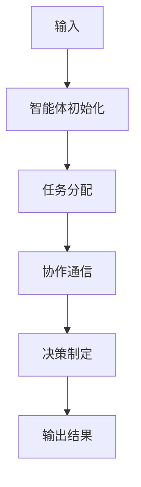
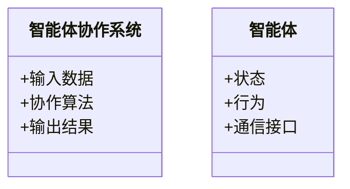
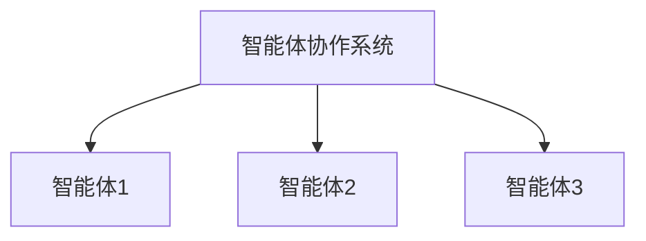
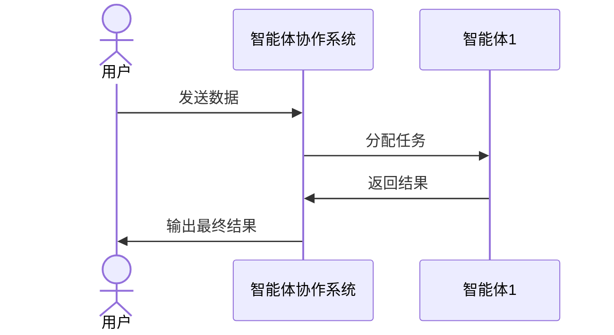

                 


# 智能体协作实现全面的风险评估与管理

> 关键词：智能体协作、风险管理、风险评估、多智能体系统、协作算法

> 摘要：本文探讨了智能体协作在风险管理中的应用，详细介绍了智能体协作的核心概念、算法原理、系统架构、项目实战及最佳实践。通过分析智能体协作的优势与挑战，提出了在风险管理领域实现全面风险评估与管理的解决方案。

---

# 第一部分: 智能体协作与风险管理背景

## 第1章: 智能体协作与风险管理概述

### 1.1 智能体协作的背景与意义

#### 1.1.1 风险管理的传统模式与挑战
传统的风险管理依赖于人工评估和单点分析，存在效率低、覆盖范围有限、难以应对复杂场景等问题。例如，在金融领域，传统的风险评估主要依赖历史数据分析，难以实时捕捉市场动态变化中的潜在风险。

#### 1.1.2 智能体协作的定义与特点
智能体协作是指多个智能体通过协同工作，共同完成复杂任务的过程。其特点包括分布式、自主性、协作性和动态性。每个智能体都有明确的目标，并能够通过通信协议进行信息共享和决策。

#### 1.1.3 智能体协作在风险管理中的优势
智能体协作能够实现多维度、实时的风险评估，通过分布式计算和协作学习，显著提高风险预测的准确性和响应速度。

### 1.2 风险评估与管理的核心概念

#### 1.2.1 风险的定义与分类
风险是指在特定条件下，某种事件发生的可能性及其可能带来的损失。常见的风险分类包括市场风险、信用风险、操作风险等。

#### 1.2.2 风险评估的基本流程
风险评估通常包括识别风险源、量化风险概率和影响、制定应对策略等步骤。

#### 1.2.3 风险管理的目标与策略
风险管理的目标是通过降低风险发生的概率或减少其影响，保障系统的稳定运行。常用策略包括风险规避、风险转移和风险缓解。

### 1.3 智能体协作在风险管理中的应用前景

#### 1.3.1 智能体协作的潜在应用场景
智能体协作在金融、医疗、能源等领域具有广泛应用潜力，特别是在实时监控、应急响应和决策支持方面。

#### 1.3.2 智能体协作的优势与挑战
优势包括高效性、实时性和灵活性；挑战主要集中在通信延迟、数据隐私和协作协调性方面。

#### 1.3.3 未来发展趋势与研究方向
未来的研究将聚焦于智能体协作的优化算法、多模态数据处理能力以及分布式系统的安全性。

---

# 第二部分: 智能体协作的核心概念与联系

## 第2章: 智能体协作的原理与机制

### 2.1 智能体协作的基本原理

#### 2.1.1 单智能体与多智能体系统
单智能体系统通常用于简单任务，而多智能体系统适用于复杂场景，能够通过协作提高整体性能。

#### 2.1.2 智能体协作的核心要素
智能体协作的核心要素包括目标一致性、通信机制、决策策略和学习能力。

#### 2.1.3 智能体协作的通信机制
通信机制是智能体协作的基础，包括信息传递、状态同步和任务分配。

### 2.2 智能体协作的关键技术

#### 2.2.1 多智能体系统架构
常见的架构包括集中式架构和分布式架构。集中式架构依赖中央控制节点，而分布式架构则更注重去中心化。

#### 2.2.2 协作协议与通信协议
协作协议定义了智能体之间的交互规则，通信协议则规定了信息传递的方式和格式。

#### 2.2.3 协作策略与决策机制
协作策略包括任务分配、资源分配和冲突解决，决策机制则依赖于多智能体的实时信息共享和联合推理。

### 2.3 智能体协作的属性对比分析

#### 2.3.1 智能体协作的属性特征表
| 属性 | 描述 |
|------|------|
| 分布式 | 多智能体协作 |
| 自主性 | 智能体具有自主决策能力 |
| 协作性 | 智能体之间能够协同工作 |

#### 2.3.2 智能体协作与传统协作方式的对比
| 特性 | 智能体协作 | 传统协作 |
|------|----------|----------|
| 自主性 | 高 | 低 |
| 实时性 | 高 | 中 |
| 灵活性 | 高 | 低 |

#### 2.3.3 智能体协作的ER实体关系图
```mermaid
er
actor: 智能体协作系统
role: 协作智能体
relationship: 参与
```

---

## 3.2 协作算法的数学模型

#### 3.2.1 协作算法的数学模型
$$ f(x) = \sum_{i=1}^{n} w_i x_i $$

#### 3.2.2 协作策略的优化模型
$$ \text{Maximize} \quad \sum_{i=1}^{n} u_i $$
$$ \text{Subject to} \quad \sum_{i=1}^{n} w_i = 1 $$

---

## 3.3 协作算法的实现代码

```python
def collaborative_algorithm(input_data):
    # 初始化智能体
    agents = initialize_agents()
    # 任务分配
    tasks = assign_tasks(input_data)
    # 信息同步
    shared_info = synchronize_info(agents, tasks)
    # 决策制定
    decision = make_decision(agents, shared_info)
    return decision
```

---

# 第三部分: 智能体协作的算法原理

## 第3章: 智能体协作算法的核心原理

### 3.1 协作算法的基本框架

#### 3.1.1 协作算法的输入与输出
输入包括原始数据和协作参数，输出是协作结果和反馈信息。

#### 3.1.2 协作算法的流程图


### 3.2 协作算法的数学模型

#### 3.2.1 协作算法的基本公式
$$ f(x) = \sum_{i=1}^{n} w_i x_i $$

#### 3.2.2 协作策略的优化模型
$$ \text{Maximize} \quad \sum_{i=1}^{n} u_i $$
$$ \text{Subject to} \quad \sum_{i=1}^{n} w_i = 1 $$

### 3.3 协作算法的实现代码

```python
def collaborative_algorithm(input_data):
    # 初始化智能体
    agents = initialize_agents()
    # 任务分配
    tasks = assign_tasks(input_data)
    # 信息同步
    shared_info = synchronize_info(agents, tasks)
    # 决策制定
    decision = make_decision(agents, shared_info)
    return decision
```

---

# 第四部分: 智能体协作的系统架构设计

## 第4章: 智能体协作系统架构

### 4.1 系统功能设计

#### 4.1.1 领域模型


#### 4.1.2 系统架构图


### 4.2 系统接口设计

#### 4.2.1 系统接口设计
智能体协作系统需要定义清晰的通信接口，包括数据格式、消息传递和反馈机制。

#### 4.2.2 系统交互图


---

# 第五部分: 项目实战

## 第5章: 智能体协作项目实战

### 5.1 环境安装

#### 5.1.1 安装依赖
需要安装Python、相关库（如numpy、scikit-learn）和协作框架。

### 5.2 系统核心实现

#### 5.2.1 核心代码实现
```python
def initialize_agents(n):
    return [Agent(i) for i in range(n)]

class Agent:
    def __init__(self, id):
        self.id = id
        self.data = None
```

### 5.3 案例分析与解读

#### 5.3.1 实际案例分析
以金融风险管理为例，智能体协作系统能够实时监控市场波动，预测潜在风险。

---

# 第六部分: 最佳实践与总结

## 第6章: 最佳实践与总结

### 6.1 小结
智能体协作在风险管理中的应用前景广阔，但仍需解决通信延迟和数据隐私等问题。

### 6.2 注意事项
在实际应用中，应注重系统的可扩展性和安全性，避免单点故障。

### 6.3 拓展阅读
推荐阅读相关领域的学术论文和技术报告，深入了解智能体协作的前沿技术。

---

# 作者：AI天才研究院 & 禅与计算机程序设计艺术

