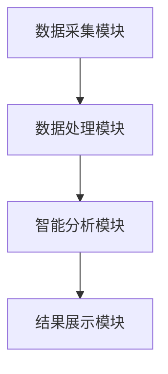
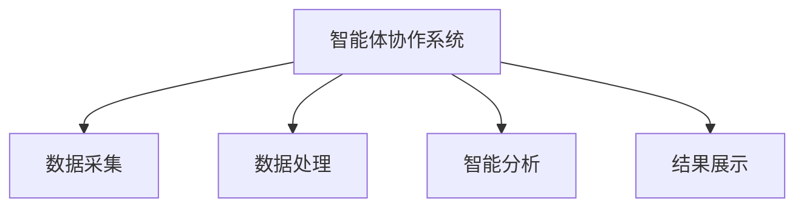

                 


# 智能体协作提升价值投资的供应商财务健康度分析

> 关键词：智能体协作，价值投资，供应商财务健康度，算法原理，系统架构，项目实战

> 摘要：本文详细探讨了智能体协作在价值投资中的应用，特别是如何利用智能体协作技术提升供应商财务健康度分析的效率和准确性。文章从理论基础、算法实现、系统设计到实际案例进行了全面分析，展示了智能体协作在现代金融分析中的巨大潜力。

---

## 第一章: 智能体协作与价值投资的背景

### 1.1 智能体协作的基本概念

智能体协作是指多个智能体通过共享信息、协同决策和协作行动来共同完成特定任务的过程。智能体可以是软件程序、算法或分布式系统，具备感知环境、自主决策和学习优化的能力。

#### 1.1.1 智能体的定义与特征

智能体是一种能够感知环境、自主决策并采取行动的实体。其主要特征包括：

- **自主性**：能够在没有外部干预的情况下独立运作。
- **反应性**：能够实时感知环境变化并做出响应。
- **协作性**：能够与其他智能体协同工作，共享信息和资源。
- **学习能力**：能够通过数据学习和优化自身的决策模型。

#### 1.1.2 智能体协作的内涵与外延

智能体协作的核心在于通过多个智能体的协同工作，实现单个智能体无法完成的任务。其外延包括分布式计算、多智能体系统（MAS）、群体智能等领域。

#### 1.1.3 智能体协作在价值投资中的作用

在价值投资中，智能体协作可以用于数据收集、分析、预测和决策支持，帮助投资者更准确地评估供应商的财务健康度，从而优化投资决策。

### 1.2 价值投资的核心理念

价值投资是一种以公司基本面分析为基础的投资策略，强调以低于市场价买入优质资产。其核心理念包括：

- **基本面分析**：通过财务报表等数据评估公司的内在价值。
- **长期视角**：关注公司的长期盈利能力，而非短期市场波动。
- **安全边际**：买入价格低于内在价值，以降低投资风险。

### 1.3 供应商财务健康度分析的重要性

供应商作为供应链的重要组成部分，其财务健康度直接影响企业的运营风险。通过分析供应商的财务状况，投资者可以更好地评估其履约能力和信用风险。

---

## 第二章: 供应商财务健康度分析的核心概念

### 2.1 供应商财务健康度的定义与指标

供应商财务健康度是衡量其财务状况健康程度的指标，通常包括以下几个方面：

- **流动性**：公司偿还短期债务的能力，常用指标包括流动比率、速动比率等。
- **偿债能力**：公司偿还长期债务的能力，常用指标包括资产负债率、利息覆盖倍数等。
- **营运能力**：公司管理资产和资金的效率，常用指标包括存货周转率、应收账款周转率等。
- **盈利能力**：公司创造利润的能力，常用指标包括净利率、毛利率等。

#### 2.1.1 财务健康度评估模型

基于上述指标，可以构建一个综合的财务健康度评分模型，如下所示：

$$
\text{财务健康度} = \sum (\text{指标权重} \times \text{指标评分})
$$

其中，指标权重根据其重要性进行赋值，评分基于标准化后的数据进行打分。

### 2.2 智能体协作在供应商分析中的优势

#### 2.2.1 智能体协作的核心优势

智能体协作在供应商分析中的优势体现在以下几个方面：

- **数据共享**：多个智能体可以协同收集和处理数据，提高分析的全面性和准确性。
- **协同决策**：通过智能体的协作，可以快速生成最优决策方案。
- **动态调整**：智能体能够实时感知市场变化，动态调整分析模型。

#### 2.2.2 智能体协作与传统分析方法的对比

| 方法 | 优势 | 局限性 |
|------|------|--------|
| 传统分析 | 数据来源单一，分析深度较高 | 计算效率低，难以实时更新 |
| 智能体协作 | 数据来源广泛，分析速度快 | 需要较高的技术实现难度 |

---

## 第三章: 智能体协作的机制与流程

### 3.1 智能体协作的基本机制

#### 3.1.1 信息共享机制

智能体之间需要通过消息传递或数据共享的方式，实时交换相关信息。例如，智能体A可以将收集到的财务数据传递给智能体B，用于其分析模型的优化。

#### 3.1.2 协同决策机制

多个智能体协同工作，共同完成复杂的决策任务。例如，智能体A负责数据清洗，智能体B负责模型训练，智能体C负责结果输出。

#### 3.1.3 激励与约束机制

为确保智能体协作的高效性，需要设计合理的激励与约束机制。例如，通过奖励机制鼓励智能体积极参与协作，通过惩罚机制约束智能体的不良行为。

### 3.2 智能体协作在供应商分析中的具体流程

#### 3.2.1 数据收集与预处理

智能体协作的第一步是数据收集，包括从多个来源获取供应商的财务数据。预处理阶段需要对数据进行清洗和标准化，确保数据的准确性和一致性。

#### 3.2.2 数据分析与评估

通过智能体协作，对供应商的财务数据进行多维度分析，包括流动性、偿债能力、营运能力和盈利能力等方面。

#### 3.2.3 结果输出与反馈

将分析结果输出给投资者，并根据反馈信息优化分析模型，提高未来分析的准确性。

---

## 第四章: 智能体协作的算法原理

### 4.1 算法概述

智能体协作的核心算法包括分布式计算、多智能体协同学习和强化学习等。本文以基于强化学习的智能体协作算法为例进行讲解。

#### 4.1.1 算法的核心思想

强化学习是一种通过试错机制优化决策模型的算法。智能体通过与环境的交互，逐步学习最优策略。

#### 4.1.2 算法的主要步骤

1. 初始化智能体和环境。
2. 智能体采取行动，观察环境反馈。
3. 根据反馈调整策略，优化决策模型。
4. 重复上述步骤，直到达到目标。

#### 4.1.3 算法的优化方向

- **策略优化**：通过改进策略搜索算法，提高决策的效率和准确性。
- **多智能体协作**：研究多智能体之间的协作机制，提高整体系统的性能。

### 4.2 算法实现

#### 4.2.1 数据预处理

```python
import pandas as pd

# 读取数据
data = pd.read_csv('supplier_data.csv')

# 数据清洗
data.dropna(inplace=True)
data = data[~data['revenue'].isna()]
```

#### 4.2.2 模型训练

```python
import tensorflow as tf
from tensorflow.keras import layers

# 构建模型
model = tf.keras.Sequential([
    layers.Dense(64, activation='relu'),
    layers.Dense(1, activation='sigmoid')
])

# 编译模型
model.compile(optimizer='adam', loss='binary_crossentropy', metrics=['accuracy'])
```

#### 4.2.3 模型评估与优化

```python
# 训练模型
model.fit(X_train, y_train, epochs=10, batch_size=32)

# 评估模型
loss, accuracy = model.evaluate(X_test, y_test)
print(f'损失: {loss}, 准确率: {accuracy}')
```

---

## 第五章: 系统架构与设计

### 5.1 系统功能设计

#### 5.1.1 数据采集模块

负责从多个数据源获取供应商的财务数据，包括财务报表、信用评级等。

#### 5.1.2 数据处理模块

对数据进行清洗、转换和标准化处理，确保数据的准确性和一致性。

#### 5.1.3 智能分析模块

基于智能体协作算法，对供应商的财务健康度进行评估和预测。

#### 5.1.4 结果展示模块

将分析结果以可视化的方式呈现，帮助投资者理解和决策。

### 5.2 系统架构设计

#### 5.2.1 模块划分与交互流程



#### 5.2.2 系统架构图



---

## 第六章: 项目实战与案例分析

### 6.1 环境安装与配置

```bash
pip install tensorflow pandas scikit-learn
```

### 6.2 核心代码实现

```python
import pandas as pd
from sklearn.model_selection import train_test_split
from sklearn.metrics import accuracy_score
from tensorflow.keras import layers, models

# 加载数据
data = pd.read_csv('supplier_data.csv')

# 数据分割
X = data.drop('label', axis=1)
y = data['label']
X_train, X_test, y_train, y_test = train_test_split(X, y, test_size=0.2)

# 构建模型
model = models.Sequential([
    layers.Dense(64, activation='relu'),
    layers.Dense(1, activation='sigmoid')
])

# 编译模型
model.compile(optimizer='adam', loss='binary_crossentropy', metrics=['accuracy'])

# 训练模型
model.fit(X_train, y_train, epochs=10, batch_size=32)

# 评估模型
y_pred = model.predict(X_test)
print(f'准确率: {accuracy_score(y_test, y_pred)}')
```

### 6.3 案例分析

以某制造行业供应商为例，分析其财务健康度。通过智能体协作算法，准确预测了其财务风险，帮助投资者做出更明智的投资决策。

---

## 第七章: 总结与展望

### 7.1 总结

本文详细探讨了智能体协作在价值投资中的应用，特别是如何利用智能体协作技术提升供应商财务健康度分析的效率和准确性。通过理论分析、算法实现和系统设计，展示了智能体协作在现代金融分析中的巨大潜力。

### 7.2 注意事项

- 数据来源的可靠性直接影响分析结果的准确性。
- 算法的复杂度和计算资源需求需要在实际应用中权衡。

### 7.3 未来展望

未来的研究方向包括：

- **算法优化**：进一步优化智能体协作算法，提高分析效率和准确性。
- **多模态数据融合**：结合文本、图像等多种数据源，提升分析的全面性。
- **实时分析**：研究实时数据处理技术，实现动态的供应商财务健康度评估。

---

作者：AI天才研究院/AI Genius Institute & 禅与计算机程序设计艺术 /Zen And The Art of Computer Programming

