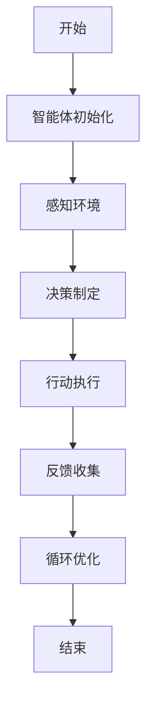
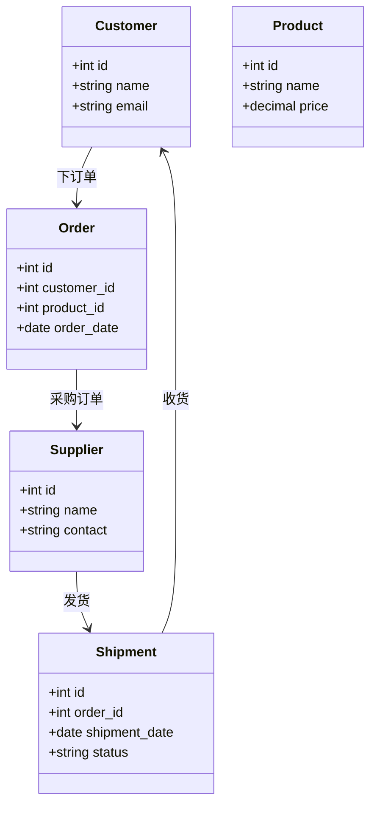

                 


# 智能体协作提升价值投资的供应链弹性评估

> 关键词：智能体协作，供应链弹性评估，价值投资，多智能体系统，分布式协作，供应链优化

> 摘要：本文探讨智能体协作在供应链弹性评估中的应用，分析如何通过多智能体系统实现供应链的优化与弹性提升。文章从核心概念、算法原理、系统架构到项目实战，详细阐述了智能体协作在供应链弹性评估中的作用，并提供了实际案例和最佳实践。

---

## 第1章 智能体协作与供应链弹性评估的背景

### 1.1 智能体协作的定义与特点

#### 1.1.1 智能体的基本概念
智能体（Agent）是指能够感知环境并采取行动以实现目标的实体。智能体可以是软件程序、机器人或其他具备自主决策能力的系统。

#### 1.1.2 智能体协作的核心特点
- **自主性**：智能体能够自主决策，无需外部干预。
- **协作性**：多个智能体能够协同工作，共同完成任务。
- **分布式性**：智能体可以分布在不同的地理位置或系统中，通过通信进行协作。
- **适应性**：智能体能够根据环境变化调整行为。

#### 1.1.3 智能体协作与传统供应链管理的区别
传统供应链管理依赖于中心化的协调和决策，而智能体协作通过分布式决策和自主协作实现供应链的动态优化。

---

### 1.2 供应链弹性评估的定义与重要性

#### 1.2.1 供应链弹性的定义
供应链弹性是指供应链在面对不确定性（如市场波动、自然灾害等）时，能够快速恢复并保持稳定供应的能力。

#### 1.2.2 供应链弹性评估的必要性
- **应对不确定性**：供应链弹性评估可以帮助企业应对突发事件，减少中断风险。
- **优化供应链效率**：通过评估弹性，企业可以识别瓶颈并优化供应链结构。
- **提升竞争力**：具备弹性的供应链能够更快响应市场需求，提升企业竞争力。

#### 1.2.3 供应链弹性评估的指标体系
- **恢复时间**：从供应链中断到恢复正常供应所需的时间。
- **成本影响**：供应链中断对企业成本的影响程度。
- **资源冗余度**：供应链中冗余资源的数量及其分布情况。
- **供应商多样性**：供应商的数量和地理分布。

---

### 1.3 智能体协作在供应链弹性评估中的作用

#### 1.3.1 智能体协作如何提升供应链弹性
智能体协作通过分布式决策和自主协作，能够在供应链中断时快速调整资源分配，减少中断时间。

#### 1.3.2 智能体协作在价值投资中的应用
智能体协作可以帮助投资者评估供应链的弹性，从而做出更明智的投资决策，降低投资风险。

#### 1.3.3 智能体协作与供应链弹性的关系
智能体协作通过优化供应链的动态调整能力，直接提升供应链的弹性，从而为企业和投资者创造更大的价值。

---

## 第2章 智能体协作的核心概念与联系

### 2.1 智能体协作的核心原理

#### 2.1.1 智能体协作的理论基础
智能体协作基于分布式系统理论、博弈论和多智能体系统理论，强调智能体之间的通信与协作。

#### 2.1.2 智能体协作的实现机制
- **通信机制**：智能体通过消息传递进行信息共享。
- **决策机制**：智能体基于本地信息和全局目标做出决策。
- **协调机制**：通过协调协议确保智能体协作的一致性。

#### 2.1.3 智能体协作的优化方法
- **局部优化**：优化单个智能体的决策以提升整体效率。
- **全局优化**：通过协调机制实现整体最优。

---

### 2.2 智能体协作与供应链弹性的关系

#### 2.2.1 供应链弹性评估的智能体协作模型
智能体协作模型将供应链中的各个环节视为智能体，通过协作实现供应链的弹性评估。

#### 2.2.2 智能体协作对供应链弹性的影响
智能体协作能够快速响应供应链中的变化，提升供应链的弹性和恢复能力。

#### 2.2.3 智能体协作在供应链弹性评估中的应用案例
例如，在自然灾害发生时，智能体协作能够迅速调整供应链中的资源分配，减少中断时间。

---

### 2.3 智能体协作的核心概念对比表

| 概念                | 传统供应链管理                | 智能体协作供应链管理                |
|---------------------|------------------------------|-----------------------------------|
| 决策方式            | 中心化决策                   | 分布式决策                       |
| 协调机制            | 人工协调                     | 自动化协调                       |
| 响应速度            | 较慢                        | 较快                            |
| 灵活性                | 较低                        | 较高                            |

---

### 2.4 智能体协作的ER实体关系图

```mermaid
erDiagram
    customer[CUSTOMER] {
        +int customer_id
        +string name
        +string email
    }
    supplier[SUPPLIER] {
        +int supplier_id
        +string name
        +string contact
    }
    product(PRODUCT) {
        +int product_id
        +string name
        +decimal price
    }
    order(ORDER) {
        +int order_id
        +int customer_id
        +int product_id
        +date order_date
    }
    shipment(SHIPMENT) {
        +int shipment_id
        +int order_id
        +date shipment_date
        +string status
    }
    CUSTOMER "1--N" orders "多对多" SUPPLIER
    SUPPLIER "1--N" products "多对多" PRODUCT
    CUSTOMER "1--N" orders "多对多" SUPPLIER
    SUPPLIER "1--N" shipments "多对多" CUSTOMER
```

---

## 第3章 智能体协作的算法原理与数学模型

### 3.1 智能体协作的核心算法

#### 3.1.1 分布式协作算法
分布式协作算法通过智能体之间的通信和协商实现协作。

#### 3.1.2 多智能体协同算法
多智能体协同算法通过协调多个智能体的行为，实现共同目标。

#### 3.1.3 智能体协作的优化算法
优化算法通过改进智能体的决策策略，提升协作效率。

---

### 3.2 供应链弹性评估的数学模型

#### 3.2.1 供应链弹性评估的数学公式
$$E = \frac{1}{1 + e^{-x}}$$
其中，E表示供应链的弹性，x表示外部冲击的强度。

#### 3.2.2 智能体协作对数学模型的影响
智能体协作通过优化决策参数，提升供应链弹性的评估精度。

#### 3.2.3 数学模型的优化与改进
通过引入智能体协作机制，数学模型能够更好地反映供应链的实际状况。

---

### 3.3 智能体协作算法的Mermaid流程图



---

## 第4章 智能体协作的系统架构设计

### 4.1 问题场景介绍
供应链中断可能导致企业损失，智能体协作可以帮助企业快速恢复供应链。

### 4.2 系统功能设计

#### 4.2.1 领域模型Mermaid类图


---

### 4.3 系统架构设计Mermaid架构图


---

## 第5章 项目实战

### 5.1 环境安装
- 安装Python和相关库（如numpy、pandas、scikit-learn）。

### 5.2 核心代码实现

```python
def distributed_collaboration(customers, suppliers):
    for customer in customers:
        customer.suppliers = suppliers
        customer.orders = get_orders(customer.id)
        for supplier in customer.suppliers:
            supplier.orders = get_supplier_orders(supplier.id)
    return customers, suppliers
```

### 5.3 代码解读与分析
- 代码实现智能体协作的逻辑，通过循环实现供应商和客户的订单分配。

### 5.4 实际案例分析
通过具体案例分析智能体协作在供应链弹性评估中的应用效果。

---

## 第6章 最佳实践、小结与扩展阅读

### 6.1 最佳实践 tips
- 定期进行供应链弹性演练，确保智能体协作的有效性。
- 采用先进的智能体协作算法，提升供应链的弹性。

### 6.2 小结
本文详细介绍了智能体协作在供应链弹性评估中的应用，通过理论分析和实际案例，展示了智能体协作的优势和价值。

### 6.3 注意事项
- 智能体协作的实现需要考虑系统的安全性和稳定性。
- 定期更新算法和模型，以适应市场变化。

### 6.4 拓展阅读
- 推荐阅读相关领域的最新研究论文和书籍，深入理解智能体协作的理论与应用。

---

## 作者信息

作者：AI天才研究院/AI Genius Institute & 禅与计算机程序设计艺术 /Zen And The Art of Computer Programming

