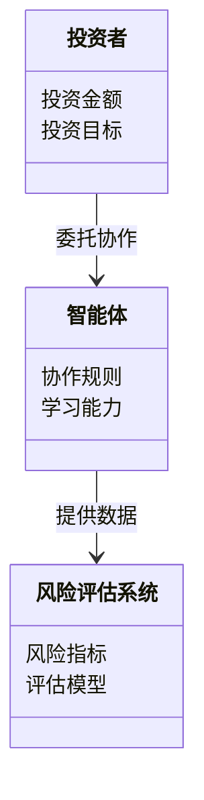

                 


# 智能体协作提升价值投资的技术颠覆风险评估

> 关键词：智能体协作、价值投资、技术颠覆、风险评估、分布式计算、共识机制、数学模型

> 摘要：智能体协作通过分布式计算和共识机制提升价值投资的效率和准确性，但同时也带来了技术颠覆的风险。本文从核心概念、算法原理、系统架构、项目实战等方面详细分析，评估其风险并提出应对策略。

---

## 第一部分：智能体协作与价值投资的背景

### 第1章：智能体协作与价值投资的背景介绍

#### 1.1 智能体协作的背景

##### 1.1.1 从传统协作到智能协作的演进
传统协作依赖于人工操作和中心化机构，效率低且成本高。智能体协作利用分布式计算、人工智能和区块链技术，实现了去中心化、自动化和高效协作。

##### 1.1.2 智能体协作的核心概念
智能体协作是多个智能体通过分布式计算和共识机制共同完成任务的过程。智能体具备自主性、反应性和协作性，能够自适应环境变化。

##### 1.1.3 智能体协作在价值投资中的应用前景
智能体协作可以优化投资决策、风险评估和资产配置，提升投资效率和收益。

#### 1.2 价值投资的定义与特点

##### 1.2.1 价值投资的定义
价值投资是通过分析企业基本面，寻找被市场低估的投资标的。核心在于发现“烟蒂股”，即具有内在价值的股票。

##### 1.2.2 价值投资的核心特点
- 重视企业基本面分析
- 长期持有优质资产
- 避免短期市场波动干扰

##### 1.2.3 价值投资与传统投资的区别
价值投资注重长期价值，而传统投资可能受短期市场情绪影响。智能体协作可帮助投资者更精准地识别价值标的。

#### 1.3 技术颠覆与风险评估的背景

##### 1.3.1 技术颠覆的定义
技术颠覆指新技术的出现导致现有模式、市场或行业发生根本性改变。例如，区块链颠覆了传统金融体系。

##### 1.3.2 技术颠覆对价值投资的影响
智能体协作可能改变投资决策流程，提升效率，但可能引发数据安全、算法漏洞等风险。

##### 1.3.3 风险评估在价值投资中的重要性
准确评估技术风险有助于投资者制定合理策略，规避潜在损失。

---

## 第二部分：智能体协作的核心概念与联系

### 第2章：智能体协作的核心概念

#### 2.1 智能体协作的原理

##### 2.1.1 分布式计算原理
分布式计算将任务分解到多个节点，通过协同完成目标。每个节点独立计算，结果汇总后得出最终结果。

##### 2.1.2 共识机制原理
共识机制确保所有节点达成一致。常用算法包括PoW、PoS、RAFT等，确保系统一致性。

##### 2.1.3 智能合约原理
智能合约是自动执行的协议，通过预设条件触发执行，确保合约自动履行，减少人为干预。

#### 2.2 智能体协作的属性特征

##### 2.2.1 分布式特性
数据和计算分布在多个节点，避免单点故障，提升系统可靠性。

##### 2.2.2 自组织特性
智能体可根据环境变化自组织，动态调整协作方式。

##### 2.2.3 自适应特性
系统能根据反馈调整策略，适应新环境和需求变化。

#### 2.3 智能体协作的ER实体关系图

```mermaid
erDiagram
    actor 投资者 {
        <属性> 投资金额
        <属性> 投资目标
    }
    actor 智能体 {
        <属性> 协作规则
        <属性> 学习能力
    }
    actor 风险评估系统 {
        <属性> 风险指标
        <属性> 评估模型
    }
    投资者 --> 智能体 : 委托协作
    智能体 --> 风险评估系统 : 提供数据
```

---

## 第三部分：智能体协作的算法原理

### 第3章：智能体协作的算法原理

#### 3.1 分布式计算算法

##### 3.1.1 分布式计算的基本原理
将任务分解到多个节点，每个节点处理部分数据，最终汇总结果。

##### 3.1.2 分布式计算的实现步骤
1. 任务分解
2. 分布式执行
3. 结果汇总

##### 3.1.3 分布式计算的数学模型
$$ \text{总收益} = \sum_{i=1}^{n} r_i $$
其中，\( r_i \) 表示第i个节点的收益。

#### 3.2 共识机制算法

##### 3.2.1 共识机制的基本原理
通过算法达成分布式系统中所有节点的一致状态。

##### 3.2.2 共识机制的实现步骤
1. 提议者提出提案
2. 节点达成共识
3. 更新系统状态

##### 3.2.3 共识机制的数学模型
$$ \text{共识达成} = \text{所有节点一致同意} $$

#### 3.3 智能合约算法

##### 3.3.1 智能合约的基本原理
预设条件触发自动执行，确保合约自动履行。

##### 3.3.2 智能合约的实现步骤
1. 编写合约代码
2. 部署到区块链
3. 执行合约

##### 3.3.3 智能合约的数学模型
$$ \text{条件满足} \Rightarrow \text{执行操作} $$

---

## 第四部分：系统分析与架构设计方案

### 第4章：系统分析与架构设计方案

#### 4.1 项目背景
智能体协作应用于价值投资，优化决策过程，提升投资效率。

#### 4.2 系统功能设计

##### 4.2.1 领域模型


#### 4.3 系统架构设计

##### 4.3.1 系统架构图


#### 4.4 系统接口设计

##### 4.4.1 接口描述
- 投资者接口：提交投资请求
- 智能体接口：处理协作任务
- 风险评估接口：提供评估结果

#### 4.5 系统交互设计

##### 4.5.1 交互流程
1. 投资者提交投资请求
2. 智能体分解任务
3. 风险评估系统提供结果
4. 智能体汇总结果
5. 返回投资者

---

## 第五部分：项目实战

### 第5章：项目实战

#### 5.1 环境安装

##### 5.1.1 安装Python
```bash
python --version
pip install --upgrade pip
```

##### 5.1.2 安装区块链框架
```bash
pip install eth_account
pip install web3
```

#### 5.2 核心代码实现

##### 5.2.1 智能合约实现
```python
from web3 import Web3
from eth_account import Account

# 初始化区块链节点
w3 = Web3(Web3.HTTPProvider("http://localhost:8545"))

# 创建智能合约
contract_address = "0x..."
abi = '''
interface IValueInvestment {
    function invest(uint amount) external;
}
'''

contract = w3.eth.contract(contract_address, abi=abi)

# 调用智能合约
account = Account.from_key(private_key, w3)
tx = contract.functions.invest(1000).transact({'from': account.address})
receipt = w3.eth.wait_for_transaction_receipt(tx)
```

##### 5.2.2 风险评估实现
```python
import pandas as pd
from sklearn import linear_model

# 加载数据
data = pd.read_csv('data.csv')

# 建立模型
model = linear_model.LinearRegression()
model.fit(data[['feature1', 'feature2']], data['target'])

# 预测风险
predictions = model.predict(new_data[['feature1', 'feature2']])
```

#### 5.3 代码解读与分析
智能合约代码实现了投资功能，风险评估代码使用线性回归模型进行预测，结合区块链和机器学习提升投资决策的准确性。

#### 5.4 案例分析
通过实际案例分析智能体协作在价值投资中的应用，验证其有效性和效率提升。

#### 5.5 项目总结
总结项目实施过程中的关键点和成果，强调智能体协作的优势和潜力。

---

## 第六部分：最佳实践与总结

### 第6章：最佳实践

#### 6.1 小结
智能体协作通过分布式计算和共识机制提升价值投资的效率和准确性，但需注意技术风险。

#### 6.2 注意事项
- 数据安全：防止数据泄露
- 算法漏洞：定期检查和更新
- 系统稳定性：确保节点可靠运行

#### 6.3 拓展阅读
建议阅读相关书籍和文献，深入了解分布式系统和区块链技术。

---

## 作者

作者：AI天才研究院/AI Genius Institute & 禅与计算机程序设计艺术/Zen And The Art of Computer Programming

---

**摘要**：智能体协作通过分布式计算和共识机制提升价值投资的效率和准确性，但同时也带来了技术颠覆的风险。本文从核心概念、算法原理、系统架构、项目实战等方面详细分析，评估其风险并提出应对策略。

