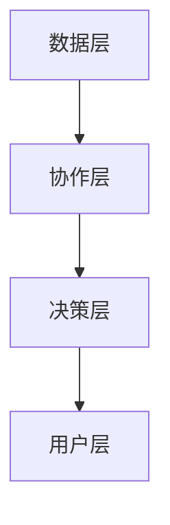
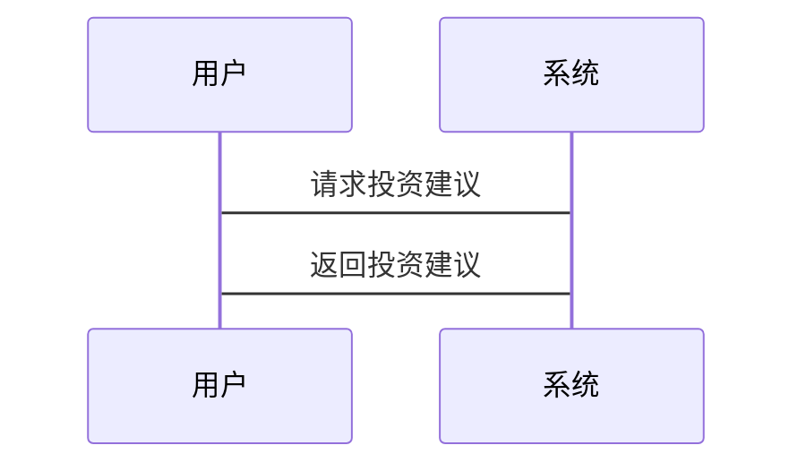

                 


# 智能体协作提升价值投资的时机选择

> 关键词：智能体协作，价值投资，时机选择，多智能体系统，强化学习，博弈论，时间序列预测

> 摘要：本文探讨了智能体协作在价值投资时机选择中的应用，通过分析多智能体系统的核心概念，结合强化学习、博弈论和时间序列预测模型，提出了一种优化投资决策的协作框架。文章详细讲解了算法原理、系统架构设计及实际案例，为投资者提供了科学的决策支持。

---

## 第一部分：智能体协作与价值投资的背景与概念

### 第1章：智能体协作与价值投资的背景

#### 1.1 智能体协作的基本概念
智能体协作是指多个智能体通过信息共享和协同决策，共同完成复杂任务的过程。智能体可以是软件程序、算法或自动化系统，具备感知、推理和行动的能力。

- **定义**：智能体协作是指多个智能体通过通信和协调，共同完成复杂任务的过程。
- **核心特征**：
  - 分布式决策：每个智能体独立决策，但通过通信协调行动。
  - 协作目标：所有智能体的目标一致，追求整体最优。
  - 动态环境：智能体协作发生在不断变化的环境中，需实时调整策略。

#### 1.2 价值投资的时机选择
价值投资是一种长期投资策略，强调以低于内在价值的价格买入优质资产。时机选择是价值投资的关键，决定了投资收益和风险。

- **基本概念**：
  - 价值投资：基于资产的内在价值进行投资，寻找市场低估的机会。
  - 时机选择：在合适的时间点买入或卖出，最大化收益。

#### 1.3 智能体协作与价值投资的结合
智能体协作通过分布式决策和信息共享，优化价值投资的时机选择，提升投资效率和准确性。

- **优势**：
  - 提高决策效率：多个智能体同时分析市场数据，快速得出结论。
  - 增强决策准确性：通过协作，降低个体决策的偏差。
  - 实时适应市场变化：智能体协作能够快速响应市场波动，调整投资策略。

### 第2章：智能体协作的核心概念与联系

#### 2.1 智能体协作的原理
多智能体系统由多个智能体组成，通过通信和协作完成任务。协作机制包括任务分配、信息共享和协调行动。

- **多智能体系统的定义**：由多个智能体组成的系统，每个智能体具备独立性和协作性。
- **协作机制**：
  - 任务分配：根据智能体的能力分配任务。
  - 信息共享：智能体之间共享数据和信息。
  - 协调行动：通过协商达成一致的行动方案。

#### 2.2 智能体协作的核心要素
智能体协作的核心要素包括智能体、协作目标、协作规则和通信协议。

- **智能体**：具备感知、推理和行动能力的实体。
- **协作目标**：智能体协作的最终目标。
- **协作规则**：智能体协作的规则和协议，确保协作顺利进行。
- **通信协议**：智能体之间信息传递的规则和格式。

#### 2.3 智能体协作的数学模型与公式
智能体协作的数学模型可以表示为多智能体系统的优化问题，目标是最优化协作目标。

- **数学模型**：
  - 目标函数：$$\max_{x_i} \sum_{i=1}^{n} f(x_i)$$
  - 约束条件：$$g(x_i) \leq 0, \forall i$$
  - 协作规则：智能体之间通过通信协议共享信息，调整决策变量。

---

## 第三部分：智能体协作的算法原理与实现

### 第3章：智能体协作的算法原理

#### 3.1 强化学习算法
强化学习是一种通过智能体与环境交互，学习最优策略的算法。在价值投资中，智能体通过试错学习，找到最优的时机选择策略。

- **算法流程**：
  1. 状态感知：智能体感知市场状态（如价格、成交量等）。
  2. 动作选择：基于当前状态，选择买入、卖出或持有。
  3. 奖励机制：根据投资收益，给予正向或负向奖励。
  4. 策略更新：根据奖励调整策略，优化投资决策。

#### 3.2 博弈论模型
博弈论模型通过分析智能体之间的互动，寻找纳什均衡，优化投资策略。

- **纳什均衡**：智能体在策略选择上，无法通过单方面改变策略而获得更高收益的状态。
- **应用**：智能体在市场中作为参与者，通过博弈论模型预测市场行为，优化投资时机。

#### 3.3 时间序列预测模型
时间序列预测模型通过历史数据，预测未来市场走势，辅助智能体做出时机选择。

- **模型选择**：
  - ARIMA模型：适合线性时间序列数据。
  - LSTM网络：适合非线性、长短期依赖的数据。

---

## 第四部分：智能体协作的系统架构与设计

### 第4章：系统架构设计

#### 4.1 系统功能设计
系统功能包括数据采集、智能体协作、决策支持和结果分析。

- **数据采集**：收集市场数据（如股票价格、成交量等）。
- **智能体协作**：智能体之间共享信息，协作决策。
- **决策支持**：提供投资建议，优化时机选择。
- **结果分析**：分析投资结果，评估智能体协作的效果。

#### 4.2 系统架构图
系统架构采用分层设计，包括数据层、协作层、决策层和用户层。



#### 4.3 接口设计
系统接口包括数据接口、协作接口和用户接口。

- **数据接口**：与数据源（如股票市场数据）对接。
- **协作接口**：智能体之间的通信接口。
- **用户接口**：用户与系统的交互界面。

#### 4.4 交互序列图
用户与系统交互的流程图，展示用户请求、系统处理和反馈的过程。



---

## 第五部分：项目实战与案例分析

### 第5章：项目实战

#### 5.1 环境安装
项目实战需要安装Python、TensorFlow、Keras等工具。

- **安装步骤**：
  1. 安装Python：```bash
     python --version
     ```
  2. 安装库：```bash
     pip install numpy tensorflow pandas
     ```

#### 5.2 核心代码实现
实现智能体协作的代码，包括数据采集、模型训练和策略执行。

- **数据采集代码**：
  ```python
  import pandas as pd
  data = pd.read_csv('stock_data.csv')
  ```

- **强化学习模型训练代码**：
  ```python
  import tensorflow as tf
  model = tf.keras.Sequential([
      tf.keras.layers.Dense(64, activation='relu'),
      tf.keras.layers.Dense(1, activation='linear')
  ])
  model.compile(optimizer='adam', loss='mse')
  model.fit(X, y, epochs=100)
  ```

#### 5.3 案例分析
通过具体案例分析，展示智能体协作在价值投资中的应用效果。

- **案例**：智能体协作在某股票投资中的应用。
  - 数据分析：智能体协作预测股票价格走势。
  - 决策支持：基于预测结果，建议买入或卖出时机。
  - 投资结果：验证智能体协作的决策效果。

---

## 第六部分：总结与展望

### 第6章：总结与展望

#### 6.1 总结
智能体协作通过分布式决策和信息共享，优化了价值投资的时机选择，提高了投资效率和准确性。

#### 6.2 展望
未来，随着人工智能技术的进步，智能体协作在价值投资中的应用将更加广泛，可能实现更复杂的投资策略和更高的投资收益。

---

## 作者

作者：AI天才研究院/AI Genius Institute & 禅与计算机程序设计艺术 /Zen And The Art of Computer Programming

