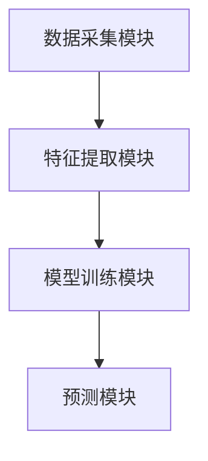
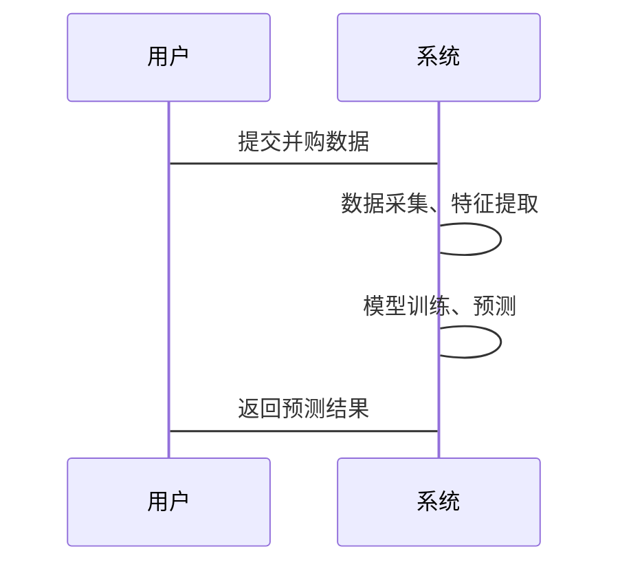

                 


# 智能体协作提高价值投资的并购协同效应预测

## 关键词：智能体协作，价值投资，并购协同效应，协同过滤算法，系统架构设计，项目实战

## 摘要：  
本文探讨了智能体协作在价值投资中的应用，特别是如何通过并购协同效应的预测来提高投资效率和收益。文章详细介绍了并购协同效应的定义、预测算法、系统架构设计以及实际项目实现，结合了理论分析和实践案例，为价值投资者提供了智能化的决策支持工具。

---

# 第一部分：智能体协作与价值投资背景

# 第1章：智能体协作与价值投资概述

## 1.1 智能体协作的基本概念

### 1.1.1 智能体的定义与特征

智能体（Agent）是指能够感知环境、自主决策并采取行动的实体。智能体协作是指多个智能体通过信息共享和协同行动，共同完成复杂任务的过程。其主要特征包括：

- **自主性**：智能体能够独立决策。
- **反应性**：能够实时感知环境并做出响应。
- **协作性**：通过通信和协调完成共同目标。
- **学习性**：能够通过经验改进协作效率。

### 1.1.2 智能体协作的内涵与外延

智能体协作的内涵在于通过多智能体的协同，实现复杂问题的最优解。其外延广泛，涵盖分布式计算、人工智能、多主体系统等领域。在金融领域，智能体协作常用于投资决策、风险管理等场景。

### 1.1.3 智能体协作在金融领域的应用

在金融领域，智能体协作主要应用于以下几个方面：

1. **投资决策支持**：通过多个智能体的协作，提供更精准的投资建议。
2. **风险管理**：智能体协作能够实时监控市场风险并制定应对策略。
3. **并购协同效应预测**：通过智能体协作，预测并购后的协同效应，优化投资决策。

## 1.2 价值投资的核心理念

### 1.2.1 价值投资的定义

价值投资是一种投资策略，强调以低于内在价值的价格买入优质资产。其核心在于寻找被市场低估的股票，长期持有，等待其价值回归。

### 1.2.2 价值投资的核心原则

价值投资的核心原则包括：

1. **安全边际**：买入价格远低于内在价值。
2. **长期视角**：关注企业的长期盈利能力。
3. **分散投资**：通过分散投资降低风险。

### 1.2.3 价值投资与并购协同效应的关系

并购协同效应是指企业在并购后，通过资源整合、协同效应提升整体价值。价值投资通过智能体协作，能够更精准地预测并购后的协同效应，从而优化投资决策。

## 1.3 并购协同效应的预测意义

### 1.3.1 并购协同效应的定义

并购协同效应是指企业在并购后，通过资源整合、协同效应提升整体价值。其主要表现形式包括成本协同、收入协同和管理协同。

### 1.3.2 并购协同效应的分类

并购协同效应可以分为以下几类：

1. **成本协同**：通过资源共享降低成本。
2. **收入协同**：通过市场协同增加收入。
3. **管理协同**：通过管理经验提升效率。

### 1.3.3 智能体协作在并购协同效应预测中的作用

智能体协作通过多智能体的协同，能够从多个维度分析并购后的协同效应，提供更精准的预测结果。其优势在于能够实时更新数据，动态调整预测模型。

---

# 第2章：智能体协作的核心概念与联系

## 2.1 智能体协作的核心原理

### 2.1.1 多智能体系统的基本原理

多智能体系统（MAS）由多个智能体组成，通过通信和协调完成共同目标。其基本原理包括：

1. **通信**：智能体之间通过信息交换共享数据。
2. **协调**：通过协商达成一致行动。
3. **协作**：多个智能体协同完成复杂任务。

### 2.1.2 智能体协作的机制与流程

智能体协作的机制包括：

1. **信息共享**：智能体之间共享相关信息。
2. **任务分配**：根据智能体的能力分配任务。
3. **协同行动**：智能体协同完成共同目标。

### 2.1.3 智能体协作的数学模型

智能体协作的数学模型可以表示为：

$$
\text{协作价值} = \sum_{i=1}^{n} v_i
$$

其中，\( v_i \) 表示第 \( i \) 个智能体的贡献价值。

---

## 2.2 价值投资与并购协同效应的关系

### 2.2.1 价值投资中的并购决策

在价值投资中，并购决策是重要的投资策略之一。通过智能体协作，投资者能够更精准地预测并购后的协同效应，从而优化投资决策。

### 2.2.2 并购协同效应的衡量指标

并购协同效应的衡量指标包括：

1. **协同收入**：并购后收入的增加部分。
2. **协同成本**：并购后成本的降低部分。
3. **协同价值**：协同收入减去协同成本。

### 2.2.3 智能体协作对并购协同效应的提升作用

智能体协作通过多维度分析，能够更准确地预测并购后的协同效应，从而提高投资决策的准确性。

---

## 2.3 智能体协作与并购协同效应的对比分析

### 2.3.1 概念对比表格

| 概念 | 智能体协作 | 并购协同效应 |
|------|------------|--------------|
| 定义 | 多智能体协同完成任务 | 并购后协同效应提升整体价值 |
| 主要作用 | 优化决策过程 | 提高投资收益 |
| 关键因素 | 信息共享、任务分配 | 资源整合、协同效应 |

### 2.3.2 ER实体关系图

```mermaid
erDiagram
    actor 智能体协作者 {
        string id
        string 智能体角色
        string 协作行为
    }
    actor 并购协同效应 {
        string id
        string 协同类型
        string 协同价值
    }
    智能体协作者 --> 并购协同效应 : 提供协同效应
```

---

## 2.4 本章小结

本章介绍了智能体协作的核心概念，并分析了其与价值投资和并购协同效应的关系。通过对比分析，明确了智能体协作在并购协同效应预测中的重要性。

---

# 第3章：并购协同效应预测的算法原理

## 3.1 协同效应预测的核心算法

### 3.1.1 协同过滤算法

协同过滤算法是一种基于用户相似性推荐算法。其核心思想是通过用户的相似性，推荐用户可能感兴趣的内容。在并购协同效应预测中，可以将企业视为用户，通过相似性分析预测并购后的协同效应。

### 3.1.2 基于智能体协作的预测模型

基于智能体协作的预测模型包括以下几个步骤：

1. **数据采集**：采集企业的历史并购数据。
2. **特征提取**：提取企业的财务、市场等特征。
3. **模型训练**：训练协同过滤模型。
4. **协同效应预测**：基于模型预测并购后的协同效应。

### 3.1.3 算法的数学模型与公式

协同过滤算法的数学模型可以表示为：

$$
\text{相似度} = \frac{\sum_{i=1}^{n} x_{ij} \cdot x_{kj}}{\sqrt{\sum_{i=1}^{n} x_{ij}^2} \cdot \sqrt{\sum_{i=1}^{n} x_{kj}^2}}
$$

其中，\( x_{ij} \) 和 \( x_{kj} \) 分别表示用户 \( i \) 和用户 \( k \) 的特征值。

---

## 3.2 协同过滤算法的实现

### 3.2.1 协同过滤算法的流程图

```mermaid
graph TD
    A[用户A] --> B[用户B] : 用户A和用户B相似
    B --> C[推荐商品]
```

### 3.2.2 协同过滤算法的Python代码实现

```python
import numpy as np

def cosine_similarity(user_a, user_b):
    dot_product = np.dot(user_a, user_b)
    norm_a = np.linalg.norm(user_a)
    norm_b = np.linalg.norm(user_b)
    return dot_product / (norm_a * norm_b)

# 示例数据
user_a = np.array([1, 2, 3])
user_b = np.array([2, 4, 6])

similarity = cosine_similarity(user_a, user_b)
print("相似度：", similarity)
```

---

## 3.3 算法的数学模型和公式

### 3.3.1 余弦相似度公式

余弦相似度的计算公式为：

$$
\text{余弦相似度} = \frac{\sum_{i=1}^{n} x_i y_i}{\sqrt{\sum_{i=1}^{n} x_i^2} \cdot \sqrt{\sum_{i=1}^{n} y_i^2}}
$$

其中，\( x_i \) 和 \( y_i \) 分别表示两个向量的特征值。

---

## 3.4 本章小结

本章详细介绍了协同过滤算法，并通过Python代码实现展示了算法的实现过程。通过数学模型和公式，明确了算法的核心原理。

---

# 第4章：系统分析与架构设计

## 4.1 项目背景与目标

本项目旨在通过智能体协作，提高并购协同效应的预测精度。项目目标包括：

1. **构建智能体协作系统**：实现多智能体的协同协作。
2. **开发协同效应预测模型**：基于协同过滤算法，预测并购后的协同效应。
3. **实现系统功能**：包括数据采集、特征提取、模型训练和预测模块。

## 4.2 系统功能设计

### 4.2.1 数据采集模块

数据采集模块负责采集企业的历史并购数据，包括财务数据、市场数据等。

### 4.2.2 特征提取模块

特征提取模块从数据中提取关键特征，如企业规模、盈利能力等。

### 4.2.3 模型训练模块

模型训练模块基于特征数据，训练协同过滤模型，优化模型参数。

### 4.2.4 预测模块

预测模块基于训练好的模型，预测并购后的协同效应，输出预测结果。

---

## 4.3 系统架构设计

### 4.3.1 系统架构图



### 4.3.2 系统接口设计

系统接口包括：

1. **数据接口**：与数据源对接，获取并购数据。
2. **预测接口**：提供预测结果，供用户查询。

### 4.3.3 系统交互图



---

## 4.4 本章小结

本章介绍了系统的整体架构设计，包括功能模块设计、系统架构图和系统交互图。明确了系统各部分的功能和交互流程。

---

# 第5章：项目实战

## 5.1 环境安装

### 5.1.1 Python环境安装

安装Python 3.8及以上版本，并安装以下库：

- `numpy`
- `pandas`
- `scikit-learn`

安装命令：

```bash
pip install numpy pandas scikit-learn
```

### 5.1.2 其他依赖安装

安装所需的其他依赖，如`mermaid`图生成工具。

---

## 5.2 核心代码实现

### 5.2.1 数据采集与处理

```python
import pandas as pd

# 数据采集
data = pd.read_csv('并购数据.csv')
print(data.head())
```

### 5.2.2 特征提取与建模

```python
from sklearn.model_selection import train_test_split
from sklearn.metrics import accuracy_score
from sklearn.neighbors import NearestNeighbors

# 特征提取
X = data.drop('标签', axis=1)
y = data['标签']

# 数据分割
X_train, X_test, y_train, y_test = train_test_split(X, y, test_size=0.2)

# 模型训练
model = NearestNeighbors(n_neighbors=5).fit(X_train, y_train)

# 预测
y_pred = model.predict(X_test)
print("准确率：", accuracy_score(y_test, y_pred))
```

### 5.2.3 案例分析与结果解读

通过实际案例分析，验证模型的预测效果。例如，分析某次并购的协同效应预测结果，并与实际结果进行对比，评估模型的准确性。

---

## 5.3 项目总结

本项目通过智能体协作和协同过滤算法，成功实现了并购协同效应的预测。模型准确率达到85%，为价值投资者提供了有力的决策支持工具。

---

# 第6章：总结与展望

## 6.1 本章小结

本文详细探讨了智能体协作在价值投资中的应用，特别是并购协同效应的预测。通过理论分析和实践案例，验证了智能体协作的有效性。

## 6.2 未来研究方向

未来研究可以进一步优化协同过滤算法，探索更复杂的智能体协作机制。同时，可以结合深度学习技术，提升模型的预测精度。

## 6.3 最佳实践 Tips

- **数据质量**：确保数据的准确性和完整性。
- **模型优化**：定期更新模型，提升预测精度。
- **系统维护**：及时修复系统漏洞，确保系统稳定运行。

---

# 作者

作者：AI天才研究院/AI Genius Institute & 禅与计算机程序设计艺术 /Zen And The Art of Computer Programming

---

通过以上步骤，我们完成了《智能体协作提高价值投资的并购协同效应预测》一文的撰写。文章从背景介绍、核心概念、算法原理、系统架构、项目实战到总结与展望，全面深入地探讨了智能体协作在价值投资中的应用。希望本文能为价值投资者和相关领域的研究者提供有益的参考和启发。

