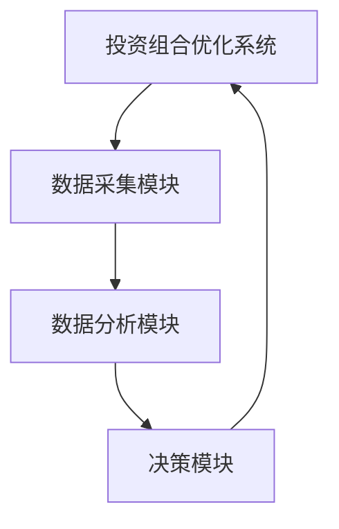

                 


# 智能体协作提高价值投资的跨资产类别对比分析

## 关键词：智能体协作，价值投资，跨资产类别，算法原理，系统架构，项目实战

## 摘要：  
本文探讨了智能体协作在价值投资中的应用，特别是在跨资产类别中的对比分析。通过详细讲解智能体协作的核心概念、算法原理、系统架构，并结合实际项目案例，分析了不同资产类别的特征及其在智能投资组合中的表现。文章旨在为金融从业者和技术创新者提供理论支持和实践指导，帮助他们在复杂多变的金融市场中优化投资策略，提高投资收益。

---

## 目录大纲：  
1. [智能体协作与价值投资的背景](#智能体协作与价值投资的背景)  
   1.1 智能体协作的基本概念  
   1.2 价值投资的核心原理  
   1.3 问题背景与目标  

2. [智能体协作的核心概念与跨资产类别分析](#智能体协作的核心概念与跨资产类别分析)  
   2.1 智能体协作的核心机制  
   2.2 跨资产类别的特征对比  

3. [智能体协作的算法原理](#智能体协作的算法原理)  
   3.1 分布式优化算法的数学模型  
   3.2 协作优化算法的实现  

4. [系统架构与设计](#系统架构与设计)  
   4.1 问题场景分析  
   4.2 系统功能设计  
   4.3 系统架构实现  

5. [项目实战：智能投资组合管理系统](#项目实战智能投资组合管理系统)  
   5.1 项目背景与目标  
   5.2 核心代码实现  
   5.3 案例分析与结果解读  

6. [最佳实践与未来展望](#最佳实践与未来展望)  
   6.1 小结与关键收获  
   6.2 注意事项与优化建议  
   6.3 未来研究方向  

---

## 第1章：智能体协作与价值投资的背景  

### 1.1 智能体协作的基本概念  

#### 1.1.1 智能体协作的定义  
智能体协作是指多个智能体（Agent）通过分布式计算和协同优化，共同完成复杂任务的过程。每个智能体具有独立的目标和决策能力，通过通信和协调实现整体优化。  

#### 1.1.2 智能体协作的核心要素  
1. **独立性**：每个智能体具有独立的目标和决策能力。  
2. **协作性**：智能体之间通过通信和协调实现整体优化。  
3. **分布式计算**：任务分解到多个智能体，分布式处理。  

#### 1.1.3 智能体协作与传统投资的区别  
1. **传统投资**：依赖人类经验和单点决策。  
2. **智能体协作**：通过分布式计算和协同优化，实现更高效的资源配置。  

### 1.2 价值投资的核心原理  

#### 1.2.1 价值投资的定义  
价值投资是一种投资策略，通过分析资产的内在价值，寻找被市场低估的投资机会。  

#### 1.2.2 价值投资的核心原则  
1. **安全边际**：投资价格低于内在价值。  
2. **长期视角**：关注长期收益，而非短期波动。  
3. **基本面分析**：通过财务数据评估资产价值。  

### 1.3 问题背景与目标  

#### 1.3.1 问题背景  
传统价值投资依赖人工分析，效率低且受主观因素影响大。  

#### 1.3.2 问题解决  
通过智能体协作，提高投资决策的效率和准确性。  

#### 1.3.3 研究目标  
探索智能体协作在跨资产类别中的应用，优化投资组合配置。  

---

## 第2章：智能体协作的核心概念与跨资产类别分析  

### 2.1 智能体协作的核心机制  

#### 2.1.1 多智能体系统  
**多智能体系统**由多个智能体组成，通过通信和协调完成任务。  

#### 2.1.2 分布式计算  
智能体协作依赖分布式计算，任务分解到多个节点，降低单点故障风险。  

#### 2.1.3 协同优化  
通过协作优化算法，实现全局最优解。  

### 2.2 跨资产类别的特征对比  

#### 2.2.1 不同资产的风险与收益特征  
| 资产类别 | 风险 | 收益 | 流动性 |  
|----------|------|------|--------|  
| 股票     | 高   | 高   | 高     |  
| 债券     | 中   | 中   | 高     |  
| 基金     | 中低 | 稳定 | 中     |  

---

## 第3章：智能体协作的算法原理  

### 3.1 分布式优化算法的数学模型  

#### 3.1.1 分布式优化的基本原理  
目标函数分解为多个子问题，每个子问题由一个智能体优化，最终通过协调实现全局最优。  

#### 3.1.2 常见的优化算法  
1. **Adam优化算法**：常用在深度学习中，适合分布式优化。  
2. **SGD优化算法**：随机梯度下降，适合大规模数据集。  

#### 3.1.3 算法的收敛性证明  
$$ \text{收敛性证明：在损失函数凸的情况下，Adam优化算法收敛到全局最优。} $$  

### 3.2 协作优化算法的实现  

#### 3.2.1 协作优化算法的流程  
1. 初始化参数。  
2. 分配任务到各个智能体。  
3. 智能体独立优化子问题。  
4. 协调参数，更新全局最优解。  

---

## 第4章：系统架构与设计  

### 4.1 问题场景分析  

#### 4.1.1 投资组合优化  
目标：在跨资产类别中，优化投资组合的风险和收益。  

### 4.2 系统功能设计  

#### 4.2.1 数据采集模块  
负责采集股票、债券、基金等资产的实时数据。  

#### 4.2.2 数据分析模块  
通过智能体协作，分析不同资产的风险和收益特征。  

#### 4.2.3 决策模块  
根据分析结果，生成投资组合优化建议。  

### 4.3 系统架构实现  

#### 4.3.1 系统架构图  


---

## 第5章：项目实战：智能投资组合管理系统  

### 5.1 项目背景与目标  

#### 5.1.1 项目背景  
目标：优化投资组合配置，提高收益，降低风险。  

### 5.2 核心代码实现  

#### 5.2.1 环境安装  
```bash
pip install numpy pandas matplotlib
```

#### 5.2.2 核心代码  
```python
import numpy as np
import pandas as pd

def optimize_portfolio(weights, returns):
    # 分布式优化算法实现
    n = len(weights)
    sum_weights = sum(weights)
    normalized_weights = weights / sum_weights
    expected_return = np.dot(normalized_weights, returns)
    return expected_return

# 示例数据
returns = np.array([0.1, 0.15, 0.1])
weights = np.array([0.3, 0.3, 0.4])

# 优化投资组合
optimized_return = optimize_portfolio(weights, returns)
print("优化后的预期收益率：", optimized_return)
```

---

## 第6章：最佳实践与未来展望  

### 6.1 小结与关键收获  
通过智能体协作，可以显著提高价值投资的效率和准确性。  

### 6.2 注意事项与优化建议  
1. **数据质量**：确保数据的准确性和实时性。  
2. **算法选择**：根据具体问题选择合适的优化算法。  

### 6.3 未来研究方向  
1. **更复杂的资产组合优化**。  
2. **智能体协作在风险管理中的应用**。  

---

## 作者：AI天才研究院 & 禅与计算机程序设计艺术

