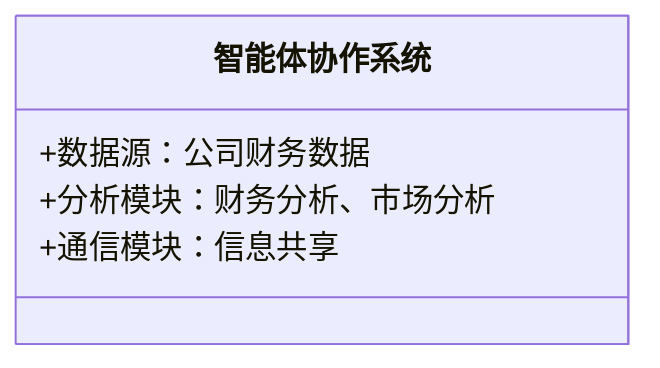

                 


# 智能体协作改进价值投资的尽职调查过程

> **关键词**：智能体协作、价值投资、尽职调查、分布式计算、多智能体系统、AI驱动分析  
> 
> **摘要**：本文探讨了智能体协作如何改进价值投资中的尽职调查过程。通过分析智能体协作的核心概念、算法原理和系统架构，结合实际案例，展示了如何利用AI技术提升投资决策的效率和准确性。

---

## 第1章：智能体协作的核心概念

### 1.1 什么是智能体协作
智能体协作是指多个智能体通过分布式计算和信息共享，协同完成复杂任务的过程。每个智能体都有独立的目标和功能，但通过协作实现整体目标。

**智能体的定义与特点**：
- 智能体：具备感知环境、决策和行动能力的实体。
- 特点：自主性、反应性、协作性、学习能力。

**智能体协作的定义**：
智能体协作是多个智能体通过通信与协调，共同完成复杂任务的过程。

---

### 1.2 价值投资与尽职调查的背景
价值投资是一种长期投资策略，强调分析公司的基本面。尽职调查是其关键环节，包括财务分析、市场研究等。

**尽职调查的作用**：
- 确认公司财务状况。
- 评估公司市场竞争力。
- 识别潜在风险。

**智能体协作在尽职调查中的潜力**：
- 提高分析效率。
- 增强数据处理能力。
- 提供更精准的决策支持。

---

### 1.3 智能体协作与价值投资的结合
智能体协作通过分布式计算和多智能体系统，优化价值投资的尽职调查过程。

**应用场景**：
- 数据收集与处理。
- 财务分析与预测。
- 市场趋势分析。

**优势与挑战**：
- 优势：高效性、准确性、实时性。
- 挑战：协作协调、数据隐私、计算资源。

---

## 第2章：智能体协作的理论基础

### 2.1 多智能体系统（MAS）概述
多智能体系统由多个智能体组成，通过协作完成任务。

**MAS的分类**：
- 分布式 MAS：智能体分布在不同节点。
- 集中式 MAS：智能体集中在一个节点。

**MAS的协作机制**：
- 通信协议：定义智能体间的信息交换方式。
- 协调算法：实现任务分配与同步。

---

### 2.2 分布式计算与智能体协作
分布式计算是智能体协作的基础。

**分布式计算的特点**：
- 并行处理。
- 资源共享。
- 高可用性。

**分布式计算在智能体协作中的应用**：
- 数据分发。
- 任务分配。
- 结果汇总。

---

### 2.3 智能体协作的数学模型
数学模型是智能体协作的核心。

**数学模型的构建**：
- 定义变量：如状态、动作、奖励。
- 建立方程：描述智能体间的互动。

**数学模型的应用**：
- 优化算法：如Q-learning。
- 分析复杂性：如计算复杂度分析。

---

## 第3章：智能体协作的算法与实现

### 3.1 分布式计算算法
分布式计算算法是智能体协作的关键。

**算法步骤**：
1. 初始化：分配任务。
2. 并行处理：各节点独立计算。
3. 结果汇总：整合结果。

**Python代码示例**：
```python
import concurrent.futures

def process_data(data):
    # 数据处理逻辑
    return result

with concurrent.futures.ThreadPoolExecutor() as executor:
    futures = [executor.submit(process_data, data) for data in dataset]
    for future in concurrent.futures.as_completed(futures):
        print(future.result())
```

---

### 3.2 多智能体协作算法
多智能体协作算法实现智能体间的协调。

**算法步骤**：
1. 初始化：定义智能体角色。
2. 通信：共享信息。
3. 协调：调整策略。

**Mermaid流程图**：


---

## 第4章：系统分析与架构设计

### 4.1 问题场景介绍
在价值投资中，智能体协作用于优化尽职调查。

**系统功能设计**：
- 数据采集：收集公司财务数据。
- 分析模块：评估公司价值。
- 报告生成：输出投资建议。

**Mermaid类图**：


---

### 4.2 系统架构设计
系统架构采用分层设计。

**Mermaid架构图**：


---

## 第5章：项目实战

### 5.1 环境安装
安装必要的库：
- `pip install concurrent.futures`
- `pip install numpy`

---

### 5.2 核心代码实现
```python
import numpy as np
import concurrent.futures

def analyze_financials(financial_data):
    # 计算财务指标
    return {
        'profit_margin': np.mean(financial_data['profit_margin']),
        'revenue_growth': np.mean(financial_data['revenue_growth'])
    }

def main():
    # 数据准备
    financial_data = {
        'profit_margin': [0.2, 0.3, 0.1],
        'revenue_growth': [0.1, 0.2, 0.15]
    }
    
    # 分布式计算
    with concurrent.futures.ThreadPoolExecutor() as executor:
        future = executor.submit(analyze_financials, financial_data)
        result = future.result()
        print(result)

if __name__ == "__main__":
    main()
```

---

### 5.3 实际案例分析
以某公司为例，分析其财务数据，生成投资建议。

---

## 第6章：总结与展望

### 6.1 最佳实践
- 确保数据隐私。
- 定期更新算法。
- 选择合适的工具。

### 6.2 小结
智能体协作通过提高效率和准确性，显著改进了价值投资的尽职调查过程。

### 6.3 注意事项
- 数据质量影响结果。
- 算法复杂性可能增加计算负担。
- 需遵守相关法律法规。

### 6.4 拓展阅读
推荐学习分布式系统和多智能体协作的书籍。

---

**作者：AI天才研究院 & 禅与计算机程序设计艺术**

