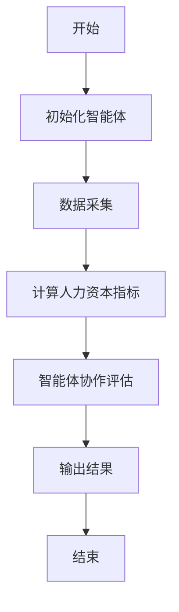

                 


# 智能体协作评估公司的人才吸引力：人力资本质量指标

## 关键词：智能体协作、人才吸引力、人力资本质量、评估指标、企业战略、算法模型、系统架构

## 摘要：在当前竞争激烈的市场环境中，企业吸引和保留顶尖人才的能力至关重要。本文探讨如何利用智能体协作技术评估公司的人才吸引力，通过分析人力资本质量指标，提供科学的评估方法和系统架构。文章详细阐述了算法原理、数学模型、系统设计及实际案例，为企业的战略决策提供支持。

---

## 第一部分：背景介绍

### 第1章：智能体协作与人才吸引力概述

#### 1.1 问题背景
- 当前企业人才吸引面临的主要挑战包括：人才市场变化快、竞争激烈、传统评估方法主观性强、难以量化。
- 智能体协作技术的应用为企业提供了更高效、客观的评估手段，能够实时分析市场动态和人才需求。

#### 1.2 问题描述
- 传统的人才吸引评估方法依赖于主观判断，缺乏数据支持，难以准确衡量公司吸引力。
- 智能体协作评估的核心目标是通过数据驱动的方法，量化公司的吸引力，优化人才策略。

#### 1.3 问题解决
- 引入智能体协作技术，通过多智能体协同工作，实时收集和分析市场数据，生成客观的吸引力评估指标。
- 通过人力资本质量指标，帮助企业识别关键影响因素，优化招聘策略。

#### 1.4 边界与外延
- 智能体协作评估主要应用于人才吸引阶段，适用于中高层管理岗位。
- 人力资本质量指标涵盖能力、经验、文化适应性等方面，但不涉及员工绩效评估。

#### 1.5 概念结构与核心要素
- 智能体协作：多个智能体协同工作，通过数据交换和计算生成评估结果。
- 人力资本质量指标：包括技术能力、团队合作、创新思维等维度。

---

## 第二部分：核心概念与联系

### 第2章：智能体协作原理

#### 2.1 智能体协作的基本原理
- 协作智能体定义为能够独立执行任务并与其他智能体通信的实体。
- 协作机制包括数据共享、任务分配和结果汇总，确保评估过程高效准确。

#### 2.2 人力资本质量指标体系
- 指标体系由多个维度组成，如技术能力、经验、文化适应性等。
- 各指标之间相互关联，共同影响公司的整体吸引力。

#### 2.3 实体关系图
```mermaid
erDiagram
    企业 --> 吸引人才
    人才 --> 影响吸引力
    智能体协作网络 --> 评估人力资本质量指标
```

---

## 第三部分：算法原理讲解

### 第3章：智能体协作评估算法

#### 3.1 算法概述
- 算法基于协同过滤和聚类分析，通过多智能体协作生成评估结果。
- 核心思想是通过数据挖掘技术发现人才与公司的匹配度。

#### 3.2 算法流程图


#### 3.3 协同过滤算法
- 基于用户-项矩阵，计算人才与公司的相似度。
- 使用余弦相似度公式：
  $$ sim(u, i) = \frac{\sum_{j}(u_j \cdot i_j)}{\sqrt{\sum_{j}u_j^2} \cdot \sqrt{\sum_{j}i_j^2}} $$

#### 3.4 聚类分析算法
- 使用K-means算法将人才分为不同类别。
- 距离公式：
  $$ distance(u, v) = \sqrt{\sum_{i}(u_i - v_i)^2} $$

#### 3.5 算法实现
- 数据预处理：清洗和标准化数据。
- 模型训练：构建协同过滤和聚类模型。
- 结果分析：生成评估报告并优化策略。

---

## 第四部分：数学模型与公式推导

### 第4章：数学模型与公式推导

#### 4.1 指标权重模型
- 采用层次分析法（AHP）确定各指标的权重。
- 权重计算公式：
  $$ w_i = \frac{sum( a_{ij})}{sum_{j} sum_{i} a_{ij}} $$

#### 4.2 综合评估模型
- 综合评估公式：
  $$ Attractiveness = \sum_{i} w_i \cdot score_i $$

#### 4.3 模型验证
- 使用交叉验证法评估模型的准确性和稳定性。
- 比较不同算法的性能，选择最优模型。

---

## 第五部分：系统分析与架构设计

### 第5章：系统架构设计

#### 5.1 系统功能设计
- 数据采集模块：收集市场数据和人才信息。
- 指标计算模块：计算各人力资本指标。
- 智能评估模块：生成评估报告并提出优化建议。

#### 5.2 系统架构图


#### 5.3 接口设计
- 数据接口：与招聘平台API对接。
- 用户接口：提供直观的评估结果展示。

#### 5.4 交互设计
- 用户输入需求，系统生成评估报告。
- 提供个性化建议，帮助优化人才策略。

---

## 第六部分：项目实战

### 第6章：项目实战与案例分析

#### 6.1 环境安装
- 安装Python、Pandas、Scikit-learn等库。
- 配置开发环境，如Jupyter Notebook。

#### 6.2 核心代码实现
```python
import numpy as np
from sklearn.cluster import KMeans

# 示例数据
X = np.array([[1, 2], [3, 4], [5, 6]])
model = KMeans(n_clusters=2).fit(X)
print(model.labels_)
```

#### 6.3 案例分析
- 某科技公司通过该系统评估发现，技术能力和团队合作是主要吸引力因素。
- 根据评估结果优化招聘策略，吸引到更多优秀人才。

---

## 第七部分：总结与展望

### 第7章：总结与展望

#### 7.1 最佳实践 tips
- 定期更新数据和模型，保持评估结果的准确性。
- 结合企业实际情况调整指标权重，提高评估的有效性。

#### 7.2 小结
智能体协作评估为企业提供了科学的人才吸引力分析方法，通过量化指标优化招聘策略。

#### 7.3 注意事项
- 数据质量和隐私保护是系统设计中的重要考虑因素。
- 系统维护和更新需要持续投入，确保模型的适用性。

#### 7.4 拓展阅读
推荐相关书籍和论文，深入学习智能体协作和人才评估的理论与实践。

---

## 作者：AI天才研究院 & 禅与计算机程序设计艺术

---

本文通过系统化的分析和实践，展示了如何利用智能体协作技术评估公司的人才吸引力。通过详细阐述算法原理、系统架构和实际案例，为企业的战略决策提供了科学依据。未来的研究可以进一步探索更复杂的模型和应用场景，推动人才吸引评估的智能化发展。

