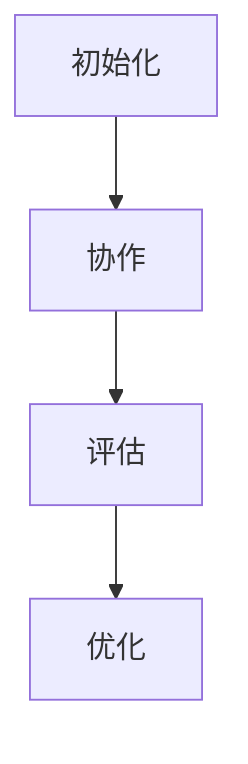
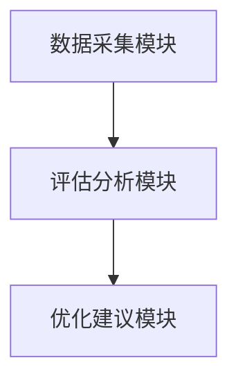

                 


# 智能体协作评估公司的循环经济实践：可持续发展新视角

> **关键词**: 智能体协作评估, 循环经济, 可持续发展, 多智能体协作, 算法实现

> **摘要**: 本文探讨了智能体协作评估在企业循环经济实践中的应用，通过分析循环经济的基本概念、智能体协作评估的核心原理、算法实现、系统架构设计以及项目实战，展示了如何利用智能体协作技术优化企业可持续发展策略。文章从理论到实践，结合具体案例，为读者提供了一个全面的视角，帮助企业在循环经济中实现高效协作与优化。

---

# 第一部分: 智能体协作评估的背景与概念

## 第1章: 循环经济与智能体协作评估概述

### 1.1 循环经济的基本概念

#### 1.1.1 循环经济的定义与核心特征
循环经济是一种以资源高效利用和循环利用为核心的发展模式。其核心特征包括资源减量化、产品再利用和废弃物再生化。循环经济强调减少资源消耗和环境污染，推动经济与生态的协调发展。

#### 1.1.2 循环经济与传统经济模式的区别
- **资源消耗**: 传统经济强调资源的线性消耗，而循环经济强调资源的循环利用。
- **污染排放**: 传统经济可能导致大量废弃物和污染物排放，而循环经济通过回收和再生减少污染。
- **经济增长**: 传统经济依赖资源的无限开发，而循环经济强调通过技术创新实现可持续增长。

#### 1.1.3 循环经济在企业中的重要性
企业采用循环经济模式可以降低成本、提高资源利用效率、减少环境风险，同时提升企业的社会形象和竞争力。

### 1.2 智能体协作评估的定义与特点

#### 1.2.1 智能体协作评估的定义
智能体协作评估是一种基于多智能体协作的评估方法，通过多个智能体协同工作，对企业的循环经济实践进行分析和优化。智能体协作评估利用分布式计算和人工智能技术，实现对企业资源利用、废弃物管理和生产过程的实时监控和评估。

#### 1.2.2 智能体协作评估的核心特点
- **多智能体协作**: 通过多个智能体协同工作，实现对复杂系统的全面评估。
- **实时性**: 智能体能够实时采集和分析数据，快速响应变化。
- **自适应性**: 智能体可以根据环境变化自动调整评估策略。

#### 1.2.3 智能体协作评估与传统评估方法的区别
| 评估方法 | 传统评估方法 | 智能体协作评估 |
|----------|---------------|----------------|
| 数据来源 | 单一数据源    | 多数据源        |
| 处理方式 | 批处理         | 实时处理        |
| 智能性   | 低            | 高              |

### 1.3 循环经济实践中的智能体协作评估

#### 1.3.1 循环经济实践的典型场景
- **资源回收**: 对企业废弃物进行分类、回收和再生利用。
- **生产优化**: 通过智能体协作优化生产流程，减少资源浪费。
- **供应链管理**: 对供应链中的资源流动进行实时监控和优化。

#### 1.3.2 智能体协作评估在循环经济中的作用
智能体协作评估能够实时监控企业的资源利用情况，发现潜在的浪费点，提出优化建议，从而提高资源利用效率，降低运营成本。

#### 1.3.3 智能体协作评估的边界与外延
- **边界**: 企业内部资源利用和生产过程。
- **外延**: 包括供应链上下游企业和外部环境。

### 1.4 本章小结
本章介绍了循环经济的基本概念、智能体协作评估的定义与特点，以及其在循环经济中的应用。通过对比传统评估方法，突出了智能体协作评估的优势和重要性。

---

## 第2章: 智能体协作评估的核心原理

### 2.1 智能体协作评估的理论基础

#### 2.1.1 多智能体协作的基本原理
多智能体协作是指多个智能体通过协调和合作完成共同目标的过程。每个智能体都有自己的任务和目标，但通过协作实现整体目标的优化。

#### 2.1.2 智能体协作中的博弈论基础
博弈论在智能体协作中起着重要作用，特别是纳什均衡的概念。智能体在协作过程中通过博弈达到最优策略。

#### 2.1.3 智能体协作的数学模型
智能体协作的数学模型可以表示为：
$$ V(i) = \sum_{j \neq i} v(j) $$
其中，\( V(i) \) 表示智能体 \( i \) 的总收益，\( v(j) \) 表示其他智能体 \( j \) 的收益。

### 2.2 智能体协作评估的核心要素

#### 2.2.1 智能体的定义与属性
智能体是一个能够感知环境、做出决策并采取行动的实体。智能体的属性包括感知能力、决策能力和协作能力。

#### 2.2.2 协作行为的定义与特征
协作行为是指智能体之间为了实现共同目标而进行的合作。其特征包括目标一致性、信息共享和行动协调。

#### 2.2.3 评估指标的设计与选择
评估指标的设计需要考虑以下因素：
- **相关性**: 指标应与企业循环经济目标相关。
- **可测量性**: 指标应能够量化。
- **可操作性**: 指标应易于计算和实现。

### 2.3 智能体协作评估的ER实体关系图

```mermaid
erDiagram
    智能体协作评估系统 o-- 智能体: 管理
    智能体协作评估系统 o-- 行为: 监测
    智能体协作评估系统 o-- 评估指标: 计算
```

### 2.4 本章小结
本章介绍了智能体协作评估的理论基础、核心要素以及ER实体关系图。通过这些内容，读者可以理解智能体协作评估的基本原理和实现方式。

---

## 第3章: 智能体协作评估的算法实现

### 3.1 智能体协作评估的算法概述

#### 3.1.1 多智能体协作算法的基本框架
多智能体协作算法的基本框架包括初始化、协作、评估和优化四个阶段。



#### 3.1.2 智能体协作评估的算法分类
智能体协作评估的算法可以分为基于博弈论的协作算法和基于分布式计算的协作算法。

#### 3.1.3 算法选择的依据与原则
- **问题复杂性**: 根据问题的复杂性选择算法。
- **实时性要求**: 根据实时性要求选择算法。
- **资源约束**: 根据资源约束选择算法。

### 3.2 基于博弈论的智能体协作算法

#### 3.2.1 博弈论基础
博弈论是研究多个智能体在协作中的策略选择和行为模式的理论。纳什均衡是博弈论中的一个关键概念。

#### 3.2.2 智能体协作的数学模型
智能体协作的数学模型可以表示为：
$$ u(i) = \sum_{j \neq i} u(j) $$
其中，\( u(i) \) 表示智能体 \( i \) 的效用函数。

#### 3.2.3 协作算法的实现步骤
1. 初始化：定义智能体和目标。
2. 协作：智能体通过博弈论选择最优策略。
3. 评估：计算协作效果。
4. 优化：调整策略以提高协作效果。

### 3.3 本章小结
本章详细介绍了智能体协作评估的算法实现，包括博弈论基础、数学模型和实现步骤。通过这些内容，读者可以理解如何通过算法实现智能体协作评估。

---

## 第4章: 智能体协作评估的系统架构设计

### 4.1 系统功能设计

#### 4.1.1 数据采集模块
数据采集模块负责采集企业的资源利用数据，包括能源消耗、原材料使用和废弃物产生量。

#### 4.1.2 评估分析模块
评估分析模块利用智能体协作算法对采集的数据进行分析，生成评估报告。

#### 4.1.3 优化建议模块
优化建议模块根据评估报告提出优化建议，帮助企业优化循环经济实践。

### 4.2 系统架构设计



### 4.3 系统接口设计

#### 4.3.1 数据接口
数据接口负责与企业系统的数据交互，包括数据采集和数据传输。

#### 4.3.2 用户接口
用户接口负责与用户的交互，包括数据输入和结果展示。

### 4.4 系统交互设计

#### 4.4.1 数据采集流程
1. 数据采集模块采集数据。
2. 数据传输到评估分析模块。
3. 评估分析模块生成评估报告。
4. 优化建议模块提出优化建议。

### 4.5 本章小结
本章介绍了智能体协作评估系统的功能设计、架构设计、接口设计和交互设计。通过这些内容，读者可以理解如何构建一个完整的智能体协作评估系统。

---

## 第5章: 智能体协作评估的项目实战

### 5.1 环境安装

#### 5.1.1 系统需求
- 操作系统：Windows 10 或更高版本，或 Linux 系统。
- 内存：至少 4GB。
- 硬盘空间：至少 10GB。

#### 5.1.2 软件安装
- 安装 Python 3.x。
- 安装 Mermaid 和其他开发工具。

### 5.2 核心代码实现

#### 5.2.1 数据采集模块
```python
def collect_data():
    # 数据采集代码
    pass
```

#### 5.2.2 评估分析模块
```python
def assess_performance():
    # 评估分析代码
    pass
```

#### 5.2.3 优化建议模块
```python
def generate_recommendations():
    # 优化建议代码
    pass
```

### 5.3 案例分析

#### 5.3.1 案例背景
某制造企业希望通过智能体协作评估优化其资源利用效率。

#### 5.3.2 数据分析
通过对企业的生产数据进行分析，发现原材料浪费率高达 15%。

#### 5.3.3 优化建议
建议企业优化生产流程，减少原材料浪费，预计可降低浪费率 10%。

### 5.4 本章小结
本章通过一个具体案例展示了智能体协作评估的实现过程，包括环境安装、核心代码实现和案例分析。通过这些内容，读者可以实际操作智能体协作评估系统。

---

## 第6章: 总结与展望

### 6.1 本章总结
智能体协作评估是一种高效的企业循环经济实践优化方法。通过多智能体协作和实时数据分析，企业可以实现资源的高效利用和优化管理。

### 6.2 最佳实践 tips
- **数据准确性**: 确保数据采集的准确性。
- **算法优化**: 不断优化协作算法，提高评估效果。
- **系统维护**: 定期维护系统，确保其稳定运行。

### 6.3 注意事项
- **数据隐私**: 注意保护企业的数据隐私。
- **系统兼容性**: 确保系统与其他企业系统的兼容性。

### 6.4 拓展阅读
- **多智能体协作**: 《Multi-Agent Systems》
- **循环经济**: 《The Circular Economy》

---

## 作者：AI天才研究院 & 禅与计算机程序设计艺术

```

