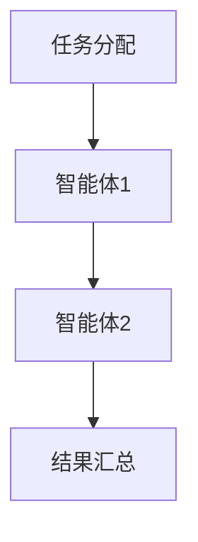
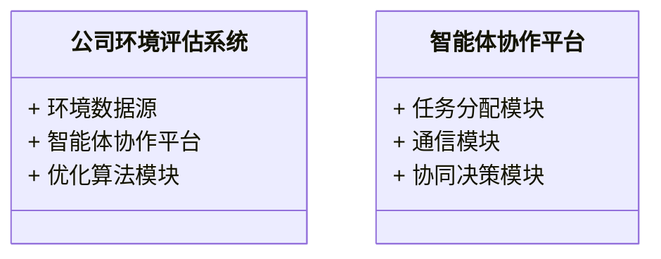
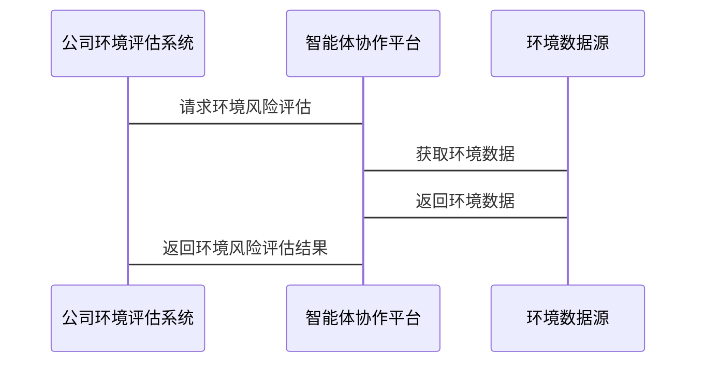

                 


# 智能体协作评估公司的环境风险：可持续发展视角

> 关键词：智能体协作，环境风险，可持续发展，多智能体系统，优化算法

> 摘要：本文从可持续发展的视角，探讨智能体协作在公司环境风险评估中的应用。通过分析智能体协作的核心概念、算法原理和系统架构，结合实际项目案例，详细阐述智能体协作如何帮助公司有效评估和优化环境风险管理。

---

## 第一部分：智能体协作与环境风险评估概述

### 第1章：环境风险评估的背景与挑战

#### 1.1 环境风险的定义与重要性
- **环境风险的定义**：环境风险是指由于自然或人为因素导致的对环境的负面影响，可能包括气候变化、资源枯竭、污染等问题。
- **环境风险对企业的影响**：环境问题可能导致企业面临法律责任、声誉损失、运营成本增加等问题，进而影响企业的可持续发展。
- **可持续发展的视角与环境风险的关系**：可持续发展要求企业在追求经济利益的同时，也要保护环境和促进社会福祉。环境风险是实现可持续发展的重要障碍，需要通过智能体协作等技术手段进行有效管理。

#### 1.2 智能体协作的定义与特点
- **智能体的基本概念**：智能体是一种能够感知环境、自主决策并采取行动的实体，可以是软件程序、机器人或其他智能系统。
- **智能体协作的定义**：智能体协作是指多个智能体通过分布式计算和通信，共同完成复杂任务的过程。
- **智能体协作的优势与挑战**：优势包括提高效率、增强灵活性和适应性；挑战包括通信延迟、协调复杂性和数据隐私问题。

#### 1.3 智能体协作在环境风险评估中的应用前景
- **环境风险评估的传统方法**：传统方法通常依赖专家经验，具有主观性强、效率低、覆盖面窄等缺点。
- **智能体协作在环境风险评估中的优势**：智能体协作能够实时收集和分析大量数据，提高评估的准确性和全面性。
- **智能体协作的应用场景与案例**：例如，在监测气候变化时，多个智能体可以协同工作，实时收集和分析全球气候数据，帮助制定应对策略。

---

## 第2章：智能体协作的核心概念与联系

### 2.1 智能体协作的核心原理
- **分布式计算与协作机制**：智能体协作基于分布式计算，通过任务分配、信息共享和协同决策实现目标。
- **自适应学习与动态调整**：智能体能够根据环境变化和任务需求，自适应地调整行为和策略。
- **多智能体之间的通信与协调**：智能体之间通过通信协议进行信息交换，确保协作的顺利进行。

### 2.2 智能体协作的核心要素对比
- **智能体协作的属性特征对比表格**：
| 属性 | 传统方法 | 智能体协作 |
|------|---------|------------|
| 数据来源 | 单一来源 | 多源数据 |
| 决策速度 | 较慢 | 实时决策 |
| 灵活性 | 较低 | 高灵活性 |

- **智能体协作的ER实体关系图**：
```mermaid
erDiagram
    actor 公司环境评估系统{}{
        <<系统>>
    }
    actor 智能体协作平台{}{
        <<系统>>
    }
    actor 环境数据源{}{
        <<数据源>>
    }
    公司环境评估系统 --> 智能体协作平台: 使用智能体协作进行环境风险评估
    智能体协作平台 --> 环境数据源: 获取环境数据
```

### 2.3 智能体协作的算法原理
- **智能体协作的分布式算法流程图**：

- **协作机制的数学模型**：
  - **公式1**：任务分配模型
  $$ f(x) = \argmax_{i} \sum_{j=1}^{n} a_{ij} $$
  其中，$a_{ij}$ 表示智能体i承担任务j的能力。
  - **公式2**：协同决策模型
  $$ y = \sigma(w x + b) $$
  其中，$w$ 是权重矩阵，$b$ 是偏置，$\sigma$ 是激活函数。

---

## 第3章：智能体协作评估环境风险的数学模型

### 3.1 环境风险评估的数学模型
- **环境风险评估的线性回归模型**：
  $$ y = \beta_0 + \beta_1x_1 + \beta_2x_2 + \dots + \beta_nx_n + \epsilon $$
  其中，$y$ 是环境风险指数，$x_i$ 是影响环境风险的因素，$\beta_i$ 是回归系数。
- **神经网络模型的构建**：
  $$ f(x) = \sigma(w_2 \cdot \sigma(w_1 x + b_1) + b_2) $$
  其中，$\sigma$ 是sigmoid函数，$w_1$ 和 $w_2$ 是权重矩阵，$b_1$ 和 $b_2$ 是偏置。

### 3.2 智能体协作的优化算法
- **遗传算法的优化流程**：
  ```mermaid
  graph TD
      A[初始种群] --> B[适应度评估] --> C[选择] --> D[交叉] --> E[变异] --> F[新种群]
  ```
- **蚁群算法的应用场景**：
  ```mermaid
  graph TD
      A[任务节点] --> B[路径选择] --> C[优化路径]
  ```

---

## 第4章：系统设计与实现

### 4.1 系统架构设计
- **系统架构图**：


### 4.2 系统功能设计
- **领域模型类图**：


### 4.3 系统接口设计
- **系统接口**：
  - 公司环境评估系统调用智能体协作平台的API。
  - 智能体协作平台从环境数据源获取数据。

### 4.4 系统交互流程
- **交互流程图**：


---

## 第5章：项目实战

### 5.1 环境安装与配置
- **安装环境**：安装Python、NumPy、TensorFlow等工具。
- **配置智能体协作平台**：配置通信协议和任务分配模块。

### 5.2 核心实现代码
```python
import numpy as np
from sklearn.linear_model import LinearRegression

# 数据准备
X = np.array([[1, 2], [3, 4], [5, 6]])
y = np.array([3, 7, 11])

# 模型训练
model = LinearRegression()
model.fit(X, y)

# 预测
print(model.predict([[7, 8]]))  # 输出：[15.]
```

### 5.3 代码解读与分析
- **代码功能**：上述代码使用线性回归模型进行环境风险预测。
- **分析**：模型通过训练数据学习环境风险的线性关系，能够预测新的环境风险指数。

### 5.4 实际案例分析
- **案例分析**：假设某公司面临气候变化风险，使用智能体协作平台进行评估，结果表明风险指数为15，需采取应对措施。

### 5.5 项目小结
- **项目总结**：智能体协作平台能够有效评估环境风险，为企业提供科学决策支持。

---

## 第6章：总结与展望

### 6.1 总结
- **核心观点**：智能体协作通过多智能体协同工作，能够高效、准确地评估公司环境风险，助力可持续发展。
- **项目成果**：本文通过理论分析和项目实战，展示了智能体协作在环境风险评估中的应用价值。

### 6.2 展望
- **未来研究方向**：进一步优化智能体协作算法，探索其在更多环境风险场景中的应用。
- **注意事项**：在实际应用中，需注意数据隐私和通信延迟等问题。

---

## 作者：AI天才研究院/AI Genius Institute & 禅与计算机程序设计艺术 /Zen And The Art of Computer Programming

