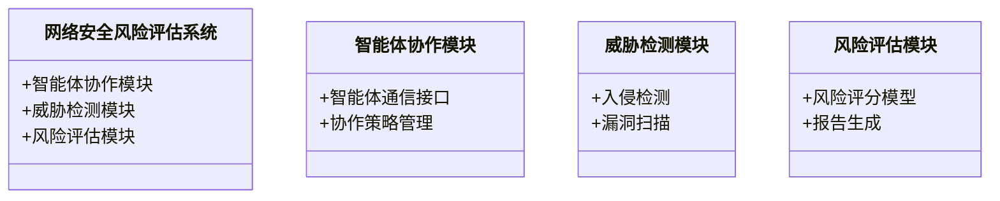
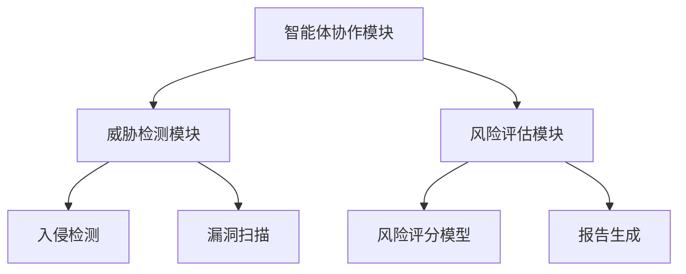

                 


```markdown
# 智能体协作评估公司的网络安全风险：数字时代的新考量

> 关键词：智能体协作，网络安全风险，数字时代，风险评估，多智能体系统，博弈论，网络安全

> 摘要：随着数字化转型的深入，网络安全风险评估变得日益复杂。传统的基于规则的评估方法逐渐暴露出其局限性，无法应对日益复杂的网络攻击和威胁。智能体协作作为一种新兴的技术，通过多智能体系统之间的协作，能够更高效、更准确地评估和应对网络安全风险。本文将从智能体协作的基本概念出发，探讨其在网络安全风险评估中的应用，分析其优势与挑战，并通过实际案例展示其在数字时代的独特价值。

---

## 第一部分：智能体协作与网络安全风险评估基础

### 第1章：智能体协作与网络安全风险评估概述

#### 1.1 智能体协作的基本概念
智能体（Agent）是具有感知、推理和行动能力的实体，能够独立或协作完成特定任务。智能体协作是指多个智能体通过共享信息、协调行动，共同完成复杂任务的过程。在网络安全领域，智能体协作能够帮助组织更高效地识别、分析和应对安全威胁。

#### 1.2 智能体协作在网络安全中的作用
数字时代的网络安全威胁呈现出多样化、智能化的特点。传统的基于规则的安全系统难以应对未知的、复杂的威胁。而智能体协作能够通过分布式计算、自主决策和动态协作，显著提升安全评估的效率和准确性。

---

### 第2章：智能体协作的原理与机制

#### 2.1 多智能体系统概述
多智能体系统（Multi-Agent System, MAS）由多个智能体组成，每个智能体都有自己的目标和行为规则。智能体之间通过通信和协作，共同完成复杂的任务。在网络安全中，智能体可以负责不同的安全模块，如入侵检测、漏洞扫描和风险评估。

#### 2.2 智能体协作机制
智能体协作机制包括以下几种：
1. **基于规则的协作**：通过预定义的规则和优先级，智能体之间协调行动。
2. **基于目标的协作**：智能体根据共同的目标进行协作，动态调整策略。
3. **基于博弈论的协作**：通过模拟博弈过程，优化智能体的协作策略。

---

## 第二部分：智能体协作的算法原理与数学模型

### 第3章：智能体协作的算法原理

#### 3.1 基于博弈论的协作算法
博弈论是研究智能体协作的重要工具。通过分析智能体之间的博弈关系，可以设计出更高效的协作策略。例如，囚徒困境模型可以帮助理解智能体在协作中的策略选择。

#### 3.2 协作过程的数学建模
以下是协作过程的一个简化模型：

$$
\text{收益} = \text{合作程度} \times \text{任务完成度}
$$

---

### 第4章：智能体协作的数学模型与公式

#### 4.1 协作行为的数学表达
智能体协作可以通过以下公式表示：

$$
P(i, j) = \frac{1}{1 + e^{-\beta (s_i + s_j)}}
$$

其中，$P(i, j)$ 表示智能体$i$和$j$协作的概率，$\beta$ 是一个正的常数，$s_i$ 和 $s_j$ 是智能体的协作能力评分。

---

## 第三部分：系统架构与项目实战

### 第5章：系统架构设计

#### 5.1 系统功能设计
以下是系统功能的类图：



#### 5.2 系统架构图
以下是系统的架构图：



---

### 第6章：项目实战

#### 6.1 环境搭建
以下是项目环境搭建的步骤：

1. 安装Python和相关库（如NumPy、Matplotlib）。
2. 安装多智能体协作框架（如A Toolbox）。
3. 配置网络安全数据集。

#### 6.2 核心代码实现
以下是协作算法的核心代码：

```python
import numpy as np

def collaboration_probability(s_i, s_j, beta=1):
    return 1 / (1 + np.exp(-beta * (s_i + s_j)))

# 示例计算
s_i = 0.8
s_j = 0.6
beta = 1
prob = collaboration_probability(s_i, s_j, beta)
print(f"协作概率为：{prob}")
```

---

## 第四部分：总结与展望

### 第7章：总结与展望

#### 7.1 总结
智能体协作通过多智能体系统的协作，显著提升了网络安全风险评估的效率和准确性。其基于博弈论的协作机制和动态调整能力，使其在应对复杂安全威胁时具有显著优势。

#### 7.2 展望
未来，智能体协作在网络安全中的应用将更加广泛。通过结合人工智能和大数据分析，智能体协作系统将更加智能化，能够实时应对各种新型威胁。

---

## 作者

作者：AI天才研究院/AI Genius Institute & 禅与计算机程序设计艺术 /Zen And The Art of Computer Programming

---

感谢您的阅读！如需进一步探讨，请随时联系。
```

