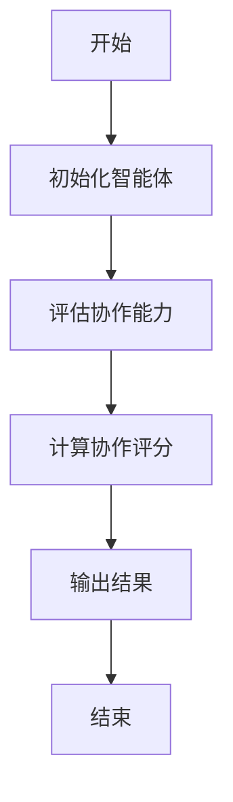
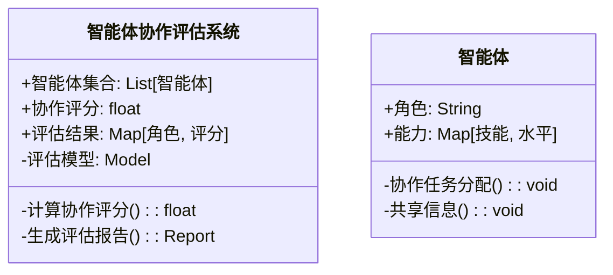

                 


# 智能体协作评估管理层能力：价值投资的关键因素

> 关键词：智能体协作，管理层能力，价值投资，评估模型，算法原理

> 摘要：本文探讨了智能体协作在评估管理层能力中的应用，分析其对价值投资的重要性。文章从背景、概念、算法、系统架构到项目实战，全面阐述了智能体协作评估模型的设计与实现，旨在为投资者提供科学的决策工具。

---

## 第一部分：背景介绍

### 第1章：问题背景与核心概念

#### 1.1 问题背景

- **价值投资的核心要素**  
  价值投资是一种长期投资策略，关注企业的内在价值。管理层能力是影响企业价值的关键因素，包括战略规划、团队管理、风险控制等方面。

- **管理层能力对价值投资的影响**  
  管理层的决策直接影响企业的成长和盈利能力。优秀的管理层能有效利用资源，提升企业价值。

- **智能体协作的定义与特点**  
  智能体协作是多智能体系统中各智能体协同工作的过程，通过信息共享和任务分配实现目标。

#### 1.2 问题描述

- **传统评估方法的局限性**  
  传统评估方法通常基于财务指标，难以全面反映管理层的协作能力。

- **智能体协作在评估中的优势**  
  智能体协作评估能够捕捉管理层在动态环境中的协作效率和问题解决能力。

- **问题解决与边界**  
  通过智能体协作模型，可以量化管理层的协作能力，为投资决策提供数据支持。

#### 1.3 核心要素与结构

- **模型的核心要素**  
  包括协作效率、决策速度、问题解决能力等。

- **概念结构**  
  通过ER图展示管理层、智能体、评估结果的关系。

### 第2章：智能体协作评估模型的核心概念

#### 2.1 模型的原理

- **智能体协作的基本原理**  
  智能体通过信息共享和任务分配协同工作，形成协作网络。

- **评估模型的设计原则**  
  采用层次化设计，结合定量和定性分析。

#### 2.2 属性对比

- **智能体协作的属性**  
  包括协作能力、信息共享、任务分配效率。

- **管理层能力的评估维度**  
  战略决策能力、团队协作能力、风险控制能力。

#### 2.3 ER实体关系图

```mermaid
er
  actor(管理层)
  attribute(协作能力)
  relation(评估结果)
  actor -[1..n]-> attribute
  actor -[1..1]-> relation
  attribute -[n..n]-> relation
```

---

## 第二部分：算法原理与数学模型

### 第3章：算法原理

#### 3.1 算法步骤

- **初始化智能体**  
  每个智能体代表一个管理层角色。

- **评估协作能力**  
  通过信息共享和任务分配，评估协作效率。

- **计算协作评分**  
  使用层次分析法计算各维度的权重和评分。

- **输出评估结果**  
  生成协作评分和潜在投资建议。

### 第3.2 算法流程图



### 第3.3 数学模型

- **层次分析法（AHP）**  
  使用AHP计算各维度的权重和评分。

  $$ A = \frac{\sum (\lambda_i \cdot w_i)}{\sum w_i} $$
  其中，$A$ 是评估结果，$\lambda_i$ 是协作评分，$w_i$ 是权重。

---

## 第三部分：系统分析与架构设计

### 第4章：系统分析

#### 4.1 问题场景

- **场景描述**  
  投资者需要评估目标企业的管理层协作能力，以决定是否投资。

- **系统目标**  
  开发智能体协作评估系统，提供实时协作评分和投资建议。

### 第4.2 系统架构设计

- **领域模型类图**



- **系统架构图**

```mermaid
archi
    前端 --> 后端
    后端 --> 数据库
    后端 --> 分析模块
    分析模块 --> 智能体协作模块
```

---

## 第四部分：项目实战

### 第5章：环境安装与系统实现

#### 5.1 环境安装

- **Python环境**  
  安装Python 3.8及以上版本，安装必要的库如numpy、pandas、scipy。

#### 5.2 核心功能实现

```python
class Agent:
    def __init__(self, role):
        self.role = role
        self.skills = {}

    def collaborate(self, task):
        # 分配任务
        pass

    def share_info(self, info):
        # 共享信息
        pass

class CollaborativeEvaluator:
    def __init__(self, agents):
        self.agents = agents

    def evaluate(self):
        # 计算协作评分
        pass
```

#### 5.3 应用解读

- **代码实现**  
  通过Python代码实现智能体协作和评估功能。

- **实际案例分析**  
  以具体企业为例，展示如何通过模型评估管理层协作能力。

---

## 第五部分：最佳实践与小结

### 第6章：最佳实践

#### 6.1 实践建议

- **数据质量**  
  确保输入数据的准确性和完整性。

- **模型调优**  
  根据实际需求调整评估模型的参数。

#### 6.2 小结

- **总结内容**  
  智能体协作评估模型为价值投资提供了科学的决策工具。

- **注意事项**  
  模型结果仅供参考，需结合实际情况进行判断。

- **拓展阅读**  
  建议深入研究多智能体系统和层次分析法。

---

## 作者

作者：AI天才研究院 & 禅与计算机程序设计艺术

---

通过以上结构，文章详细讲解了智能体协作评估模型的设计与实现，为价值投资者提供了科学的决策工具。

