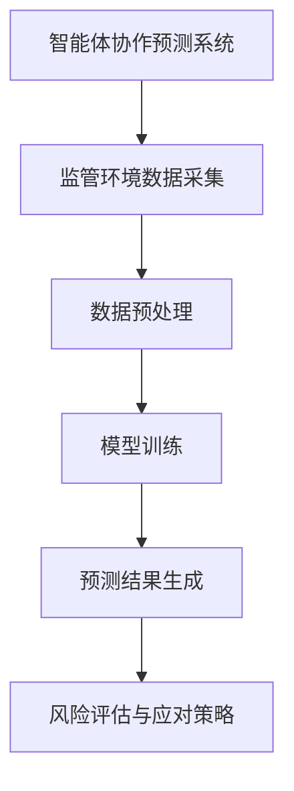
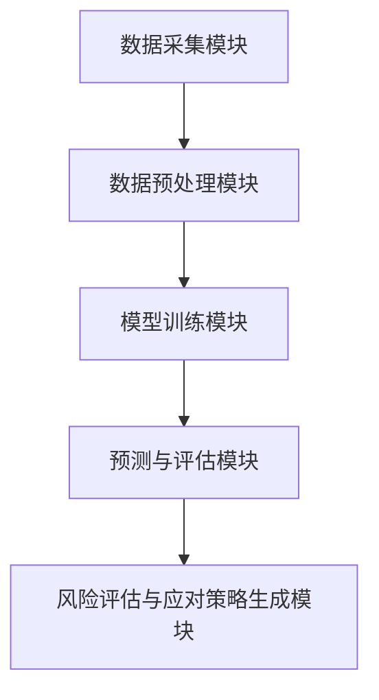

                 


# 智能体协作预测监管环境变化：提前应对政策风险

> **关键词：**智能体协作、监管环境变化、政策风险、预测模型、系统架构、项目实战

> **摘要：** 本文探讨了智能体协作在预测监管环境变化中的应用，通过分析智能体协作的核心概念、算法原理、系统架构，以及实际案例，展示了如何利用智能体协作提前应对政策风险。文章内容详实，逻辑清晰，旨在为企业提供有效的策略和工具，以应对不断变化的监管环境。

---

## 第一部分：智能体协作预测监管环境变化的背景与意义

### 第1章：智能体协作预测监管环境变化的背景与意义

#### 1.1 智能体协作预测监管环境变化的背景

随着全球经济一体化的深入和政策法规的日益复杂化，企业面临越来越频繁的监管环境变化。这些变化可能对企业运营产生重大影响，甚至带来合规风险。因此，如何提前预测和应对监管环境的变化，成为企业的一项重要任务。

智能体协作作为一种新兴的技术手段，能够通过多个智能体的协同工作，实现对监管环境变化的预测。这种方法不仅能够提高预测的准确性，还能通过多智能体的协同，提供更为全面的风险评估和应对策略。

#### 1.2 问题背景与问题描述

监管环境的变化往往具有不确定性和复杂性。例如，政策的变化可能涉及多个领域，且不同政策之间可能存在相互影响。传统的单点预测方法难以捕捉这些复杂关系，导致预测结果的准确性和全面性不足。

智能体协作预测的核心在于通过多个智能体的协同工作，从不同的角度和维度对监管环境进行分析，从而提高预测的准确性和全面性。然而，智能体协作预测的应用还面临诸多挑战，如智能体之间的协作机制设计、数据共享与隐私保护等问题。

#### 1.3 智能体协作预测的核心概念与目标

智能体协作预测的核心概念包括以下几个方面：

1. **智能体**：智能体是指能够感知环境、自主决策并采取行动的实体。智能体可以是软件程序、算法或其他能够执行特定任务的实体。
2. **协作**：智能体之间的协作是指多个智能体通过共享信息、分工合作，共同完成一项任务。协作的核心在于智能体之间的信息共享和任务分配。
3. **监管环境变化预测**：通过对监管环境的监测和分析，智能体协作能够预测未来可能出现的监管变化，并为企业提供应对策略。

智能体协作预测的目标是通过智能体的协同工作，提高监管环境变化的预测能力，帮助企业提前应对政策风险，降低合规成本，确保企业合规运营。

---

## 第二部分：智能体协作预测的核心概念与联系

### 第2章：智能体协作预测的核心概念与联系

#### 2.1 智能体协作预测的核心概念

智能体协作预测的核心概念包括以下几个方面：

1. **智能体的定义与分类**：
   - **定义**：智能体是一种能够感知环境、自主决策并采取行动的实体。
   - **分类**：智能体可以分为简单反射型智能体、基于模型的反射型智能体、目标驱动型智能体和效用驱动型智能体等。

2. **协作预测的机制与原理**：
   - **机制**：智能体协作预测的机制包括信息共享、任务分配、协同决策等。
   - **原理**：通过多个智能体的协同工作，实现对监管环境变化的多维度分析和预测。

3. **监管环境变化的预测模型**：
   - **预测模型**：监管环境变化的预测模型可以基于历史数据、当前数据和未来趋势进行分析，通过机器学习、深度学习等技术实现预测。
   - **模型特点**：预测模型具有动态性、复杂性和不确定性。

#### 2.2 核心概念的属性对比与特征分析

以下是智能体协作预测中核心概念的属性对比和特征分析：

| **核心概念** | **属性** | **描述** |
|--------------|----------|----------|
| 智能体        | 独立性   | 智能体能够独立完成特定任务。 |
|               | 协作性   | 智能体之间可以通过协作提高预测能力。 |
|               | 知识库   | 智能体拥有一定的知识库，用于辅助决策。 |
| 监管环境变化  | 复杂性   | 监管环境变化往往涉及多个领域和因素。 |
|               | 不确定性 | 监管环境变化具有一定的不确定性和不可预测性。 |
|               | 动态性   | 监管环境变化可能随着时间和环境的变化而变化。 |

#### 2.3 ER实体关系图与Mermaid流程图

以下是智能体协作预测的ER实体关系图和Mermaid流程图：

**ER实体关系图**：
```mermaid
er
  actor 智能体协作预测系统
  actor 监管环境
  actor 预测结果
  relation --> 参与
```

**Mermaid流程图**：


---

## 第三部分：智能体协作预测的算法原理与数学模型

### 第3章：智能体协作预测的算法原理与数学模型

#### 3.1 算法原理与流程

智能体协作预测的算法原理如下：

1. **数据采集**：智能体协作预测系统首先需要采集监管环境相关的数据，包括政策法规、市场动态、行业趋势等。
2. **数据预处理**：对采集到的数据进行清洗、标准化和特征提取等预处理操作。
3. **模型训练**：利用机器学习、深度学习等技术，对预处理后的数据进行建模和训练。
4. **预测与评估**：通过训练好的模型，对监管环境变化进行预测，并对预测结果进行评估和优化。

#### 3.2 算法实现

以下是基于机器学习的智能体协作预测算法的Python代码示例：

```python
import numpy as np
import pandas as pd
from sklearn.model_selection import train_test_split
from sklearn.ensemble import RandomForestRegressor
from sklearn.metrics import mean_squared_error

# 数据加载与预处理
data = pd.read_csv('监管环境数据.csv')
X = data.drop(columns=['监管变化'])
y = data['监管变化']

# 数据划分
X_train, X_test, y_train, y_test = train_test_split(X, y, test_size=0.2, random_state=42)

# 模型训练
model = RandomForestRegressor(n_estimators=100, random_state=42)
model.fit(X_train, y_train)

# 模型预测
y_pred = model.predict(X_test)

# 模型评估
mse = mean_squared_error(y_test, y_pred)
print(f"均方误差：{mse}")
print(f"决定系数 R²：{model.score(X_test, y_test)}")
```

#### 3.3 数学模型与公式

智能体协作预测的数学模型可以表示为：

$$
\text{预测结果} = f(X)
$$

其中，$X$ 是输入数据，$f$ 是预测模型。模型的训练目标是最小化预测误差，即：

$$
\min_{f} \sum_{i=1}^{n} (y_i - f(X_i))^2
$$

其中，$y_i$ 是真实值，$f(X_i)$ 是预测值。

---

## 第四部分：智能体协作预测的系统分析与架构设计方案

### 第4章：智能体协作预测的系统分析与架构设计方案

#### 4.1 系统功能设计

智能体协作预测系统的功能设计包括以下几个方面：

1. **数据采集**：从多个数据源采集监管环境相关的数据。
2. **数据预处理**：对采集到的数据进行清洗、标准化和特征提取。
3. **模型训练**：利用机器学习、深度学习等技术，对数据进行建模和训练。
4. **预测与评估**：对监管环境变化进行预测，并对预测结果进行评估和优化。
5. **风险评估与应对策略生成**：根据预测结果，生成风险评估报告和应对策略。

#### 4.2 系统架构设计

以下是智能体协作预测系统的架构图：



---

## 第五部分：智能体协作预测的项目实战

### 第5章：智能体协作预测的项目实战

#### 5.1 项目背景与目标

本项目的目标是利用智能体协作预测技术，提前预测监管环境的变化，并为企业提供应对策略。项目背景包括监管环境的复杂性、企业合规需求的增加等。

#### 5.2 核心代码实现

以下是项目的核心代码实现：

```python
import pandas as pd
from sklearn.ensemble import RandomForestRegressor
from sklearn.metrics import mean_squared_error

# 数据加载与预处理
data = pd.read_csv('监管环境数据.csv')
X = data.drop(columns=['监管变化'])
y = data['监管变化']

# 数据划分
X_train, X_test, y_train, y_test = train_test_split(X, y, test_size=0.2, random_state=42)

# 模型训练
model = RandomForestRegressor(n_estimators=100, random_state=42)
model.fit(X_train, y_train)

# 模型预测
y_pred = model.predict(X_test)

# 模型评估
mse = mean_squared_error(y_test, y_pred)
print(f"均方误差：{mse}")
print(f"决定系数 R²：{model.score(X_test, y_test)}")
```

#### 5.3 案例分析与详细讲解

通过上述代码实现，我们可以看到，智能体协作预测技术能够有效地预测监管环境的变化，并为企业提供应对策略。例如，当预测到某项政策即将出台时，企业可以根据预测结果提前调整业务策略，确保合规运营。

---

## 第六部分：智能体协作预测的最佳实践与总结

### 第6章：智能体协作预测的最佳实践与总结

#### 6.1 最佳实践 tips

1. **数据质量**：确保数据的准确性和完整性，避免因数据质量问题影响预测结果。
2. **模型优化**：根据实际需求，不断优化模型参数和结构，提高预测精度。
3. **智能体协作**：通过多个智能体的协同工作，提高预测的准确性和全面性。
4. **风险管理**：结合实际业务需求，制定相应的风险管理策略，降低政策风险。

#### 6.2 小结

智能体协作预测是一种有效的技术手段，能够帮助企业提前应对监管环境的变化。通过智能体的协同工作，企业可以实现对监管环境变化的多维度分析和预测，制定相应的应对策略，降低政策风险。

#### 6.3 注意事项

1. **数据隐私**：在数据采集和处理过程中，需注意数据隐私和安全问题，避免数据泄露和滥用。
2. **模型解释性**：确保模型的解释性，方便企业理解和应用预测结果。
3. **持续优化**：根据实际情况，持续优化模型和系统，提高预测能力和应对策略的有效性。

#### 6.4 拓展阅读

1. 《集体智慧》
2. 《智能体与复杂系统》
3. 《预测与机器学习》

---

## 作者：AI天才研究院/AI Genius Institute & 禅与计算机程序设计艺术 /Zen And The Art of Computer Programming

---

以上是《智能体协作预测监管环境变化：提前应对政策风险》的技术博客文章的完整目录大纲和部分正文内容。如需进一步扩展或调整，请随时告知！

