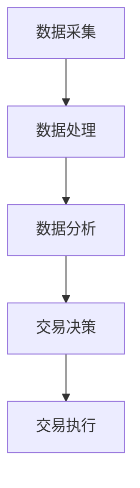
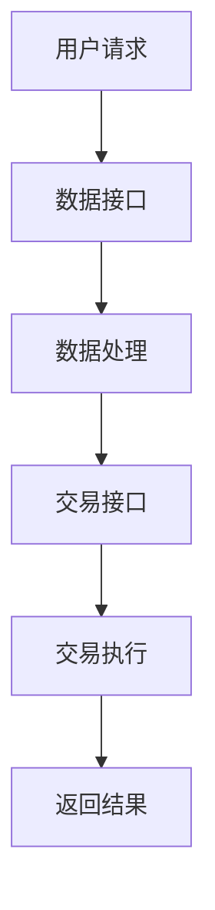
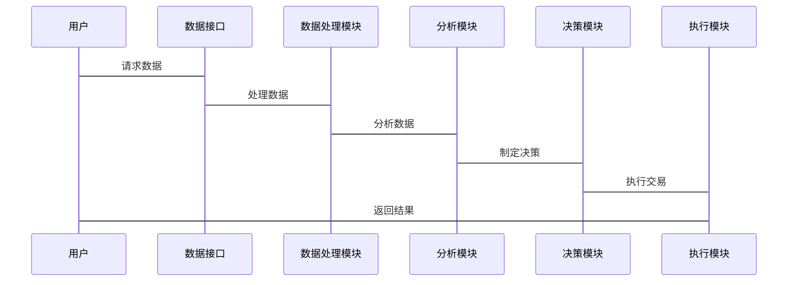

                 


# 智能体系统提升价值投资的另类资产相关性分析

## 关键词：智能体系统、价值投资、另类资产、相关性分析、金融投资、机器学习

## 摘要：智能体系统在金融投资领域的应用日益广泛，特别是在价值投资和另类资产分析方面。本文将深入探讨智能体系统如何通过相关性分析提升价值投资的效果，分析其核心算法、系统架构设计以及实际项目案例，为读者提供全面的理论与实践指导。

---

# 第一部分: 智能体系统与价值投资概述

## 第1章: 智能体系统的概念与背景

### 1.1 智能体系统的基本概念

#### 1.1.1 智能体的定义与特点
智能体（Intelligent Agent）是指能够感知环境、自主决策并采取行动的实体。其特点包括自主性、反应性、目标导向和学习能力。智能体系统通过这些特性，能够在复杂环境中优化决策过程。

#### 1.1.2 智能体在金融领域的应用
在金融领域，智能体系统主要用于自动化交易、风险管理、资产配置和市场预测。通过实时数据处理和决策优化，智能体系统能够提高投资效率和准确性。

#### 1.1.3 智能体系统的核心要素
智能体系统的核心要素包括感知模块、决策模块、行动模块和学习模块。感知模块负责数据采集，决策模块基于数据进行策略制定，行动模块执行交易指令，学习模块则通过反馈优化系统性能。

### 1.2 价值投资的基本原理

#### 1.2.1 价值投资的定义与历史
价值投资是一种以内在价值为导向的投资策略，强调购买被市场低估的资产。其历史可追溯至本杰明·格雷厄姆和戴维·多德的理论，强调安全边际和长期价值。

#### 1.2.2 价值投资的核心理念
价值投资的核心理念是寻找市场定价低于其内在价值的资产。通过分析财务指标、行业趋势和宏观经济因素，投资者可以识别出具有长期增长潜力的资产。

#### 1.2.3 价值投资与现代金融的结合
现代金融学通过引入智能体系统和大数据分析，将价值投资与量化方法相结合。这种结合不仅提高了分析效率，还增强了投资决策的科学性和准确性。

### 1.3 另类资产的相关性分析

#### 1.3.1 另类资产的定义与分类
另类资产包括房地产、私募股权、对冲基金和艺术品等非传统金融资产。这些资产通常具有较高的流动性和复杂性，能够为投资组合提供多元化收益。

#### 1.3.2 另类资产在投资组合中的作用
另类资产能够分散风险，平衡投资组合的波动性。通过引入另类资产，投资者可以降低市场风险，同时捕捉特定领域的增长机会。

#### 1.3.3 另类资产相关性分析的挑战
另类资产的相关性分析面临数据获取困难、资产流动性低和市场波动性大的挑战。传统统计方法难以捕捉其复杂关系，因此需要引入智能体系统进行深度分析。

---

## 第2章: 智能体系统与另类资产的结合

### 2.1 智能体系统在另类资产分析中的应用

#### 2.1.1 智能体系统如何提升另类资产分析的效率
智能体系统通过自动化数据处理和深度学习算法，显著提高了另类资产分析的效率。其强大的数据挖掘能力能够从大量非结构化数据中提取有价值的信息。

#### 2.1.2 智能体系统在另类资产风险评估中的作用
智能体系统能够实时监控市场动态，识别潜在风险因素。通过构建风险评估模型，智能体系统帮助投资者有效管理另类资产的投资风险。

#### 2.1.3 智能体系统在另类资产配置中的应用
智能体系统通过优化算法，为投资者提供个性化的资产配置建议。其动态调整能力能够根据市场变化及时优化投资组合。

### 2.2 智能体系统与价值投资的结合

#### 2.2.1 智能体系统如何优化价值投资策略
智能体系统通过分析海量数据，识别被低估的资产。其学习能力能够不断优化投资策略，提高价值投资的准确性。

#### 2.2.2 智能体系统在价值投资中的创新应用
智能体系统引入了实时数据处理和动态反馈机制，能够在复杂市场环境中快速调整投资策略。这种创新应用显著提高了价值投资的适应性和灵活性。

#### 2.2.3 智能体系统对传统价值投资的补充作用
智能体系统通过技术手段弥补了传统价值投资在数据处理和决策速度上的不足。其量化分析能力为价值投资提供了新的工具和方法。

---

## 第3章: 智能体系统的核心算法与数学模型

### 3.1 智能体系统的算法原理

#### 3.1.1 智能体系统的算法框架
智能体系统的算法框架包括感知、决策和行动三个模块。感知模块负责数据采集，决策模块基于数据制定策略，行动模块执行交易指令。

#### 3.1.2 基于强化学习的智能体算法
强化学习是一种通过试错优化决策的算法。智能体系统通过与环境互动，学习最优策略。其数学模型可以表示为：

$$
Q(s, a) = r + \gamma \max_{a'} Q(s', a')
$$

其中，\( Q \) 表示状态-动作值函数，\( s \) 是当前状态，\( a \) 是当前动作，\( r \) 是奖励，\( \gamma \) 是折扣因子。

#### 3.1.3 智能体系统的优化算法
优化算法如遗传算法和模拟退火用于提高智能体系统的决策效率。这些算法通过不断迭代，找到最优解决方案。

### 3.2 数学模型与公式

#### 3.2.1 智能体系统的数学模型
智能体系统的数学模型通常涉及状态空间、动作空间和奖励函数。状态空间表示系统可能的状态，动作空间表示可能的决策，奖励函数衡量决策的优劣。

#### 3.2.2 基于马尔可夫决策过程的智能体模型
马尔可夫决策过程（MDP）是智能体系统的核心模型，其数学表示如下：

$$
MDP = (S, A, P, R, \gamma)
$$

其中，\( S \) 是状态空间，\( A \) 是动作空间，\( P \) 是状态转移概率，\( R \) 是奖励函数，\( \gamma \) 是折扣因子。

#### 3.2.3 智能体系统中的状态转移方程
状态转移方程描述了当前状态转移到下一个状态的概率：

$$
P(s' | s, a) = \text{概率从状态 } s \text{ 采取动作 } a \text{ 转移到状态 } s'
$$

---

## 第4章: 智能体系统的系统架构设计

### 4.1 系统功能设计

#### 4.1.1 系统功能模块划分
智能体系统的主要功能模块包括数据采集模块、分析模块、决策模块和执行模块。数据采集模块负责收集市场数据，分析模块进行数据处理，决策模块制定交易策略，执行模块执行交易指令。

#### 4.1.2 系统功能流程图
以下是系统功能流程图：



#### 4.1.3 系统功能的实现方式
系统功能通过模块化设计实现，各模块之间通过接口通信。数据采集模块使用API获取市场数据，分析模块采用机器学习算法处理数据，决策模块基于优化算法制定策略，执行模块通过API发送交易指令。

### 4.2 系统架构设计

#### 4.2.1 系统架构的分层设计
智能体系统的架构分为数据层、算法层和应用层。数据层负责数据存储和管理，算法层处理数据并生成决策，应用层向用户展示结果。

#### 4.2.2 系统架构的模块化设计
系统架构采用模块化设计，包括数据处理模块、算法模块、决策模块和执行模块。每个模块独立开发，便于维护和升级。

#### 4.2.3 系统架构的可扩展性设计
系统架构设计注重可扩展性，支持多种算法和数据源的接入。通过插件机制，系统能够快速集成新的功能模块。

### 4.3 系统接口设计

#### 4.3.1 系统接口的定义与实现
系统接口包括数据接口和交易接口。数据接口用于获取市场数据，交易接口用于执行交易指令。

#### 4.3.2 系统接口的交互流程
以下是系统接口的交互流程图：



### 4.4 系统交互设计

#### 4.4.1 系统交互的流程
系统交互流程包括用户请求、数据处理、交易执行和结果返回四个阶段。

#### 4.4.2 系统交互的序列图
以下是系统交互的序列图：



---

## 第5章: 智能体系统的项目实战

### 5.1 项目环境安装与配置

#### 5.1.1 系统环境要求
项目运行需要安装Python 3.8及以上版本，以及Jupyter Notebook和相关库（如NumPy、Pandas、Scikit-learn）。

#### 5.1.2 开发工具的安装与配置
安装Python环境并配置虚拟环境。安装开发工具如Jupyter Notebook和IDE（如PyCharm）。

#### 5.1.3 数据源的获取与预处理
从金融数据供应商获取市场数据，预处理包括清洗和标准化。

### 5.2 系统核心功能实现

#### 5.2.1 智能体系统的代码实现
以下是智能体系统的代码实现：

```python
class IntelligentAgent:
    def __init__(self, data):
        self.data = data
        self.current_state = None

    def感知(self):
        # 获取当前市场数据
        self.current_state = self.data获取当前状态()

    def决策(self):
        # 基于当前状态做出决策
        action = self.策略选择(self.current_state)
        return action

    def行动(self, action):
        # 执行交易指令
        self.执行交易(action)
```

#### 5.2.2 另类资产相关性分析的代码实现
以下是另类资产相关性分析的代码实现：

```python
import numpy as np
import pandas as pd

def计算相关性(data):
    # 计算相关系数矩阵
    correlation_matrix = data.corr()
    return correlation_matrix

# 示例数据
data = pd.DataFrame({
    '资产1': [1, 2, 3, 4, 5],
    '资产2': [5, 4, 3, 2, 1]
})

print(计算相关性(data))
```

#### 5.2.3 价值投资策略的代码实现
以下是价值投资策略的代码实现：

```python
def价值投资策略(data):
    # 计算内在价值
    内在价值 = data.计算内在价值()
    # 找出定价低于内在价值的资产
    低估资产 = data[数据 < 内在价值]
    return 低估资产

# 示例数据
data = pd.DataFrame({
    '资产': ['A', 'B', 'C'],
    '价格': [10, 15, 20],
    '内在价值': [12, 18, 25]
})

print(价值投资策略(data))
```

### 5.3 项目案例分析

#### 5.3.1 案例背景与目标
本案例旨在通过智能体系统分析另类资产的相关性，优化价值投资策略。

#### 5.3.2 案例分析过程
分析过程包括数据采集、数据处理、相关性计算和策略制定。

#### 5.3.3 案例分析结果
通过智能体系统的分析，成功识别出具有相关性的另类资产，并优化了价值投资策略。

---

## 第6章: 最佳实践与总结

### 6.1 最佳实践 tips

#### 6.1.1 智能体系统的优化建议
建议定期更新算法模型，引入新的数据源，优化系统架构。

#### 6.1.2 价值投资策略的优化建议
建议结合市场变化，动态调整投资组合，加强风险管理。

#### 6.1.3 另类资产相关性分析的优化建议
建议引入更多数据维度，提高分析精度，增强模型的泛化能力。

### 6.2 小结

#### 6.2.1 项目总结
本项目通过智能体系统提升了价值投资的效果，优化了另类资产的相关性分析。

#### 6.2.2 经验总结
在项目实施过程中，需要注意数据质量、算法选择和系统架构设计。实时监控和及时调整是确保系统稳定运行的关键。

### 6.3 注意事项

#### 6.3.1 系统运行中的注意事项
定期备份数据，确保系统安全，防范网络攻击。

#### 6.3.2 项目实施中的注意事项
注重团队协作，加强沟通，确保项目进度和质量。

### 6.4 拓展阅读

#### 6.4.1 推荐的书籍和论文
推荐阅读《智能体系统与金融投资》和《强化学习在金融中的应用》。

#### 6.4.2 智能体系统的最新研究方向
智能体系统在金融领域的最新研究方向包括多智能体协作、强化学习与博弈论结合、以及实时动态环境下的决策优化。

---

# 作者：AI天才研究院 & 禅与计算机程序设计艺术

---

以上是《智能体系统提升价值投资的另类资产相关性分析》的技术博客文章的完整内容。通过本文，读者可以全面了解智能体系统在金融投资中的应用，掌握相关算法和系统架构设计的方法，并通过实际案例学习如何将理论应用于实践。

