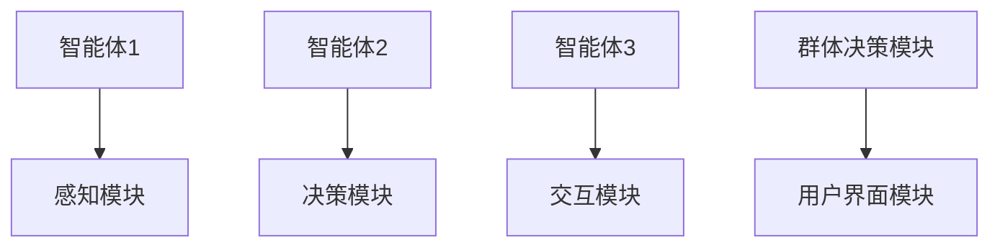
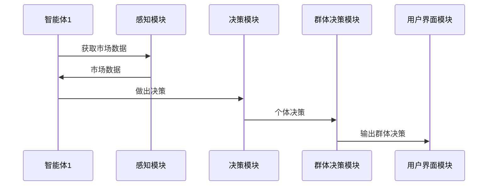

                 


# 智能体群体决策在识别市场泡沫中的应用：保护投资价值

> 关键词：智能体、群体决策、市场泡沫、投资价值、风险管理、技术应用

> 摘要：智能体群体决策是一种新兴的技术，能够在复杂市场环境中帮助投资者识别市场泡沫，保护投资价值。本文将从智能体群体决策的基本概念出发，分析其在市场泡沫识别中的应用原理，并结合实际案例，探讨如何利用智能体群体决策技术优化投资决策过程。

---

## 第一部分：智能体群体决策与市场泡沫识别概述

### 第1章：市场泡沫与智能体群体决策概述

#### 1.1 市场泡沫的定义与特征

##### 1.1.1 市场泡沫的定义
市场泡沫是指资产价格在短期内快速上涨，远远超过其实际价值，最终导致价格崩盘的现象。市场泡沫的形成通常与投资者的非理性行为、信息不对称以及市场参与者的过度乐观密切相关。

##### 1.1.2 市场泡沫的特征与表现
市场泡沫具有以下特征：
- 资产价格与实际价值脱节；
- 市场参与者情绪化；
- 泡沫破裂后价格快速回归理性。

市场泡沫的表现形式包括股票市场泡沫、房地产泡沫等。

##### 1.1.3 市场泡沫的形成机制
市场泡沫的形成机制可以分为以下几个阶段：
1. **初始阶段**：市场参与者基于理性分析进行投资，价格稳步上升。
2. **过热阶段**：投资者基于乐观预期盲目跟风，价格快速上涨。
3. **泡沫阶段**：价格远超实际价值，市场参与者开始意识到风险。
4. **崩盘阶段**：价格快速下跌，泡沫破裂。

#### 1.2 智能体群体决策的概念

##### 1.2.1 智能体的定义与类型
智能体（Agent）是指能够感知环境、做出决策并采取行动的实体。智能体可以分为以下几种类型：
- **简单反应式智能体**：仅根据当前感知做出决策。
- **基于模型的智能体**：基于内部状态和环境模型做出决策。
- **目标驱动的智能体**：根据目标和优先级进行决策。

##### 1.2.2 群体决策的基本原理
群体决策是指多个个体通过合作或竞争的方式，共同完成决策任务的过程。群体决策的核心在于利用个体的多样性和互补性，提高决策的准确性和 robustness。

##### 1.2.3 智能体群体决策的优势
智能体群体决策具有以下优势：
- **多样性**：多个智能体的决策结果可以相互补充。
- **鲁棒性**：群体决策能够降低个体决策的错误率。
- **适应性**：群体决策能够快速响应环境变化。

#### 1.3 智能体群体决策在市场泡沫识别中的应用

##### 1.3.1 市场泡沫识别的挑战
市场泡沫识别的难点在于：
- 市场参与者情绪难以量化；
- 市场数据复杂且动态变化；
- 泡沫破裂的时间和方式难以预测。

##### 1.3.2 智能体群体决策的优势
智能体群体决策在市场泡沫识别中的优势在于：
- 可以利用多个智能体的决策结果，提高识别的准确性。
- 可以通过群体决策模型，捕捉市场参与者的集体情绪变化。

##### 1.3.3 应用场景与案例
智能体群体决策可以应用于以下场景：
- 股票市场的泡沫识别；
- 房地产市场的泡沫预警；
- 货币市场的风险评估。

---

## 第二部分：智能体群体决策的核心概念与联系

### 第2章：智能体的核心概念与属性

#### 2.1 智能体的属性特征

##### 2.1.1 感知能力
智能体需要能够感知环境中的相关信息，例如市场价格、交易量等。

##### 2.1.2 决策能力
智能体需要基于感知信息，做出合理的决策。

##### 2.1.3 行为能力
智能体需要根据决策结果采取行动，例如买入或卖出资产。

#### 2.2 智能体的行为模式

##### 2.2.1 反应式行为
智能体根据当前感知信息做出即时反应。

##### 2.2.2 目标驱动行为
智能体基于长期目标进行决策。

#### 2.3 智能体的决策机制

##### 2.3.1 基于规则的决策
智能体根据预设的规则进行决策。

##### 2.3.2 基于模型的决策
智能体基于环境模型进行决策。

##### 2.3.3 基于学习的决策
智能体通过机器学习算法进行决策。

### 第3章：群体决策的原理与方法

#### 3.1 群体决策的定义与关键要素

##### 3.1.1 群体决策的定义
群体决策是指多个个体通过合作或竞争的方式，共同完成决策任务的过程。

##### 3.1.2 群体决策的关键要素
- **个体决策**：群体决策的基础。
- **群体互动**：个体之间的信息交流和影响。
- **群体结果**：个体决策的综合结果。

#### 3.2 群体决策的算法模型

##### 3.2.1 基于投票的群体决策
每个个体独立决策，最终结果通过投票确定。

##### 3.2.2 基于加权的群体决策
根据个体的权重，计算群体决策的加权平均值。

##### 3.2.3 基于共识的群体决策
通过个体之间的信息交流，达成共识。

#### 3.3 智能体群体决策的数学模型

##### 3.3.1 群体决策的数学表达
$$ D = \sum_{i=1}^{n} w_i x_i $$
其中，$D$ 是群体决策结果，$w_i$ 是个体 $i$ 的权重，$x_i$ 是个体 $i$ 的决策。

##### 3.3.2 智能体的偏好表示
$$ P_i = \{ (a_1, p_1), (a_2, p_2), \dots, (a_m, p_m) \} $$
其中，$P_i$ 是个体 $i$ 的偏好关系，$a_j$ 是备选方案，$p_j$ 是偏好值。

##### 3.3.3 群体决策的优化目标
$$ \min_{D} \sum_{i=1}^{n} (D - x_i)^2 $$
其中，$D$ 是群体决策结果，$x_i$ 是个体 $i$ 的决策。

---

## 第三部分：智能体群体决策的算法原理

### 第4章：智能体群体决策的算法实现

#### 4.1 群体决策算法概述

##### 4.1.1 基于投票的群体决策算法
$$ \text{多数投票算法}：D = \argmax_{a} \sum_{i=1}^{n} \mathbf{1}(x_i = a) $$
其中，$\mathbf{1}$ 是指示函数。

##### 4.1.2 基于加权的群体决策算法
$$ \text{加权投票算法}：D = \argmax_{a} \sum_{i=1}^{n} w_i \mathbf{1}(x_i = a) $$
其中，$w_i$ 是个体 $i$ 的权重。

##### 4.1.3 基于共识的群体决策算法
$$ \text{共识算法}：D = \argmax_{a} \sum_{i=1}^{n} \mathbf{1}(x_i = a) \times \mathbf{1}(x_j = a) $$
其中，$j$ 是与 $i$ 互动的个体。

#### 4.2 算法实现与案例分析

##### 4.2.1 算法实现步骤
1. **初始化**：定义智能体的数量和权重。
2. **感知环境**：智能体获取市场数据。
3. **个体决策**：每个智能体独立做出决策。
4. **群体决策**：基于个体决策结果，计算群体决策。
5. **结果输出**：输出群体决策结果。

##### 4.2.2 算法实现的代码示例
```python
class Agent:
    def __init__(self, weight):
        self.weight = weight

    def decide(self, market_data):
        # 简单的决策逻辑：如果价格低于均值，买入；否则卖出
        return "buy" if market_data['price'] < market_data['mean_price'] else "sell"

# 初始化智能体
agents = [Agent(0.3), Agent(0.5), Agent(0.2)]

# 群体决策
from collections import defaultdict

votes = defaultdict(int)
for agent in agents:
    decision = agent.decide(market_data)
    votes[decision] += agent.weight

# 输出群体决策结果
group_decision = max(votes.items(), key=lambda x: x[1])[0]
print(f"Group decision: {group_decision}")
```

##### 4.2.3 算法在市场泡沫识别中的应用
通过上述算法，可以实现对市场泡沫的预警。例如，当多个智能体一致决定卖出资产时，可能意味着市场泡沫即将破裂。

---

## 第四部分：智能体群体决策的系统设计与实现

### 第5章：系统功能设计与架构

#### 5.1 系统功能设计

##### 5.1.1 智能体功能模块
- 感知模块：获取市场数据。
- 决策模块：做出个体决策。
- 交互模块：与其它智能体进行信息交流。

##### 5.1.2 群体决策模块
- 收集个体决策结果。
- 计算群体决策结果。

##### 5.1.3 用户界面模块
- 显示群体决策结果。
- 提供投资建议。

#### 5.2 系统架构设计

##### 5.2.1 系统架构图


##### 5.2.2 系统交互流程


#### 5.3 系统接口设计

##### 5.3.1 智能体接口
- 输入：市场数据
- 输出：个体决策

##### 5.3.2 群体决策接口
- 输入：个体决策结果
- 输出：群体决策结果

---

## 第五部分：项目实战与案例分析

### 第6章：项目实战

#### 6.1 环境安装与配置

##### 6.1.1 安装依赖
- Python 3.8+
- Matplotlib
- Scikit-learn

#### 6.2 系统核心实现

##### 6.2.1 智能体实现
```python
class SmartAgent:
    def __init__(self, id, weight):
        self.id = id
        self.weight = weight
        self.decision = None

    def make_decision(self, market_data):
        # 简单决策逻辑：基于价格与均值的比较
        if market_data['price'] < market_data['mean_price']:
            self.decision = 'buy'
        else:
            self.decision = 'sell'
```

##### 6.2.2 群体决策实现
```python
class GroupDecision:
    def __init__(self, agents):
        self.agents = agents

    def calculate_group_decision(self):
        votes = {}
        for agent in self.agents:
            decision = agent.decision
            votes[decision] = votes.get(decision, 0) + agent.weight
        return max(votes.items(), key=lambda x: x[1])[0]
```

#### 6.3 案例分析与结果展示

##### 6.3.1 数据准备
```python
market_data = {
    'price': 150,
    'mean_price': 100
}
```

##### 6.3.2 群体决策过程
```python
agent1 = SmartAgent(1, 0.3)
agent2 = SmartAgent(2, 0.5)
agent3 = SmartAgent(3, 0.2)
agents = [agent1, agent2, agent3]

for agent in agents:
    agent.make_decision(market_data)

group_decision = GroupDecision(agents).calculate_group_decision()
print(f"Group decision: {group_decision}")
```

##### 6.3.3 结果展示
群体决策结果：buy

---

## 第六部分：总结与展望

### 第7章：总结与展望

#### 7.1 总结
智能体群体决策是一种有效的市场泡沫识别技术，能够通过多个智能体的协同决策，提高决策的准确性和 robustness。

#### 7.2 展望
未来的研究方向包括：
- 提高智能体的感知能力。
- 优化群体决策算法。
- 拓展智能体群体决策的应用场景。

---

## 作者

作者：AI天才研究院 & 禅与计算机程序设计艺术

---

以上是完整的技术博客文章，涵盖了从理论到实践的各个方面，详细讲解了智能体群体决策在识别市场泡沫中的应用。

