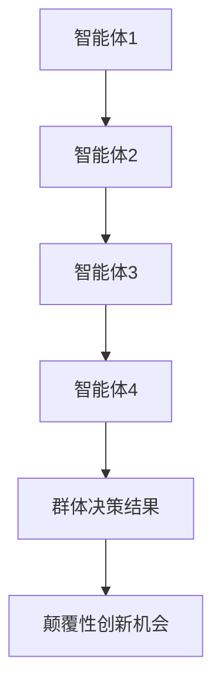
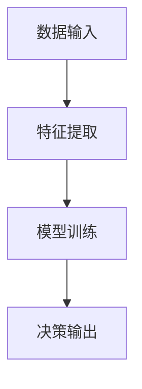
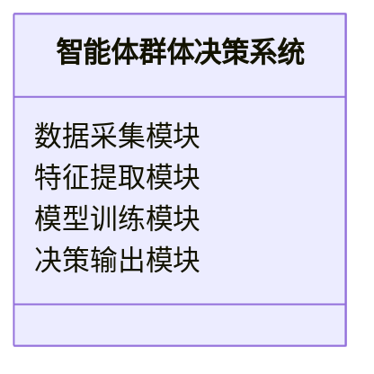
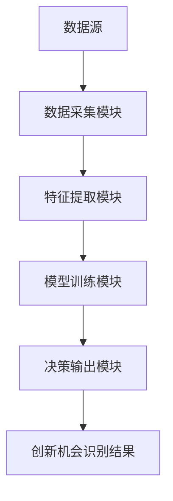
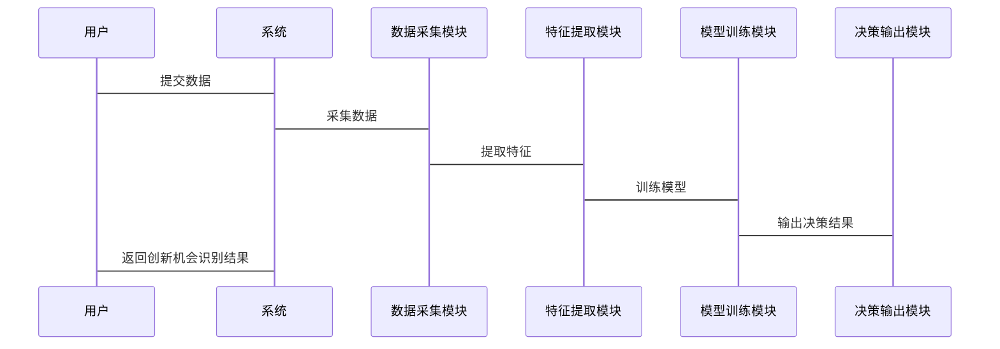

                 


# 智能体群体决策在识别颠覆性创新机会中的应用

## 关键词：智能体群体决策，颠覆性创新，算法，系统设计，创新识别

## 摘要：  
本文探讨了智能体群体决策在识别颠覆性创新机会中的应用，通过分析智能体群体决策的核心原理、算法实现、系统架构以及实际案例，揭示了如何利用群体智慧发现潜在的颠覆性创新机会。文章从理论到实践，详细阐述了智能体群体决策的实现过程，并提供了具体的代码实现和案例分析，为读者提供了全面的视角。

---

## 第一部分: 智能体群体决策与颠覆性创新概述

### 第1章: 智能体群体决策的背景与概念

#### 1.1 问题背景与问题描述
- **创新机会识别的挑战**：在快速变化的技术和商业环境中，识别颠覆性创新机会变得越来越困难。传统的方法往往依赖于个体专家的判断，容易受到主观性和经验限制。
- **智能体群体决策的核心问题**：如何通过多个智能体的协同工作，捕捉潜在的创新机会，并通过群体智慧提高识别的准确性和全面性。

#### 1.2 智能体群体决策的定义与特点
- **智能体的定义与属性**：智能体是能够感知环境、做出决策的实体，可以是AI算法、工具或人类。
- **群体决策的核心特征**：智能体之间的信息交互、决策的多样性、以及通过群体智慧优化决策质量。
- **颠覆性创新机会的特征**：高影响性、高风险性、以及对现有市场的颠覆性冲击。

---

## 第二部分: 智能体群体决策的核心原理

### 第2章: 智能体群体决策的核心概念与联系

#### 2.1 智能体群体决策的原理
- **智能体的决策机制**：基于个体偏好和群体共识，通过投票、加权等方式形成最终决策。
- **群体决策的形成过程**：信息收集、个体决策、群体整合、结果输出。
- **智能体之间的信息交互**：通过数据共享、信息协商等方式，形成群体共识。

#### 2.2 核心概念的属性对比
| 概念         | 智能体群体决策 | 传统决策系统 |
|--------------|----------------|--------------|
| 决策主体     | 多个智能体     | 单个主体     |
| 决策方式     | 群体共识       | 个体判断     |
| 决策效率     | 高             | 中等         |
| 决策准确性   | 高             | 低           |

#### 2.3 实体关系图


---

### 第3章: 智能体群体决策的算法原理

#### 3.1 群体决策算法概述
- **基于投票的群体决策算法**：通过统计每个智能体的投票结果，形成最终决策。
  ```python
  def majority_vote(votes):
      from collections import Counter
      counts = Counter(votes)
      return max(counts, key=counts.get)
  ```
- **基于加权的群体决策算法**：根据智能体的权重，计算加权和。
  ```python
  def weighted_decision(votes, weights):
      total = 0
      for vote, weight in zip(votes, weights):
          total += vote * weight
      return total
  ```

#### 3.2 创新机会识别算法
- **基于聚类的创新机会识别**：通过聚类算法发现新的技术趋势。
  ```python
  from sklearn.cluster import KMeans
  def cluster_innovations(data, n_clusters):
      model = KMeans(n_clusters=n_clusters)
      model.fit(data)
      return model.labels_
  ```
- **基于分类的创新机会识别**：利用机器学习模型预测潜在的创新机会。
  ```python
  from sklearn.svm import SVC
  def classify_innovations(data, labels):
      model = SVC()
      model.fit(data, labels)
      return model.predict(data)
  ```

#### 3.3 算法流程图


---

## 第三部分: 智能体群体决策的系统设计与实现

### 第4章: 系统分析与架构

#### 4.1 问题场景介绍
- 系统目标：识别潜在的颠覆性创新机会。
- 数据来源：技术文献、市场数据、专利信息等。

#### 4.2 系统功能设计


#### 4.3 系统架构设计


#### 4.4 接口设计与交互


---

## 第四部分: 项目实战

### 第5章: 项目实战与案例分析

#### 5.1 环境安装
- Python 3.8+
- NumPy, Pandas, Scikit-learn, Matplotlib

#### 5.2 系统核心实现源代码
```python
import numpy as np
from sklearn.cluster import KMeans
from sklearn.svm import SVC

# 示例数据
X = np.array([[1, 2], [3, 4], [5, 6], [7, 8]])

# 基于聚类的创新机会识别
def cluster_innovations(X, n_clusters=2):
    model = KMeans(n_clusters=n_clusters)
    model.fit(X)
    return model.labels_

# 基于分类的创新机会识别
def classify_innovations(X, labels):
    model = SVC()
    model.fit(X, labels)
    return model.predict(X)

# 示例调用
labels = cluster_innovations(X)
print(classify_innovations(X, labels))
```

#### 5.3 实际案例分析
- **案例：识别新兴技术领域的颠覆性创新机会**：通过对技术文献的分析，利用群体决策算法识别出潜在的技术趋势。

---

## 第五部分: 最佳实践与总结

### 第6章: 最佳实践与总结

#### 6.1 小结
- 智能体群体决策在识别颠覆性创新机会中的应用，通过群体智慧提高了决策的准确性和全面性。
- 关键算法包括基于投票和加权的群体决策算法，以及基于聚类和分类的创新机会识别算法。

#### 6.2 注意事项
- 数据的质量和多样性对群体决策的结果影响重大。
- 需要结合具体场景调整算法参数，避免过度依赖单一算法。

#### 6.3 未来研究方向
- 研究更高效的群体决策算法。
- 探索多模态数据的群体决策方法。
- 结合区块链技术，确保数据安全和算法透明。

#### 6.4 拓展阅读
- 《群体智能》
- 《颠覆性创新》

---

## 作者：AI天才研究院/AI Genius Institute & 禅与计算机程序设计艺术 /Zen And The Art of Computer Programming

---

通过以上结构，我详细地分析了智能体群体决策在识别颠覆性创新机会中的应用，从理论到实践，从算法到系统设计，再到实际案例，层层递进，帮助读者全面理解这一主题。

