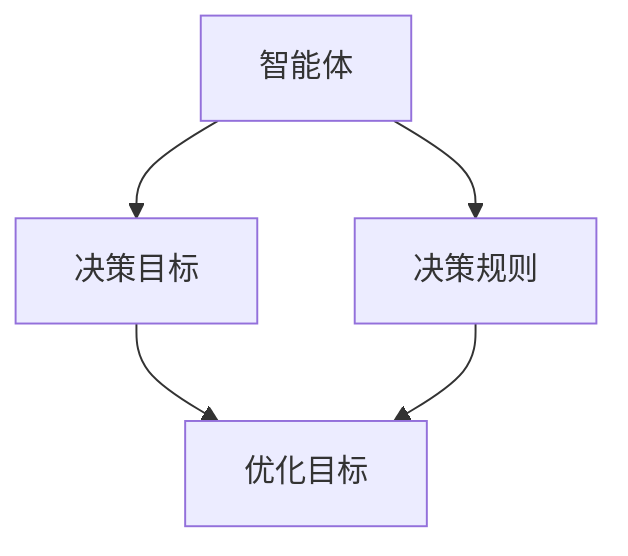
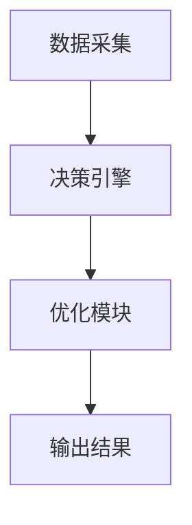

                 


# 智能体群体决策在资产配置中的应用：优化投资组合

**关键词：** 智能体，群体决策，资产配置，投资组合优化，算法原理，系统架构，项目实战

**摘要：** 本文探讨了智能体群体决策在资产配置中的应用，通过分析智能体的基本概念、群体决策机制、算法原理、系统架构设计以及项目实战，展示了如何利用智能体群体决策优化投资组合。文章结合理论与实践，详细阐述了智能体群体决策的优势及其在资产配置中的具体应用，为投资决策提供了新的视角和方法。

---

## 第一部分: 智能体群体决策在资产配置中的应用概述

### 第1章: 背景介绍与问题背景

#### 1.1 问题背景
##### 1.1.1 智能体群体决策的起源与定义
智能体（Agent）是指能够感知环境、自主决策并采取行动的实体。群体决策是指多个智能体协同工作，共同完成决策任务的过程。智能体群体决策起源于人工智能和分布式系统领域，近年来在金融领域的应用逐渐增多。

##### 1.1.2 资产配置中的传统方法与局限性
传统的资产配置方法主要包括均值-方差模型和现代投资组合理论（MPT）。这些方法依赖于历史数据和假设条件，但在面对复杂市场环境时，往往难以适应动态变化，且缺乏灵活性。

##### 1.1.3 智能体群体决策的优势与适用场景
智能体群体决策通过多个智能体协同工作，能够更好地捕捉市场信息，适应市场变化，降低单一决策的风险。适用于复杂、动态的资产配置场景。

#### 1.2 问题描述
##### 1.2.1 资产配置的核心问题
资产配置的核心问题是如何在不同资产之间分配资金，以实现收益最大化和风险最小化。

##### 1.2.2 智能体群体决策在资产配置中的具体应用
智能体群体决策可以用于资产分配、风险控制和动态再平衡等场景。

##### 1.2.3 问题的边界与外延
智能体群体决策的应用边界包括市场数据获取、智能体之间的通信机制以及决策的实时性要求。

#### 1.3 问题解决与核心概念
##### 1.3.1 智能体群体决策的基本原理
智能体通过感知环境、协商和协作，共同完成决策任务。

##### 1.3.2 资产配置中的优化目标
资产配置的优化目标包括最大化收益、最小化风险、提高资金利用率等。

##### 1.3.3 核心概念与要素的结构化分析
智能体群体决策的核心要素包括智能体、环境、决策规则和目标函数。

### 第2章: 智能体群体决策的核心概念与联系

#### 2.1 核心概念原理
##### 2.1.1 智能体的基本属性与特征
智能体具有自主性、反应性、目标导向性和社会性等特征。

##### 2.1.2 群体决策的机制与规则
群体决策机制包括信息共享、协商和共识达成等步骤。

##### 2.1.3 智能体与资产配置的关联性
智能体通过分析市场数据和风险偏好，制定投资策略。

#### 2.2 核心概念对比表
| 比较维度 | 智能体决策 | 传统决策模型 |
|----------|------------|--------------|
| 决策主体 | 多个智能体 | 单一决策者    |
| 决策效率 | 高         | 中           |
| 决策灵活性 | 强         | 低           |

#### 2.3 ER实体关系图


---

## 第二部分: 智能体群体决策的算法原理

### 第3章: 算法原理概述
#### 3.1 基于仿生学的智能体算法
粒子群算法（PSO）是一种常见的仿生算法，模拟鸟群觅食行为。

#### 3.2 基于博弈论的群体决策算法
纳什均衡是一种稳定状态，适用于多个智能体之间的博弈场景。

#### 3.3 基于多目标优化的智能体算法
通过多目标优化算法，可以在多个目标之间找到平衡点。

### 第4章: 算法流程图
#### 4.1 粒子群算法的流程图
```mermaid
graph TD
    Start --> Initialize
    Initialize --> Update Personal Best
    Update Personal Best --> Update Global Best
    Update Global Best --> Update Velocity
    Update Velocity --> Update Position
    Update Position --> Check Termination
    Check Termination --> End
    Check Termination --> Continue
```

#### 4.2 算法实现代码
```python
import numpy as np

def pso_optimizer(n_particles, dimensions, bounds, max_iter):
    # 初始化粒子群
    particles = np.random.uniform(bounds[0], bounds[1], (n_particles, dimensions))
    # 全局最优解
    global_best = np.zeros(dimensions)
    # 粒子最优解
    personal_best = np.zeros((n_particles, dimensions))
    # 计算初始适应度
    fitness = np.zeros(n_particles)
    
    for i in range(max_iter):
        for j in range(n_particles):
            # 计算适应度
            fitness[j] = calculate_fitness(particles[j])
            # 更新个人最优
            if fitness[j] > calculate_fitness(personal_best[j]):
                personal_best[j] = particles[j]
        # 更新全局最优
        if np.mean(fitness) > calculate_fitness(global_best):
            global_best = np.mean(personal_best, axis=0)
        # 更新速度和位置
        particles += np.random.rand(n_particles, dimensions) * (personal_best - particles)
```

---

## 第三部分: 智能体群体决策的系统架构设计

### 第5章: 问题场景与系统功能设计
#### 5.1 问题场景介绍
投资者需要在股票、债券等资产之间进行配置，以实现收益与风险的平衡。

#### 5.2 系统功能设计
- 数据采集模块：收集市场数据。
- 决策引擎模块：执行智能体群体决策。
- 优化模块：生成最优投资组合。

#### 5.3 系统架构设计


### 第6章: 项目实战与案例分析
#### 6.1 项目实战
##### 6.1.1 环境安装
安装必要的库：`pip install numpy pandas`

##### 6.1.2 核心实现代码
```python
import numpy as np

def calculate_fitness(position):
    # 计算适应度函数，此处简化为收益
    return np.sum(position)

def pso_optimizer(n_particles, dimensions, bounds, max_iter):
    particles = np.random.uniform(bounds[0], bounds[1], (n_particles, dimensions))
    personal_best = particles.copy()
    global_best = particles.mean(axis=0)
    
    for _ in range(max_iter):
        fitness = np.apply_along_axis(calculate_fitness, 1, particles)
        if np.max(fitness) > calculate_fitness(global_best):
            global_best = personal_best[np.argmax(fitness)]
        # 更新速度和位置
        velocity = np.random.rand(n_particles, dimensions)
        particles += velocity
    return global_best

# 示例调用
n_particles = 10
dimensions = 3
bounds = (0, 1)
max_iter = 100
result = pso_optimizer(n_particles, dimensions, bounds, max_iter)
print("最优解:", result)
```

#### 6.2 案例分析
通过实际案例分析，验证智能体群体决策在资产配置中的有效性。

#### 6.3 项目小结
总结项目成果，强调智能体群体决策的优势和未来发展方向。

---

## 第四部分: 总结与展望

### 第7章: 总结与展望
#### 7.1 总结
智能体群体决策在资产配置中展现出显著优势，能够有效优化投资组合。

#### 7.2 未来展望
未来可以进一步研究智能体间的通信机制，优化算法性能，提升决策的实时性和准确性。

### 第8章: 最佳实践与注意事项
#### 8.1 最佳实践 tips
- 合理选择智能体数量和算法参数。
- 定期更新市场数据和决策规则。

#### 8.2 注意事项
- 注意算法的计算复杂度，避免性能瓶颈。
- 确保数据质量和实时性。

---

**作者：AI天才研究院 & 禅与计算机程序设计艺术**

