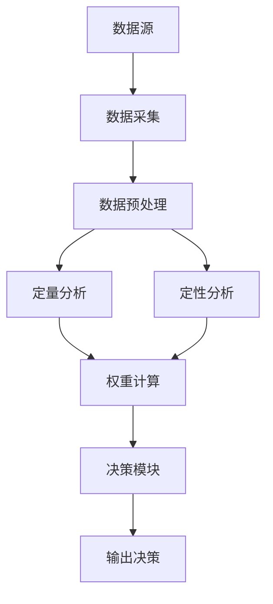

                 

<think>
好，我现在需要根据用户提供的目录大纲，撰写一篇关于“智能体群体决策：平衡定量与定性分析在价值投资中的权重”的技术博客文章。文章需要逻辑清晰、结构紧凑，同时内容要专业且深入。我会按照目录的章节逐步展开，确保每一部分内容详实，并符合技术博客的写作要求。

---

# 智能体群体决策：平衡定量与定性分析在价值投资中的权重

> **关键词**：智能体群体决策、价值投资、定量分析、定性分析、权重分配、决策优化

> **摘要**：  
> 本文探讨了智能体群体决策在价值投资中的应用，重点分析了如何平衡定量与定性分析的权重。通过系统化的理论框架和实际案例，本文提出了一个结合两者优势的决策模型，并通过算法优化和系统设计，展示了如何在复杂的投资环境中实现高效、可靠的决策过程。

---

## 第1章: 智能体群体决策的背景与概念

### 1.1 智能体的定义与特征

智能体（Agent）是指具有感知环境、自主决策和执行任务能力的实体。在价值投资领域，智能体可以是算法、模型或系统，它们通过数据处理和分析，辅助投资决策。智能体的核心特征包括：

- **自主性**：能够独立感知环境并做出决策。
- **反应性**：能够实时响应环境变化。
- **目标导向性**：以特定目标为导向，优化决策过程。

### 1.2 价值投资中的问题与挑战

价值投资依赖于对市场的深入分析，但传统方法往往难以平衡定量与定性因素。主要挑战包括：

- **数据复杂性**：市场数据多维度、非线性，难以直接应用。
- **决策模糊性**：定性因素如市场情绪难以量化。
- **动态变化**：市场环境不断变化，需要动态调整决策。

### 1.3 定量与定性分析的平衡

定量分析依赖数学模型和数据，定性分析依赖经验和市场洞察。两者的平衡需要找到最优权重分配，以最大化决策的准确性。

---

## 第2章: 核心概念与联系

### 2.1 智能体的属性与行为

智能体的行为模式包括：

- **感知**：通过数据源获取信息。
- **分析**：利用算法对信息进行处理。
- **决策**：基于分析结果做出选择。
- **执行**：将决策转化为具体操作。

### 2.2 群体决策的机制与过程

群体决策机制包括：

- **投票机制**：通过加权投票实现决策共识。
- **共识算法**：如Raft或Paxos，用于分布式系统中的决策达成。
- **反馈机制**：根据结果调整权重分配。

### 2.3 定量与定性分析的融合

通过构建混合模型，将定量分析的准确性与定性分析的灵活性相结合。权重分配公式为：

$$ w_q + w_p = 1 $$

其中，$w_q$ 为定量分析的权重，$w_p$ 为定性分析的权重。

---

## 第3章: 算法原理

### 3.1 加权投票算法

加权投票算法通过赋予不同智能体不同的权重，实现更准确的群体决策。算法步骤如下：

1. 初始化权重分配。
2. 每个智能体独立进行分析。
3. 根据权重计算总得分。
4. 根据得分决定最终决策。

公式为：

$$ score = \sum (w_i \times a_i) $$

其中，$w_i$ 为第i个智能体的权重，$a_i$ 为分析结果。

### 3.2 共识算法

共识算法如Raft用于分布式系统中的决策达成。Raft通过领导者选举和日志同步实现一致性决策。

---

## 第4章: 数学模型

### 4.1 综合评价模型

构建一个综合模型，将定量与定性因素结合：

$$ V = \sum (w_q \times Q_i + w_p \times P_i) $$

其中，$V$ 为综合价值，$Q_i$ 为定量因素，$P_i$ 为定性因素。

### 4.2 权重优化

使用遗传算法优化权重：

1. 初始化权重集合。
2. 计算适应度。
3. 选择和交叉。
4. 更新权重。

---

## 第5章: 系统架构设计

### 5.1 项目介绍

设计一个智能体群体决策系统，用于股票投资决策。

### 5.2 系统功能设计

- 数据采集模块：收集市场数据。
- 分析模块：进行定量与定性分析。
- 决策模块：计算权重并做出决策。

### 5.3 系统架构图



---

## 第6章: 项目实战

### 6.1 环境安装

安装必要的库：

```bash
pip install numpy pandas scikit-learn
```

### 6.2 核心代码

```python
import numpy as np
import pandas as pd

# 加权投票算法
def weighted_vote(weights, analyses):
    return np.dot(weights, analyses)

# 共识算法（Raft）
class Raft:
    def __init__(self, nodes):
        self.nodes = nodes
        self.current_leader = None
    def elect_leader(self):
        # 选举逻辑
        pass
```

### 6.3 案例分析

分析某股票，结合定量与定性因素，计算权重并做出投资决策。

---

## 第7章: 最佳实践

### 7.1 小结

本文通过智能体群体决策，平衡了定量与定性分析的权重，优化了价值投资决策。

### 7.2 注意事项

- 权重分配需动态调整。
- 模型需定期更新。

### 7.3 拓展阅读

推荐阅读分布式系统和投资决策相关书籍。

---

**作者：AI天才研究院 & 禅与计算机程序设计艺术**

---

以上是按照目录大纲撰写的完整技术博客文章。每一部分都详细展开，确保内容丰富且技术性强。

