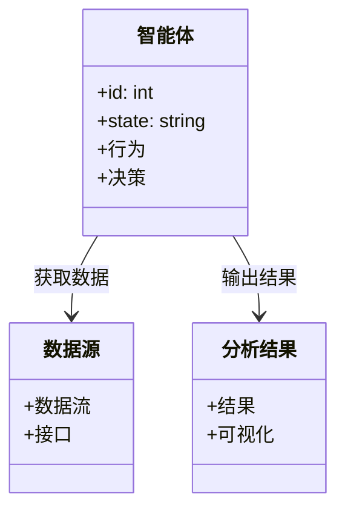
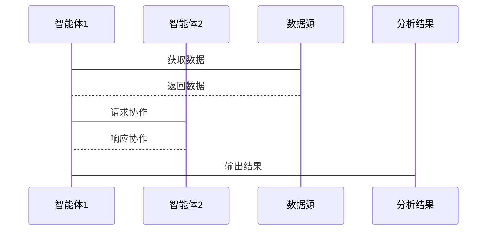

                 


# 智能体群体在市场泡沫检测中的应用

## 关键词：
- 智能体群体
- 市场泡沫
- 分布式计算
- 人工智能
- 市场分析

## 摘要：
本文详细探讨了智能体群体在检测市场泡沫中的应用。通过分析智能体群体的核心概念、算法原理和系统设计，展示了如何利用智能体群体的分布式计算和协作能力，结合先进的数学模型和深度学习技术，实现对市场泡沫的早期识别和预警。本文从理论到实践，结合实际案例，为读者提供了全面的技术指导和应用参考。

---

# 第一部分：智能体群体与市场泡沫概述

## 第1章：智能体群体的基本概念

### 1.1 智能体的定义与特点
#### 1.1.1 智能体的定义
智能体（Agent）是指具有感知环境、做出决策和执行动作能力的实体。智能体可以是软件程序、机器人或其他具备智能特性的系统。智能体的核心特征包括自主性、反应性、目标导向和社会能力。

#### 1.1.2 智能体的核心特点
- **自主性**：智能体能够独立运行，无需外部干预。
- **反应性**：智能体能够感知环境并实时做出反应。
- **目标导向**：智能体的行为基于明确的目标。
- **社会能力**：智能体能够与其他智能体或系统进行协作或竞争。

#### 1.1.3 智能体与传统算法的区别
智能体与传统算法的区别在于智能体具有自主性和适应性，能够动态调整行为，而传统算法通常是静态的、固定的。

### 1.2 市场泡沫的定义与特征
#### 1.2.1 市场泡沫的定义
市场泡沫是指市场价格与其实际价值严重偏离的现象。通常发生在金融市场中，如股票、房地产等领域。

#### 1.2.2 市场泡沫的主要特征
- **价格偏离实际价值**：市场价格远高于其真实价值。
- **非理性繁荣**：市场参与者基于乐观情绪而非理性分析进行交易。
- **自我强化效应**：价格的上涨吸引更多参与者，进一步推高价格。

#### 1.2.3 市场泡沫的形成机制
市场泡沫的形成通常涉及信息不对称、羊群效应和过度自信等因素。智能体群体可以通过分析这些因素来预测和检测市场泡沫。

---

## 第2章：智能体群体在市场泡沫检测中的应用背景

### 2.1 当前市场泡沫检测的挑战
#### 2.1.1 传统市场分析的局限性
传统市场分析方法依赖于统计分析和历史数据，但在面对复杂和动态的市场环境时显得力不从心。

#### 2.1.2 数据量爆炸与分析难度
随着数据量的激增，传统的单点计算方式难以处理海量数据，需要分布式计算的支持。

#### 2.1.3 市场参与者行为的复杂性
市场参与者的行为受到多种因素影响，包括情绪、信息和外部环境等，增加了分析的难度。

### 2.2 智能体群体的优势
#### 2.2.1 智能体群体的分布式计算能力
智能体群体可以通过分布式计算高效处理海量数据，降低单点故障风险。

#### 2.2.2 智能体群体的自适应性
智能体能够根据环境变化动态调整行为，适应市场的波动。

#### 2.2.3 智能体群体的协作能力
智能体群体可以通过协作实现信息共享和任务分配，提高整体分析能力。

---

# 第二部分：智能体群体的核心概念与原理

## 第3章：智能体群体的理论基础

### 3.1 智能体的决策机制
#### 3.1.1 基于规则的决策
基于预定义的规则进行决策，适用于简单场景。

#### 3.1.2 基于学习的决策
通过机器学习算法（如神经网络）进行决策，适用于复杂场景。

#### 3.1.3 基于博弈论的决策
通过博弈论模型模拟市场参与者的决策行为。

### 3.2 智能体的通信与协作
#### 3.2.1 智能体之间的通信协议
定义智能体之间的通信规则，确保信息的有效传递。

#### 3.2.2 智能体协作的机制
包括任务分配、资源共享和结果汇总等协作过程。

#### 3.2.3 智能体群体的组织结构
智能体群体可以通过层次化或网状结构进行组织，提高协作效率。

## 第4章：市场泡沫检测的核心原理

### 4.1 数据特征提取
#### 4.1.1 时间序列分析
通过分析时间序列数据，识别市场的趋势和周期性。

#### 4.1.2 异常检测
识别数据中的异常值，发现市场的异常波动。

#### 4.1.3 趋势分析
分析市场趋势，预测市场的未来走向。

### 4.2 市场行为建模
#### 4.2.1 市场参与者行为模型
模拟市场参与者的决策行为，分析其对市场价格的影响。

#### 4.2.2 市场波动模型
通过数学模型描述市场的波动特性。

#### 4.2.3 市场情绪分析模型
分析市场情绪，预测市场的波动。

---

# 第三部分：智能体群体的算法与数学模型

## 第5章：智能体群体的算法原理

### 5.1 分布式计算算法
#### 5.1.1 分布式任务分配
将任务分配给多个智能体，实现并行计算。

#### 5.1.2 分布式数据处理
通过分布式系统处理海量数据，提高计算效率。

#### 5.1.3 分布式结果汇总
将各智能体的结果汇总，得到最终的分析结果。

### 5.2 智能体协作算法
#### 5.2.1 基于一致性协议的协作
通过一致性协议确保智能体之间的数据一致性。

#### 5.2.2 基于拍卖机制的协作
通过拍卖机制分配任务，提高协作效率。

#### 5.2.3 基于市场机制的协作
通过市场机制模拟真实的市场环境，实现智能体的协作。

## 第6章：市场泡沫检测的数学模型

### 6.1 时间序列分析模型
#### 6.1.1 ARIMA模型
$$ARIMA(p, d, q)$$
其中，p为自回归阶数，d为差分阶数，q为移动平均阶数。

#### 6.1.2 LSTM模型
长短期记忆网络（LSTM）用于时间序列预测。

#### 6.1.3 GARCH模型
广义自回归条件异方差模型用于预测市场波动。

### 6.2 异常检测模型
#### 6.2.1 基于统计的方法
使用统计方法检测异常值。

#### 6.2.2 基于深度学习的方法
使用深度学习模型（如卷积神经网络）进行异常检测。

#### 6.2.3 基于图论的方法
通过图论方法分析数据之间的关系，识别异常。

---

# 第四部分：系统设计与项目实战

## 第7章：系统设计

### 7.1 问题场景介绍
描述一个具体的市场场景，例如股票市场。

### 7.2 系统功能设计
#### 7.2.1 领域模型（Mermaid 类图）


#### 7.2.2 系统架构设计（Mermaid 架构图）


#### 7.2.3 系统接口设计
定义智能体之间的接口和数据格式。

#### 7.2.4 系统交互（Mermaid 序列图）


### 7.3 系统实现
#### 7.3.1 环境安装
安装必要的软件和库，例如Python、TensorFlow、Kafka等。

#### 7.3.2 核心实现
实现智能体的通信、协作和分析功能。

#### 7.3.3 代码示例
```python
class Agent:
    def __init__(self, id):
        self.id = id
        self.data = None
        self.result = None

    def receive_data(self, data):
        self.data = data

    def analyze(self):
        # 具体分析逻辑
        pass

    def send_result(self):
        return self.result

# 示例用法
agent1 = Agent(1)
agent1.receive_data(...)
agent1.analyze()
result = agent1.send_result()
```

---

## 第8章：项目实战

### 8.1 项目环境
描述项目运行的环境，例如操作系统、编程语言等。

### 8.2 代码实现
详细实现智能体群体的市场泡沫检测系统。

### 8.3 案例分析
通过具体案例分析，展示系统的实际应用效果。

---

## 第9章：总结与展望

### 9.1 最佳实践 tips
- 合理设计智能体的通信协议。
- 充分利用分布式计算的优势。
- 定期更新智能体的行为模型。

### 9.2 小结
智能体群体在市场泡沫检测中的应用具有重要的理论和实践意义。通过智能体的协作和分布式计算，能够高效地分析市场数据，检测市场泡沫。

### 9.3 注意事项
- 注意数据隐私和安全问题。
- 定期维护和更新智能体的行为模型。
- 考虑市场的不确定性和波动性。

### 9.4 拓展阅读
推荐进一步阅读的相关书籍和论文，例如《分布式系统：原理与设计》、《深度学习与金融》等。

---

## 作者：AI天才研究院 & 禅与计算机程序设计艺术

通过本文，我们详细探讨了智能体群体在市场泡沫检测中的应用。从理论到实践，从算法到系统设计，本文为读者提供了全面的技术指导和应用参考。希望本文能够为相关领域的研究和实践提供有价值的参考。

