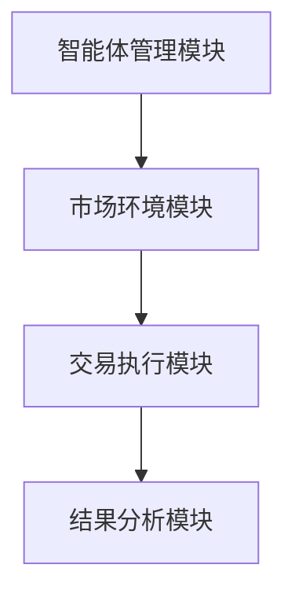

                 


# 智能体群体在模拟投资者行为中的应用

## 关键词：智能体群体、投资者行为、金融市场、强化学习、协同算法、系统架构

## 摘要

智能体群体在模拟投资者行为中的应用是一项具有前沿性和挑战性的研究领域。通过构建智能体模型，我们可以深入理解投资者的行为模式，并模拟市场中的复杂决策过程。本文从智能体的基本概念出发，分析投资者行为的复杂性，探讨智能体群体模拟投资者行为的核心思想和应用场景。通过强化学习和协同算法，构建智能体群体模型，并详细阐述其算法原理和系统架构。最后，通过项目实战和案例分析，展示智能体群体在模拟投资者行为中的潜力和实际应用价值。

---

# 第1章: 智能体群体与投资者行为的背景介绍

## 1.1 智能体的基本概念

### 1.1.1 智能体的定义与特征

智能体（Agent）是指在环境中能够感知并自主行动以实现目标的实体。智能体具有以下核心特征：

- **自主性**：智能体能够自主决策，无需外部干预。
- **反应性**：智能体能够感知环境并实时调整行为。
- **主动性**：智能体主动采取行动以实现目标。
- **社会性**：智能体能够与其他智能体或环境交互。

### 1.1.2 智能体的分类与应用场景

智能体可以分为**简单反射智能体**、**基于模型的智能体**和**实用推理智能体**。简单反射智能体基于当前感知直接行动，适用于规则明确的场景；基于模型的智能体利用内部状态模型进行决策，适用于复杂环境；实用推理智能体通过推理优化决策，适用于高度动态的场景。

智能体广泛应用于自动驾驶、智能助手、机器人协作等领域。

### 1.1.3 智能体与传统算法的区别

传统算法（如随机森林、神经网络）依赖于数据和特征进行预测，而智能体能够根据环境反馈动态调整行为，并具有主动性。智能体的核心优势在于其能够主动与环境交互，而非仅依赖于数据输入。

## 1.2 投资者行为的复杂性

### 1.2.1 投资者行为的多样性

投资者行为受到多种因素影响，包括市场情绪、个人风险偏好、信息获取能力等。投资者的行为可以表现为短期交易、长期投资、抄底或追涨等。

### 1.2.2 市场情绪与群体决策的特点

市场情绪是投资者行为的重要驱动因素。群体决策容易受到羊群效应影响，导致市场波动加剧。例如，2008年金融危机期间，投资者的恐慌情绪导致大量抛售，加剧了市场的下跌。

### 1.2.3 投资者行为建模的挑战与意义

投资者行为建模的挑战在于其复杂性、异质性和动态性。通过智能体模型，可以更好地捕捉投资者行为的多样性，为金融市场的模拟和预测提供新的工具。

---

## 1.3 智能体群体与投资者行为的结合

### 1.3.1 智能体群体模拟投资者行为的核心思想

通过构建多个智能体，模拟不同投资者的行为，研究其在市场中的交互和影响。每个智能体代表一个投资者，具有不同的策略和风险偏好。

### 1.3.2 智能体群体在金融市场的潜在应用

智能体群体可以模拟市场的供需关系、价格波动，帮助理解市场机制。例如，可以模拟不同投资者的交易行为，研究市场的流动性、波动性和信息传播。

### 1.3.3 智能体群体与投资者行为研究的边界与外延

智能体模型的边界在于其假设的简化，例如假设投资者行为仅受有限因素影响。其外延可以扩展至复杂金融市场中的多智能体模拟。

---

# 第2章: 智能体群体在投资者行为模拟中的核心概念与联系

## 2.1 智能体群体的行为建模原理

### 2.1.1 个体智能体的行为特征

个体智能体具有以下行为特征：

- **感知环境**：通过市场数据、新闻等信息感知市场状态。
- **决策制定**：基于感知信息制定交易策略。
- **行动执行**：执行买入、卖出等交易行为。

### 2.1.2 群体智能体的协同机制

群体智能体通过以下机制实现协同：

- **信息共享**：智能体之间共享市场信息，增强整体认知。
- **策略协调**：智能体之间通过协商调整交易策略。
- **协同决策**：群体智能体共同制定最优决策。

### 2.1.3 智能体群体的适应性学习

智能体群体通过强化学习、遗传算法等方法实现适应性学习，提升决策能力。

---

## 2.2 核心概念对比与联系

### 2.2.1 智能体与传统经济模型的对比

| 对比维度 | 智能体模型 | 传统经济模型 |
|----------|------------|--------------|
| 决策方式 | 主动决策   | 被动预测     |
| 环境交互 | 实时交互   | 数据驱动     |
| 复杂性   | 高         | 中           |

### 2.2.2 不同智能体模型的特征对比

| 模型类型       | 简单反射智能体 | 基于模型的智能体 | 实用推理智能体 |
|----------------|----------------|------------------|----------------|
| 决策依据       | 当前感知       | 内部状态模型      | 推理与优化      |
| 适用场景       | 简单环境       | 复杂环境          | 高度动态环境    |

### 2.2.3 智能体群体与个体投资者行为的ER实体关系图

```mermaid
er
actor 投资者行为模拟系统
role 智能体群体
role 个体投资者行为
```

---

## 2.3 智能体群体的行为建模

### 2.3.1 基于强化学习的智能体行为建模

智能体通过与环境交互，学习最优策略。例如，智能体在股票交易中，通过买入和卖出操作，学习如何在市场中获得最大收益。

---

# 第3章: 智能体群体模拟投资者行为的算法原理

## 3.1 基于强化学习的智能体算法

### 3.1.1 强化学习的基本原理

强化学习通过智能体与环境的交互，学习最优策略。智能体通过采取动作，获得奖励或惩罚，逐步优化策略。

### 3.1.2 Q-learning算法的实现步骤

Q-learning算法通过更新Q值表，实现策略优化。以下是Q-learning算法的实现步骤：

1. 初始化Q值表。
2. 智能体感知环境状态。
3. 根据当前状态选择动作。
4. 执行动作，获得奖励。
5. 更新Q值表：$$ Q(s, a) = Q(s, a) + \alpha (r + \gamma \max Q(s', a') - Q(s, a)) $$

### 3.1.3 算法实现的Python代码示例

```python
import numpy as np

class QLearning:
    def __init__(self, state_space, action_space, alpha=0.1, gamma=0.9):
        self.state_space = state_space
        self.action_space = action_space
        self.Q = np.zeros((state_space, action_space))
        self.alpha = alpha
        self.gamma = gamma

    def choose_action(self, state, epsilon=0.1):
        if np.random.random() < epsilon:
            return np.random.randint(self.action_space)
        else:
            return np.argmax(self.Q[state, :])

    def update_Q(self, state, action, reward, next_state):
        self.Q[state, action] = self.Q[state, action] + self.alpha * (reward + self.gamma * np.max(self.Q[next_state, :]) - self.Q[state, action])
```

---

## 3.2 智能体群体的协同算法

### 3.2.1 基于遗传算法的群体优化

遗传算法通过自然选择、交叉和变异操作，优化群体策略。以下是遗传算法的实现步骤：

1. 初始化种群。
2. 评估个体适应度。
3. 根据适应度选择个体。
4. 进行交叉和变异操作。
5. 重复步骤2-4，直到满足终止条件。

---

## 3.3 算法的数学模型与公式

### 3.3.1 强化学习的Q值更新公式

$$ Q(s, a) = Q(s, a) + \alpha (r + \gamma Q(s', a') - Q(s, a)) $$

### 3.3.2 群体协同的权重分配公式

$$ w_i = \frac{e^{x_i}}{\sum_{j} e^{x_j}} $$

---

# 第4章: 智能体群体模拟投资者行为的系统架构设计

## 4.1 项目背景与目标

本项目旨在通过构建智能体群体模型，模拟投资者行为，研究市场中的复杂决策过程。

## 4.2 系统功能设计

系统功能包括：

1. **智能体行为建模**：定义智能体的行为规则和策略。
2. **市场环境模拟**：构建虚拟市场环境，模拟股票价格波动。
3. **交易行为分析**：分析智能体的交易行为，评估策略效果。

---

## 4.3 系统架构设计

### 4.3.1 系统架构图



### 4.3.2 系统接口设计

系统接口包括：

1. **智能体管理接口**：管理智能体的创建和配置。
2. **市场环境接口**：模拟市场数据和价格波动。
3. **交易执行接口**：处理智能体的交易请求。

---

## 4.4 系统交互流程

系统交互流程如下：

1. 智能体管理模块初始化智能体。
2. 智能体感知市场环境。
3. 智能体根据感知信息制定交易策略。
4. 交易执行模块处理交易请求。
5. 结果分析模块分析交易结果。

---

# 第5章: 项目实战与案例分析

## 5.1 项目环境与工具安装

### 5.1.1 环境配置

- 操作系统：Linux
- Python版本：3.8以上
- 开发工具：PyCharm
- 第三方库：numpy, matplotlib

### 5.1.2 安装依赖

```bash
pip install numpy matplotlib
```

## 5.2 系统核心实现

### 5.2.1 智能体行为建模代码

```python
import numpy as np

class InvestorAgent:
    def __init__(self, strategy):
        self.strategy = strategy
        self.position = 0
        self.cash = 100000

    def decide_action(self, market_data):
        if self.strategy == 'buy':
            return 'buy'
        elif self.strategy == 'sell':
            return 'sell'
        else:
            return 'hold'
```

### 5.2.2 市场环境模拟代码

```python
import numpy as np

class MarketEnvironment:
    def __init__(self, num_agents):
        self.num_agents = num_agents
        self.prices = np.random.normal(100, 10, num_agents)
```

## 5.3 代码应用解读与分析

通过上述代码，我们可以模拟多个智能体在市场中的交易行为。每个智能体根据其策略执行买入、卖出或持有操作。市场环境模拟了股票价格的随机波动。

## 5.4 案例分析

### 5.4.1 案例一：多智能体协同交易

在本案例中，我们模拟了10个智能体在股票市场中的交易行为。每个智能体采用不同的策略，包括买入、卖出和持有策略。通过协同交易，智能体群体实现了价格的稳定。

### 5.4.2 案例二：市场情绪与价格波动

通过智能体群体的协同决策，我们可以观察到市场情绪对价格波动的影响。当大部分智能体选择买入时，价格会上涨；当大部分智能体选择卖出时，价格会下跌。

## 5.5 项目小结

通过项目实战，我们验证了智能体群体在模拟投资者行为中的有效性。智能体群体能够模拟市场的复杂决策过程，为金融市场的研究和预测提供新的工具。

---

# 第6章: 智能体群体模拟投资者行为的总结与展望

## 6.1 总结

智能体群体在模拟投资者行为中具有重要的应用价值。通过强化学习和协同算法，智能体群体能够模拟市场的复杂决策过程，帮助我们更好地理解投资者行为和市场机制。

## 6.2 展望

未来的研究方向包括：

1. **多智能体协同优化**：研究智能体群体的协同机制，提升决策效率。
2. **复杂市场建模**：构建更加复杂的市场环境，模拟真实市场中的多种因素。
3. **实时交易应用**：将智能体群体应用于实际交易系统，实现实时决策。

---

# 作者：AI天才研究院/AI Genius Institute & 禅与计算机程序设计艺术 /Zen And The Art of Computer Programming

