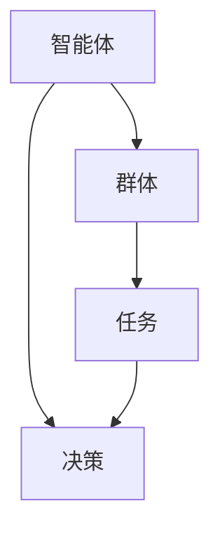
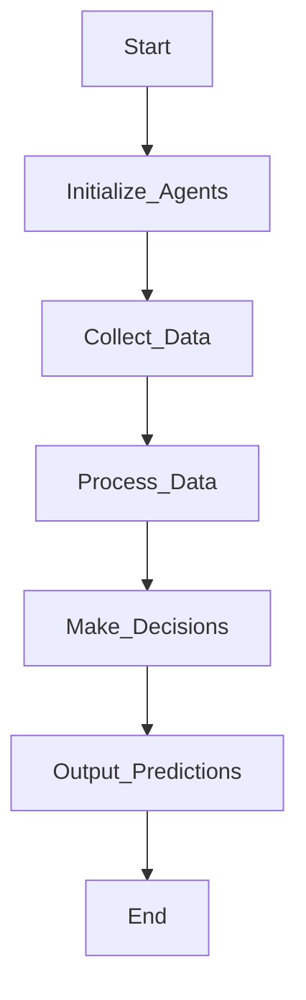
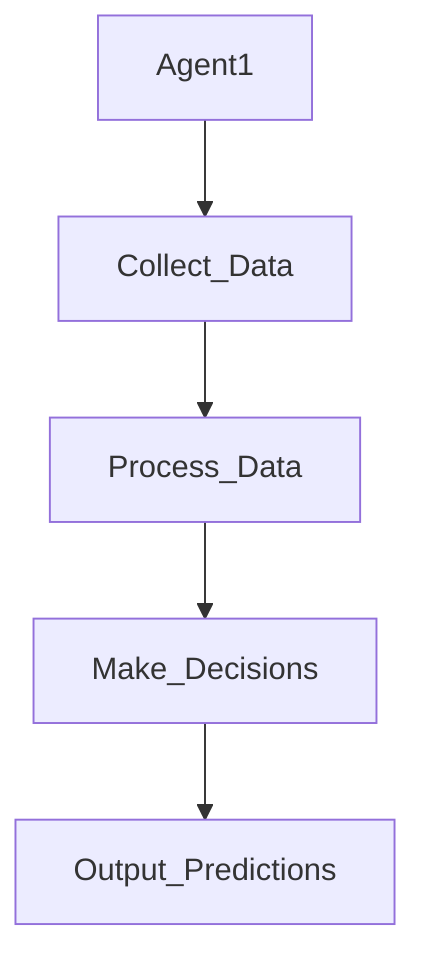

                 


# {{此处是文章标题}}

> 关键词：{{此处列出文章的5-7个核心关键词}}

> 摘要：{{此处给出文章的核心内容和主题思想}}

                 

# 第一章: 智能体群体与公司破产风险预测概述

## 1.1 问题背景与描述
### 1.1.1 研究背景
公司破产预测一直是金融领域的重要课题，传统的预测方法存在数据不足、模型复杂等问题。智能体群体通过分布式计算和群体智能，为破产预测提供了新的解决方案。

### 1.1.2 问题描述
公司破产风险预测需要考虑多个因素，包括财务状况、市场环境等。传统方法难以处理这些复杂因素，而智能体群体可以通过协作解决这些问题。

### 1.1.3 问题解决方法
智能体群体通过协同工作，利用分布式计算和群体决策机制，提高了预测的准确性和效率。

### 1.1.4 边界与外延
智能体群体的应用范围不仅限于公司破产预测，还可以扩展到其他领域，如金融市场预测、网络安全等。

## 1.2 核心概念与联系
### 1.2.1 智能体的基本定义
智能体是一个能够感知环境并采取行动的实体，具备自主性和协作性。

### 1.2.2 群体智能的特征
群体智能是多个智能体通过协作完成任务，具有去中心化、自组织和适应性强的特点。

### 1.2.3 智能体与群体智能的关系
智能体是群体智能的基本单元，而群体智能通过智能体的协作实现复杂任务。

### 1.2.4 核心概念对比分析
| 概念 | 定义 | 特点 | 应用 |
|------|------|------|------|
| 智能体 | 能够感知环境并采取行动的实体 | 自主性、反应性、协作性 | 破产预测、分布式计算 |
| 群体智能 | 多个智能体协作完成任务 | 去中心化、自组织、适应性强 | 复杂系统预测、优化问题 |

### 1.2.5 实体关系图（ER图）


## 1.3 本章小结
本章介绍了智能体群体在公司破产风险预测中的背景、核心概念及其关系，并通过对比分析和ER图展示了其特点和应用范围。

# 第二章: 智能体群体预测的算法原理

## 2.1 算法流程与原理
### 2.1.1 分布式计算原理
智能体群体通过分布式计算，将任务分解为多个子任务，分别由不同的智能体完成。

### 2.1.2 群体决策机制
智能体通过通信协议共享信息，基于个体决策形成群体决策。

### 2.1.3 智能体间的通信协议
通信协议定义了智能体之间信息交换的方式和格式，确保协作的有效性。

## 2.2 算法流程图


## 2.3 数学模型与公式
### 2.3.1 概率模型
$$ P(\text{破产}|X) = \frac{P(X|\text{破产})P(\text{破产})}{P(X)} $$

### 2.3.2 决策树构建
$$ \text{信息增益} = \text{熵的减少量} $$

## 2.4 本章小结
本章详细讲解了智能体群体预测的算法流程、通信协议及数学模型，为后续的系统设计和实现奠定了基础。

# 第三章: 系统分析与架构设计

## 3.1 项目背景与目标
### 3.1.1 项目背景
公司破产预测的传统方法存在数据不足、模型复杂等问题，智能体群体提供了新的解决方案。

### 3.1.2 项目目标
开发一个基于智能体群体的公司破产风险预测系统，提高预测的准确性和效率。

### 3.1.3 项目范围
系统设计包括数据收集、智能体协作、决策生成和结果输出。

## 3.2 系统功能设计
### 3.2.1 领域模型
```mermaid
classD
    class 公司 {
        名称: string
        财务状况: float
        市场环境: string
    }
    class 智能体 {
        感知环境: function
        决策: function
    }
    class 群体决策 {
        收集数据: function
        处理数据: function
        输出预测: function
    }
```

## 3.3 系统架构设计
### 3.3.1 分层架构
系统分为数据层、智能体层和决策层，各层之间通过接口进行通信。

### 3.3.2 接口设计
智能体层提供感知环境和决策的接口，群体决策层通过接口收集数据并生成预测结果。

### 3.3.3 交互流程图


## 3.4 本章小结
本章设计了一个基于智能体群体的公司破产风险预测系统的架构，并详细描述了各部分的功能和交互流程。

# 第四章: 项目实战

## 4.1 环境搭建
### 4.1.1 系统环境
安装Python、Jupyter Notebook和必要的库，如numpy、pandas、scikit-learn。

### 4.1.2 安装依赖
使用pip安装所需依赖：
```bash
pip install numpy pandas scikit-learn
```

## 4.2 核心代码实现
### 4.2.1 智能体类
```python
class Agent:
    def __init__(self, id):
        self.id = id
        self.data = None
        self.decision = None

    def感知环境(self, data):
        self.data = data

    def 决策(self):
        # 示例决策逻辑
        if self.data['财务状况'] < 0.5:
            self.decision = '破产'
        else:
            self.decision = '非破产'
```

### 4.2.2 群体决策类
```python
class GroupDecision:
    def __init__(self, agents):
        self.agents = agents

    def 收集数据(self, data):
        for agent in self.agents:
            agent.感知环境(data)

    def 处理数据(self):
        decisions = [agent.决策() for agent in self.agents]
        from collections import Counter
        result = Counter(decisions)
        return result

    def 输出预测(self):
        result = self.处理数据()
        return result.most_common(1)[0][0]
```

## 4.3 代码应用解读
### 4.3.1 数据准备
```python
import pandas as pd
data = pd.read_csv('company_data.csv')
```

### 4.3.2 初始化智能体
```python
agents = [Agent(i) for i in range(5)]
group = GroupDecision(agents)
```

### 4.3.3 执行预测
```python
group.收集数据(data)
prediction = group.输出预测()
print(f'预测结果: {prediction}')
```

## 4.4 实际案例分析
### 4.4.1 数据分析
分析公司财务状况和市场环境，提取相关特征。

### 4.4.2 智能体协作
通过智能体协作生成群体决策，提高预测的准确性。

### 4.4.3 结果分析
评估预测结果的准确性，调整模型参数以优化性能。

## 4.5 本章小结
本章通过实际案例展示了智能体群体在公司破产风险预测中的应用，并提供了核心代码的实现和解读。

# 第五章: 最佳实践与总结

## 5.1 最佳实践
### 5.1.1 智能体设计
确保智能体具备良好的感知和决策能力，优化通信协议以提高协作效率。

### 5.1.2 系统优化
通过分布式计算和并行处理，提高系统的运行效率和预测速度。

## 5.2 小结
智能体群体通过协作和分布式计算，为公司破产风险预测提供了新的解决方案，提高了预测的准确性和效率。

## 5.3 注意事项
### 5.3.1 数据质量
确保数据的准确性和完整性，避免数据偏差影响预测结果。

### 5.3.2 模型优化
定期更新模型参数，适应市场环境的变化，提高预测的准确性。

## 5.4 拓展阅读
推荐相关书籍和论文，进一步了解智能体群体和群体智能在其他领域的应用。

# 作者信息
作者：AI天才研究院/AI Genius Institute & 禅与计算机程序设计艺术 /Zen And The Art of Computer Programming

---

通过以上目录大纲，读者可以系统地了解智能体群体在公司破产风险预测中的应用，从基础概念到算法实现再到实际案例，逐步深入学习相关知识。

