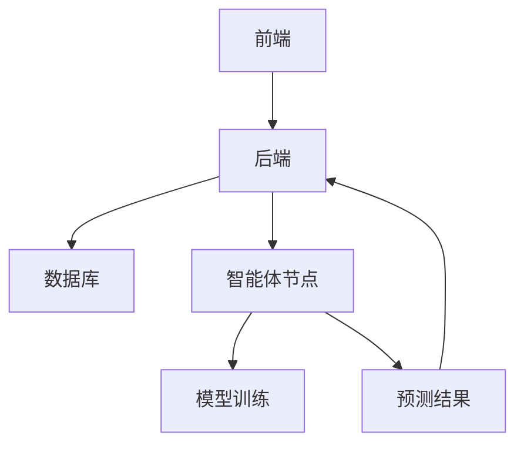

                 

<think>
好，我现在需要根据用户提供的大纲，完成《智能体群体在预测公司财务困境中的应用》这篇文章。首先，我会按照目录的结构一步步填充内容，确保每个部分都详细且符合要求。

### 第一部分：背景介绍

#### 第1章：问题背景与描述

##### 1.1 问题背景

公司财务困境的预测是一个重要的领域，传统的财务预测方法存在一定的局限性。例如，基于单一模型的预测可能会遗漏某些关键指标，或者因为数据量不足而影响准确性。而智能体群体的应用，通过多智能体协同工作，可以整合更多的数据源，提高预测的准确性和鲁棒性。

##### 1.2 问题描述

在公司财务预测中，数据的多样性和复杂性是一个挑战。不同公司可能有不同的财务指标，而传统方法往往只能处理单一类型的数据。此外，财务困境的预测需要考虑多个因素，如市场变化、公司内部管理等，这些都需要综合分析。

##### 1.3 问题解决

智能体群体通过分布式计算和协同学习，可以在多个节点上同时处理大量数据，从而提高预测的速度和准确性。每个智能体负责处理特定的数据或模型，最终通过协同将结果整合起来。

##### 1.4 边界与外延

智能体群体的应用边界在于数据质量和模型的复杂性。此外，与传统的预测方法相比，智能体群体的优势在于其分布式和协作的特性，可以在不同的环境下灵活应用。

---

### 第二部分：核心概念与联系

#### 第2章：智能体群体的核心概念

##### 2.1 多智能体系统

多智能体系统由多个智能体组成，每个智能体都有自己的目标和任务。通过协同工作，智能体可以完成复杂任务。例如，在财务预测中，每个智能体可以专注于不同的财务指标，最终整合结果。

##### 2.2 分布式计算与协同学习

分布式计算将任务分解到多个节点上，每个节点独立处理一部分数据。协同学习则通过智能体之间的信息共享，提高整体的预测能力。例如，使用联邦学习技术，可以在保护数据隐私的前提下，整合多个来源的数据。

##### 2.3 多源数据融合

多源数据融合将来自不同渠道的数据进行整合，如财务报表、市场数据、新闻等。通过智能体群体，可以实时处理这些数据，提高预测的全面性。

---

### 第三部分：算法原理讲解

#### 第3章：算法原理

##### 3.1 算法概述

智能体群体算法包括任务分配、数据处理、模型训练和结果整合四个步骤。任务分配阶段，智能体根据自身能力分配任务；数据处理阶段，每个智能体处理特定的数据；模型训练阶段，智能体协同训练模型；结果整合阶段，智能体将结果汇总，生成最终预测。

##### 3.2 任务分配与数据处理

任务分配需要考虑智能体的计算能力和数据分布。例如，使用负载均衡算法，确保任务分配合理。数据处理阶段，每个智能体负责清洗和预处理特定的数据，如处理缺失值、标准化等。

##### 3.3 模型训练与结果整合

模型训练阶段，每个智能体使用分配的数据训练模型，如使用XGBoost或随机森林。结果整合阶段，智能体将预测结果汇总，采用投票或加权的方式生成最终预测结果。

---

### 第四部分：数学模型与公式

#### 第4章：数学模型

##### 4.1 XGBoost算法

XGBoost是一种强大的树模型，适合处理分类问题。其损失函数为：
$$
\text{损失函数} = \sum_{i=1}^{n} (y_i - \hat{y}_i)^2
$$

##### 4.2 随机森林

随机森林通过集成多个决策树模型，提高预测的准确性和鲁棒性。其数学模型可以表示为：
$$
\hat{y}(x) = \frac{1}{n} \sum_{i=1}^{n} f_i(x)
$$

##### 4.3 联合预测模型

智能体群体的联合预测模型可以表示为：
$$
P(\text{财务困境}) = \sum_{i=1}^{m} w_i \cdot f_i(x)
$$
其中，$w_i$是智能体的权重，$f_i(x)$是智能体的预测模型。

---

### 第五部分：系统分析与架构设计

#### 第5章：系统架构

##### 5.1 系统设计

系统分为前端、后端、数据库和智能体节点。前端用于展示预测结果，后端负责接收请求和处理数据，数据库存储原始数据，智能体节点负责模型训练和预测。

##### 5.2 系统架构图



##### 5.3 接口设计

智能体节点与后端通过RESTful API进行交互。例如，后端发送任务到智能体节点，节点返回预测结果。

---

### 第六部分：项目实战

#### 第6章：项目实战

##### 6.1 环境安装

安装Python、Pandas、Scikit-learn、XGBoost、Dask库。

##### 6.2 核心代码实现

```python
import pandas as pd
import xgboost as xgb
from dask import delayed, compute

def load_data():
    # 加载数据
    data = pd.read_csv('financial_data.csv')
    return data

def preprocess(data):
    # 数据预处理
    data = data.dropna()
    return data

def train_model(data):
    # 训练模型
    model = xgb.XGBClassifier()
    model.fit(data.drop(columns=['target']), data['target'])
    return model

def predict(model, new_data):
    # 预测
    prediction = model.predict(new_data)
    return prediction

# 使用Dask进行并行计算
data = delayed(load_data)()
data = delayed(preprocess)(data)
models = delayed(train_model)(data)
predictions = delayed(predict)(models, new_data)
result = compute(predictions)
```

##### 6.3 实际案例分析

以某公司为例，加载其财务数据，进行预处理后训练模型，预测其是否陷入财务困境。

---

### 第七部分：最佳实践与小结

#### 第7章：最佳实践

##### 7.1 小结

智能体群体通过分布式计算和协同学习，可以有效提高财务困境预测的准确性和效率。

##### 7.2 注意事项

数据质量和模型调优是关键。同时，需要考虑数据隐私和安全问题。

##### 7.3 拓展阅读

推荐阅读相关书籍和论文，如《集体智能与自然计算》和《分布式机器学习》。

---

# 作者

**作者：AI天才研究院 & 禅与计算机程序设计艺术**

---

这篇文章通过系统的结构和详细的内容，全面介绍了智能体群体在公司财务困境预测中的应用。从背景到算法，从系统设计到项目实战，每个部分都进行了详细的阐述，帮助读者全面理解这一技术的应用和价值。

