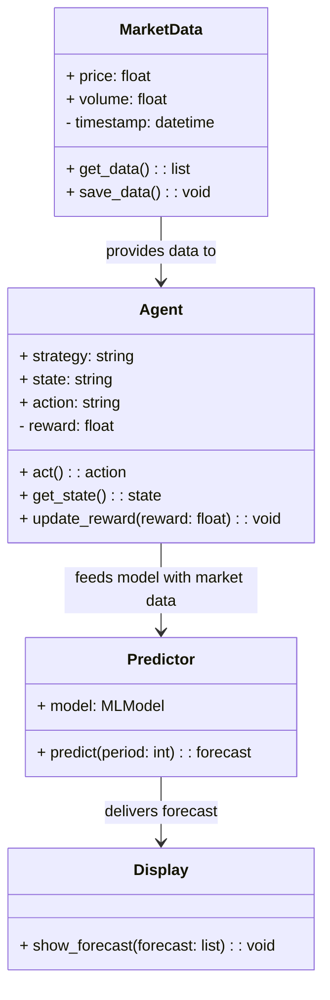

                 


```markdown
# 智能体群体如何模拟并预测市场周期

## 关键词：智能体群体，市场周期，强化学习，时间序列分析，多智能体系统，市场预测

## 摘要：本文详细探讨了如何利用智能体群体来模拟和预测市场周期。通过分析智能体的行为模型、协同机制以及强化学习和时间序列分析等算法，本文为读者提供了一种全新的视角来理解市场周期的变化，并展示了如何通过智能体群体的协同工作来实现市场周期的准确预测。

---

## 第一部分: 智能体群体与市场周期概述

### 第1章: 智能体群体的基本概念

#### 1.1 智能体的定义与特征

智能体（Agent）是指能够感知环境并采取行动以实现目标的实体。与传统的算法不同，智能体具有以下核心特征：

- **自主性**：智能体能够自主决策，无需外部干预。
- **反应性**：智能体能够实时感知环境并做出反应。
- **社会性**：智能体能够与其他智能体或人类进行交互和协作。

智能体的行为可以通过规则、强化学习或博弈论等方法来建模。

#### 1.2 市场周期的基本概念

市场周期是指市场在经济活动中经历的波动周期，通常包括以下几个阶段：

1. **繁荣阶段**：市场需求旺盛，价格上升。
2. **衰退阶段**：市场参与者减少，价格下降。
3. **萧条阶段**：市场需求低迷，价格稳定或进一步下降。
4. **复苏阶段**：市场需求逐步恢复，价格开始回升。

市场周期的变化受到多种因素的影响，包括经济政策、市场参与者的决策等。

#### 1.3 智能体群体与市场周期的关系

智能体群体通过模拟市场参与者的决策行为，可以有效地捕捉市场周期的变化。智能体群体的多样性使其能够模拟复杂的市场动态，从而为市场周期的预测提供新的思路。

---

### 第2章: 智能体群体模拟市场周期的背景与挑战

#### 2.1 市场周期预测的复杂性

市场周期的预测具有高度的不确定性，主要表现在以下几个方面：

- **数据的不完全性**：市场参与者的行为受到多种因素的影响，数据获取具有局限性。
- **市场的多样性**：不同市场参与者的决策行为差异显著，增加了预测的难度。
- **市场的动态性**：市场周期的变化具有一定的随机性，难以通过简单的模型捕捉。

#### 2.2 智能体群体模拟的优势

智能体群体模拟市场周期具有以下优势：

- **多样性**：智能体群体能够模拟不同市场参与者的决策行为。
- **自适应性**：智能体能够根据环境变化调整自己的行为策略。
- **可扩展性**：智能体群体可以通过增加智能体的数量来模拟更大的市场。

#### 2.3 智能体群体模拟的挑战

智能体群体模拟市场周期也面临一些挑战：

- **智能体设计的复杂性**：智能体的行为模型需要精确建模。
- **智能体群体的协调性问题**：如何确保智能体群体能够协同工作是一个难点。
- **模拟结果的验证与评估**：如何验证模拟结果的准确性是一个重要问题。

---

### 第3章: 智能体群体模拟市场周期的核心概念

#### 3.1 智能体的行为模型

智能体的行为模型可以通过以下几种方式建模：

- **基于规则的行为模型**：通过预定义的规则来描述智能体的行为。
- **基于强化学习的行为模型**：通过强化学习算法来优化智能体的行为策略。
- **基于博弈论的行为模型**：通过博弈论模型来模拟智能体之间的互动。

#### 3.2 市场周期的多智能体建模

市场周期的多智能体建模需要考虑以下几点：

- **市场参与者的角色划分**：确定市场中的不同参与者（如买方、卖方、投资者等）。
- **市场行为的建模方法**：通过智能体的行为模型来模拟市场参与者的决策行为。
- **市场动态的模拟框架**：建立一个框架来描述市场动态的变化过程。

#### 3.3 智能体群体的协同机制

智能体群体的协同机制需要考虑以下几点：

- **协同机制的定义**：协同机制是智能体之间相互作用的方式。
- **协同机制的类型**：包括基于规则的协同机制和基于强化学习的协同机制。
- **协同机制的设计原则**：确保智能体群体能够协同工作，同时保持个体的自主性。

---

## 第二部分: 智能体群体模拟市场周期的算法与模型

### 第4章: 基于强化学习的智能体行为建模

#### 4.1 强化学习的基本原理

强化学习是一种通过试错方法来优化决策策略的算法。其核心要素包括：

- **状态（State）**：环境中的当前情况。
- **动作（Action）**：智能体采取的行动。
- **奖励（Reward）**：智能体采取行动后获得的反馈。

#### 4.2 基于强化学习的智能体行为建模

智能体的行为可以通过强化学习算法来建模。例如，可以使用Q-learning算法来训练智能体，使其能够在市场环境中做出最优决策。

#### 4.3 强化学习在市场周期模拟中的应用

强化学习可以应用于市场周期的模拟，例如：

- **市场参与者行为的模拟**：通过强化学习训练智能体来模拟市场参与者的决策行为。
- **市场动态的预测**：通过强化学习预测市场的未来走势。
- **市场周期的识别与分类**：通过强化学习识别市场的不同阶段。

### 第5章: 基于时间序列分析的市场周期预测

#### 5.1 时间序列分析的基本概念

时间序列分析是一种通过分析数据随时间变化的模式来预测未来趋势的方法。常用的时间序列分析方法包括：

- **移动平均法（Moving Average）**：通过计算过去若干期的平均值来预测未来值。
- **自回归模型（AR Model）**：通过回归分析来预测未来值。
- **ARIMA模型**：综合自回归和移动平均模型的混合模型。
- **LSTM网络**：一种基于深度学习的时间序列预测模型。

#### 5.2 常见的时间序列分析方法

- **移动平均法**：适用于短期预测，计算简单。
- **自回归模型**：适用于长期预测，能够捕捉数据的趋势。
- **ARIMA模型**：适用于复杂的时间序列数据。
- **LSTM网络**：适用于长序列数据，能够捕捉复杂的模式。

#### 5.3 基于时间序列分析的市场周期预测

时间序列分析可以应用于市场周期的预测，例如：

- **数据的预处理**：对市场数据进行清洗和变换。
- **模型的训练与验证**：选择合适的时间序列模型进行训练。
- **预测结果的评估**：通过均方误差（MSE）等指标评估模型的预测效果。

### 第6章: 智能体群体与时间序列分析的结合

#### 6.1 智能体群体的动态行为建模

智能体群体的动态行为可以通过强化学习和时间序列分析的结合来建模。例如，可以通过强化学习训练智能体，使其能够根据市场动态调整自己的行为策略。

#### 6.2 基于智能体群体的时间序列预测

智能体群体可以通过协同工作来提高时间序列预测的准确性。例如，多个智能体可以分别负责不同的市场参与者，共同预测市场的未来走势。

#### 6.3 智能体群体与时间序列分析的结合应用

智能体群体与时间序列分析的结合可以应用于以下场景：

- **市场参与者行为的模拟**：通过智能体群体模拟不同市场参与者的决策行为。
- **市场动态的预测**：通过时间序列分析预测市场的未来走势。
- **市场周期的识别与分类**：通过智能体群体和时间序列分析的结合，识别市场的不同阶段。

---

## 第三部分: 智能体群体模拟市场周期的系统架构设计

### 第7章: 系统功能设计

#### 7.1 系统功能模块划分

- **数据采集模块**：采集市场数据（如价格、交易量等）。
- **智能体管理模块**：管理智能体群体的行为。
- **预测模块**：基于智能体群体的模拟和时间序列分析进行市场周期预测。
- **结果展示模块**：展示预测结果。

#### 7.2 系统功能流程

1. 数据采集模块采集市场数据。
2. 智能体管理模块根据数据初始化智能体群体。
3. 智能体群体通过强化学习和时间序列分析进行市场模拟。
4. 预测模块基于模拟结果进行市场周期预测。
5. 结果展示模块展示预测结果。

#### 7.3 领域模型设计（Mermaid 类图）



### 第8章: 系统架构设计

#### 8.1 系统架构设计（Mermaid 架构图）


---

## 第四部分: 智能体群体模拟市场周期的项目实战

### 第9章: 项目实战

#### 9.1 环境安装

需要安装以下工具和库：

- Python 3.8+
- NumPy
- Pandas
- TensorFlow
- Keras
- Scikit-learn
- Mermaid

#### 9.2 核心实现源代码

以下是一个简单的强化学习智能体实现：

```python
import numpy as np
import gym

class Agent:
    def __init__(self, state_space, action_space):
        self.state_space = state_space
        self.action_space = action_space
        self.q_table = np.zeros((state_space, action_space))
    
    def act(self, state):
        return np.argmax(self.q_table[state])
    
    def update_q_table(self, state, action, reward):
        self.q_table[state, action] += reward

# 创建环境
env = gym.make('CartPole-v1')
agent = Agent(env.observation_space.shape[0], env.action_space.n)

# 训练智能体
for episode in range(1000):
    state = env.reset()
    total_reward = 0
    done = False
    while not done:
        action = agent.act(state)
        next_state, reward, done, _ = env.step(action)
        agent.update_q_table(state, action, reward)
        total_reward += reward
        state = next_state
    print(f'Episode {episode}: Total Reward = {total_reward}')
```

#### 9.3 代码应用解读与分析

上述代码实现了一个简单的强化学习智能体，用于解决CartPole问题。通过不断与环境交互，智能体学会了如何控制小车保持平衡。

---

## 第五部分: 智能体群体模拟市场周期的最佳实践

### 第10章: 最佳实践

#### 10.1 小结

智能体群体模拟市场周期是一种新兴的技术，通过智能体群体的协同工作，可以有效地捕捉市场动态，提高市场周期预测的准确性。

#### 10.2 注意事项

- **数据质量**：确保数据的准确性和完整性。
- **模型选择**：选择合适的智能体行为模型和时间序列分析方法。
- **系统优化**：优化系统架构设计，提高系统的运行效率。

#### 10.3 拓展阅读

- 《强化学习入门》
- 《时间序列分析与应用》
- 《多智能体系统》

---

## 作者：AI天才研究院/AI Genius Institute & 禅与计算机程序设计艺术 /Zen And The Art of Computer Programming
```

