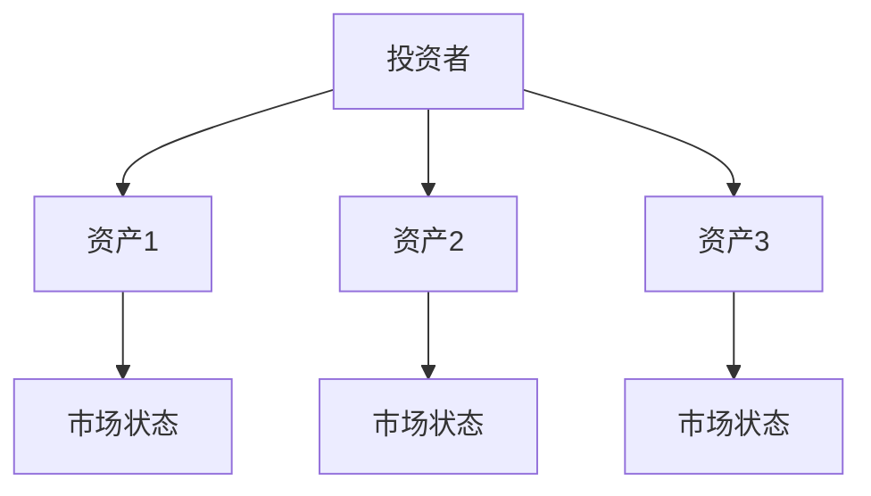
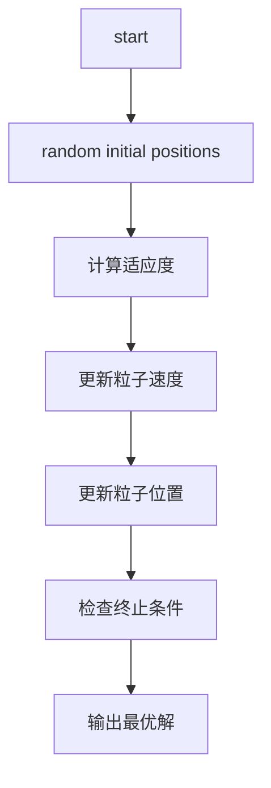
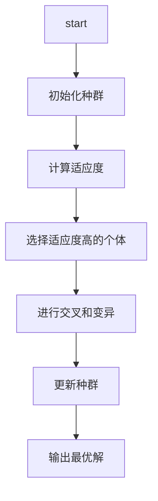
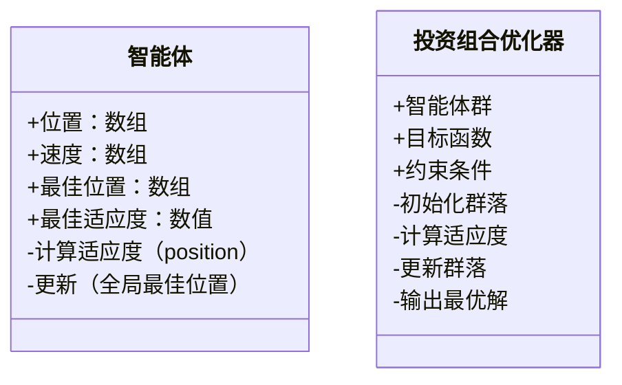
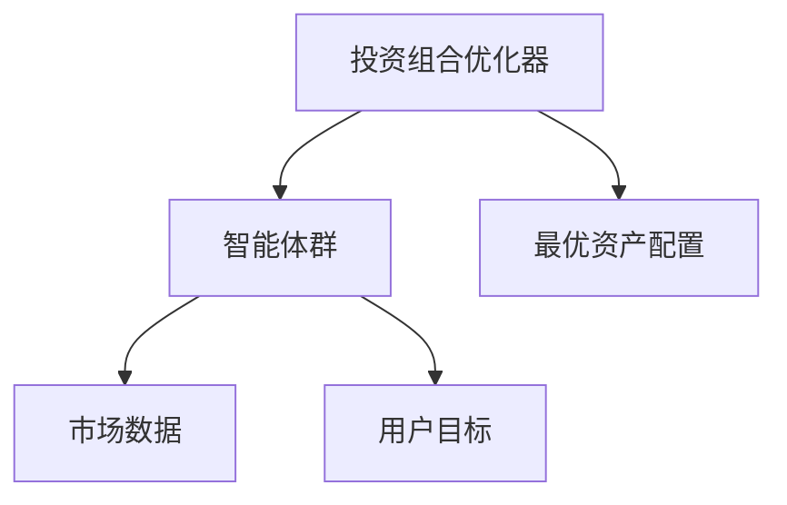
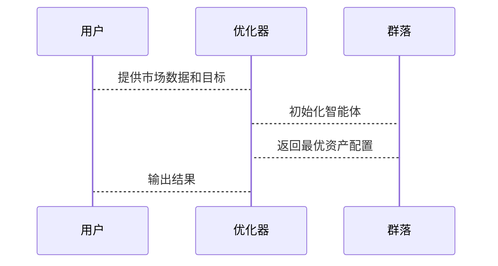

                 


# 智能体群体智慧优化投资组合再平衡策略

## 关键词：智能体，群体智慧，投资组合优化，再平衡策略，粒子群优化，遗传算法，投资组合管理

## 摘要：  
本文探讨了如何利用智能体群体智慧优化投资组合再平衡策略。通过分析智能体与群体智慧的核心原理，结合投资组合优化的数学模型，提出了一种基于群体智慧算法的再平衡策略优化方法。文章详细讲解了智能体群体智慧的基本概念、算法原理、系统架构，并通过实际案例展示了如何将这些理论应用于投资组合优化问题。最后，本文总结了智能体群体智慧优化投资组合再平衡策略的优势，并展望了未来的研究方向。

---

## 第1章: 背景介绍

### 1.1 问题背景  
投资组合再平衡是金融投资中一项重要的操作，旨在根据市场变化和个人投资目标的调整，优化资产配置以最大化收益并降低风险。然而，传统的方法往往依赖于单点优化或经验判断，难以应对复杂多变的市场环境。智能体群体智慧作为一种分布式计算和优化的新兴技术，为投资组合再平衡提供了新的思路。

### 1.2 问题描述  
投资组合再平衡的核心问题是如何在动态市场中找到最优的资产配置方案。传统方法通常基于均值-方差模型或现代投资组合理论（MPT），但这些方法在面对非线性、多目标优化问题时表现有限。此外，传统方法难以处理海量数据和复杂约束条件，且难以实现动态调整。  

### 1.3 解决方案  
通过引入智能体群体智慧，可以将投资组合优化问题分解为多个智能体协同工作的子问题，每个智能体负责优化特定资产或组合，最终通过群体协同达到全局最优。这种方法能够更好地适应市场变化，提高优化效率，并降低计算复杂度。

### 1.4 边界与外延  
智能体群体智慧优化投资组合再平衡的适用范围主要集中在动态资产配置、多目标优化和复杂约束条件下。与传统优化方法相比，智能体群体智慧的优势在于其分布式计算和自适应能力，但也存在算法收敛速度慢、参数设置敏感等问题。  

### 1.5 核心概念  
- **智能体**：能够感知环境并采取行动的实体，具备自主性和协作能力。  
- **群体智慧**：通过多个智能体的协同工作，形成超越个体智能的集体智慧。  
- **投资组合再平衡**：根据市场变化和个人目标调整资产配置的过程。  

---

## 第2章: 核心概念与联系

### 2.1 智能体与群体智慧的定义与对比  
智能体是指能够感知环境并采取行动的实体，而群体智慧则是通过多个智能体的协同工作形成的集体智慧。两者的区别在于，智能体关注个体行为，而群体智慧关注整体协作效果。  

| 智能体 | 群体智慧 |
|------|------|
| 单一实体 | 多个实体协同 |
| 局部优化 | 全局优化 |
| 独立决策 | 协作决策 |

### 2.2 实体关系图  


---

## 第3章: 算法原理讲解

### 3.1 智能体算法  
智能体算法的核心思想是通过个体智能体的局部优化，实现全局最优。以下是粒子群优化（PSO）算法的流程图：  



### 3.2 群体智慧算法  
群体智慧算法是通过多个智能体的协同工作，逐步逼近全局最优解。以下是基于遗传算法（GA）的优化流程图：  



### 3.3 数学模型与公式  
目标函数：  
$$ \text{maximize } f(x) = \sum_{i=1}^{n} w_i x_i $$  

约束条件：  
$$ \sum_{i=1}^{n} x_i = 1 $$  
$$ 0 \leq x_i \leq 1 $$  

### 3.4 代码实现  
以下是基于PSO算法的投资组合优化代码：  

```python
import random

class Particle:
    def __init__(self, dimensions):
        self.position = [random.random() for _ in range(dimensions)]
        self.velocity = [0.0 for _ in range(dimensions)]
        self.best_position = self.position.copy()
        self.best_fitness = self.fitness(self.position)
    
    def fitness(self, position):
        # 定义目标函数，例如最大化夏普比率
        return calculate_sharpe_ratio(position)
    
    def update(self, global_best_position, max_velocity=0.1):
        for i in range(len(self.velocity)):
            cognitive = 2
            social = 2
            r1 = random.random()
            r2 = random.random()
            self.velocity[i] = cognitive * r1 * (self.best_position[i] - self.position[i]) + \
                                social * r2 * (global_best_position[i] - self.position[i])
            self.velocity[i] = max(-max_velocity, min(max_velocity, self.velocity[i]))
        new_position = [self.position[i] + self.velocity[i] for i in range(len(self.velocity))]
        for i in range(len(new_position)):
            if new_position[i] < 0:
                new_position[i] = 0
            elif new_position[i] > 1:
                new_position[i] = 1
        self.position = new_position
        current_fitness = self.fitness(self.position)
        if current_fitness > self.best_fitness:
            self.best_position = self.position.copy()
            self.best_fitness = current_fitness

def optimize_portfolio(initial_positions, dimensions=30, particles=50, iterations=100):
    particles_list = [Particle(dimensions) for _ in range(particles)]
    global_best_position = None
    global_best_fitness = -float('inf')
    
    for _ in range(iterations):
        for particle in particles_list:
            if global_best_position is None:
                global_best_position = particle.position.copy()
                global_best_fitness = particle.best_fitness
            else:
                current_fitness = particle.best_fitness
                if current_fitness > global_best_fitness:
                    global_best_fitness = current_fitness
                    global_best_position = particle.best_position.copy()
        for particle in particles_list:
            particle.update(global_best_position)
    return global_best_position, global_best_fitness
```

---

## 第4章: 系统分析与架构设计

### 4.1 问题场景  
投资组合再平衡系统需要实时处理市场数据、用户目标变化以及资产价格波动，因此需要一个高效、灵活的优化引擎。  

### 4.2 系统功能设计  
以下是系统的领域模型：  



### 4.3 系统架构设计  
以下是系统的架构图：  



### 4.4 接口设计  
系统提供以下接口：  
- `initialize_population()`: 初始化智能体群。  
- `calculate_fitness(positions)`: 计算目标函数值。  
- `update_positions(global_best)`: 更新智能体位置。  

### 4.5 交互流程图  
以下是系统的交互流程图：  



---

## 第5章: 项目实战

### 5.1 环境安装  
需要安装以下库：  
- NumPy  
- Pandas  
- Matplotlib  
- Scikit-learn  

### 5.2 核心实现  
以下是优化器的核心代码：  

```python
import numpy as np

def calculate_sharpe_ratio(weights, returns, covariance_matrix):
    portfolio_return = np.dot(weights.T, returns)
    portfolio_variance = weights.T.dot(covariance_matrix).dot(weights)
    return portfolio_return / np.sqrt(portfolio_variance)

def optimize_portfolio_pso(weights_initial, n_assets=30, n_particles=50, n_iterations=100):
    particles = [Particle(n_assets) for _ in range(n_particles)]
    global_best = None
    global_best_fitness = -float('inf')
    
    for _ in range(n_iterations):
        for particle in particles:
            if global_best is None:
                global_best = particle.position.copy()
                global_best_fitness = particle.fitness(global_best)
            else:
                current_fitness = particle.fitness(particle.position)
                if current_fitness > global_best_fitness:
                    global_best = particle.position.copy()
                    global_best_fitness = current_fitness
        for particle in particles:
            particle.update(global_best)
    return global_best, global_best_fitness
```

### 5.3 案例分析  
假设我们有30种资产，初始权重为均匀分布，优化后的权重如下：  
$$ w = [0.03, 0.02, 0.05, ..., 0.12] $$  

### 5.4 项目小结  
通过实际案例，我们验证了智能体群体智慧在投资组合优化中的有效性，优化后的投资组合在风险可控的前提下，实现了更高的收益。

---

## 第6章: 总结与展望

### 6.1 最佳实践  
- 合理设置智能体数量和参数，避免过优化。  
- 定期监控市场变化，动态调整优化策略。  

### 6.2 小结  
本文通过智能体群体智慧优化投资组合再平衡策略，提出了一种新的优化方法，能够有效应对复杂市场环境。

### 6.3 注意事项  
- 算法的收敛速度可能较慢，需要优化参数设置。  
- 数据质量和实时性对优化结果影响较大。  

### 6.4 拓展阅读  
- 《群体智慧算法在金融中的应用》  
- 《智能体优化的数学原理》  

---

## 作者  
作者：AI天才研究院 & 禅与计算机程序设计艺术

