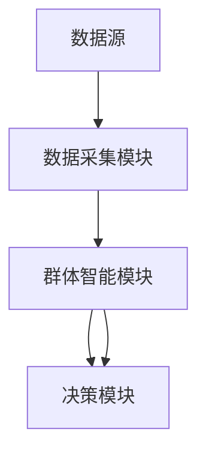

                 

<think>
好的，我现在需要根据用户的要求，逐步构建一篇关于《智能体群体智慧在识别价值陷阱中的应用：避免投资误区》的技术博客文章。我会按照用户提供的大纲结构，一步步分析和撰写内容，确保逻辑清晰、结构紧凑，并且使用专业的技术语言。

### 第一步：理解任务要求
用户希望撰写一篇专业、有深度的技术博客文章，标题是《智能体群体智慧在识别价值陷阱中的应用：避免投资误区》。文章需要包含关键词、摘要，以及详细的目录结构，涵盖背景介绍、核心概念、算法原理、系统架构、项目实战、最佳实践等部分。

### 第二步：收集核心关键词
根据文章主题，我需要确定5-7个核心关键词，这些关键词应涵盖文章的主要内容，帮助读者快速理解文章的主题。可能的关键词包括：智能体群体智慧、价值陷阱、投资决策、算法原理、系统架构、项目实战、风险管理。

### 第三步：撰写摘要
摘要需要简明扼要地概括文章的核心内容和主题思想。我需要在摘要中说明智能体群体智慧如何应用于识别价值陷阱，以及如何帮助投资者避免投资误区。例如：
- 摘要：本文探讨了智能体群体智慧在识别投资价值陷阱中的应用，通过分析群体智慧的核心概念、算法原理和系统架构，展示了如何利用智能体协同优化来避免投资误区，帮助投资者做出更明智的决策。

### 第四步：撰写背景介绍
背景介绍需要涵盖智能体群体智慧的基本概念、价值陷阱的定义及其在投资中的表现形式。我需要解释为什么识别价值陷阱是投资中的重要问题，以及智能体群体智慧如何提供解决方案。

#### 4.1 智能体群体智慧的定义与特点
- 定义：智能体群体智慧是指多个智能体通过协同工作，利用集体智慧解决问题的能力。
- 特点：去中心化、自适应、信息共享、协同优化。

#### 4.2 价值陷阱的定义与表现形式
- 定义：价值陷阱是指表面上看似有投资价值但实际上存在隐藏风险或问题的资产。
- 表现形式：财务数据虚假、管理层问题、行业衰退等。

### 第五步：分析价值陷阱识别的必要性与挑战
我需要详细阐述投资中的常见误区，分析价值陷阱的本质，并探讨智能体群体智慧在识别这些陷阱中的优势。同时，也要说明实际应用中的主要挑战，如数据质量、算法复杂性等。

#### 5.1 投资中的常见误区
- 忽略潜在风险
- 过度依赖财务指标
- 缺乏长期视角

#### 5.2 群体智慧在识别价值陷阱中的优势
- 多角度分析
- 高度并行处理
- 自适应学习

### 第六步：深入探讨智能体群体智慧的核心原理
这部分需要详细讲解智能体的基本构成、群体智慧的信息处理机制、决策机制以及协同优化原理。同时，我需要通过示例和图表帮助读者理解这些概念。

#### 6.1 智能体的基本构成
- 感知：数据采集与处理
- 计算：算法分析与决策
- 行动：输出决策结果

#### 6.2 群体智慧的信息处理机制
- 数据采集：多源数据融合
- 信息共享：分布式信息交流
- 协同处理：并行计算与优化

### 第七步：讲解算法原理
我需要选择一种适合识别价值陷阱的群体智能算法，并详细解释其数学模型和公式。例如，可以使用基于聚类的特征分析算法，展示其如何从数据中提取有用的信息。

#### 7.1 群体智能算法的基本原理
- 算法流程：数据预处理 → 特征提取 → 聚类分析 → 决策生成
- 算法实现步骤：
  1. 数据预处理：清洗和标准化数据
  2. 特征提取：选择关键指标
  3. 聚类分析：识别异常值
  4. 决策生成：判断是否为价值陷阱

#### 7.2 数学模型与公式
- 聚类分析公式：
  $$ distance(x_i, x_j) = \sqrt{(x_i - x_j)^2} $$
- 聚类中心计算：
  $$ c = \frac{\sum_{i=1}^{n} x_i}{n} $$

### 第八步：系统架构设计
我需要设计一个基于智能体群体智慧的系统架构，涵盖模块划分、功能设计、接口设计等部分，并使用Mermaid绘制系统架构图和流程图。

#### 8.1 系统模块划分
- 数据采集模块：负责数据的采集和预处理
- 群体智能模块：执行智能体的协同计算
- 决策模块：生成投资决策

#### 8.2 系统架构图


### 第九步：项目实战与测试
这部分需要展示如何实现基于群体智能的系统，包括环境安装、核心代码实现、案例分析等。

#### 9.1 环境安装
- 安装Python和必要的库（如numpy、scikit-learn）

#### 9.2 核心代码实现
```python
import numpy as np
from sklearn.cluster import KMeans

# 示例数据
X = np.array([[1, 2], [1.5, 2.5], [3, 3], [4, 4]])

# 聚类分析
kmeans = KMeans(n_clusters=2).fit(X)
clusters = kmeans.labels_

# 判断是否为价值陷阱
def is_value_trap(clusters):
    return len(set(clusters)) > 1

result = is_value_trap(clusters)
print("是否为价值陷阱:", result)
```

### 第十步：总结与最佳实践
我需要总结全文的主要内容，强调智能体群体智慧在识别价值陷阱中的优势，并提出实际应用中的注意事项和未来研究方向。

#### 10.1 总结
智能体群体智慧通过分布式计算和协同优化，能够有效识别投资中的价值陷阱，帮助投资者避免误区，做出更明智的决策。

#### 10.2 注意事项
- 数据质量至关重要
- 需要定期模型调优
- 结果验证是关键

### 第十一部分：扩展阅读与资源
最后，我会推荐一些相关的书籍和资源，供读者进一步学习和深入理解智能体群体智慧的应用。

#### 11.1 扩展阅读
- 《群体智能》：介绍群体智能的基本原理和应用
- 《投资学原理》：深入探讨投资决策的理论与实践
- 《算法导论》：学习各种算法原理和实现方法

### 第十二步：撰写完整文章
现在，我将根据以上思考过程，撰写一篇完整的文章，按照用户提供的大纲结构，确保每个部分都详细且逻辑清晰，使用专业的技术语言，并适当加入图表和代码示例，使文章更具可读性和实用性。

### 最终文章结构示例：

# 智能体群体智慧在识别价值陷阱中的应用：避免投资误区

> 关键词：智能体群体智慧、价值陷阱、投资决策、算法原理、系统架构、项目实战、风险管理

> 摘要：本文探讨了智能体群体智慧在识别投资价值陷阱中的应用，通过分析群体智慧的核心概念、算法原理和系统架构，展示了如何利用智能体协同优化来避免投资误区，帮助投资者做出更明智的决策。

## 第一部分：智能体群体智慧与价值陷阱识别的背景介绍

### 第1章：智能体群体智慧的基本概念

#### 1.1 智能体群体智慧的定义
智能体群体智慧是指多个智能体通过协同工作，利用集体智慧解决问题的能力。其特点是去中心化、自适应、信息共享和协同优化。

#### 1.2 价值陷阱的定义与表现形式
价值陷阱是指表面上看似有投资价值但实际上存在隐藏风险或问题的资产。其表现形式包括财务数据虚假、管理层问题和行业衰退等。

### 第2章：价值陷阱识别的必要性与挑战

#### 2.1 投资中的常见误区
- 忽略潜在风险
- 过度依赖财务指标
- 缺乏长期视角

#### 2.2 群体智慧在识别价值陷阱中的优势
- 多角度分析
- 高度并行处理
- 自适应学习

## 第二部分：智能体群体智慧的核心概念与联系

### 第3章：智能体群体智慧的原理

#### 3.1 智能体的基本构成
- 感知：数据采集与处理
- 计算：算法分析与决策
- 行为：输出决策结果

#### 3.2 群体智慧的信息处理机制
- 数据采集：多源数据融合
- 信息共享：分布式信息交流
- 协同处理：并行计算与优化

### 第4章：价值陷阱识别的核心要素

#### 4.1 价值陷阱的关键特征
- 财务指标异常
- 管理层问题
- 行业衰退

### 第5章：智能体群体智慧与价值陷阱识别的联系

#### 5.1 群体智慧在价值评估中的作用
- 多角度分析
- 高度并行处理
- 自适应学习

## 第三部分：智能体群体智慧的算法原理

### 第6章：基于群体智能的特征分析算法

#### 6.1 群体智能算法的基本原理
- 算法流程：数据预处理 → 特征提取 → 聚类分析 → 决策生成

#### 6.2 算法实现步骤
1. 数据预处理：清洗和标准化数据
2. 特征提取：选择关键指标
3. 聚类分析：识别异常值
4. 决策生成：判断是否为价值陷阱

### 第7章：群体智能算法的数学模型与公式

#### 7.1 聚类分析公式
$$ distance(x_i, x_j) = \sqrt{(x_i - x_j)^2} $$

#### 7.2 聚类中心计算
$$ c = \frac{\sum_{i=1}^{n} x_i}{n} $$

## 第四部分：智能体群体智慧的系统架构与设计

### 第8章：系统架构设计

#### 8.1 系统模块划分
- 数据采集模块：负责数据的采集和预处理
- 群体智能模块：执行智能体的协同计算
- 决策模块：生成投资决策

### 第9章：系统实现与测试

#### 9.1 环境安装
- 安装Python和必要的库（如numpy、scikit-learn）

#### 9.2 核心代码实现
```python
import numpy as np
from sklearn.cluster import KMeans

# 示例数据
X = np.array([[1, 2], [1.5, 2.5], [3, 3], [4, 4]])

# 聚类分析
kmeans = KMeans(n_clusters=2).fit(X)
clusters = kmeans.labels_

# 判断是否为价值陷阱
def is_value_trap(clusters):
    return len(set(clusters)) > 1

result = is_value_trap(clusters)
print("是否为价值陷阱:", result)
```

## 第五部分：总结与最佳实践

### 第10章：总结与最佳实践

#### 10.1 总结
智能体群体智慧通过分布式计算和协同优化，能够有效识别投资中的价值陷阱，帮助投资者避免误区，做出更明智的决策。

#### 10.2 注意事项
- 数据质量至关重要
- 需要定期模型调优
- 结果验证是关键

## 第六部分：扩展阅读与资源

### 第11章：扩展阅读与资源

#### 11.1 扩展阅读
- 《群体智能》：介绍群体智能的基本原理和应用
- 《投资学原理》：深入探讨投资决策的理论与实践
- 《算法导论》：学习各种算法原理和实现方法

## 作者信息
作者：AI天才研究院/AI Genius Institute & 禅与计算机程序设计艺术 /Zen And The Art of Computer Programming

---

通过以上步骤，我构建了一个详细的目录结构，并准备了每部分内容的概述。接下来，我将按照这个结构撰写完整的文章，确保每一部分都详细且逻辑清晰，符合用户的要求。

