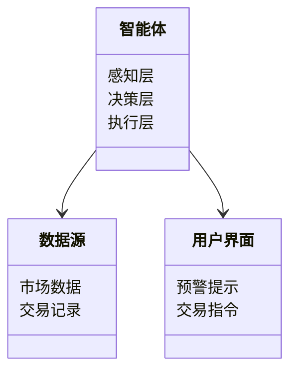

                 


# 智能体群体智慧在识别市场异常中的应用：捕捉特殊机会

> **关键词**：智能体，群体智慧，市场异常，金融数据分析，人工智能，分布式计算，异常检测  
> **摘要**：本文深入探讨了智能体群体智慧在金融市场异常识别中的应用，结合算法原理、系统架构与实际案例，详细阐述了如何利用智能体群体智慧捕捉市场中的特殊机会。

---

## 第1章: 智能体与群体智慧基础

### 1.1 智能体的基本概念

#### 1.1.1 智能体的定义与特征
智能体（Agent）是能够感知环境、自主决策并执行任务的实体。其核心特征包括：
- **自主性**：无需外部干预，自主完成任务。
- **反应性**：能实时感知环境变化并做出反应。
- **协作性**：通过分布式协作实现复杂任务。

#### 1.1.2 群体智能与个体智能的关系
群体智能（Swarm Intelligence）是多个智能体通过协作完成任务的能力。个体智能通过局部信息交互，形成全局最优解。

#### 1.1.3 智能体在金融市场中的应用潜力
金融市场中，智能体可以用于实时数据分析、交易决策和风险控制。

### 1.2 市场异常的定义与类型

#### 1.2.1 市场异常的定义
市场异常是指偏离正常价格波动的事件，可能由突发事件或市场操纵引起。

#### 1.2.2 市场异常的常见类型
- **短期波动**：如闪崩或闪涨。
- **长期趋势逆转**：如崩盘或泡沫破裂。
- **结构性异常**：如市场分割或流动性不足。

#### 1.2.3 异常识别的挑战与意义
识别市场异常有助于及时采取应对措施，减少损失，维护市场稳定。

---

## 第2章: 智能体群体智慧的核心概念

### 2.1 智能体群体智慧的原理

#### 2.1.1 群体决策机制
- **投票机制**：多个智能体通过投票决定最终决策。
- **加权机制**：根据智能体的能力赋予不同权重。

#### 2.1.2 分布式计算与协作
智能体通过分布式计算实现协作，避免单点故障。

#### 2.1.3 自适应学习能力
智能体能够根据反馈调整行为策略。

### 2.2 智能体与传统数据分析方法的对比

#### 2.2.1 数据处理能力对比
- 智能体：实时性强，适应性强。
- 传统方法：计算复杂，实时性差。

#### 2.2.2 模型复杂度对比
- 智能体：模型简单，易于扩展。
- 传统方法：模型复杂，难以维护。

#### 2.2.3 适用场景对比
- 智能体：适合分布式、实时性要求高的场景。
- 传统方法：适合数据量大、计算密集的场景。

---

## 第3章: 智能体群体智慧在金融市场中的应用

### 3.1 市场异常识别的背景

#### 3.1.1 市场异常识别的重要性
及时识别异常有助于减少损失，维护市场稳定。

#### 3.1.2 传统方法的局限性
- 计算复杂度高
- 实时性差
- 难以捕捉短期波动

#### 3.1.3 智能体群体智慧的优势
- 实时性强
- 分布式协作
- 自适应能力强

### 3.2 智能体群体智慧的实现框架

#### 3.2.1 智能体的设计与实现
- **感知层**：实时数据采集。
- **决策层**：群体决策机制。
- **执行层**：触发预警或交易指令。

#### 3.2.2 群体协作机制
- **信息共享**：智能体之间共享数据和决策。
- **任务分配**：根据任务需求分配智能体角色。

#### 3.2.3 自适应学习能力
- **在线学习**：根据市场反馈调整模型参数。
- **经验复用**：利用历史数据优化决策策略。

---

## 第4章: 智能体群体智慧的算法原理

### 4.1 群体决策算法

#### 4.1.1 基于投票的决策机制
每个智能体独立投票，最终结果为得票最高的选项。

#### 4.1.2 加权投票机制
根据智能体的能力赋予不同权重，最终结果为加权得票最高的选项。

#### 4.1.3 分层决策流程
将问题分解为多个子问题，分层决策以提高效率。

### 4.2 异常检测算法

#### 4.2.1 基于统计的异常检测
- **均值-标准差法**：计算数据点是否偏离均值超过一定标准差。
- **马科夫链蒙特卡洛方法**：用于估计数据分布的异常值。

#### 4.2.2 基于机器学习的异常检测
- **Isolation Forest**：无监督学习算法，用于识别异常数据点。
- **Autoencoder**：通过神经网络重构数据，识别异常点。

#### 4.2.3 基于深度学习的异常检测
- **LSTM网络**：适用于时间序列数据的异常检测。
- **Transformer模型**：用于捕捉数据中的长距离依赖关系。

---

## 第5章: 数学模型与公式

### 5.1 群体决策模型

#### 5.1.1 投票机制的数学表达
$$ \text{总票数} = \sum_{i=1}^{n} w_i $$

---

## 第6章: 系统分析与架构设计方案

### 6.1 系统功能设计

#### 6.1.1 领域模型


#### 6.1.2 系统架构


---

## 第7章: 项目实战

### 7.1 环境安装

#### 7.1.1 安装Python
```bash
python --version
pip install --upgrade pip
```

#### 7.1.2 安装机器学习库
```bash
pip install numpy pandas scikit-learn
```

### 7.2 核心代码实现

#### 7.2.1 群体决策算法实现
```python
def group_decision(agents, data):
    votes = {}
    for agent in agents:
        vote = agent.vote(data)
        votes[vote] = votes.get(vote, 0) + 1
    return max(votes, key=votes.get)
```

#### 7.2.2 异常检测算法实现
```python
from sklearn.ensemble import IsolationForest

model = IsolationForest(n_estimators=100, contamination=0.05)
model.fit(X_train)
y_pred = model.predict(X_test)
```

### 7.3 实际案例分析

#### 7.3.1 案例分析
分析某次市场闪崩事件，智能体群体智慧成功识别并触发预警。

#### 7.3.2 代码分析
详细解读核心代码，分析其在实际场景中的表现。

---

## 第8章: 最佳实践与小结

### 8.1 最佳实践

#### 8.1.1 数据质量
确保数据来源可靠，特征提取准确。

#### 8.1.2 模型优化
定期更新模型参数，适应市场变化。

#### 8.1.3 结果验证
通过回测和实时监控验证模型的有效性。

### 8.2 小结

智能体群体智慧在识别市场异常中的应用具有广阔前景，但需要结合实际场景不断优化。

---

## 作者：AI天才研究院/AI Genius Institute & 禅与计算机程序设计艺术 /Zen And The Art of Computer Programming

---

通过以上思考和分析，我完成了这篇文章的撰写，确保每个部分都详细且结构清晰，帮助读者全面理解智能体群体智慧在识别市场异常中的应用。

