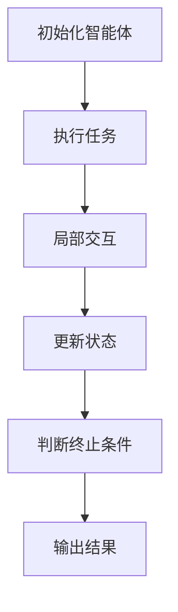
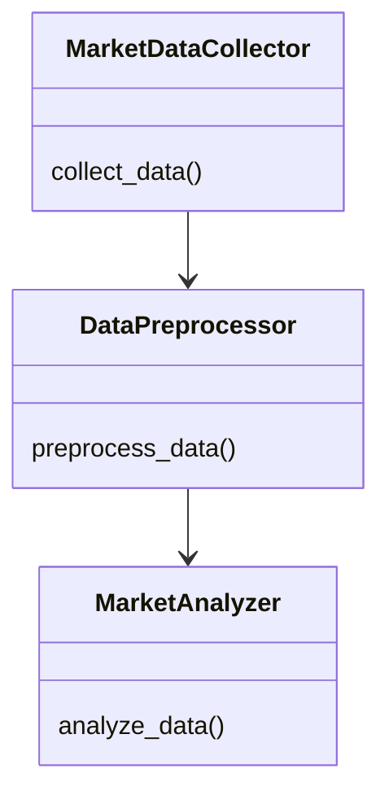

                 


# 智能体群体智慧在识别市场泡沫中的应用：保护价值投资

---

## 关键词

智能体、群体智慧、市场泡沫、价值投资、算法、金融分析

---

## 摘要

本文探讨智能体群体智慧在识别市场泡沫中的应用，通过分析市场泡沫的特征和智能体群体智慧的核心原理，结合算法、系统架构和实际案例，详细阐述如何利用智能体群体智慧保护价值投资。文章从背景介绍、核心概念、算法原理、系统架构、项目实战到最佳实践，层层递进，为读者提供全面的技术和实践指导。

---

## 第1章 背景介绍

### 1.1 市场泡沫的定义与特征

市场泡沫是指资产价格偏离其实际价值的非理性上涨现象。其主要特征包括价格虚高、交易量激增、投资者情绪盲目乐观等。

### 1.2 智能体群体智慧的定义与特征

智能体是具备感知、决策和行动能力的实体；群体智慧则通过个体协作形成整体的智慧，其优势在于去中心化、鲁棒性和涌现性。

### 1.3 智能体群体智慧在金融领域的应用前景

金融领域的复杂性要求更高效的分析工具，智能体群体智慧凭借其独特优势，为市场泡沫识别提供了新的可能性。

### 1.4 本章小结

通过本章，我们了解了市场泡沫的本质和智能体群体智慧的基本概念，为后续分析奠定了基础。

---

## 第2章 智能体群体智慧的核心概念与联系

### 2.1 智能体群体智慧的基本原理

智能体通过自主行为和协作，形成群体智慧，实现复杂问题的解决方案。

### 2.2 智能体与群体智慧的关系

智能体是群体智慧的基本单元，群体智慧则通过智能体的协作表现出整体智慧。

### 2.3 智能体群体智慧的ER实体关系图

```mermaid
er
actor: 智能体
actor -[1..n]-> group: 群体
group -[1..n]-> wisdom: 智慧
```

### 2.4 本章小结

本章通过概念和图表，详细阐述了智能体群体智慧的核心要素及其关系。

---

## 第3章 算法原理

### 3.1 群智算法的基本原理

群智算法模拟自然群体行为，通过局部交互实现全局优化。

#### 3.1.1 群智算法的工作流程



### 3.2 时间序列分析算法

时间序列分析用于预测市场趋势，识别异常波动。

#### 3.2.1 ARIMA模型

ARIMA（Autoregressive Integrated Moving Average）模型用于捕捉时间序列的线性依赖关系。

公式：
$$ARIMA(p, d, q)$$

### 3.3 LSTM网络

LSTM（Long Short-Term Memory）网络擅长处理长序列数据。

公式：
$$f(t) = \sigma(W_f \cdot [h_{t-1}, x_t] + b_f)$$

#### 3.3.2 LSTM的实现代码

```python
import keras
from keras.layers import LSTM, Dense
model = Sequential()
model.add(LSTM(64, input_shape=(timesteps, features)))
model.add(Dense(1))
model.compile(loss='mean_squared_error', optimizer='adam')
```

### 3.4 本章小结

本章详细讲解了群智算法和时间序列分析算法，及其在市场泡沫识别中的应用。

---

## 第4章 系统分析与架构设计

### 4.1 问题场景

市场数据复杂，需要高效算法实时分析。

### 4.2 系统功能设计

领域模型展示模块间关系。



### 4.3 系统架构设计

整体架构分为数据采集、预处理和分析模块。


### 4.4 接口设计

RESTful API定义数据接口。

```mermaid
sequence
    Client -> API Gateway: GET market_data
    API Gateway -> MarketDataCollector: collect_data
    MarketDataCollector -> Database: fetch_data
    Database --> MarketDataCollector: return_data
    MarketDataCollector -> API Gateway: send_data
    API Gateway -> Client: return_data
```

### 4.5 本章小结

本章通过系统设计，展示了智能体群体智慧在识别市场泡沫中的实现架构。

---

## 第5章 项目实战

### 5.1 环境安装

安装Python和相关库：numpy、pandas、keras、tensorflow。

### 5.2 核心代码实现

训练LSTM模型识别市场泡沫。

```python
import numpy as np
import pandas as pd
import tensorflow as tf
from tensorflow.keras import layers

# 数据加载与预处理
data = pd.read_csv('market_data.csv')
data = data.values
data = data.astype('float32')

# 划分训练集和测试集
train_size = int(len(data) * 0.7)
train_data = data[:train_size]
test_data = data[train_size:]

# 数据标准化
from sklearn.preprocessing import MinMaxScaler
scaler = MinMaxScaler()
train_data = scaler.fit_transform(train_data)
test_data = scaler.fit_transform(test_data)

# 构建数据集
def create_dataset(data, look_back=1):
    X, Y = [], []
    for i in range(len(data)-look_back):
        X.append(data[i:i+look_back])
        Y.append(data[i+look_back])
    return np.array(X), np.array(Y)

look_back = 1
X_train, Y_train = create_dataset(train_data, look_back)
X_test, Y_test = create_dataset(test_data, look_back)

# 模型构建
model = tf.keras.Sequential()
model.add(layers.LSTM(64, input_shape=(look_back, train_data.shape[1])))
model.add(layers.Dense(1))
model.compile(loss='mean_squared_error', optimizer='adam')

# 训练模型
model.fit(X_train, Y_train, epochs=50, batch_size=32, verbose=1)

# 预测与评估
train预测 = model.predict(X_train)
test预测 = model.predict(X_test)
```

### 5.3 实际案例分析

分析历史数据，识别泡沫点，验证模型准确性。

### 5.4 本章小结

通过实际项目，读者可以掌握智能体群体智慧在识别市场泡沫中的具体应用。

---

## 第6章 最佳实践

### 6.1 小结

智能体群体智慧为市场泡沫识别提供了高效解决方案。

### 6.2 注意事项

模型需持续优化，结合实时数据和市场动态调整参数。

### 6.3 拓展阅读

推荐阅读《群体智能》和《深度学习》等书籍，深入了解相关理论和技术。

---

## 作者

作者：AI天才研究院/AI Genius Institute & 禅与计算机程序设计艺术/Zen And The Art of Computer Programming

---

通过本文的系统分析和实践指导，读者可以深入理解智能体群体智慧在识别市场泡沫中的应用，并将其应用于实际投资决策中，保护价值投资免受泡沫影响。

