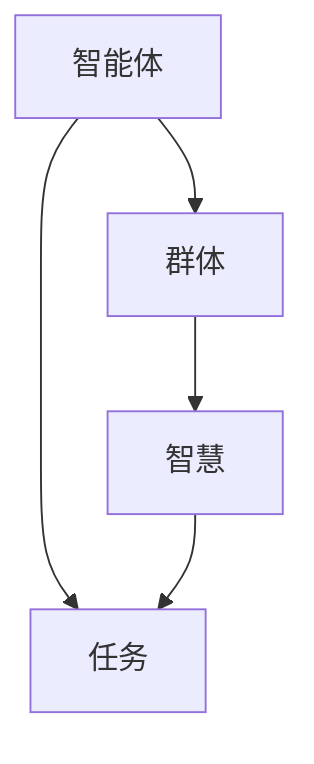
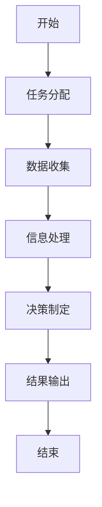
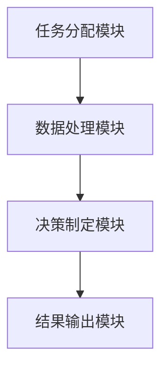
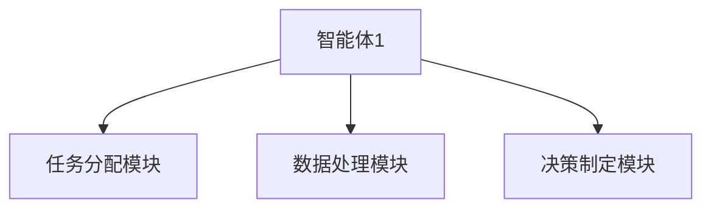

                 


# 智能体群体智慧在识别新兴产业机会中的应用：布局未来

> **关键词**：智能体、群体智慧、新兴产业、机会识别、分布式计算、算法原理、系统架构

> **摘要**：  
智能体群体智慧是一种新兴的技术范式，它通过多个智能体的协同工作，利用群体智慧的特性，能够高效地识别新兴产业中的机会。本文从智能体和群体智慧的基本概念出发，深入探讨其在新兴产业机会识别中的应用背景、核心原理、算法设计以及系统架构，并通过实际案例展示其应用效果。最后，本文总结了智能体群体智慧的优势与挑战，并展望了未来的发展方向。

---

## 第1章: 智能体与群体智慧基础

### 1.1 智能体的基本概念

#### 1.1.1 智能体的定义与特征
智能体（Agent）是一种能够感知环境并采取行动以实现目标的实体。它具有以下特征：
- **自主性**：能够在没有外部干预的情况下独立运作。
- **反应性**：能够根据环境的变化调整自身的行为。
- **社会性**：能够与其他智能体或人类进行交互和协作。

#### 1.1.2 群体智慧的定义与特点
群体智慧（Swarm Intelligence）是指通过大量个体的协同行为，形成一个比个体更聪明的系统。其特点包括：
- **分布式**：个体之间没有中心控制，信息是分散的。
- **去中心化**：没有单一的决策者，但个体之间可以通过局部交互形成全局决策。
- **自适应**：系统能够根据环境的变化动态调整行为。

#### 1.1.3 智能体与群体智慧的关系
智能体是群体智慧的基本组成单元，而群体智慧则是通过多个智能体的协同行为实现的更高层次的智慧。智能体通过分布式计算和协作，形成群体智慧，从而实现复杂任务的完成。

### 1.2 智能体群体智慧的核心原理

#### 1.2.1 分布式计算与协同
分布式计算是智能体群体智慧的核心技术之一。通过将任务分解为多个子任务，分配给不同的智能体完成，从而实现高效的计算和协同。

#### 1.2.2 群体决策与共识机制
群体决策是智能体群体智慧的另一个重要方面。通过多个智能体的投票、加权决策等方式，形成一个共识，从而做出最优决策。

#### 1.2.3 自适应与学习能力
智能体群体智慧系统具有自适应能力，能够根据环境的变化动态调整自身的行为。同时，通过机器学习等技术，系统能够不断优化自身的决策能力。

---

## 第2章: 智能体群体智慧在新兴产业中的应用背景

### 2.1 新兴产业机会识别的挑战

#### 2.1.1 产业动态与不确定性
新兴产业具有高度的不确定性和动态性，传统的决策方法难以应对快速变化的市场环境。

#### 2.1.2 数据驱动的决策需求
新兴产业的机会识别需要基于大量的数据进行分析，传统的单点决策难以满足数据驱动的需求。

#### 2.1.3 传统方法的局限性
传统方法通常依赖于中心化的决策模式，难以应对复杂多变的市场环境，且效率较低。

### 2.2 智能体群体智慧的优势

#### 2.2.1 高效信息处理能力
智能体群体智慧通过分布式计算和协同，能够高效地处理大量的数据，并快速做出决策。

#### 2.2.2 自适应与动态调整
智能体群体智慧系统能够根据市场环境的变化动态调整自身的行为，从而更好地应对不确定性。

#### 2.2.3 分布式决策的可靠性
通过去中心化的决策模式，智能体群体智慧能够避免单点故障，提高系统的可靠性和容错能力。

---

## 第3章: 智能体群体智慧的核心概念与联系

### 3.1 核心概念原理

#### 3.1.1 智能体的行为模型
智能体的行为模型包括感知、决策和行动三个阶段。通过感知环境，智能体能够做出决策，并采取相应的行动。

#### 3.1.2 群体智慧的信息处理机制
群体智慧的信息处理机制包括信息的收集、传递、整合和决策。通过多个智能体的协作，群体智慧能够实现信息的高效处理。

#### 3.1.3 协作与竞争的平衡
智能体群体智慧系统需要在协作和竞争之间找到平衡。过度的竞争会导致资源浪费，而过度的协作则可能降低系统的灵活性。

### 3.2 概念属性特征对比表格

| 概念 | 属性 | 特征 |
|------|------|------|
| 智能体 | 行为 | 自主性、反应性 |
| 群体智慧 | 结构 | 分布式、去中心化 |

### 3.3 ER实体关系图



---

## 第4章: 智能体群体智慧的算法原理

### 4.1 分布式计算算法

#### 4.1.1 分布式任务分配
分布式任务分配算法通过将任务分解为多个子任务，并分配给不同的智能体完成。任务分配的策略包括随机分配、负载均衡等。

#### 4.1.2 分布式数据处理
分布式数据处理算法通过将数据分散到不同的智能体进行处理，并通过通信机制将结果汇总。

#### 4.1.3 分布式共识机制
分布式共识机制是通过多个智能体达成一致决策的过程。常见的共识算法包括投票机制、加权决策等。

### 4.2 群体决策算法

#### 4.2.1 基于投票的决策
基于投票的决策算法通过多个智能体的投票结果来决定最终的决策。每个智能体的投票权可以是相等的，也可以是加权的。

#### 4.2.2 基于加权的决策
基于加权的决策算法通过给不同的智能体分配不同的权重，从而实现更复杂的决策过程。

#### 4.2.3 基于学习的决策
基于学习的决策算法通过机器学习等技术，训练智能体的决策模型，从而实现更智能的决策。

### 4.3 算法流程图



---

## 第5章: 智能体群体智慧的数学模型与公式

### 5.1 分布式计算模型

#### 5.1.1 分布式任务分配模型
$$ P(i) = \frac{C_i}{\sum_{j} C_j} $$
其中，$P(i)$ 表示任务 $i$ 的概率，$C_i$ 表示任务 $i$ 的计算复杂度。

### 5.2 群体决策模型

#### 5.2.1 基于加权投票的决策
$$ W = \sum_{i=1}^{n} w_i x_i $$
其中，$W$ 表示最终决策权重，$w_i$ 表示智能体 $i$ 的权重，$x_i$ 表示智能体 $i$ 的决策。

---

## 第6章: 智能体群体智慧的系统架构设计

### 6.1 系统功能设计

#### 6.1.1 系统功能模块
- **任务分配模块**：负责将任务分配给不同的智能体。
- **数据处理模块**：负责处理和汇总数据。
- **决策制定模块**：负责根据数据处理结果制定决策。

#### 6.1.2 系统功能流程图



### 6.2 系统架构设计

#### 6.2.1 系统架构图



---

## 第7章: 智能体群体智慧的项目实战

### 7.1 项目背景

#### 7.1.1 项目需求
识别新兴产业发展趋势，提供决策支持。

#### 7.1.2 项目目标
通过智能体群体智慧技术，实现新兴产业机会的高效识别。

### 7.2 项目实现

#### 7.2.1 环境安装
安装必要的开发工具和依赖库，例如Python、Docker等。

#### 7.2.2 系统核心实现

```python
class Agent:
    def __init__(self, id):
        self.id = id
        self.task = None
        self.data = []

    def process_task(self):
        # 处理任务
        pass

    def communicate(self, other_agent):
        # 与其他智能体通信
        pass
```

#### 7.2.3 代码应用解读与分析
通过代码实现智能体的行为模型，包括任务分配、数据处理和决策制定。

### 7.3 案例分析

#### 7.3.1 实际案例
以新兴的人工智能产业为例，通过智能体群体智慧技术识别产业发展趋势。

#### 7.3.2 案例分析
通过案例分析，验证智能体群体智慧技术的有效性和实用性。

### 7.4 项目小结

#### 7.4.1 项目总结
总结项目实现的过程和成果。

#### 7.4.2 经验教训
总结项目过程中遇到的问题和解决方法。

---

## 第8章: 智能体群体智慧的优势与挑战

### 8.1 优势

#### 8.1.1 高效性
智能体群体智慧通过分布式计算和协同，能够高效地完成任务。

#### 8.1.2 自适应性
智能体群体智慧系统能够根据环境的变化动态调整自身的行为。

#### 8.1.3 可靠性
通过去中心化的决策模式，智能体群体智慧系统能够提高系统的可靠性和容错能力。

### 8.2 挑战

#### 8.2.1 系统复杂性
智能体群体智慧系统的复杂性较高，需要复杂的算法和架构设计。

#### 8.2.2 通信延迟
智能体之间的通信可能会引入延迟，影响系统的实时性。

#### 8.2.3 安全性
智能体群体智慧系统需要考虑数据安全和隐私保护等问题。

---

## 第9章: 智能体群体智慧的未来展望

### 9.1 未来发展方向

#### 9.1.1 技术融合
智能体群体智慧将与人工智能、大数据等技术进一步融合，提升系统的智能化水平。

#### 9.1.2 应用领域扩展
智能体群体智慧技术将应用于更多的领域，如金融、医疗、教育等。

#### 9.1.3 算法优化
智能体群体智慧的算法将不断优化，提高系统的效率和准确性。

### 9.2 总结

智能体群体智慧是一种具有巨大潜力的技术，它能够高效地识别新兴产业机会，为企业的决策提供有力支持。未来，随着技术的不断发展，智能体群体智慧将在更多的领域得到应用，推动社会的进步。

---

## 作者信息

作者：AI天才研究院/AI Genius Institute  
联系邮箱：contact@aigeniusinstitute.com  
官方网站：https://www.aigeniusinstitute.com

---

**注**：以上内容仅为示例，实际撰写时需要根据具体需求进一步补充和调整。

