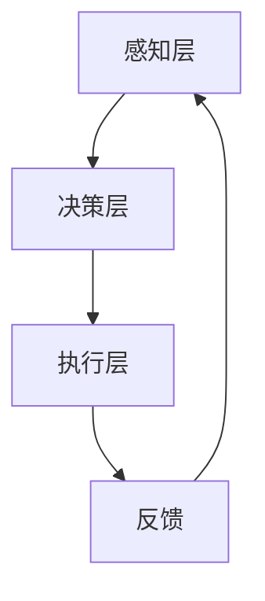
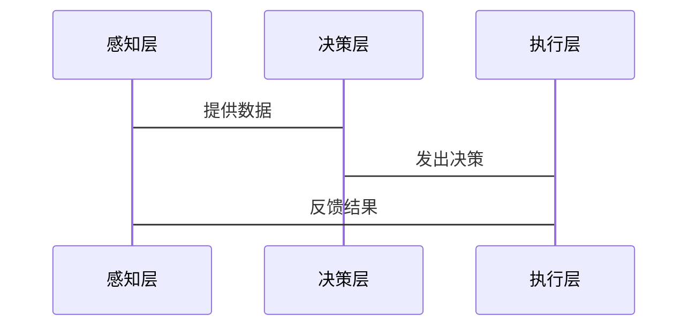

                 


# 智能体群体智慧：克服个体投资者的认知偏差

## 关键词：智能体、群体智慧、认知偏差、投资决策、算法模型

## 摘要：本文探讨了智能体群体智慧在投资决策中的应用，分析了个体投资者常见的认知偏差，并提出通过群体智慧算法和系统架构设计来克服这些偏差的方法。通过实际案例和项目实战，展示了如何利用智能体群体智慧优化投资决策过程，为投资者提供更科学的决策支持。

---

# 第一部分: 智能体群体智慧概述

## 第1章: 智能体群体智慧的基本概念

### 1.1 智能体的基本定义

#### 1.1.1 智能体的定义与特征

智能体（Agent）是指能够感知环境并采取行动以实现目标的实体。智能体可以是软件程序、机器人或其他具备自主决策能力的系统。智能体的核心特征包括自主性、反应性、目标导向性和社会性。

#### 1.1.2 群体智能与个体智能的对比

群体智能（Swarm Intelligence）是指多个智能体通过协作完成复杂任务的能力。与个体智能相比，群体智能具有去中心化、自组织和涌现性等特点，能够通过简单的交互规则实现复杂的全局目标。

#### 1.1.3 智能体在投资决策中的应用潜力

在投资领域，智能体可以通过分析市场数据、预测趋势和优化组合来辅助决策。群体智能能够聚合多个智能体的见解，从而克服个体投资者的认知偏差，提高决策的准确性和稳定性。

### 1.2 投资者认知偏差的来源与表现

#### 1.2.1 认知偏差的基本概念

认知偏差是指个体在信息处理和决策过程中产生的系统性错误。常见偏差包括过度自信、确认偏差、损失厌恶等。

#### 1.2.2 常见的投资者认知偏差类型

- **过度自信偏差**：投资者倾向于过度相信自己的判断能力，忽视外部信息。
- **确认偏差**：倾向于寻找支持自己观点的信息，忽视相反证据。
- **损失厌恶**：对损失的厌恶程度高于对收益的追求，导致决策过于保守。

#### 1.2.3 认知偏差对投资决策的影响

认知偏差可能导致投资者做出非理性决策，如盲目追涨杀跌、过度交易等，进而影响投资收益和风险控制。

### 1.3 群体智慧在投资决策中的优势

#### 1.3.1 群体智慧的基本原理

群体智慧通过聚合多个个体的决策信息，利用去中心化的计算方式，形成更优的集体判断。

#### 1.3.2 群体智慧如何克服个体偏差

群体智慧通过分布式计算和投票机制，能够有效减少个体偏差的影响，提升整体决策的准确性。

#### 1.3.3 群体智慧在投资中的具体应用场景

- **市场预测**：通过聚合多个智能体的预测结果，提高市场趋势的准确性。
- **风险评估**：利用群体智慧评估投资组合的风险，优化资产配置。
- **实时决策**：在市场波动中，快速调整投资策略，降低损失。

## 第2章: 智能体群体智慧的理论基础

### 2.1 群体决策的基本原理

#### 2.1.1 群体决策的定义与特点

群体决策是指多个个体通过协作方式共同做出决策的过程。其特点是去中心化、自组织和涌现性。

#### 2.1.2 群体决策的优缺点分析

- **优点**：能够聚合多个个体的智慧，避免个体偏差，提高决策质量。
- **缺点**：可能存在信息过载和协调成本高的问题。

#### 2.1.3 群体决策的数学模型

群体决策的数学模型可以表示为：

$$
f(x) = \sum_{i=1}^{n} a_i x_i
$$

其中，$a_i$ 为个体权重，$x_i$ 为个体决策。

### 2.2 投资决策中的群体智慧模型

#### 2.2.1 群体智慧模型的基本框架

群体智慧模型包括感知层、决策层和执行层，通过多智能体协作实现投资决策。

#### 2.2.2 群体智慧模型的核心算法

- **一致性算法**：通过迭代更新个体决策，达到群体一致性。
- **共识算法**：通过投票机制达成群体决策共识。

#### 2.2.3 群体智慧模型的实现步骤

1. 初始化个体决策。
2. 迭代更新个体决策，直至达到一致或收敛。

### 2.3 群体智慧与个体决策的关系

#### 2.3.1 群体智慧对个体决策的影响

群体智慧能够通过去中心化的方式优化个体决策，减少偏差。

#### 2.3.2 群体智慧如何优化个体决策

通过聚合多个个体的决策信息，群体智慧能够形成更优的集体判断。

#### 2.3.3 群体智慧与个体决策的协同机制

个体决策通过群体智慧平台进行聚合，形成群体决策，再反哺个体决策，形成良性循环。

## 第3章: 群体智慧算法与数学模型

### 3.1 群体智慧算法概述

#### 3.1.1 群体智慧算法的基本类型

- **一致性算法**：通过个体间不断通信，达到一致决策。
- **共识算法**：通过投票机制达成群体共识。

#### 3.1.2 群体智慧算法的核心特点

- 去中心化：无需中央控制，个体间自行通信。
- 自组织：个体能够自适应地调整行为。
- 涌现性：群体行为是通过个体简单规则产生的复杂结果。

#### 3.1.3 群体智慧算法的应用场景

- 市场预测
- 投资组合优化
- 风险评估

### 3.2 群体智慧算法的数学模型

#### 3.2.1 群体一致性算法

一致性算法的数学模型可以表示为：

$$
x_i^{(k+1)} = \frac{\sum_{j=1}^{n} a_{ij} x_j^{(k)}}{\sum_{j=1}^{n} a_{ij}}
$$

其中，$a_{ij}$ 为个体间的影响权重，$x_j^{(k)}$ 为第$j$个体在第$k$次迭代的决策。

#### 3.2.2 群体共识算法

共识算法的数学模型可以表示为：

$$
f(x) = \text{argmax}(x_i)
$$

其中，$x_i$ 为个体决策，$f(x)$ 为群体共识。

#### 3.2.3 群体决策优化算法

优化算法的数学模型可以表示为：

$$
\min_{x} \sum_{i=1}^{n} (x - x_i)^2
$$

其中，$x$ 为群体决策，$x_i$ 为个体决策。

### 3.3 群体智慧算法的实现步骤

#### 3.3.1 算法输入与输出

- **输入**：个体决策列表
- **输出**：群体共识决策

#### 3.3.2 算法实现的具体步骤

1. 初始化个体决策。
2. 迭代更新个体决策，直至达到一致或收敛。
3. 输出群体共识决策。

---

# 第二部分: 群体智慧算法与数学模型

## 第4章: 群体智慧算法的实现与优化

### 4.1 群体一致性算法的实现

#### 4.1.1 算法实现步骤

1. 初始化个体决策。
2. 迭代更新个体决策，使用一致性模型：

$$
x_i^{(k+1)} = \frac{\sum_{j=1}^{n} a_{ij} x_j^{(k)}}{\sum_{j=1}^{n} a_{ij}}
$$

3. 检查收敛条件，若满足则停止迭代，输出群体决策。

#### 4.1.2 算法优化建议

- **权重调整**：根据个体影响力动态调整权重。
- **收敛条件优化**：设置合理的收敛阈值和最大迭代次数。

### 4.2 群体共识算法的实现

#### 4.2.1 基于投票机制的共识算法

1. 初始化个体决策。
2. 统计个体决策的频率，进行投票：
   - 如果某个决策获得过半数支持，直接输出该决策。
   - 否则，继续迭代更新。

#### 4.2.2 基于投票机制的代码实现

```python
def consensus_algorithm(decisions):
    from collections import Counter
    counts = Counter(decisions)
    majority = max(counts.values())
    if majority > len(decisions)/2:
        return list(counts.keys())[0]
    else:
        return None
```

### 4.3 群体决策优化算法的实现

#### 4.3.1 基于最小二乘法的优化算法

1. 初始化群体决策。
2. 计算个体决策与群体决策的误差：

$$
\min_{x} \sum_{i=1}^{n} (x - x_i)^2
$$

3. 求解得到最优群体决策：

$$
x = \frac{\sum_{i=1}^{n} x_i}{n}
$$

#### 4.3.2 基于最小二乘法的代码实现

```python
def optimize_consensus(decisions):
    return sum(decisions) / len(decisions)
```

---

# 第三部分: 智能体系统架构设计

## 第5章: 智能体系统架构设计

### 5.1 智能体系统的功能设计

#### 5.1.1 系统功能模块划分

- **感知层**：数据采集与处理
- **决策层**：算法实现与优化
- **执行层**：决策输出与反馈

#### 5.1.2 系统功能模块的交互流程

1. 感知层采集市场数据。
2. 决策层通过群体智慧算法生成决策。
3. 执行层根据决策执行交易。

### 5.2 智能体系统的架构设计

#### 5.2.1 系统架构的 Mermaid 图



#### 5.2.2 系统架构的核心组件

- **感知层**：负责数据采集与预处理。
- **决策层**：实现群体智慧算法，生成群体决策。
- **执行层**：根据决策执行操作，并反馈结果。

### 5.3 智能体系统的接口设计

#### 5.3.1 系统接口的设计原则

- **简洁性**：接口设计简单明了，易于扩展。
- **标准化**：采用标准接口规范，便于集成。

#### 5.3.2 系统接口的具体实现

- **数据接口**：定义数据格式和通信协议。
- **算法接口**：定义算法输入输出接口。
- **执行接口**：定义操作执行接口。

### 5.4 智能体系统的交互流程

#### 5.4.1 交互流程的 Mermaid 图



---

# 第四部分: 智能体群体智慧在投资中的应用

## 第6章: 智能体群体智慧在投资中的应用

### 6.1 市场预测中的群体智慧

#### 6.1.1 市场预测的基本原理

通过聚合多个智能体的预测结果，利用群体智慧算法进行市场预测。

#### 6.1.2 市场预测的案例分析

案例：利用一致性算法预测股票价格走势。

### 6.2 投资组合优化中的群体智慧

#### 6.2.1 投资组合优化的基本原理

通过群体智慧算法优化投资组合，实现风险与收益的最佳平衡。

#### 6.2.2 投资组合优化的案例分析

案例：利用共识算法优化资产配置。

### 6.3 风险评估中的群体智慧

#### 6.3.1 风险评估的基本原理

通过群体智慧算法评估投资组合的风险，制定风险管理策略。

#### 6.3.2 风险评估的案例分析

案例：利用一致性算法评估市场波动风险。

---

# 第五部分: 项目实战与最佳实践

## 第7章: 项目实战与最佳实践

### 7.1 项目实战

#### 7.1.1 环境安装与配置

安装必要的开发工具和库，如Python、NumPy、Matplotlib等。

#### 7.1.2 核心功能实现

实现一致性算法、共识算法等核心功能。

#### 7.1.3 代码解读与分析

解读核心代码，分析算法实现细节。

#### 7.1.4 案例分析与总结

分析实际案例，总结项目经验。

### 7.2 最佳实践

#### 7.2.1 数据质量的重要性

确保数据的准确性和完整性，避免噪声干扰。

#### 7.2.2 算法选择的注意事项

根据具体场景选择合适的算法，避免盲目使用。

#### 7.2.3 系统优化的技巧

通过并行计算和分布式架构优化系统性能。

---

# 第六部分: 总结与展望

## 第8章: 总结与展望

### 8.1 总结

智能体群体智慧通过聚合多个个体的决策信息，能够有效克服个体投资者的认知偏差，提高投资决策的准确性和稳定性。

### 8.2 展望

未来，随着人工智能和分布式计算技术的发展，智能体群体智慧在投资领域的应用将更加广泛和深入。多智能体协作、分布式计算和边缘计算等技术将进一步提升群体智慧的性能和应用潜力。

---

作者：AI天才研究院/AI Genius Institute & 禅与计算机程序设计艺术/Zen And The Art of Computer Programming

