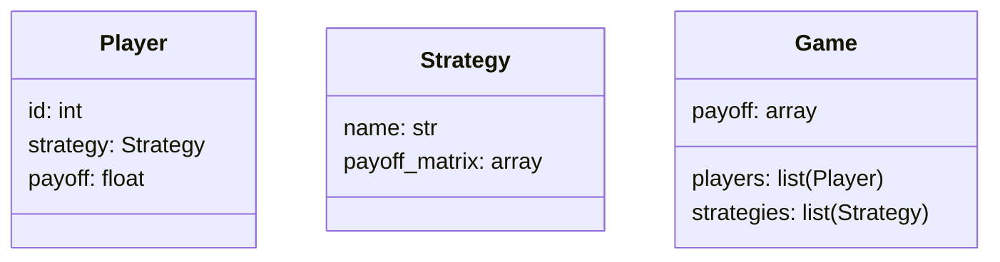
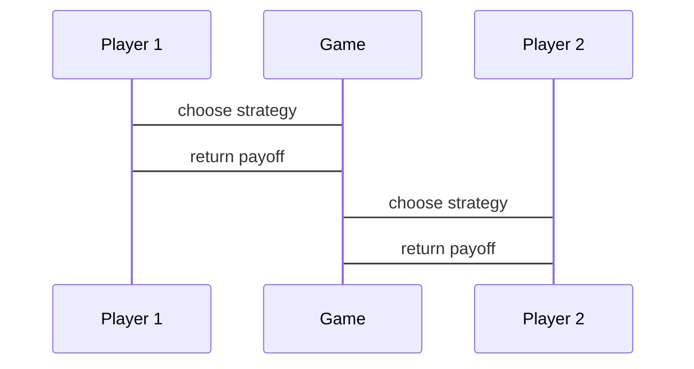

                 


# 智能体间博弈理论在价值投资策略优化中的应用

> 关键词：智能体, 博弈论, 价值投资, 策略优化, 人工智能, 金融建模

> 摘要：智能体间博弈理论是一种基于多智能体相互作用的理论框架，广泛应用于经济学、金融学和计算机科学等领域。本文将深入探讨智能体间博弈理论在价值投资策略优化中的应用，分析其核心原理、算法实现及实际案例，为投资者和研究人员提供理论支持和实践指导。

---

# 第一部分: 智能体间博弈理论与价值投资策略概述

---

## 第1章: 智能体间博弈理论基础

### 1.1 智能体的定义与特征

#### 1.1.1 智能体的基本定义
智能体（Agent）是指能够感知环境并采取行动以实现目标的实体。智能体可以是软件程序、机器人或其他具备自主决策能力的系统。智能体的核心特征包括自主性、反应性、目标导向性和社会性。

#### 1.1.2 智能体的核心特征
1. **自主性**：智能体能够自主决策，无需外部干预。
2. **反应性**：智能体能够根据环境变化实时调整行为。
3. **目标导向性**：智能体的行为以实现特定目标为导向。
4. **社会性**：智能体能够与其他智能体或环境进行交互。

#### 1.1.3 智能体与传统AI的区别
智能体与传统AI的区别在于智能体具备更强的自主性和目标导向性，能够主动与环境交互，而传统AI通常是在预设规则下被动执行任务。

### 1.2 博弈论基础

#### 1.2.1 博弈论的基本概念
博弈论是研究理性主体之间策略互动的理论框架。博弈论的核心要素包括参与者、策略、收益和规则。

#### 1.2.2 博弈的分类与特点
1. **完全信息博弈**：所有参与者都掌握所有相关信息。
2. **不完全信息博弈**：参与者掌握的信息不完全。
3. **零和博弈**：一方的收益等于另一方的损失。
4. **非零和博弈**：收益可以是多方共赢或部分共赢。

#### 1.2.3 智能体间博弈的定义
智能体间博弈是指多个智能体在相互作用中采取策略以最大化自身收益的过程。智能体间博弈可以是合作的、竞争的或对抗的。

### 1.3 智能体间博弈的核心原理

#### 1.3.1 纳什均衡的概念
纳什均衡是指在博弈中，每个参与者都在给定其他参与者策略的情况下采取最优策略，使得没有人能够单方面改变策略而获得更好的收益。

#### 1.3.2 博弈树与博弈图
博弈树是一种树状结构，用于描述博弈的决策过程和可能的结果。博弈图是一种图模型，用于描述博弈中各参与者的策略和收益。

#### 1.3.3 多智能体博弈的挑战
多智能体博弈的挑战包括信息不对称、策略复杂性和计算复杂性。

### 1.4 智能体间博弈的应用场景

#### 1.4.1 金融领域的博弈应用
金融领域中的智能体间博弈可以用于股票交易、资产定价和风险管理。

#### 1.4.2 经济学中的博弈模型
经济学中的博弈模型可以用于解释市场行为、价格形成和资源配置。

#### 1.4.3 智能体间博弈的未来趋势
随着人工智能技术的发展，智能体间博弈在金融、游戏、自动驾驶等领域将得到更广泛的应用。

---

## 第2章: 价值投资策略的基本原理

### 2.1 价值投资的核心理念

#### 2.1.1 价值投资的定义
价值投资是一种以基本面分析为基础的投资策略，旨在通过识别被低估的资产进行投资。

#### 2.1.2 价值投资的基本原则
1. 长期投资：关注长期收益，而非短期波动。
2. 买入低估资产：寻找市场价格低于内在价值的资产。
3. 高质量企业：投资具有强大竞争优势和良好管理的企业。

#### 2.1.3 价值投资的实现路径
1. 基本面分析：分析企业的财务状况、行业地位和竞争优势。
2. 定价模型：使用DCF模型等工具评估资产的内在价值。
3. 投资组合管理：分散投资以降低风险。

### 2.2 价值投资中的博弈因素

#### 2.2.1 市场参与者的博弈关系
市场参与者包括投资者、企业、监管机构等。不同参与者之间的博弈关系影响市场价格和资源配置。

#### 2.2.2 价格形成机制中的博弈
市场价格的形成是多个参与者博弈的结果，包括买方和卖方的互动。

#### 2.2.3 投资者决策的博弈影响
投资者的决策受到其他参与者行为的影响，包括羊群效应和市场情绪。

### 2.3 价值投资中的智能体模型

#### 2.3.1 投资者行为模型
投资者可以被建模为智能体，具备感知市场信息和决策的能力。

#### 2.3.2 市场参与者的智能体构建
构建多个智能体模型，模拟市场参与者的博弈行为。

#### 2.3.3 价值投资策略的智能体表示
将价值投资策略转化为智能体的决策规则，例如寻找低估资产的智能体。

### 2.4 本章小结

---

## 第3章: 智能体间博弈理论与价值投资的结合

### 3.1 博弈论在价值投资中的应用

#### 3.1.1 博弈论在资产定价中的作用
博弈论可以解释市场价格的形成机制，例如通过纳什均衡分析市场的均衡状态。

#### 3.1.2 市场均衡与非均衡状态
市场可以处于均衡或非均衡状态，博弈论可以帮助理解这两种状态的转换。

#### 3.1.3 投资者决策的博弈优化
通过博弈论优化投资者的决策，例如通过纳什均衡找到最优策略。

### 3.2 智能体间博弈对价值投资策略的影响

#### 3.2.1 智能体间博弈对市场效率的影响
智能体间博弈可以提高市场的效率，例如通过竞争降低信息不对称。

#### 3.2.2 投资者收益的博弈影响
智能体间博弈可以影响投资者的收益，例如通过策略互动影响资产价格。

#### 3.2.3 投资者风险的博弈影响
智能体间博弈可以影响投资者的风险，例如通过羊群效应引发市场波动。

### 3.3 智能体间博弈在价值投资中的具体应用

#### 3.3.1 智能体间博弈在股票投资中的应用
通过智能体模拟市场参与者的行为，优化股票投资策略。

#### 3.3.2 智能体间博弈在资产配置中的应用
通过智能体间的博弈优化资产配置，例如分散投资以降低风险。

#### 3.3.3 智能体间博弈在风险管理中的应用
通过智能体间的博弈分析和管理市场风险，例如识别系统性风险。

### 3.4 本章小结

---

## 第4章: 智能体间博弈理论的算法实现

### 4.1 博弈论算法基础

#### 4.1.1 纳什均衡的算法实现
通过算法计算纳什均衡，例如使用极大极小算法求解。

#### 4.1.2 多智能体强化学习
通过多智能体强化学习模拟智能体间的博弈互动。

### 4.2 智能体间博弈的数学模型

#### 4.2.1 博弈树的构建
使用博弈树描述博弈过程，例如构建一个简单的两人博弈树。

#### 4.2.2 纳什均衡的条件
通过数学公式描述纳什均衡的条件，例如：
$$ \text{策略 } s_i \text{ 是纳什均衡的组成部分，当且仅当对所有 } j \neq i, s_i \text{ 是最佳反应。} $$

### 4.3 智能体间博弈的实现代码

#### 4.3.1 Python代码实现
以下是用Python实现的纳什均衡计算代码示例：

```python
import numpy as np

def nash_equilibrium(payoffs):
    players = len(payoffs)
    strategies = len(payoffs[0])
    equilibrium = []
    for i in range(players):
        best_response = []
        for s_i in range(strategies):
            max payoff = -float('inf')
            best_s = -1
            for s_j in range(strategies):
                payoff = payoffs[i][s_i][s_j]
                if payoff > max payoff:
                    max payoff = payoff
                    best_s = s_j
            best_response.append(best_s)
        equilibrium.append(best_response)
    return equilibrium

payoffs = np.array([[[0, 1], [1, 0]], [[0, 1], [1, 0]]])
equilibrium = nash_equilibrium(payoffs)
print(equilibrium)
```

### 4.4 本章小结

---

## 第5章: 智能体间博弈理论的系统架构设计

### 5.1 系统功能设计

#### 5.1.1 领域模型
使用Mermaid类图描述领域模型，例如：



#### 5.1.2 系统架构设计
使用Mermaid架构图描述系统架构，例如：

```mermaid
container Game {
    Player 1
    Player 2
    Strategy 1
    Strategy 2
}
```

### 5.2 系统接口设计

#### 5.2.1 系统交互
使用Mermaid序列图描述系统交互，例如：



### 5.3 系统实现
详细描述系统的实现过程，包括环境配置和核心代码实现。

### 5.4 系统测试
描述系统的测试过程，包括测试用例设计和测试结果分析。

### 5.5 系统优化
提出系统的优化建议，例如算法优化和性能提升。

### 5.6 本章小结

---

## 第6章: 项目实战

### 6.1 项目背景

#### 6.1.1 项目简介
本项目旨在通过智能体间博弈理论优化价值投资策略，实现股票投资的收益最大化。

#### 6.1.2 项目目标
1. 构建智能体模型，模拟市场参与者的行为。
2. 使用博弈论优化投资策略，实现收益最大化。

### 6.2 核心代码实现

#### 6.2.1 环境配置
安装必要的库，例如：

```bash
pip install numpy matplotlib
```

#### 6.2.2 核心代码
以下是实现智能体间博弈的Python代码示例：

```python
import numpy as np
import matplotlib.pyplot as plt

def game_matrix(n_players, strategies):
    payoff = np.zeros((n_players, strategies, strategies))
    for i in range(n_players):
        for s1 in range(strategies):
            for s2 in range(strategies):
                payoff[i][s1][s2] = np.random.rand()
    return payoff

payoffs = game_matrix(2, 2)
print(payoffs)
```

### 6.3 项目实现

#### 6.3.1 系统实现
详细描述系统的实现过程，包括模块划分和代码实现。

#### 6.3.2 系统测试
描述系统的测试过程，包括测试用例设计和测试结果分析。

#### 6.3.3 系统优化
提出系统的优化建议，例如算法优化和性能提升。

### 6.4 案例分析

#### 6.4.1 实际案例分析
分析一个实际案例，例如智能体在股票投资中的应用。

#### 6.4.2 案例分析结果
总结案例分析的结果，例如智能体间博弈对投资收益的影响。

### 6.5 本章小结

---

## 第7章: 总结与展望

### 7.1 本章总结
总结全文的核心内容和主要观点，强调智能体间博弈理论在价值投资中的重要性。

### 7.2 未来展望
展望未来的研究方向，例如更复杂智能体模型的构建和更广泛的应用场景。

### 7.3 最佳实践 tips
给出实际应用中的最佳实践建议，例如如何选择合适的智能体模型和算法。

### 7.4 本章小结

---

# 第二部分: 参考文献

（根据实际需要添加相关文献）

---

# 作者：AI天才研究院/AI Genius Institute & 禅与计算机程序设计艺术 /Zen And The Art of Computer Programming

