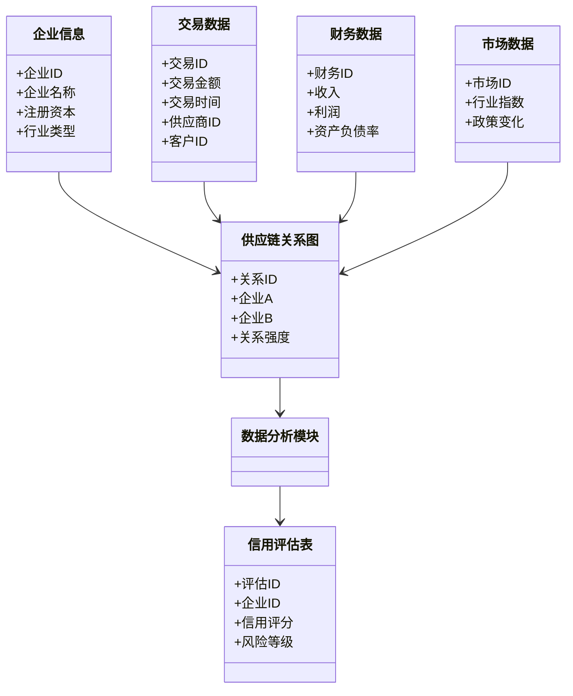
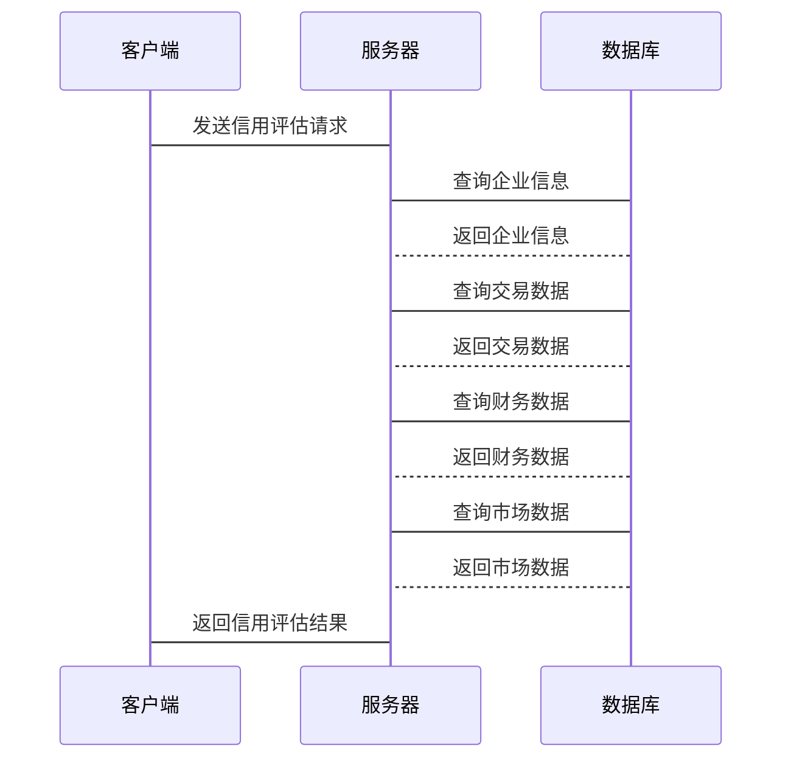

                 


# 智能供应链金融信用评估

---

## 关键词：供应链金融、智能信用评估、人工智能、大数据、机器学习

---

## 摘要

智能供应链金融信用评估是结合人工智能、大数据和机器学习技术，对供应链中的企业信用进行智能化评估和风险控制的过程。本文从供应链金融的基本概念出发，深入分析智能信用评估的核心算法、系统架构和实际应用场景，结合实际案例，详细讲解基于机器学习的信用评估模型的构建与优化方法，最后总结智能供应链金融信用评估的未来发展方向。

---

# 第一部分: 智能供应链金融信用评估概述

## 第1章: 供应链金融的定义与特点

### 1.1 供应链金融的基本概念

供应链金融是指通过整合供应链上下游企业的资金流、信息流和物流，为供应链中的企业提供融资服务的一种金融模式。其核心目标是通过优化资金分配和风险控制，提高供应链整体效率和企业竞争力。

供应链金融的特点包括：

- **资金流**：通过金融工具（如保理、质押贷款等）为企业提供资金支持。
- **信息流**：整合供应链中的交易数据、物流数据和信用数据。
- **物流**：结合物流信息，确保资金流向与实物流动一致。

### 1.2 供应链金融中的信用评估问题

信用评估是供应链金融的核心环节，其目的是通过对企业信用状况的分析，评估其还款能力和违约风险。传统的信用评估方法依赖于财务报表和历史数据，但在供应链环境中，还需考虑企业的上下游关系和供应链整体稳定性。

供应链金融中的信用评估问题包括：

- **数据复杂性**：供应链涉及的企业众多，数据来源多样化。
- **风险传递性**：上游企业的风险可能影响整个供应链。
- **动态性**：供应链中的企业信用状况会随着市场变化而波动。

### 1.3 智能供应链金融的发展背景

智能供应链金融是传统供应链金融与现代信息技术结合的产物。随着人工智能、大数据和区块链等技术的快速发展，供应链金融逐渐向智能化方向转型。

智能供应链金融的发展背景包括：

- **技术驱动**：人工智能和大数据技术为信用评估提供了新的工具和方法。
- **市场需求**：企业对高效、精准的融资服务需求日益增长。
- **政策支持**：政府鼓励供应链金融创新，降低企业融资成本。

---

## 第2章: 智能供应链金融信用评估的核心概念与联系

### 2.1 供应链金融信用评估的核心要素

供应链金融信用评估的核心要素包括：

- **企业基本面**：收入、利润、资产负债率等财务指标。
- **供应链关系**：企业与上下游企业的合作关系。
- **市场环境**：行业周期、政策变化等外部因素。

### 2.2 信用评估模型的原理与特征

信用评估模型是智能供应链金融的核心工具，其原理是通过机器学习算法对供应链中的企业数据进行分析，生成信用评分。

信用评估模型的特征包括：

- **数据驱动**：依赖于供应链中的海量数据。
- **动态调整**：模型能够根据实时数据动态调整评估结果。
- **多维度分析**：综合考虑财务、交易和市场等多方面因素。

### 2.3 ER实体关系图架构（Mermaid流程图）

```mermaid
erDiagram
    actor 企业信息
    actor 交易数据
    actor 财务数据
    actor 市场数据
    database 企业信用评估表
    database 供应链关系图
    boundary 信用评估系统
    boundary 数据分析模块
    boundary 风险控制模块

    企业信息 --> 供应链关系图
    交易数据 --> 供应链关系图
    财务数据 --> 供应链关系图
    市场数据 --> 供应链关系图

    供应链关系图 --> 数据分析模块
    数据分析模块 --> 信用评估表
    信用评估表 --> 风险控制模块
```

---

## 第3章: 基于机器学习的信用评估算法原理

### 3.1 机器学习在信用评估中的应用

机器学习通过分析供应链中的海量数据，能够发现传统方法难以察觉的信用风险。常见的机器学习算法包括：

- **逻辑回归**：用于分类问题，预测企业信用等级。
- **支持向量机（SVM）**：适用于小样本数据的分类。
- **随机森林**：通过集成学习提高模型鲁棒性。

### 3.2 基于机器学习的信用评估模型

#### 3.2.1 模型构建步骤

1. **数据收集**：整合供应链中的交易数据、财务数据和市场数据。
2. **数据预处理**：清洗数据，处理缺失值和异常值。
3. **特征提取**：从数据中提取有助于信用评估的特征。
4. **模型训练**：使用训练数据训练机器学习模型。
5. **模型评估**：通过测试数据验证模型性能。

#### 3.2.2 数据预处理与特征提取

数据预处理是信用评估的关键步骤，主要包括：

- **数据清洗**：去除重复数据和异常值。
- **特征工程**：提取对企业信用有影响的关键特征。

#### 3.2.3 模型训练与评估

模型训练使用训练数据，通过交叉验证评估模型性能。常用的评估指标包括准确率、召回率和F1分数。

### 3.3 算法原理的数学模型与公式

#### 3.3.1 线性回归模型

线性回归用于预测企业的信用评分，其数学公式为：

$$y = \beta_0 + \beta_1x_1 + \beta_2x_2 + \dots + \beta_nx_n + \epsilon$$

其中，$y$ 是信用评分，$x_i$ 是特征变量，$\beta_i$ 是系数，$\epsilon$ 是误差项。

#### 3.3.2 逻辑回归模型

逻辑回归用于分类问题，其概率公式为：

$$P(y=1|x) = \frac{e^{\beta_0 + \beta_1x_1 + \dots + \beta_nx_n}}{1 + e^{\beta_0 + \beta_1x_1 + \dots + \beta_nx_n}}$$

---

## 第4章: 系统分析与架构设计

### 4.1 问题场景介绍

供应链金融信用评估系统需要解决的问题包括：

- 如何高效收集和处理供应链数据。
- 如何构建高性能的信用评估模型。
- 如何实现系统的实时监控和风险预警。

### 4.2 项目介绍

本项目旨在开发一个基于机器学习的智能供应链金融信用评估系统，实现对供应链中企业的信用评估和风险控制。

### 4.3 系统功能设计（领域模型 Mermaid 类图）



### 4.4 系统架构设计（Mermaid 架构图）


### 4.5 系统接口设计和交互（Mermaid 序列图）



---

## 第5章: 项目实战

### 5.1 环境安装

项目实战需要以下环境：

- Python 3.8+
- Scikit-learn
- Pandas
- NumPy
- Matplotlib

### 5.2 系统核心实现源代码

```python
# 环境安装
pip install scikit-learn pandas numpy matplotlib

# 数据预处理
import pandas as pd
import numpy as np
from sklearn.model_selection import train_test_split
from sklearn.preprocessing import StandardScaler
from sklearn.linear_model import LogisticRegression
from sklearn.metrics import accuracy_score, recall_score, f1_score

# 数据加载
data = pd.read_csv('supply_chain_credit.csv')

# 特征选择
features = ['收入', '利润', '资产负债率', '交易频率']
target = '信用评分'

X = data[features]
y = data[target]

# 数据分割
X_train, X_test, y_train, y_test = train_test_split(X, y, test_size=0.2, random_state=42)

# 数据标准化
scaler = StandardScaler()
X_train_scaled = scaler.fit_transform(X_train)
X_test_scaled = scaler.transform(X_test)

# 模型训练
model = LogisticRegression()
model.fit(X_train_scaled, y_train)

# 模型预测
y_pred = model.predict(X_test_scaled)

# 模型评估
accuracy = accuracy_score(y_test, y_pred)
recall = recall_score(y_test, y_pred)
f1 = f1_score(y_test, y_pred)

print(f'准确率: {accuracy}')
print(f'召回率: {recall}')
print(f'F1分数: {f1}')
```

### 5.3 实际案例分析

以一家制造企业为例，分析其信用评估过程：

1. **数据收集**：收集企业的财务数据、交易数据和市场数据。
2. **数据预处理**：清洗数据，提取关键特征。
3. **模型训练**：使用逻辑回归模型训练信用评估模型。
4. **模型预测**：预测企业的信用评分。

---

## 第6章: 最佳实践与未来展望

### 6.1 小结

智能供应链金融信用评估通过结合人工智能和大数据技术，显著提高了信用评估的效率和准确性。本文详细介绍了信用评估的核心概念、算法原理和系统架构，并通过实际案例展示了模型的应用。

### 6.2 注意事项

- 数据质量和完整性是模型性能的关键。
- 模型需要定期更新，以适应市场变化。
- 企业需确保数据安全和隐私保护。

### 6.3 拓展阅读

- 《供应链金融：理论与实践》
- 《机器学习实战》
- 《大数据分析与应用》

---

## 作者：AI天才研究院 & 禅与计算机程序设计艺术

---

**本文由AI天才研究院（AI Genius Institute）与禅与计算机程序设计艺术（Zen And The Art of Computer Programming）联合出品。**

