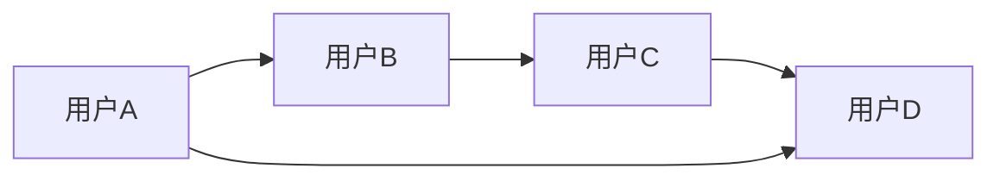
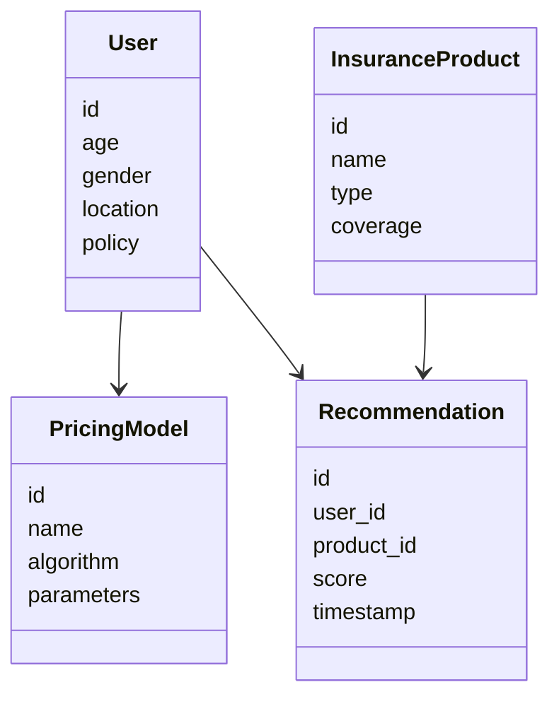
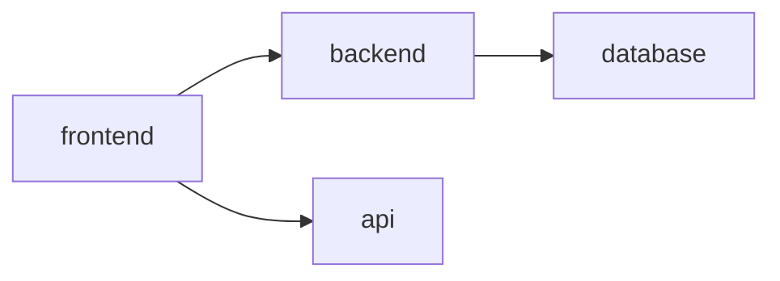

                 


# 智能保险产品个性化定价与推荐引擎

> **关键词**：智能保险，个性化定价，推荐引擎，机器学习，数据分析

> **摘要**：本文深入探讨智能保险产品个性化定价与推荐引擎的设计与实现。通过分析保险行业的现状，阐述个性化定价和推荐引擎的重要性，详细讲解相关核心概念、算法原理、系统架构，并通过项目实战展示实际应用。最后，总结最佳实践和未来发展方向。

---

## 第一部分：背景介绍

### 第1章：保险行业的现状与挑战

#### 1.1 保险行业的现状与发展趋势

保险行业正经历数字化转型的浪潮，传统定价模式依赖历史数据和经验，难以满足个性化需求。随着大数据和人工智能技术的发展，保险公司开始利用数据驱动的方法优化定价策略，提升用户体验和市场竞争力。

#### 1.2 个性化定价与推荐引擎的重要性

个性化定价能够根据用户特征和行为提供精准的价格，推荐引擎通过分析用户需求，推荐合适的产品，从而提高用户满意度和转化率。这两者结合，使保险公司在激烈的市场竞争中脱颖而出。

#### 1.3 智能保险产品定价与推荐引擎的基本概念

智能定价利用机器学习模型分析数据，推荐引擎基于用户行为和数据特征生成个性化推荐。两者结合，实现精准定价和推荐，提升保险产品的市场适应性。

### 第2章：核心概念与联系

#### 2.1 核心概念原理

智能定价依赖机器学习模型，分析用户特征和市场数据，生成个性化价格。推荐引擎通过分析用户行为和产品特征，推荐相关产品。

#### 2.2 概念属性特征对比

| 概念       | 数据驱动 | 模型化 | 个性化 |
|------------|----------|--------|--------|
| 智能定价   | 是       | 是     | 是     |
| 推荐引擎   | 是       | 是     | 是     |

#### 2.3 ER实体关系图

```mermaid
er
    insurance_product (id, name, type, coverage)
    user (id, age, gender, location, policy)
    pricing_model (id, name, algorithm, parameters)
    recommendation (id, user_id, product_id, score, timestamp)
    user-profile (id, user_id, features)
    rule-based (id, name, conditions, actions)
    feedback (id, user_id, product_id, rating, comment)
    transaction (id, user_id, product_id, price, date)
```

---

## 第二部分：算法原理讲解

### 第3章：传统推荐算法

#### 3.1 协同过滤算法

协同过滤基于用户行为相似性推荐产品。步骤包括数据收集、计算相似度、生成推荐。



数学公式：
$$ sim(u, v) = \frac{\sum_{i}(u_i - \bar{u})(v_i - \bar{v})}{\sqrt{\sum_{i}(u_i - \bar{u})^2} \sqrt{\sum_{i}(v_i - \bar{v})^2}} $$

Python实现：
```python
def calculate_similarity(user_matrix):
    # 计算余弦相似度
    pass
```

#### 3.2 聚类分析

聚类分析将用户分为若干群体，基于群体特征推荐产品。常用K-means算法。

### 第4章：基于深度学习的推荐模型

#### 4.1 神经网络模型

深度学习模型如神经网络用于处理复杂特征，生成推荐。结构包括输入层、隐藏层、输出层。

数学公式：
$$ P(y|x) = \sigma(w x + b) $$

#### 4.2 基于序列的推荐

利用用户行为序列预测偏好，使用LSTM或GRU模型。

---

## 第三部分：系统分析与架构设计

### 第5章：系统分析

#### 5.1 问题场景

保险公司收集用户数据，包括年龄、性别、地点、购买记录等，设计推荐系统。

#### 5.2 功能设计

- 用户画像构建：提取特征，如年龄、性别。
- 定价模型：基于特征预测价格。
- 推荐系统：根据用户特征推荐产品。

领域模型类图：


### 第6章：架构设计

#### 6.1 系统架构

前后端架构，数据层、业务逻辑层和表现层。

架构图：


#### 6.2 接口与交互设计

API接口实现用户请求处理和数据返回，使用RESTful风格。

---

## 第四部分：项目实战

### 第7章：数据准备与特征工程

#### 7.1 环境安装

安装Python、Pandas、Scikit-learn、Keras等库。

#### 7.2 数据清洗

处理缺失值和异常值，提取特征，如年龄、性别。

### 第8章：模型训练与推荐系统实现

#### 8.1 模型训练

使用协同过滤或深度学习模型训练定价和推荐模型。

#### 8.2 生成推荐

根据用户特征生成推荐列表，输出结果。

### 第9章：案例分析

分析实际案例，评估模型效果，优化参数。

---

## 第五部分：小结与展望

### 第10章：小结

智能保险产品个性化定价与推荐引擎通过机器学习和深度学习技术，实现精准定价和推荐，提升用户体验和市场竞争力。

### 第11章：注意事项

注意数据隐私保护，定期更新模型，避免过拟合，监控模型性能。

### 第12章：拓展阅读

推荐相关书籍和资源，深入学习个性化推荐和定价技术。

---

**作者：AI天才研究院/AI Genius Institute & 禅与计算机程序设计艺术 /Zen And The Art of Computer Programming**

