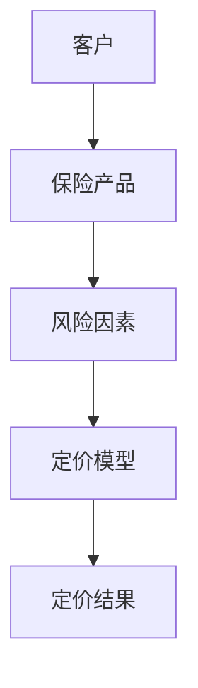
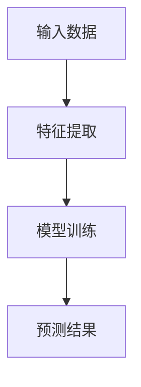
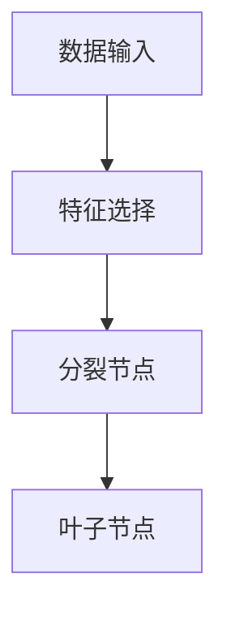
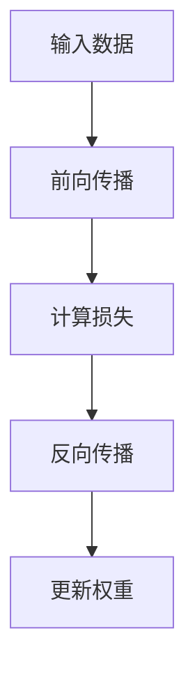
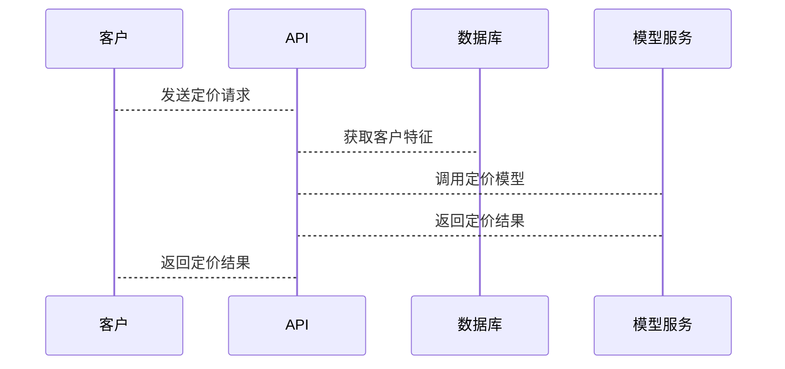

                 


# 智能保险产品定价模型

> **关键词**：智能定价、保险产品、机器学习、定价模型、风险管理

> **摘要**：本文详细探讨了智能保险产品定价模型的构建与应用，从背景介绍到算法原理，再到系统架构设计和项目实战，全面解析了智能定价的核心要素、技术实现和实际案例。文章通过丰富的图表、数学公式和代码示例，为读者提供了一套完整的智能定价解决方案。

---

# 第一部分: 智能保险产品定价模型概述

## 第1章: 智能保险定价的背景与挑战

### 1.1 保险产品定价的基本概念

#### 1.1.1 保险产品的定义与分类

保险产品是保险公司提供的风险保障服务，常见的保险产品包括寿险、财险、健康险等。每种保险产品的定价都需要考虑多个因素，包括风险评估、市场环境、客户特征等。

#### 1.1.2 保险定价的核心要素

保险定价的核心要素包括：
1. **风险因素**：如健康状况、驾驶记录等。
2. **市场因素**：如利率、通货膨胀等。
3. **客户特征**：如年龄、性别、职业等。

#### 1.1.3 传统保险定价的局限性

传统保险定价主要依赖精算师的经验和统计方法，存在以下问题：
- 数据维度有限，难以捕捉复杂风险。
- 定价过程缺乏动态调整能力。
- 个性化定价能力不足。

### 1.2 智能定价的背景与驱动因素

#### 1.2.1 大数据与人工智能的兴起

随着大数据和人工智能技术的发展，保险公司可以利用海量数据和先进算法，构建更精准的定价模型。

#### 1.2.2 保险行业数字化转型的需求

数字化转型是保险行业提升竞争力的重要手段，智能定价是其中的核心环节。

#### 1.2.3 智能定价的潜在价值与应用场景

智能定价能够提高定价效率、降低成本、提升客户体验，应用场景包括车险、健康险、寿险等。

### 1.3 智能保险定价的核心问题

#### 1.3.1 数据驱动的定价挑战

如何从海量数据中提取有效特征是智能定价的关键。

#### 1.3.2 模型复杂性与可解释性

复杂的模型可能难以解释定价结果，影响监管合规。

#### 1.3.3 个性化定价与风险控制的平衡

个性化定价需要在客户细分和风险控制之间找到平衡点。

---

## 第2章: 智能保险定价模型的核心概念

### 2.1 智能定价模型的构成要素

#### 2.1.1 数据源与特征工程

数据源包括客户数据、 claims 数据、市场数据等。特征工程需要对数据进行清洗、转换和特征选择。

#### 2.1.2 模型算法与训练方法

常用的算法包括线性回归、决策树、神经网络等。

#### 2.1.3 评估指标与优化目标

评估指标包括均方误差（MSE）、R平方值等，优化目标是提高模型预测准确性和可解释性。

### 2.2 智能定价模型的关键属性

#### 2.2.1 数据驱动性

智能定价依赖于大数据分析，能够捕捉传统方法难以发现的模式。

#### 2.2.2 可解释性

模型需要能够解释定价结果，满足监管要求。

#### 2.2.3 实时性与动态调整能力

智能定价模型能够实时调整定价策略，适应市场变化。

### 2.3 智能定价模型的实体关系图



---

# 第二部分: 智能保险定价模型的算法原理

## 第3章: 常见定价算法及其原理

### 3.1 线性回归模型

#### 3.1.1 线性回归的数学模型

$$ y = \beta_0 + \beta_1x_1 + \beta_2x_2 + \dots + \beta_nx_n + \epsilon $$

#### 3.1.2 算法流程图



### 3.2 决策树模型

#### 3.2.1 ID3/C4.5算法原理

决策树通过特征选择构建树状结构，用于分类或回归。

#### 3.2.2 决策树构建流程图



### 3.3 神经网络模型

#### 3.3.1 神经网络的数学模型

神经网络通过多层感知机（MLP）实现非线性回归。

#### 3.3.2 神经网络训练流程图



### 3.4 随机森林模型

#### 3.4.1 随机森林的原理

随机森林通过集成多个决策树模型，提高预测准确性和稳定性。

---

## 第4章: 基于机器学习的定价模型实现

### 4.1 环境配置

```python
import pandas as pd
import numpy as np
from sklearn.model_selection import train_test_split
from sklearn.linear_model import LinearRegression
from sklearn.metrics import mean_squared_error
```

### 4.2 数据预处理

```python
# 数据加载
data = pd.read_csv('insurance.csv')

# 特征提取
X = data[['age', 'sex', 'bmi', 'children', 'smoker', 'region']]
y = data['charges']

# 数据划分
X_train, X_test, y_train, y_test = train_test_split(X, y, test_size=0.2, random_state=42)
```

### 4.3 模型训练

```python
# 线性回归模型训练
model = LinearRegression()
model.fit(X_train, y_train)

# 模型预测
y_pred = model.predict(X_test)

# 模型评估
mse = mean_squared_error(y_test, y_pred)
print(f'均方误差: {mse}')
```

### 4.4 模型优化

通过超参数调优和特征选择，进一步优化模型性能。

### 4.5 模型解释

使用 SHAP 或 LIME 等工具，解释模型的定价结果。

---

## 第5章: 系统架构设计

### 5.1 问题场景介绍

构建一个实时智能定价系统，支持保险公司快速调整定价策略。

### 5.2 系统功能设计

#### 5.2.1 领域模型图

```mermaid
classDiagram
    class 客户 {
        id
        基本信息
        风险评估
    }
    class 保险产品 {
        产品ID
        保费
        风险类型
    }
    class 定价模型 {
        输入特征
        模型参数
        输出结果
    }
    customer -> insurance_product: 购买
    insurance_product -> pricing_model: 生成保费
```

### 5.3 系统架构设计


### 5.4 接口设计

- **API 接口**：`POST /api/pricing`，接收客户特征，返回定价结果。
- **数据接口**：`GET /data/charges`，获取保费数据。

### 5.5 交互流程图



---

## 第6章: 项目实战

### 6.1 车险定价案例

#### 6.1.1 数据准备

```python
# 数据加载
data = pd.read_csv('car_insurance.csv')

# 特征工程
X = data[['age', 'driving_experience', 'accidents', 'Vehicle_type']]
y = data['premium']
```

#### 6.1.2 模型实现

```python
# 训练模型
model = LinearRegression()
model.fit(X_train, y_train)

# 预测结果
y_pred = model.predict(X_test)
```

#### 6.1.3 结果分析

比较真实保费和预测保费，评估模型性能。

### 6.2 模型优化与部署

通过超参数调优和模型部署，实现线上实时定价。

---

## 第7章: 最佳实践与小结

### 7.1 最佳实践 tips

- 数据预处理是关键，特征选择和数据清洗直接影响模型性能。
- 模型解释性是监管合规的重要因素。
- 定价策略需要结合业务场景，避免过度依赖算法。

### 7.2 小结

智能保险定价模型通过大数据和机器学习技术，显著提升了定价的准确性和效率，为保险公司带来了新的竞争优势。

### 7.3 注意事项

- 数据隐私和安全是重中之重。
- 模型需要定期更新，适应市场变化。
- 跨领域合作是成功的关键。

### 7.4 拓展阅读

推荐阅读《机器学习实战》和《精算学基础》，深入了解相关知识。

---

# 作者信息

作者：AI天才研究院/AI Genius Institute & 禅与计算机程序设计艺术 /Zen And The Art of Computer Programming

