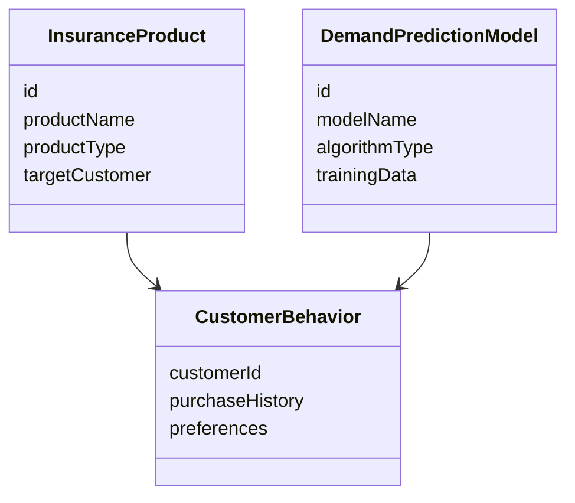
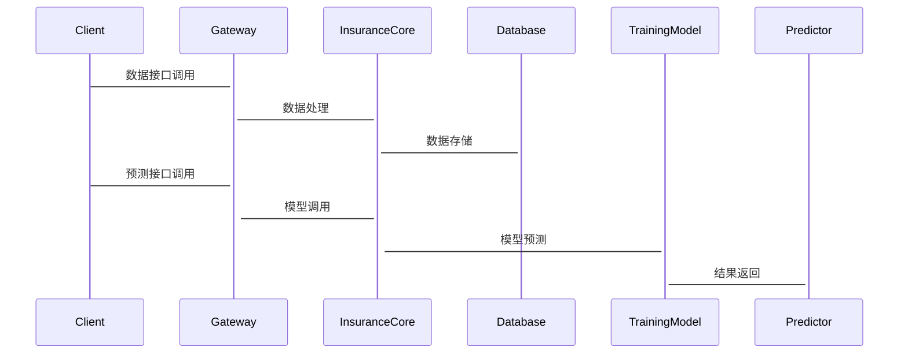

                 


# 智能保险产品需求预测模型优化

> 关键词：保险需求预测、机器学习、模型优化、深度学习、智能保险

> 摘要：本文详细探讨了智能保险产品需求预测模型的优化方法，涵盖数据特征分析、算法原理、系统架构设计、项目实战及最佳实践等内容，旨在为保险行业提供高效的预测解决方案。

---

## 第1章: 智能保险产品需求预测模型概述

### 1.1 保险行业的数字化转型

#### 1.1.1 保险行业的现状与挑战
保险行业正面临数字化转型的挑战，传统业务模式逐渐被数据驱动的智能服务取代。客户需求多样化、市场竞争加剧以及政策监管趋严，促使保险公司寻求更高效的运营方式。

#### 1.1.2 数字化转型的必要性
通过数字化转型，保险公司可以实现客户行为分析、精准营销和风险控制，提升运营效率和客户满意度。

#### 1.1.3 智能保险产品的概念与特点
智能保险产品利用AI技术，根据客户需求动态调整产品设计和定价，具有个性化、实时性和数据驱动等特点。

### 1.2 需求预测的重要性

#### 1.2.1 需求预测在保险业务中的作用
准确的需求预测帮助保险公司合理分配资源、优化产品组合，降低运营成本。

#### 1.2.2 智能需求预测的核心价值
通过分析历史数据和市场趋势，智能模型能够预测未来需求，提升决策的科学性和准确性。

#### 1.2.3 需求预测的边界与外延
需求预测的边界包括数据质量和模型准确性，外延则涉及客户行为分析和市场趋势预测。

### 1.3 模型优化的目标与意义

#### 1.3.1 模型优化的目标
优化模型性能，提升预测准确性和稳定性，降低预测误差。

#### 1.3.2 模型优化的意义
通过优化，模型能够更好地适应市场变化，提供更精准的预测结果。

#### 1.3.3 优化与实际业务的结合
将优化后的模型应用于实际业务，提升保险产品的市场适应性和客户满意度。

### 1.4 本章小结
本章介绍了保险行业的数字化转型趋势，分析了需求预测的重要性和优化目标，为后续模型优化奠定了基础。

---

## 第2章: 智能保险产品需求预测的核心概念

### 2.1 数据特征与需求预测

#### 2.1.1 数据特征的分类
数据特征分为客户特征、产品特征和市场特征三类，每类特征对需求预测的影响不同。

#### 2.1.2 数据特征对需求预测的影响
客户年龄、性别、收入等特征影响购买决策，产品类型和市场竞争状况也影响需求预测。

#### 2.1.3 数据预处理方法
数据清洗、特征提取和数据标准化是常用的数据预处理步骤，确保数据质量。

### 2.2 模型优化的关键要素

#### 2.2.1 模型选择的原则
选择适合业务需求的模型，评估模型性能，选择最优模型。

#### 2.2.2 优化算法的核心要素
包括算法选择、参数调优和性能评估，确保模型优化效果。

#### 2.2.3 模型评估指标
准确率、召回率和F1值是常用的评估指标，帮助判断模型性能。

### 2.3 核心概念的ER实体关系图

```mermaid
er
    InsuranceProduct {
        id
        productName
        productType
        targetCustomer
    }
    DemandPredictionModel {
        id
        modelName
        algorithmType
        trainingData
    }
    CustomerBehavior {
        customerId
        purchaseHistory
        preferences
    }
    modelassociation
```

### 2.4 本章小结
本章详细讲解了数据特征和模型优化的关键要素，并通过ER图展示了数据关系，为后续算法设计奠定基础。

---

## 第3章: 需求预测模型的算法原理

### 3.1 常见的预测算法

#### 3.1.1 线性回归

##### 3.1.1.1 线性回归的原理
线性回归通过最小化预测值与实际值的平方差，建立变量之间的线性关系。

##### 3.1.1.2 线性回归的数学公式
$$ y = \beta_0 + \beta_1x + \epsilon $$

##### 3.1.1.3 线性回归的流程图


##### 3.1.1.4 Python实现示例
```python
import numpy as np
from sklearn.linear_model import LinearRegression

X = np.array([[1], [2], [3], [4]])
y = np.array([2, 4, 5, 4])
model = LinearRegression()
model.fit(X, y)
print(model.predict([[5]]))
```

#### 3.1.2 随机森林

##### 3.1.2.1 随机森林的原理
随机森林通过构建多个决策树并行集成，提高预测准确性和鲁棒性。

##### 3.1.2.2 随机森林的流程图


##### 3.1.2.3 Python实现示例
```python
from sklearn.ensemble import RandomForestRegressor

X = np.array([[1, 2], [3, 4], [5, 6]])
y = np.array([3, 5, 7])
model = RandomForestRegressor(n_estimators=100)
model.fit(X, y)
print(model.predict([[7, 8]]))
```

### 3.2 深度学习模型

#### 3.2.1 神经网络

##### 3.2.1.1 神经网络的原理
神经网络通过多层感知机模拟人脑神经网络，学习数据的非线性关系。

##### 3.2.1.2 神经网络的数学公式
$$ y = \sigma(wx + b) $$

##### 3.2.1.3 神经网络的流程图


##### 3.2.1.4 Python实现示例
```python
import tensorflow as tf
import numpy as np

X = np.array([[0.0], [1.0], [2.0], [3.0]])
y = np.array([[0.0], [1.0], [2.0], [3.0]])

model = tf.keras.Sequential([
    tf.keras.layers.Dense(64, activation='relu'),
    tf.keras.layers.Dense(1)
])
model.compile(optimizer='adam', loss='mean_squared_error')
model.fit(X, y, epochs=100)
print(model.predict([[4.0]]))
```

### 3.3 本章小结
本章介绍了线性回归、随机森林和神经网络的算法原理，并通过流程图和代码示例展示了其实现过程，为后续系统设计提供理论基础。

---

## 第4章: 系统分析与架构设计方案

### 4.1 问题场景介绍
保险产品需求预测系统需要处理大量数据，实时预测需求，支持决策。

### 4.2 项目介绍
系统目标是构建智能预测模型，提高需求预测的准确性。

### 4.3 系统功能设计

#### 4.3.1 领域模型类图


### 4.4 系统架构设计

#### 4.4.1 系统架构图
```mermaid
archi
    Client --middle--> Gateway --middle--> InsuranceCore
    Gateway --middle--> Database
    Database --> TrainingModel
    TrainingModel --> Predictor
```

### 4.5 系统接口设计

#### 4.5.1 API接口
提供数据接口和预测接口，便于系统集成。

#### 4.5.2 接口设计图


### 4.6 本章小结
本章通过系统架构设计和接口设计，展示了智能保险产品需求预测系统的整体结构和交互流程。

---

## 第5章: 项目实战

### 5.1 环境安装
安装Python、TensorFlow、Scikit-learn等工具，搭建开发环境。

### 5.2 系统核心实现

#### 5.2.1 数据采集与处理
使用爬虫采集数据，清洗和预处理，提取特征。

#### 5.2.2 模型训练与优化
训练随机森林模型，调参优化，评估模型性能。

#### 5.2.3 模型部署与测试
部署模型到云平台，测试预测结果，收集反馈。

### 5.3 代码实现示例

#### 5.3.1 数据处理
```python
import pandas as pd
data = pd.read_csv('insurance_data.csv')
data_processed = data.dropna()
```

#### 5.3.2 模型训练
```python
from sklearn.ensemble import RandomForestRegressor
model = RandomForestRegressor(n_estimators=100)
model.fit(X_train, y_train)
```

#### 5.3.3 模型评估
```python
from sklearn.metrics import mean_squared_error
print(mean_squared_error(y_test, model.predict(X_test)))
```

### 5.4 实际案例分析
通过具体案例分析模型表现，调整参数，优化模型。

### 5.5 项目总结
总结项目成果，分析优化效果，提出改进建议。

### 5.6 本章小结
本章通过实际项目，展示了智能保险产品需求预测模型的实现过程和优化策略。

---

## 第6章: 最佳实践与小结

### 6.1 优化策略

#### 6.1.1 数据处理
确保数据质量，合理选择特征，避免维度灾难。

#### 6.1.2 模型选择
根据业务需求选择合适的模型，合理设置参数。

#### 6.1.3 模型评估
使用多种指标评估模型性能，确保结果准确。

### 6.2 注意事项

#### 6.2.1 数据隐私
确保数据处理符合隐私保护法规。

#### 6.2.2 模型泛化
避免过拟合，确保模型泛化能力。

#### 6.2.3 模型更新
定期更新模型，适应市场变化。

### 6.3 未来趋势
AI技术进步和大数据应用将进一步推动保险行业智能化发展。

### 6.4 本章小结
本章总结了优化策略和注意事项，展望了未来发展趋势。

---

## 第7章: 总结与展望

### 7.1 本文总结
本文详细探讨了智能保险产品需求预测模型的优化方法，涵盖数据处理、算法选择和系统设计。

### 7.2 未来展望
随着技术进步，预测模型将更加智能化和个性化，为保险行业带来更多创新。

---

## 作者：AI天才研究院/AI Genius Institute & 禅与计算机程序设计艺术 /Zen And The Art of Computer Programming

