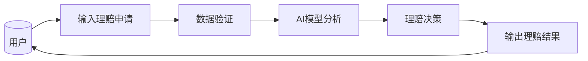
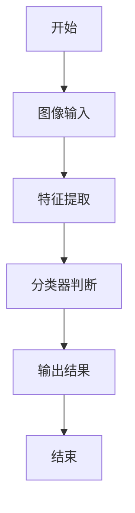
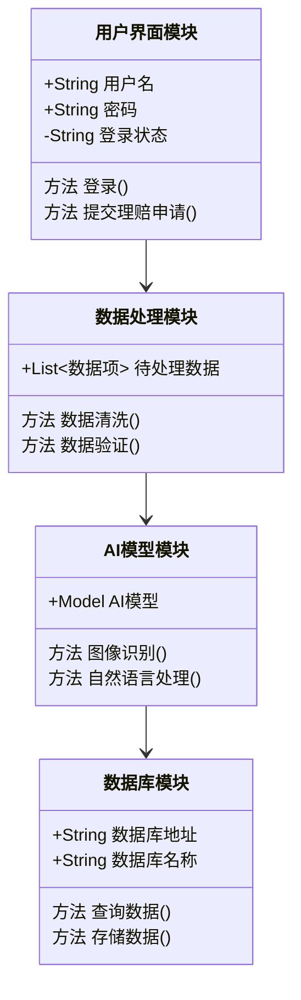

                 


# 智能保险理赔快速处理系统

> 关键词：智能保险、快速理赔、AI技术、系统架构、算法实现

> 摘要：智能保险理赔快速处理系统是一种基于人工智能技术的创新解决方案，旨在通过自动化和智能化的方式简化保险理赔流程，提高效率，降低成本，并提升用户体验。本文将从背景、核心概念、算法原理、系统架构设计、项目实战等多个方面详细阐述智能保险理赔快速处理系统的实现与应用。

---

## 第二章: 保险理赔数据流与系统模块

### 2.1 保险理赔数据流

保险理赔数据流是指从用户提交理赔申请到理赔结果处理完成的整个数据流动过程。理解这一流程对于设计智能保险理赔系统至关重要。

#### 2.1.1 数据流的定义

数据流是系统中数据流动的方向和方式的抽象表示。在保险理赔场景中，数据流从用户开始，经过多个系统模块的处理，最终到达理赔结果。

#### 2.1.2 数据流的分类

数据流可以分为以下几种类型：

- **用户输入数据流**：用户提交的理赔申请信息，如保单号、事故描述等。
- **系统处理数据流**：系统内部处理数据的过程，包括数据验证、AI模型分析等。
- **输出数据流**：系统处理完成后返回给用户的结果，如理赔金额、处理状态等。

#### 2.1.3 数据流的可视化

通过数据流图可以直观地展示数据在系统中的流动过程。以下是一个简单的数据流图示例：



---

### 2.2 系统模块划分

智能保险理赔系统可以划分为以下几个主要模块：

#### 2.2.1 用户界面模块

用户界面模块是用户与系统交互的前端部分，负责接收用户的理赔申请和展示处理结果。

- **功能**：用户登录、提交理赔申请、查看处理进度、接收结果通知。
- **设计**：采用响应式设计，确保在不同设备上都能良好显示。

#### 2.2.2 数据处理模块

数据处理模块负责对用户提交的理赔申请进行预处理和验证。

- **功能**：数据清洗、格式转换、数据验证。
- **设计**：使用队列机制处理大量数据，确保高并发场景下的性能。

#### 2.2.3 AI模型模块

AI模型模块是系统的核心部分，负责通过AI技术对理赔申请进行智能分析和决策。

- **功能**：图像识别、自然语言处理、风险评估。
- **设计**：采用微服务架构，支持模型的动态加载和更新。

#### 2.2.4 数据库模块

数据库模块用于存储和管理所有相关的理赔数据。

- **功能**：数据存储、数据查询、数据备份。
- **设计**：使用关系型数据库和非关系型数据库的结合，确保数据的高效存储和快速检索。

---

## 第三章: AI算法在保险理赔中的应用

### 3.1 常见AI算法概述

在智能保险理赔系统中，常用的AI算法包括图像识别、自然语言处理和机器学习等。

#### 3.1.1 图像识别算法

图像识别算法用于处理用户提交的理赔相关图片，如事故现场照片、损坏程度等。

- **算法**：使用卷积神经网络（CNN）进行图像分类和目标检测。
- **应用**：自动识别事故类型、评估损坏程度。

#### 3.1.2 自然语言处理算法

自然语言处理算法用于理解和分析用户提交的文本信息，如事故描述、理赔申请内容等。

- **算法**：使用循环神经网络（RNN）或Transformer模型进行文本分类和实体识别。
- **应用**：自动提取关键信息、识别欺诈行为。

#### 3.1.3 机器学习算法

机器学习算法用于预测理赔风险和评估理赔金额。

- **算法**：使用随机森林、支持向量机（SVM）等监督学习算法进行分类和回归任务。
- **应用**：预测理赔概率、评估理赔金额。

---

### 3.2 算法原理与流程图

#### 3.2.1 图像识别流程

以下是图像识别算法的流程图：



特征提取阶段通常使用卷积神经网络（CNN）来提取图像的高层次特征，分类器则使用训练好的模型进行分类。

---

## 第四章: 系统架构设计

### 4.1 系统功能设计

智能保险理赔系统的功能设计如下：

- **用户模块**：用户注册、登录、提交理赔申请。
- **数据处理模块**：数据清洗、格式转换、数据验证。
- **AI模型模块**：图像识别、自然语言处理、风险评估。
- **数据库模块**：数据存储、查询、备份。

---

### 4.2 系统架构设计

以下是系统架构设计的类图：



---

## 第五章: 项目实战

### 5.1 环境安装

为了运行智能保险理赔系统，需要以下环境：

- **Python**：3.8及以上版本
- **TensorFlow**：2.0及以上版本
- **Pillow**：图像处理库
- **Flask**：Web框架

安装命令：

```bash
pip install python>=3.8
pip install tensorflow>=2.0
pip install pillow
pip install flask
```

---

### 5.2 系统核心实现

以下是AI模型模块的实现代码：

```python
import tensorflow as tf
from tensorflow.keras.models import Model
from tensorflow.keras.layers import Input, Dense, Conv2D, MaxPooling2D, Flatten

# 定义模型
input_layer = Input(shape=(64, 64, 3))
conv1 = Conv2D(32, (3, 3), activation='relu')(input_layer)
pool1 = MaxPooling2D(pool_size=(2, 2))(conv1)
conv2 = Conv2D(64, (3, 3), activation='relu')(pool1)
pool2 = MaxPooling2D(pool_size=(2, 2))(conv2)
flatten = Flatten()(pool2)
dense1 = Dense(128, activation='relu')(flatten)
output_layer = Dense(1, activation='sigmoid')(dense1)

model = Model(inputs=input_layer, outputs=output_layer)
model.compile(optimizer='adam', loss='binary_crossentropy', metrics=['accuracy'])
```

---

## 第六章: 总结与展望

### 6.1 总结

智能保险理赔快速处理系统通过AI技术的引入，显著提高了理赔效率和准确性，降低了人工成本，并提升了用户体验。本文详细介绍了系统的背景、核心概念、算法实现、系统架构设计以及项目实战。

### 6.2 展望

未来，随着AI技术的不断进步，智能保险理赔系统将更加智能化和自动化。可能的发展方向包括：

- 更加复杂的AI模型，如深度学习模型的优化和改进。
- 结合区块链技术，确保理赔数据的安全和透明。
- 实时处理能力的提升，进一步缩短理赔处理时间。

---

## 作者

作者：AI天才研究院/AI Genius Institute  
禅与计算机程序设计艺术 / Zen And The Art of Computer Programming

---

通过以上内容，我们可以看到智能保险理赔快速处理系统在理论和实践中的重要性。希望本文能为读者提供有价值的技术参考和实践指导。

