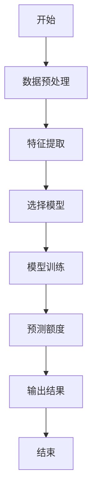
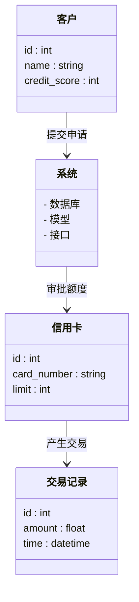
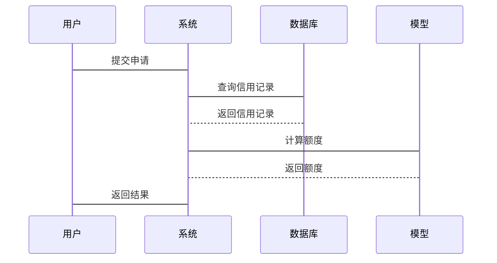

                 


# 智能信用卡额度管理优化系统

## 关键词：智能信用卡、额度管理、人工智能、优化系统、风险管理、数据分析

## 摘要：智能信用卡额度管理优化系统利用人工智能技术，通过数据分析和智能算法，优化信用卡额度的分配和管理，降低风险，提高收益。本文将详细介绍该系统的背景、核心概念、算法原理、系统架构、项目实战及最佳实践。

---

# 第1章: 智能信用卡额度管理优化系统概述

## 1.1 问题背景与挑战

### 1.1.1 传统信用卡额度管理的痛点
传统信用卡额度管理依赖人工审批，效率低、风险高，且客户体验差。银行难以实时掌握客户的信用状况，导致额度分配不合理。

### 1.1.2 数据驱动的智能额度管理需求
随着大数据和人工智能的发展，智能信用卡额度管理成为可能。通过分析海量数据，实时调整额度，提升审批效率和风险控制能力。

### 1.1.3 优化额度管理的业务价值
智能额度管理可降低坏账率，提升客户满意度，提高银行收益。通过精准额度分配，优化资源配置，增强客户忠诚度。

## 1.2 问题描述与目标

### 1.2.1 信用卡额度管理的核心问题
如何在海量数据中快速、准确地评估客户信用风险，合理分配额度。

### 1.2.2 智能优化的目标与边界
目标：优化额度分配，降低风险，提高收益。
边界：仅限于信用卡额度管理，不涉及其他业务。

### 1.2.3 系统实现的核心要素
数据来源：客户信息、交易记录、信用评分。
算法选择：机器学习模型，如梯度提升树。
系统架构：前端交互、后端处理、数据库存储。

## 1.3 核心概念与系统架构

### 1.3.1 数据驱动的智能决策模型
通过分析客户数据，建立数学模型，预测信用风险，指导额度分配。

### 1.3.2 系统功能模块划分
- 数据采集模块：收集客户数据。
- 数据处理模块：清洗和预处理数据。
- 模型训练模块：训练机器学习模型。
- 额度计算模块：根据模型结果计算额度。
- 系统交互模块：与用户和银行系统交互。

### 1.3.3 系统架构的初步设想
- 前端：用户界面，展示额度计算结果。
- 后端：处理逻辑，调用模型计算。
- 数据库：存储客户数据和交易记录。

---

# 第2章: 智能信用卡额度管理的核心概念与联系

## 2.1 核心概念原理

### 2.1.1 数据来源与特征提取
数据来源包括客户信息、交易记录、信用评分等。特征提取涉及客户年龄、收入、信用历史等变量。

### 2.1.2 智能算法与模型选择
选择梯度提升树模型，适合处理分类和回归问题，能有效处理非线性关系。

### 2.1.3 额度优化的数学模型
模型目标：最大化收益，最小化风险。损失函数：平方损失、对数损失。

## 2.2 核心概念属性特征对比

| 概念       | 属性       | 特征                       |
|------------|------------|---------------------------|
| 数据源     | 类型       | 结构化数据、非结构化数据   |
| 模型       | 方法       | 机器学习、深度学习         |
| 额度优化   | 目标       | 最大化收益、最小化风险     |

## 2.3 ER实体关系图

```mermaid
erDiagram
    customer[客户] {
        id : int
        name : string
        credit_score : int
    }
    card[信用卡] {
        id : int
        card_number : string
        limit : int
    }
    transaction[交易记录] {
        id : int
        amount : float
        time : datetime
    }
    customer --> card : 拥有
    card --> transaction : 产生
```

---

## 2.4 算法流程图



## 2.5 算法代码实现

```python
import pandas as pd
from sklearn.model_selection import train_test_split
from sklearn.ensemble import GradientBoostingRegressor
from sklearn.metrics import mean_squared_error

# 数据加载
data = pd.read_csv('credit_data.csv')

# 特征选择
features = data[['age', 'income', 'credit_score', 'transaction_amount']]
target = data['target']

# 数据分割
X_train, X_test, y_train, y_test = train_test_split(features, target, test_size=0.2, random_state=42)

# 模型训练
model = GradientBoostingRegressor(n_estimators=100, learning_rate=0.1, max_depth=3)
model.fit(X_train, y_train)

# 预测
y_pred = model.predict(X_test)

# 评估
mse = mean_squared_error(y_test, y_pred)
print(f"均方误差: {mse}")
```

---

## 2.6 算法数学模型

模型目标：最小化损失函数。损失函数：平方损失，公式为：

$$
L = \frac{1}{2n} \sum_{i=1}^{n} (y_i - \hat{y_i})^2
$$

分裂条件：使用最小二乘法，分裂条件公式为：

$$
\text{分裂条件} = \min\left( \frac{1}{n}\sum (y_i - \hat{y_i})^2 \right)
$$

---

# 第3章: 系统分析与架构设计方案

## 3.1 问题场景介绍
描述用户申请信用卡，系统自动评估信用风险，实时调整额度的过程。

## 3.2 系统功能设计

### 3.2.1 领域模型



---

## 3.3 系统架构设计

### 3.3.1 系统架构图


---

## 3.4 系统接口设计

### 3.4.1 API接口

```http
POST /api/v1/credit/apply
{
    "name": "张三",
    "age": 30,
    "income": 60000,
    "credit_score": 700
}
```

### 3.4.2 序列图



---

# 第4章: 项目实战

## 4.1 环境安装

- Python 3.8+
- Jupyter Notebook
- Scikit-learn、Pandas等库

## 4.2 核心代码实现

```python
import pandas as pd
from sklearn.ensemble import GradientBoostingRegressor
from sklearn.metrics import mean_squared_error

# 数据加载
data = pd.read_csv('credit_data.csv')

# 特征选择
features = data[['age', 'income', 'credit_score', 'transaction_amount']]
target = data['target']

# 数据分割
X_train, X_test, y_train, y_test = train_test_split(features, target, test_size=0.2, random_state=42)

# 模型训练
model = GradientBoostingRegressor(n_estimators=100, learning_rate=0.1, max_depth=3)
model.fit(X_train, y_train)

# 预测
y_pred = model.predict(X_test)

# 评估
mse = mean_squared_error(y_test, y_pred)
print(f"均方误差: {mse}")
```

---

## 4.3 案例分析

分析一个客户的数据，预测其额度，展示模型的预测结果和实际结果的对比。

---

## 4.4 项目小结

总结项目实现的过程，强调智能信用卡额度管理的优势，如提高审批效率、降低风险。

---

# 第5章: 总结与展望

## 5.1 最佳实践 Tips

- 数据质量至关重要，需清洗和预处理。
- 模型选择要根据实际业务需求。
- 系统要具备实时处理能力。

## 5.2 小结

智能信用卡额度管理优化系统通过人工智能技术，显著提升了信用卡额度管理的效率和准确性。

## 5.3 注意事项

- 数据隐私保护
- 系统稳定性
- 模型解释性

## 5.4 拓展阅读

推荐学习机器学习、数据挖掘、风险管理等领域的书籍和资源。

---

# 作者：AI天才研究院 & 禅与计算机程序设计艺术

