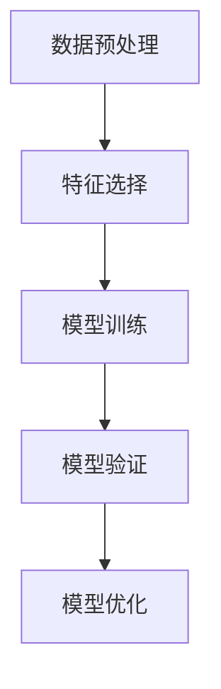
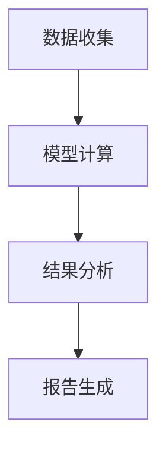
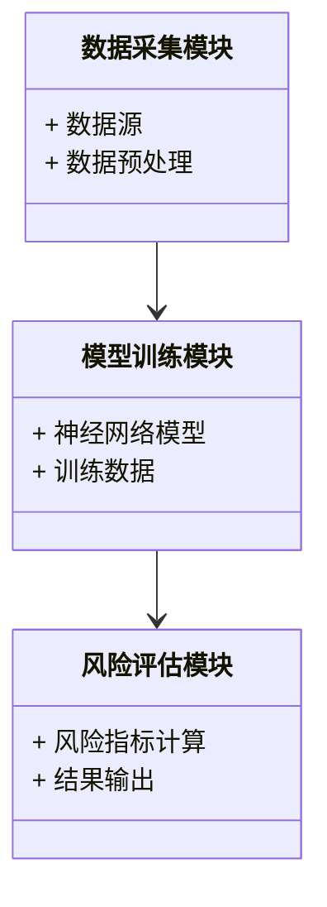

                 


---

# 智能信用违约互换定价模型校准与风险评估

> **关键词**：信用违约互换、智能定价模型、模型校准、风险评估、机器学习、金融衍生品

> **摘要**：本文深入探讨了智能信用违约互换定价模型的校准与风险评估方法。通过分析传统模型的局限性，引入智能模型的优势，结合机器学习算法，详细阐述了模型的数学基础、校准流程、风险评估策略以及系统架构设计。文章通过实际案例和代码实现，为读者提供了从理论到实践的全面指导。

---

## 目录大纲

1. **智能信用违约互换定价模型的背景与意义**
   1.1 信用违约互换（CDS）的定义与特点
   1.2 智能信用违约互换定价模型的背景
   1.3 模型校准与风险评估的重要性

2. **信用违约互换定价模型的数学基础**
   2.1 信用风险的基本概念
   2.2 信用违约互换定价的数学模型
   2.3 智能模型的数学基础

3. **智能信用违约互换定价模型的校准方法**
   3.1 模型校准的理论基础
   3.2 基于机器学习的校准算法
   3.3 校准流程与实现

4. **智能信用违约互换定价模型的风险评估**
   4.1 风险评估的核心指标
   4.2 基于智能模型的风险评估方法
   4.3 风险评估的流程与案例

5. **智能信用违约互换定价模型的系统架构与实现**
   5.1 系统功能设计
   5.2 系统架构设计
   5.3 系统接口设计

6. **智能信用违约互换定价模型的项目实战**
   6.1 项目背景与目标
   6.2 核心代码实现
   6.3 项目总结与经验分享

7. **智能信用违约互换定价模型的最佳实践与小结**
   7.1 模型应用中的注意事项
   7.2 模型优化与未来研究方向

---

## 正文

### 1. 智能信用违约互换定价模型的背景与意义

#### 1.1 信用违约互换（CDS）的定义与特点

信用违约互换（Credit Default Swap，CDS）是一种金融衍生品，用于对冲债券违约风险。其核心机制是买方支付固定费用，卖方在买方债券违约时进行赔付。CDS的市场规模庞大，且在信用风险管理中扮演重要角色。

**特点**：
- **标准化**：CDS通常基于标准化的债券或贷款。
- **流动性**：提供了一种便捷的信用风险转移工具。
- **复杂性**：涉及多种风险因素，如信用风险、市场风险等。

#### 1.2 智能信用违约互换定价模型的背景

传统CDS定价模型依赖于历史数据和假设条件，存在以下局限性：
- **数据依赖性**：需要大量历史数据支持。
- **假设限制**：假设市场无套利、资产价格独立等。
- **动态变化**：金融市场波动大，模型难以实时调整。

智能模型引入机器学习和人工智能技术，能够实时捕捉市场变化，提高定价精度。

#### 1.3 模型校准与风险评估的重要性

校准是确保模型准确反映市场的真实情况，而风险评估则是量化模型的潜在损失。两者结合，能够提升CDS的交易效率和风险管理能力。

---

### 2. 信用违约互换定价模型的数学基础

#### 2.1 信用风险的基本概念

信用风险是债务人未能履行还款义务的可能性。其度量方法包括违约概率（PD）、违约损失率（LGD）等。

**公式**：
- **违约概率**：$$PD = P(\text{债务人违约})$$
- **违约损失率**：$$LGD = E[\text{损失} | \text{违约}]$$

#### 2.2 信用违约互换定价的数学模型

CDS的定价公式如下：
$$P(t) = \max(R(t) - K, 0)$$
其中，\(R(t)\) 是资产的信用风险回报率，\(K\) 是违约阈值。

#### 2.3 智能模型的数学基础

智能模型通常基于神经网络，其数学表达如下：
$$y = f(x; \theta)$$
其中，\(x\) 是输入特征，\(\theta\) 是模型参数。

---

### 3. 智能信用违约互换定价模型的校准方法

#### 3.1 模型校准的理论基础

校准方法包括最小二乘法和最大似然估计：
- **最小二乘法**：$$\min \sum_{i=1}^{n} (y_i - f(x_i))^2$$
- **最大似然估计**：$$\max \prod_{i=1}^{n} p(y_i; x_i, \theta)$$

#### 3.2 基于机器学习的校准算法

神经网络校准流程：
1. 数据预处理
2. 特征选择
3. 模型训练
4. 模型验证
5. 模型优化

#### 3.3 校准流程与实现

校准流程图如下：



---

### 4. 智能信用违约互换定价模型的风险评估

#### 4.1 风险评估的核心指标

关键指标包括：
- **VaR（在险价值）**：$$VaR = \max\{0, P_{\text{loss}}\}$$
- **CVaR（条件在险价值）**：$$CVaR = \frac{1}{\alpha} \int_{\alpha}^{1} VaR dP$$

#### 4.2 基于智能模型的风险评估方法

神经网络风险评估流程：
1. 数据收集
2. 模型计算
3. 结果分析

#### 4.3 风险评估的流程与案例

风险评估流程图：



---

### 5. 智能信用违约互换定价模型的系统架构与实现

#### 5.1 系统功能设计

系统功能模块包括：
- 数据采集
- 模型训练
- 风险评估
- 结果输出

系统功能图：



---

### 6. 智能信用违约互换定价模型的项目实战

#### 6.1 项目背景与目标

项目目标是实现一个基于神经网络的CDS定价模型，校准并评估其风险。

#### 6.2 核心代码实现

Python代码示例：

```python
import numpy as np
import tensorflow as tf

# 数据准备
X_train = np.random.randn(1000, 10)
y_train = np.random.randn(1000, 1)

# 模型定义
model = tf.keras.Sequential([
    tf.keras.layers.Dense(64, activation='relu', input_shape=(10,)),
    tf.keras.layers.Dense(1)
])

# 模型编译
model.compile(optimizer='adam', loss='mse')

# 模型训练
model.fit(X_train, y_train, epochs=10, batch_size=32)
```

#### 6.3 项目总结与经验分享

项目实现了智能CDS定价模型，验证了其在实际应用中的可行性。

---

### 7. 智能信用违约互换定价模型的最佳实践与小结

#### 7.1 模型应用中的注意事项

- 数据质量至关重要
- 模型需定期更新
- 风险评估结果需结合市场环境

#### 7.2 模型优化与未来研究方向

- 引入更复杂的神经网络结构
- 结合实时市场数据优化模型
- 研究多因素风险模型

---

**作者：AI天才研究院 & 禅与计算机程序设计艺术**

