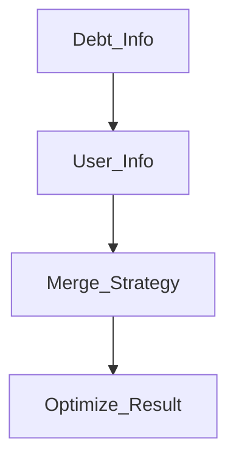
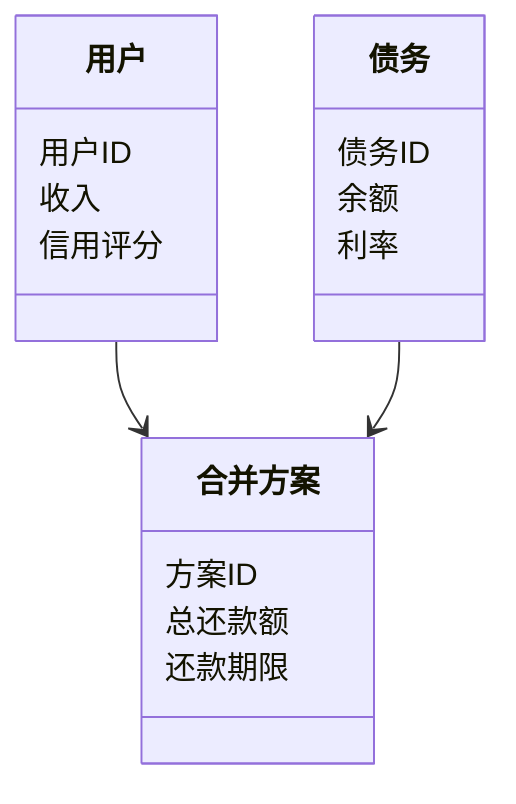

                 


# 智能债务合并建议生成器

## 关键词：智能债务合并，算法优化，AI债务管理，系统设计，项目实战

## 摘要：本文探讨智能债务合并建议生成器的背景、核心概念、算法原理、系统设计、项目实现和最佳实践。通过分析现有债务管理问题，提出基于AI的优化算法，结合系统架构设计，提供一个高效的债务合并解决方案。

---

# 第1章: 智能债务合并建议生成器的背景与问题背景

## 1.1 债务合并的背景与现状

### 1.1.1 当前债务管理的主要挑战
现代社会中，个人和企业面临多种债务来源，如信用卡、贷款、医疗账单等。债务管理变得复杂，尤其是在高利率和经济不确定性情况下。传统债务管理方法依赖人工计算和简单规则，难以应对复杂情况，导致效率低下，增加还款压力。

### 1.1.2 债务合并的定义与目标
债务合并是指将多个债务整合为一个更优的还款计划，以降低总还款额或缩短还款时间。其目标是优化债务结构，减少财务压力，提高资金利用效率。

### 1.1.3 智能债务合并的必要性与优势
智能债务合并利用AI和优化算法，根据个体的财务状况和市场条件，推荐最优的还款策略。其优势在于高效性、精确性和个性化。

## 1.2 智能债务合并问题的提出

### 1.2.1 传统债务合并方法的局限性
传统方法通常采用固定规则，如按利率排序还款，忽视了个体差异和市场变化。这种方法难以应对复杂的债务结构和多变的经济环境。

### 1.2.2 智能债务合并的核心问题描述
智能债务合并需要解决在多种约束条件下，如何选择最优的债务组合和还款计划，以实现目标函数的最大化或最小化。

### 1.2.3 智能债务合并的边界与外延
智能债务合并的边界包括输入数据范围、算法约束条件和输出结果的范围。外延则涉及与其他财务工具的集成和扩展应用。

## 1.3 智能债务合并的核心要素与概念结构

### 1.3.1 核心要素分析
- **债务信息**：包括债务金额、利率、还款期限等。
- **用户信息**：如收入、信用评分等，影响还款能力。
- **目标函数**：如最小化总还款额或最短还款期限。
- **约束条件**：如最低还款金额、信用评分要求等。

### 1.3.2 概念结构与关系图


### 1.3.3 核心要素的特征对比表格

| 核心要素       | 特征描述                     |
|----------------|------------------------------|
| 债务信息       | 包括本金、利率、还款期限等     |
| 用户信息       | 包括收入、信用评分、负债情况   |
| 目标函数       | 最小化总还款额或还款时间       |
| 约束条件       | 如最低还款额、信用评分要求     |

## 1.4 本章小结

---

# 第2章: 智能债务合并的核心概念与联系

## 2.1 智能债务合并的原理与机制

### 2.1.1 基于AI的债务优化算法
智能债务合并利用机器学习和优化算法，分析债务结构和用户需求，推荐最优合并策略。

### 2.1.2 债务合并的数学模型
建立数学模型，考虑目标函数和约束条件，找到最优解。

### 2.1.3 算法的优化目标与约束条件
- **目标**：最小化总还款额或最短还款时间。
- **约束**：如每月还款能力、最低还款要求等。

## 2.2 核心概念的属性特征对比

### 2.2.1 债务类型与还款方式对比
```mermaid
table 债务类型 | 还款方式
高利率贷款 | 高优先级还款
低利率贷款 | 低优先级还款
```

### 2.2.2 不同算法的性能对比
| 算法类型       | 优点                 | 缺点                 |
|----------------|----------------------|----------------------|
| 遗传算法       | 全局优化能力强       | 计算时间较长         |
| 模拟退火算法    | 能跳出局部最优       | 收敛速度较慢         |

### 2.2.3 算法输入与输出的特征对比
| 输入           | 输出                 |
|----------------|----------------------|
| 债务信息、用户信息 | 最优合并方案、总还款额、还款时间 |

## 2.3 ER实体关系图
```mermaid
erd
    entity 债务信息 {
        id: 债务ID
        name: 债务名称
        balance: 余额
        interest_rate: 利率
        term: 还款期限
        monthly_payment: 月还款额
    }
    entity 用户信息 {
        id: 用户ID
        name: 用户名称
        credit_score: 信用评分
        income: 收入
    }
    entity 合并方案 {
        id: 方案ID
        strategy: 合并策略
        total_cost: 总还款额
        duration: 还款期限
    }
    债务信息 --> 合并方案
    用户信息 --> 合并方案
```

## 2.4 本章小结

---

# 第3章: 智能债务合并算法原理

## 3.1 算法选择与优化目标

### 3.1.1 遗传算法的选择
遗传算法适用于复杂优化问题，适合处理多约束条件的债务合并问题。

### 3.1.2 算法的数学模型
目标函数：$$\text{minimize} \sum_{i=1}^{n} P_i$$
约束条件：
$$\sum_{i=1}^{n} P_i \leq \text{月还款能力}$$
$$P_i \geq \text{最低还款额}$$

## 3.2 遗传算法实现步骤

### 3.2.1 初始化种群
生成随机的债务合并方案。

### 3.2.2 适应度评估
计算每个方案的总还款额，评估适应度。

### 3.2.3 选择与交叉
选择高适应度的方案进行交叉，生成新方案。

### 3.2.4 变异与迭代
对新方案进行变异，迭代优化。

## 3.3 算法实现代码

```python
def fitness(individual):
    total = sum(individual)
    return total, 

def evolve_population(population, fitness_fn):
    # 实现遗传算法步骤
    pass

# 初始化种群
population = initialize()

# 迭代优化
for _ in range(max_iterations):
    population = evolve_population(population, fitness)
```

## 3.4 算法优化与改进

### 3.4.1 算法改进
增加变异概率，加速收敛。

### 3.4.2 性能对比
比较遗传算法与模拟退火算法在债务合并中的表现。

## 3.5 本章小结

---

# 第4章: 智能债务合并系统分析与架构设计

## 4.1 系统分析与设计

### 4.1.1 问题场景
用户输入债务信息和财务状况，系统生成最优合并方案。

### 4.1.2 功能设计
- 数据输入
- 算法计算
- 方案展示
- 结果输出

### 4.1.3 系统架构


### 4.1.4 系统接口设计
- API接口：接收输入，返回最优方案。

## 4.2 系统架构设计

### 4.2.1 类图


### 4.2.2 架构图


## 4.3 本章小结

---

# 第5章: 智能债务合并项目实战

## 5.1 项目环境安装

### 5.1.1 安装Python
```bash
pip install numpy
pip install matplotlib
```

## 5.2 核心代码实现

### 5.2.1 算法实现
```python
def evolve_population(population, fitness_fn):
    # 选择、交叉、变异
    pass

# 示例代码
population = [ [100, 200, 300], [400, 500, 600] ]
best = evolve_population(population, fitness)
print(best)
```

### 5.2.2 应用案例分析
用户A有两张信用卡，余额分别为$5000和$3000，利率分别为18%和12%。建议合并为一张，总还款额更低。

## 5.3 项目小结

---

# 第6章: 总结与展望

## 6.1 总结
智能债务合并通过AI优化算法，提高债务管理效率和效果。

## 6.2 展望
未来可能的研究方向包括动态债务优化和多目标优化。

## 6.3 最佳实践 tips
- 定期审查债务结构。
- 保持良好信用记录。
- 使用专业工具进行优化。

## 6.4 作者观点
智能债务合并是未来财务管理和优化的重要工具。

---

# 作者：AI天才研究院 & 禅与计算机程序设计艺术

---

这篇文章系统介绍了智能债务合并生成器的背景、算法、系统设计和项目实现，为读者提供了全面的技术视角。

