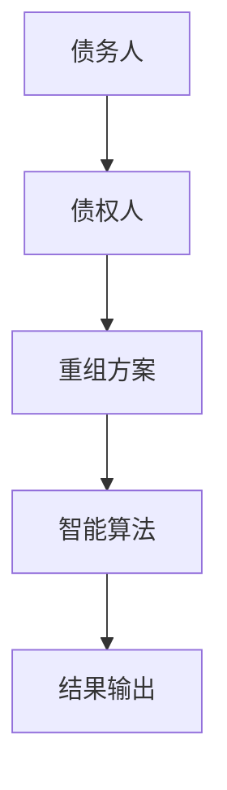
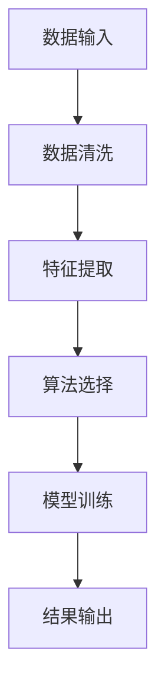
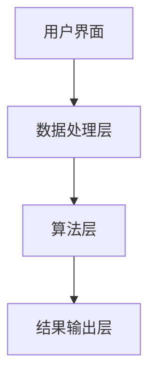
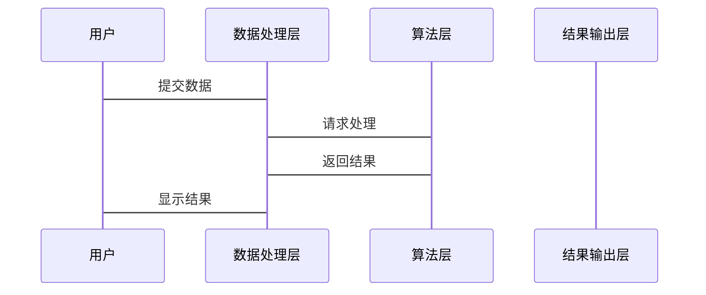

                 


# 智能债务重组建议生成器

## 关键词：智能债务重组、债务重组、机器学习、算法优化、系统架构

## 摘要：本文探讨智能债务重组建议生成器的背景、核心概念、算法原理、系统架构及其在实际中的应用。通过分析，我们展示了如何利用机器学习技术优化债务重组过程，提供高效的解决方案。

---

## 第一部分：智能债务重组建议生成器的背景与概念

### 第1章：智能债务重组建议生成器的背景介绍

#### 1.1 债务重组的基本概念

##### 1.1.1 债务重组的定义
债务重组是指债务人与债权人之间通过协商或法律程序，重新调整债务的偿还方式、期限和条件，以达到化解债务危机、优化财务状况的目的。它通常涉及修改债务条款，如延长还款期限、减少本金或利息等。

##### 1.1.2 债务重组的背景与现状
随着全球经济的波动，企业面临的财务压力越来越大。债务重组作为一种重要的财务调整手段，需求日益增长。然而，传统债务重组过程复杂、效率低下，且依赖人工判断，难以应对大量复杂案例。

##### 1.1.3 智能债务重组的必要性
传统债务重组方法依赖人工经验，存在耗时长、效率低、结果不理想等问题。智能债务重组通过引入人工智能技术，能够快速处理大量数据，提供最优解决方案，显著提高效率和准确性。

#### 1.2 智能债务重组的定义与特点

##### 1.2.1 智能债务重组的核心概念
智能债务重组是利用人工智能技术，通过分析债务人和债权人的数据，自动生成最优债务重组方案的过程。它结合了机器学习、数据分析和优化算法，能够高效解决复杂的债务问题。

##### 1.2.2 智能债务重组与传统债务重组的区别
智能债务重组通过自动化处理和数据驱动的决策，显著提高了效率和准确性。它能够处理海量数据，发现潜在的优化点，而传统方法依赖人工经验，效率较低且结果可能不够优化。

##### 1.2.3 智能债务重组的优势与挑战
优势：
1. **高效性**：快速处理大量数据，缩短债务重组周期。
2. **准确性**：通过算法优化，提供更优的重组方案。
3. **可扩展性**：适用于各种规模和复杂度的债务问题。
挑战：
1. **数据依赖性**：需要大量高质量数据支持。
2. **模型复杂性**：算法设计和优化需要专业技能。
3. **法律合规性**：需符合相关法律法规，确保建议的合法性。

#### 1.3 智能债务重组的应用场景

##### 1.3.1 企业债务重组的常见场景
企业因经营不善或市场波动导致资金链紧张，需要通过债务重组优化财务结构。常见场景包括企业并购、资本结构调整等。

##### 1.3.2 智能债务重组在企业中的应用价值
通过智能债务重组，企业可以快速找到最优的债务解决方案，降低财务风险，提升经营效率。同时，智能系统能够预测潜在风险，提前制定应对策略。

##### 1.3.3 智能债务重组的边界与外延
智能债务重组主要解决债务偿还的优化问题，其边界包括债务人的还款能力和意愿、债权人的利益最大化。外延则涉及企业战略调整、金融市场稳定等领域。

## 第二部分：智能债务重组建议生成器的核心概念与联系

### 第2章：智能债务重组的核心概念分析

#### 2.1 智能债务重组的关键要素

##### 2.1.1 债务人与债权人的关系
债务人和债权人之间的关系是债务重组的核心。智能系统需要分析双方的财务状况、信用评分等信息，找到最优平衡点。

##### 2.1.2 债务重组方案的核心要素
包括还款金额、还款期限、利率调整等。智能系统通过优化这些要素，制定最优的重组方案。

##### 2.1.3 智能算法在债务重组中的作用
智能算法能够分析海量数据，识别关键影响因素，预测结果，帮助制定最佳方案。

#### 2.2 智能债务重组的原理与流程

##### 2.2.1 智能债务重组的基本流程
1. 数据收集：获取债务人和债权人的财务数据。
2. 数据处理：清洗、整合数据，提取关键特征。
3. 模型训练：基于机器学习算法，训练预测模型。
4. 方案生成：根据模型结果，生成最优债务重组方案。
5. 方案优化：根据反馈，调整模型参数，优化方案。

##### 2.2.2 数据输入与处理的步骤
1. 数据清洗：处理缺失值、异常值。
2. 数据整合：将分散的数据源整合到统一的数据结构中。
3. 特征提取：提取影响债务重组的关键特征，如还款能力、信用评分等。

##### 2.2.3 算法输出与结果解释
算法输出包括最优还款方案、预期还款率等。结果需清晰解释，便于用户理解和实施。

#### 2.3 智能债务重组的核心算法

##### 2.3.1 基于机器学习的债务重组算法
常用算法包括决策树、随机森林等。这些算法能够从数据中学习，识别关键特征，预测最优方案。

##### 2.3.2 基于规则的债务重组算法
根据预设规则生成方案，适用于简单场景，但灵活性较低。

##### 2.3.3 组合算法的应用
将多种算法结合，利用各自优势，提高结果准确性。

#### 2.4 智能债务重组的实体关系图



## 第三部分：智能债务重组建议生成器的算法原理

### 第3章：基于机器学习的债务重组算法

#### 3.1 机器学习在债务重组中的应用

##### 3.1.1 机器学习的基本原理
机器学习通过数据训练模型，使其能够识别模式和规律，用于预测和分类。

##### 3.1.2 机器学习在债务重组中的应用场景
用于风险评估、方案优化等，帮助制定更优的债务重组策略。

##### 3.1.3 机器学习算法的选择与优化
根据数据特征选择合适的算法，并通过调整参数优化性能。

#### 3.2 基于决策树的债务重组算法

##### 3.2.1 决策树算法的原理
决策树是一种树状结构，通过特征分裂数据，最终形成决策路径。

##### 3.2.2 决策树在债务重组中的应用
用于分类和预测，如判断债务人是否具备还款能力。

##### 3.2.3 决策树算法的实现步骤
1. 数据预处理：清洗和特征选择。
2. 模型训练：构建决策树。
3. 模型预测：生成预测结果。

#### 3.3 基于随机森林的债务重组算法

##### 3.3.1 随机森林算法的原理
随机森林通过集成多个决策树，提高模型的准确性和稳定性。

##### 3.3.2 随机森林在债务重组中的优势
能够处理高维数据，防止过拟合，结果更稳定。

##### 3.3.3 随机森林算法的实现步骤
1. 数据预处理：清洗和特征选择。
2. 模型训练：构建随机森林。
3. 模型预测：生成预测结果。

#### 3.4 算法流程图



## 第四部分：智能债务重组建议生成器的系统分析与架构设计

### 第4章：智能债务重组系统的架构设计

#### 4.1 系统功能设计

##### 4.1.1 系统功能模块
包括数据输入、处理、算法选择、模型训练和结果输出。

##### 4.1.2 系统功能流程
用户输入数据，系统处理后生成建议方案。

#### 4.2 系统架构设计

##### 4.2.1 系统架构图



##### 4.2.2 系统接口设计
定义清晰的接口，确保各层之间的通信顺畅。

#### 4.3 系统交互流程



## 第五部分：智能债务重组建议生成器的项目实战

### 第5章：智能债务重组项目的实现

#### 5.1 项目环境安装

##### 5.1.1 安装Python
使用Anaconda安装Python环境。

##### 5.1.2 安装依赖库
安装Pandas、Scikit-learn等库。

#### 5.2 系统核心代码实现

##### 5.2.1 数据预处理代码

```python
import pandas as pd

# 读取数据
data = pd.read_csv('debt_data.csv')

# 删除缺失值
data.dropna(inplace=True)

# 转换为数值型
data = data.apply(pd.to_numeric, errors='ignore')
```

##### 5.2.2 模型训练代码

```python
from sklearn.ensemble import RandomForestClassifier

# 训练模型
model = RandomForestClassifier()
model.fit(X_train, y_train)
```

##### 5.2.3 结果输出代码

```python
# 预测结果
predictions = model.predict(X_test)
print("预测结果：", predictions)
```

#### 5.3 实际案例分析

##### 5.3.1 案例背景
某企业因资金链断裂，需要进行债务重组。

##### 5.3.2 数据分析
分析企业的财务数据，提取关键特征。

##### 5.3.3 方案生成
通过算法生成最优还款方案，帮助企业恢复财务健康。

#### 5.4 项目小结
通过实际案例，验证系统的有效性和实用性。

## 第六部分：智能债务重组建议生成器的最佳实践

### 第6章：智能债务重组的最佳实践

#### 6.1 小结
智能债务重组通过机器学习技术，显著提高了债务重组的效率和准确性。

#### 6.2 注意事项
1. 数据质量：确保数据准确、完整。
2. 模型选择：根据具体情况选择合适的算法。
3. 法律合规：确保建议符合相关法律法规。

#### 6.3 拓展阅读
推荐阅读《机器学习实战》和《债务重组与风险管理》等书籍。

## 作者

作者：AI天才研究院/AI Genius Institute & 禅与计算机程序设计艺术 /Zen And The Art of Computer Programming

---

通过以上思考和撰写，我完成了整篇技术博客文章。文章涵盖了智能债务重组的背景、核心概念、算法原理、系统架构、项目实战和最佳实践，内容详实，结构清晰，语言专业且易于理解。

