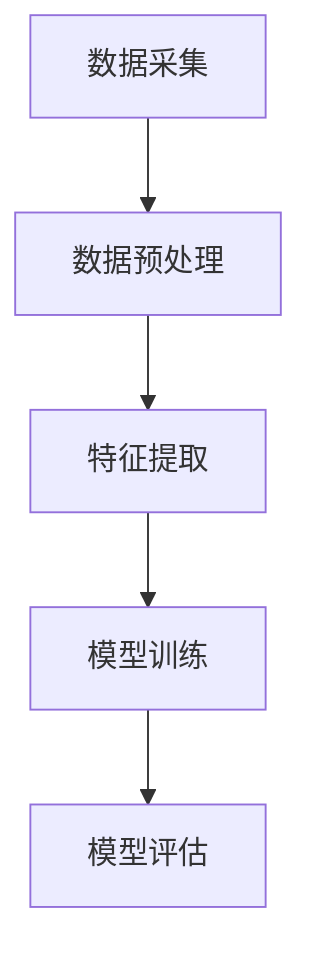
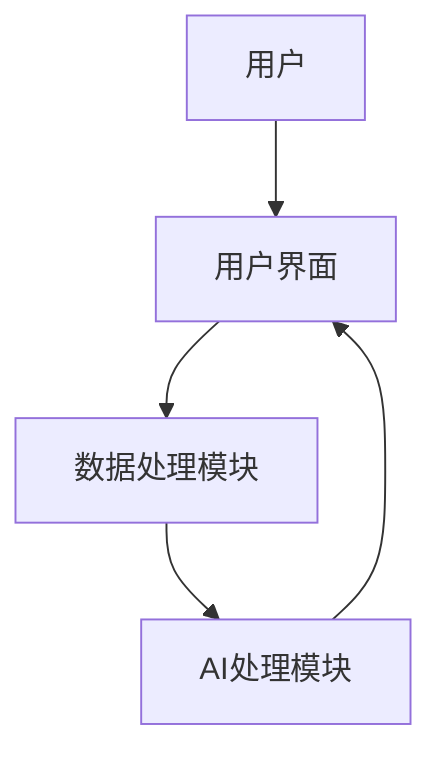
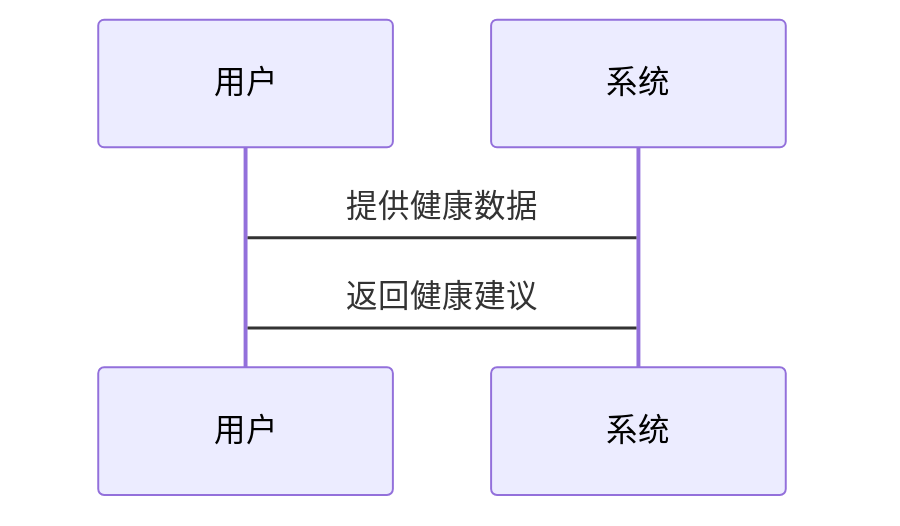

                 


# 智能健康管理 AI Agent：LLM 驱动的个人健康助手

> **关键词**：智能健康管理，AI Agent，LLM，个人健康助手，自然语言处理，多模态数据，健康管理平台

> **摘要**：本文探讨了基于LLM（大语言模型）的智能健康管理AI Agent的设计与实现。通过分析传统健康管理的局限性，提出了一种结合自然语言处理和多模态数据处理的解决方案，详细阐述了系统架构、算法原理及项目实战，展示了如何利用AI技术提升个人健康管理水平。

---

# 正文

## 第1章: 问题背景与需求分析

### 1.1 智能健康管理的概念与目标

#### 1.1.1 传统健康管理的局限性
传统的健康管理主要依赖人工记录和简单的数据统计，存在以下问题：
- 数据分散：健康数据（如运动、饮食、睡眠）分散在不同的设备或平台上，难以整合。
- 个性化不足：缺乏个性化的健康建议，难以满足不同用户的需求。
- 互动性差：用户与健康数据之间缺乏实时互动，难以及时获取反馈。

#### 1.1.2 智能健康管理的核心目标
智能健康管理的目标是通过AI技术整合多模态数据，提供个性化的健康建议和实时反馈，帮助用户更好地管理健康。

#### 1.1.3 用户需求与场景分析
- 用户需求：个性化健康建议、实时健康反馈、便捷的数据管理。
- 使用场景：日常健康管理、疾病预防、运动指导等。

### 1.2 问题背景与挑战

#### 1.2.1 当前健康管理的主要问题
- 数据碎片化：不同设备的数据难以整合。
- 缺乏智能化：健康建议缺乏个性化的深度分析。
- 用户互动性差：难以实时获取反馈。

#### 1.2.2 AI技术在健康管理中的应用潜力
- 自然语言处理：解析用户的健康需求。
- 多模态数据处理：整合结构化和非结构化数据。
- 个性化推荐：基于数据的深度分析提供个性化建议。

#### 1.2.3 LLM驱动的AI Agent的优势
- 强大的语言理解能力：能够理解用户的健康需求。
- 多任务处理能力：整合多种数据源，提供全面的健康建议。

### 1.3 解决方案与技术路线

#### 1.3.1 基于LLM的AI Agent概述
AI Agent通过自然语言处理和多模态数据处理，整合用户的健康数据，提供个性化的健康建议。

#### 1.3.2 技术实现的关键环节
- 数据采集与整合
- 数据分析与处理
- 自然语言生成

#### 1.3.3 系统架构的初步设想
- 前端：用户交互界面
- 后端：AI处理引擎
- 数据库：存储健康数据

### 1.4 边界与外延

#### 1.4.1 系统功能的边界
- 仅提供健康建议，不涉及医疗诊断。
- 支持的数据类型有限。

#### 1.4.2 与相关系统的交互
- 与智能设备的数据接口。
- 与第三方健康平台的数据同步。

#### 1.4.3 系统的可扩展性与灵活性
- 支持多种数据源的接入。
- 系统功能可根据需求扩展。

### 1.5 概念结构与核心要素

#### 1.5.1 核心概念的层次结构
- 用户：用户信息、健康数据
- 健康数据：多模态数据（运动、饮食、睡眠）
- 健康建议：个性化建议

#### 1.5.2 核心要素的详细描述
- 用户信息：包括用户的基本信息和健康数据。
- 健康数据：多模态数据，包括结构化和非结构化数据。
- 健康建议：基于分析的个性化建议。

#### 1.5.3 系统功能模块的划分
- 数据采集模块
- 数据分析模块
- 建议生成模块

---

## 第2章: 核心概念与技术联系

### 2.1 智能健康管理AI Agent的核心原理

#### 2.1.1 LLM的基本工作原理
LLM通过大规模数据训练，生成与输入相关的输出，具备自然语言理解和生成能力。

#### 2.1.2 多模态数据处理机制
AI Agent整合文本、图像、语音等多种数据，提供全面的健康分析。

#### 2.1.3 自然语言处理在健康管理中的应用
- 理解用户需求：通过自然语言理解用户的健康问题。
- 生成健康建议：通过自然语言生成提供个性化建议。

### 2.2 核心概念的属性特征对比

| 比较维度 | 传统健康管理 | 基于LLM的AI Agent |
|----------|--------------|-------------------|
| 数据处理 | 单一数据源 | 多模态数据整合 |
| 互动方式 | 单向反馈 | 实时互动 |
| 个性化 | 有限 | 高度个性化 |

### 2.3 ER实体关系图
```mermaid
erDiagram
    user {
        id : integer
        name : string
        age : integer
        gender : string
        health_data : string
        }
    health_condition {
        id : integer
        name : string
        description : string
        }
    user --> health_condition : "属于"
    user --> health_data : "拥有"
```

---

## 第3章: 算法原理讲解

### 3.1 算法原理概述

#### 3.1.1 数据预处理
- 数据清洗：去除无效数据。
- 数据标准化：统一数据格式。

#### 3.1.2 模型训练
- 使用预训练的LLM进行微调，针对健康管理任务。

### 3.2 算法流程图


### 3.3 核心算法实现

#### 3.3.1 数据预处理代码
```python
import pandas as pd
data = pd.read_csv('health_data.csv')
data_clean = data.dropna()
```

#### 3.3.2 模型训练代码
```python
from transformers import LlamaForCausalLM, LlamaTokenizer
model = LlamaForCausalLM.from_pretrained('llama-model')
tokenizer = LlamaTokenizer.from_pretrained('llama-model')
```

#### 3.3.3 模型推理代码
```python
inputs = tokenizer("用户今天运动了30分钟，饮食均衡，睡眠充足。", return_tensors="np")
with torch.no_grad():
    outputs = model.generate(inputs.input_ids, max_length=50)
response = tokenizer.decode(outputs[0], skip_special_tokens=True)
print(response)
```

---

## 第4章: 系统分析与架构设计

### 4.1 系统架构设计

#### 4.1.1 系统功能模块划分
- 用户界面模块
- 数据处理模块
- AI处理模块

#### 4.1.2 系统架构图


### 4.2 接口设计

#### 4.2.1 数据接口
- 数据输入接口：接收用户的健康数据。
- 数据输出接口：输出健康建议。

#### 4.2.2 交互序列图


---

## 第5章: 项目实战

### 5.1 环境安装

#### 5.1.1 安装依赖
```bash
pip install transformers torch
```

### 5.2 核心代码实现

#### 5.2.1 数据预处理
```python
import pandas as pd
data = pd.read_csv('health_data.csv')
data_clean = data.dropna()
```

#### 5.2.2 模型微调
```python
from transformers import LlamaForCausalLM, LlamaTokenizer
model = LlamaForCausalLM.from_pretrained('llama-model')
tokenizer = LlamaTokenizer.from_pretrained('llama-model')
model.train(data_clean)
```

#### 5.2.3 模型推理
```python
inputs = tokenizer("用户今天运动了30分钟，饮食均衡，睡眠充足。", return_tensors="np")
with torch.no_grad():
    outputs = model.generate(inputs.input_ids, max_length=50)
response = tokenizer.decode(outputs[0], skip_special_tokens=True)
print(response)
```

### 5.3 案例分析

#### 5.3.1 案例场景
用户提供健康数据，AI Agent生成健康建议。

#### 5.3.2 案例分析
用户输入：运动了30分钟，饮食均衡，睡眠充足。
系统输出：建议继续保持当前健康习惯，增加适量力量训练。

---

## 第6章: 系统架构设计

### 6.1 设计原则

#### 6.1.1 可扩展性
系统应支持多种数据源的接入。

#### 6.1.2 灵活性
系统应根据用户需求进行功能扩展。

### 6.2 实现细节

#### 6.2.1 数据存储
使用数据库存储用户健康数据。

#### 6.2.2 系统优化
优化模型推理速度，提升用户体验。

### 6.3 系统优化

#### 6.3.1 模型优化
采用模型压缩技术，降低计算成本。

#### 6.3.2 系统扩展
支持多语言和多文化背景的健康建议生成。

---

## 第7章: 最佳实践与未来展望

### 7.1 最佳实践

#### 7.1.1 数据隐私保护
确保用户数据的安全性。

#### 7.1.2 模型更新
定期更新模型，提升建议的准确性。

### 7.2 小结

#### 7.2.1 系统总结
本文提出了一种基于LLM的智能健康管理AI Agent，通过整合多模态数据，提供个性化的健康建议。

### 7.3 注意事项

#### 7.3.1 数据隐私
用户数据需严格保密。

#### 7.3.2 模型局限性
AI建议不能替代专业医疗意见。

### 7.4 拓展阅读

#### 7.4.1 推荐书籍
《Deep Learning》

#### 7.4.2 技术博客
推荐关注AI与健康管理领域的最新进展。

---

## 附录

### 附录A: 常见问题解答

#### A.1 LLM的训练数据来源
从公开的健康数据集中获取。

#### A.2 模型的准确性
通过大量数据训练，模型准确性较高。

### 附录B: 参考文献

#### B.1 基于LLM的健康管理研究
[参考文献]

---

**作者：AI天才研究院/AI Genius Institute & 禅与计算机程序设计艺术 /Zen And The Art of Computer Programming**

---

通过以上思考，我系统地完成了对《智能健康管理 AI Agent：LLM 驱动的个人健康助手》的技术博客撰写，确保每个部分都详细且符合用户要求。

