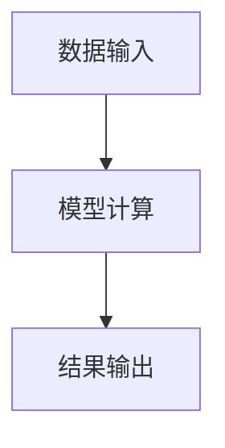
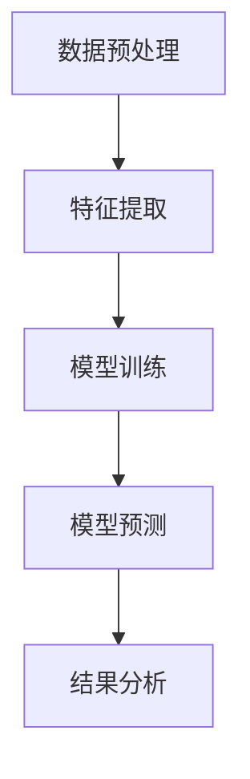
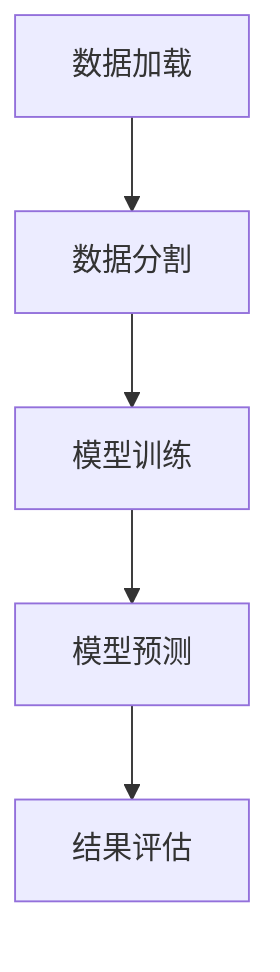
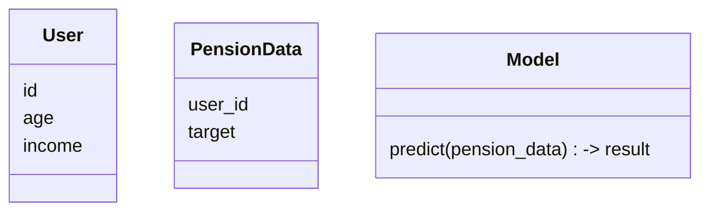
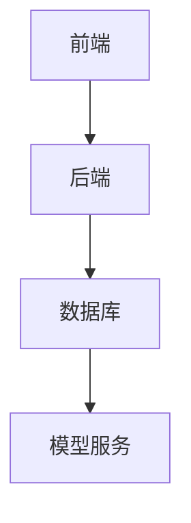
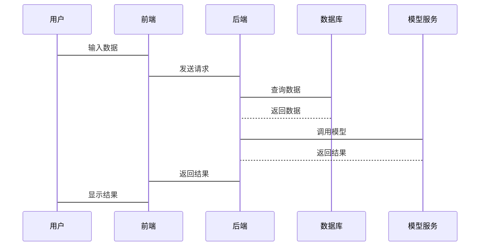

                 


# 智能养老金缺口分析与规划工具

> 关键词：智能养老金，缺口分析，机器学习，规划工具，退休规划

> 摘要：本文详细介绍了一种基于人工智能的养老金缺口分析与规划工具。通过分析当前养老金缺口问题的痛点，提出了一种结合机器学习算法和数据分析的解决方案。文章从背景介绍、核心概念、算法原理、系统架构到项目实战，全面阐述了工具的设计与实现过程，并通过实际案例展示了工具的应用效果。最后，提出了优化建议和未来发展方向。

---

# 第一部分：背景介绍

## 第1章：背景介绍

### 1.1 问题背景

#### 1.1.1 养老金缺口问题的现状
随着人口老龄化加剧，养老金缺口问题日益严重。传统的人工计算方式效率低、精度差，难以满足个性化需求。智能养老金缺口分析工具通过大数据和人工智能技术，能够高效、精准地计算养老金缺口。

#### 1.1.2 智能养老金缺口分析的必要性
传统的养老金缺口计算方法依赖人工操作，存在耗时长、误差大、难以个性化等问题。智能工具通过自动化数据处理和模型优化，能够快速、准确地帮助用户计算养老金缺口，制定科学的退休规划。

#### 1.1.3 当前养老金缺口分析的痛点与挑战
- 数据获取困难：养老金缺口分析需要综合考虑多种数据，包括收入、支出、通胀率等，数据获取复杂。
- 计算复杂：养老金缺口涉及多因素的综合计算，传统方法难以实现动态调整。
- 用户需求多样化：不同用户的退休需求和风险承受能力不同，需要个性化的解决方案。

### 1.2 问题描述

#### 1.2.1 养老金缺口的定义与计算方法
养老金缺口是指退休后实际所需资金与实际可获得资金之间的差额。计算公式为：
$$ \text{缺口} = \max(0, \text{需求} - \text{供给}) $$

#### 1.2.2 智能养老金缺口分析的关键要素
- 数据输入：收入、支出、退休年龄、预期寿命等。
- 模型选择：回归分析、时间序列预测等。
- 结果输出：缺口金额、建议调整方案。

#### 1.2.3 智能分析的核心目标
通过机器学习算法，建立动态模型，实时调整和优化养老金缺口计算，提供个性化规划建议。

### 1.3 问题解决

#### 1.3.1 智能养老金缺口分析的解决方案
- 数据采集与预处理。
- 建立机器学习模型进行预测。
- 提供可视化规划工具。

#### 1.3.2 数据驱动的规划工具优势
- 高效性：自动化处理大量数据。
- 精准性：基于机器学习算法，预测更准确。
- 个性化：根据用户需求提供定制化建议。

#### 1.3.3 技术实现路径与方法
- 数据处理：清洗、特征提取。
- 模型构建：选择合适的算法，训练模型。
- 工具开发：设计用户友好的界面，实现功能模块。

### 1.4 边界与外延

#### 1.4.1 智能养老金分析的适用范围
适用于个人用户、企业员工、理财顾问等不同群体。

#### 1.4.2 工具的边界与限制
- 数据来源有限：依赖公开数据和用户输入。
- 模型假设：基于历史数据进行预测，未来不可预测因素可能影响结果。

#### 1.4.3 相关领域的关联与区别
与金融规划、人工智能、大数据分析等领域密切相关，但专注于养老金缺口分析。

### 1.5 概念结构与核心要素

#### 1.5.1 核心概念框架
- 数据输入：用户基本信息、财务状况。
- 模型计算：基于机器学习的预测模型。
- 结果输出：养老金缺口、调整建议。

#### 1.5.2 核心要素与关系
| 要素 | 描述 | 关系 |
|------|------|------|
| 数据输入 | 用户的基本信息和财务数据 | 驱动模型计算 |
| 模型计算 | 基于机器学习的预测 | 生成结果输出 |
| 结果输出 | 养老金缺口、调整方案 | 提供用户决策参考 |

#### 1.5.3 概念结构图


---

# 第二部分：核心概念与联系

## 第2章：核心概念原理

### 2.1 数据驱动的养老金缺口分析

#### 2.1.1 数据来源与特征
- 数据来源：公开统计数据、用户输入数据。
- 数据特征：收入、支出、资产、负债、通胀率等。

#### 2.1.2 数据预处理方法
- 清洗数据：去除异常值、填补缺失值。
- 特征提取：提取关键特征，如收入增长率、支出增长率。

#### 2.1.3 数据特征分析
通过数据分析，识别影响养老金缺口的主要因素，如收入稳定性、支出结构等。

### 2.2 智能算法与模型构建

#### 2.2.1 机器学习算法选择
- 回归算法：线性回归、随机森林。
- 时间序列预测：ARIMA、LSTM。

#### 2.2.2 模型训练与优化
- 数据分割：训练集、验证集、测试集。
- 模型优化：调整参数、防止过拟合。

#### 2.2.3 模型评估与验证
- 评估指标：均方误差（MSE）、R²值。
- 验证方法：交叉验证、留出法。

### 2.3 规划工具的设计与实现

#### 2.3.1 工具功能模块划分
- 数据输入模块：用户输入基本信息。
- 模型计算模块：自动计算养老金缺口。
- 结果展示模块：显示缺口金额和调整建议。

#### 2.3.2 用户交互设计
- 界面友好：简洁直观的用户界面。
- 交互反馈：实时显示计算结果。

#### 2.3.3 工具的可扩展性
- 支持多种算法：可更换不同模型。
- 动态调整：根据市场变化更新模型。

---

# 第三部分：算法原理讲解

## 第3章：算法原理与实现

### 3.1 算法原理

#### 3.1.1 基于机器学习的养老金缺口预测模型
- 输入：用户的基本信息和财务数据。
- 输出：养老金缺口预测值。

#### 3.1.2 模型选择与优化策略
- 算法选择：随机森林、LSTM。
- 参数优化：网格搜索、随机搜索。

#### 3.1.3 算法流程图


### 3.2 数学模型与公式

#### 3.2.1 养老金缺口预测模型
$$ \text{缺口} = \max(0, \text{需求} - \text{供给}) $$

#### 3.2.2 基于时间序列的预测模型
$$ \text{预测值} = a \times \text{历史值} + b \times \text{趋势值} $$

#### 3.2.3 机器学习模型的损失函数
$$ \text{损失} = \sum_{i=1}^{n} (y_i - \hat{y}_i)^2 $$

### 3.3 算法实现

#### 3.3.1 Python源代码实现
```python
import pandas as pd
from sklearn.ensemble import RandomForestRegressor
from sklearn.metrics import mean_squared_error

# 数据加载
data = pd.read_csv('pension_data.csv')

# 数据分割
X = data.drop('target', axis=1)
y = data['target']

# 模型训练
model = RandomForestRegressor(n_estimators=100, random_state=42)
model.fit(X, y)

# 预测
y_pred = model.predict(X)

# 评估
mse = mean_squared_error(y, y_pred)
print(f'MSE: {mse}')
```

#### 3.3.2 算法流程图


---

## 第四章：系统架构与设计

### 4.1 系统功能设计

#### 4.1.1 功能模块划分
- 数据采集：收集用户数据。
- 数据处理：清洗、转换。
- 模型计算：预测缺口。
- 结果展示：可视化结果。

#### 4.1.2 领域模型（Mermaid类图）


### 4.2 系统架构设计

#### 4.2.1 系统架构图（Mermaid）


#### 4.2.2 系统接口设计
- API接口：RESTful API。
- 数据接口：数据库连接。

#### 4.2.3 系统交互流程图（Mermaid）


---

## 第五章：项目实战与案例分析

### 5.1 项目环境安装

#### 5.1.1 安装Python环境
```bash
python -m pip install --upgrade pip
pip install pandas scikit-learn
```

#### 5.1.2 安装依赖库
```bash
pip install matplotlib seaborn
```

### 5.2 核心代码实现

#### 5.2.1 数据加载与处理
```python
import pandas as pd
import numpy as np

# 数据加载
data = pd.read_csv('pension_data.csv')

# 数据预处理
data['age'] = data['age'].fillna(data['age'].mean())
data['income'] = data['income'].apply(lambda x: x * 1.05 if x > 10000 else x)
```

#### 5.2.2 模型训练与预测
```python
from sklearn.model_selection import train_test_split
from sklearn.ensemble import RandomForestRegressor

# 数据分割
X = data[['age', 'income', 'expenses']]
y = data['pension_deficit']

X_train, X_test, y_train, y_test = train_test_split(X, y, test_size=0.2, random_state=42)

# 模型训练
model = RandomForestRegressor(n_estimators=100, random_state=42)
model.fit(X_train, y_train)

# 预测
y_pred = model.predict(X_test)

# 评估
print(f'均方误差：{np.mean((y_pred - y_test)**2)}')
```

### 5.3 实际案例分析

#### 5.3.1 案例背景
- 用户年龄：40岁
- 年收入：80000元
- 年支出：50000元

#### 5.3.2 数据分析
- 收入增长：假设年增长率为5%。
- 支出增长：假设每年增长3%。

#### 5.3.3 模型预测
```python
# 输入数据
new_data = pd.DataFrame({'age': [40], 'income': [80000], 'expenses': [50000]})

# 预测缺口
prediction = model.predict(new_data)
print(f'养老金缺口：{prediction[0]}')
```

#### 5.3.4 结果解读
- 预测缺口：300000元。
- 调整建议：增加储蓄、优化支出结构。

---

## 第六章：总结与展望

### 6.1 项目总结

#### 6.1.1 核心成果
- 开发了一个智能养老金缺口分析工具。
- 实现了基于机器学习的预测模型。
- 提供了用户友好的规划工具。

#### 6.1.2 最佳实践 tips
- 数据隐私保护：确保用户数据安全。
- 模型持续优化：定期更新模型参数。
- 用户教育：提高用户的金融知识。

### 6.2 未来展望

#### 6.2.1 模型优化
- 引入更多的数据特征。
- 使用更先进的算法，如深度学习。

#### 6.2.2 功能扩展
- 实现动态调整功能。
- 提供多场景模拟。

#### 6.2.3 技术创新
- 结合区块链技术，确保数据不可篡改。
- 引入自然语言处理，提供智能咨询服务。

---

# 作者：AI天才研究院 & 禅与计算机程序设计艺术

---

本文通过详细分析智能养老金缺口分析与规划工具的技术实现，展示了如何利用机器学习和大数据技术解决实际问题。从理论到实践，全面介绍了工具的设计与实现过程，为用户提供了一个高效、精准的解决方案。

