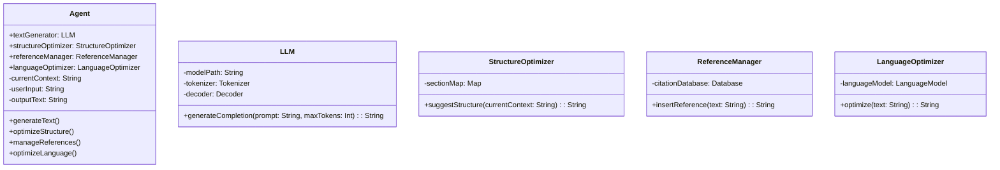
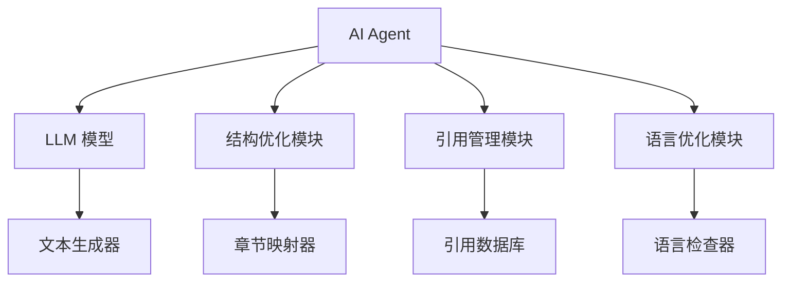
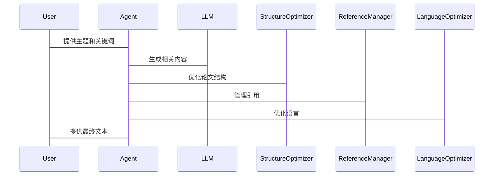

                 


# 智能写作 AI Agent：LLM 辅助学术论文与报告撰写

> 关键词：LLM, 智能写作, AI Agent, 学术论文, 自然语言处理

> 摘要：随着大语言模型（LLM）的快速发展，AI 在辅助学术论文和报告撰写方面展现出巨大潜力。本文深入探讨了 LLM 的核心原理、智能写作 AI Agent 的系统设计以及实际项目中的应用，旨在为学术研究人员和工程师提供一套基于 LLM 的智能写作解决方案。

---

# 引言

在当今快节奏的学术和商业环境中，撰写高质量的学术论文和商业报告是一项耗时且复杂的任务。传统的写作工具虽然提供了基础的文本编辑功能，但难以应对学术写作中的复杂需求，如文献引用管理、内容优化和结构生成等。近年来，大语言模型（LLM）如 GPT-3、GPT-4 等的出现，为智能写作带来了革命性的变化。本文将详细介绍如何利用 LLM 构建智能写作 AI Agent，以辅助学术论文和商业报告的撰写。

---

## 目录

1. [背景与核心概念](#背景与核心概念)
2. [LLM 的核心原理与技术](#llm的核心原理与技术)
3. [智能写作 AI Agent 的系统设计](#智能写作 ai agent 的系统设计)
4. [项目实战：基于 LLM 的写作辅助系统](#项目实战基于 llm 的写作辅助系统)
5. [总结与展望](#总结与展望)

---

## 背景与核心概念

### 1.1 学术写作的挑战

学术论文和商业报告的撰写通常涉及以下几个关键环节：
- **文献调研与综述**：需要广泛阅读相关领域的文献，并总结前人的研究成果。
- **结构设计**：包括引言、文献综述、方法、结果、讨论和结论等部分的合理安排。
- **内容创作**：需要清晰表达研究问题、方法、结果和结论。
- **引用管理**：确保引用的文献格式正确且完整。

传统的写作工具（如 Word 或 LaTeX）虽然提供了基本的文本编辑功能，但在上述环节中存在以下问题：
- **缺乏智能化**：无法根据上下文提供内容建议或自动完成。
- **效率低下**：手动整理文献和引用管理耗时且容易出错。
- **个性化支持**：难以根据具体领域或研究者的风格提供定制化建议。

### 1.2 LLM 的优势

大语言模型（LLM）通过深度学习技术，能够理解和生成人类语言。其在学术写作中的优势体现在以下几个方面：
- **内容生成**：LLM 可以根据用户提供的主题或关键词，生成相关段落或章节的内容。
- **结构优化**：通过分析论文的结构，LLM 可以提供章节安排的建议或自动补充缺失的部分。
- **引用管理**：LLM 可以根据上下文自动插入引用，并确保引用格式符合目标期刊或机构的要求。
- **语言优化**：LLM 可以对生成的内容进行语言优化，使其更加简洁、专业。

### 1.3 智能写作 AI Agent 的定义

智能写作 AI Agent 是一种基于 LLM 的工具，能够辅助用户完成学术论文和商业报告的撰写任务。它通过分析用户的输入（如主题、关键词、已有内容等），生成高质量的文本，并提供结构化建议和引用管理功能。

---

## LLM 的核心原理与技术

### 2.1 基于 Transformer 的模型结构

大语言模型的核心架构通常是基于 Transformer 模型。其主要组成部分包括：
1. **编码器（Encoder）**：将输入的文本转换为上下文表示。
2. **解码器（Decoder）**：根据编码器的输出生成目标文本。

#### Transformer 的核心公式

- **注意力机制（Attention）**：
  $$\text{Attention}(Q, K, V) = \text{softmax}\left(\frac{QK^T}{\sqrt{d_k}}\right)V$$
  其中，$Q$ 是查询向量，$K$ 是键向量，$V$ 是值向量，$d_k$ 是键的维度。

- **前馈神经网络（FFN）**：
  $$\text{FFN}(x) = \text{ReLU}(W_1x + b_1)W_2 + b_2$$

### 2.2 模型训练与优化

- **数据预处理**：对大规模文本数据进行清洗、分词和归一化处理。
- **模型并行与分布式训练**：通过并行计算加速模型训练，常用的技术包括数据并行和模型并行。
- **超参数调优**：通过调整学习率、批量大小等参数优化模型性能。

---

## 智能写作 AI Agent 的系统设计

### 3.1 系统功能设计

智能写作 AI Agent 的核心功能模块包括：
1. **文本生成模块**：根据用户输入生成相关内容。
2. **结构优化模块**：提供论文结构建议并自动补充缺失部分。
3. **引用管理模块**：自动插入引用并确保格式正确。
4. **语言优化模块**：对生成内容进行语言优化。

#### 功能模块的类图



### 3.2 系统架构设计

智能写作 AI Agent 的系统架构如下：



### 3.3 系统交互流程



---

## 项目实战：基于 LLM 的写作辅助系统

### 4.1 环境安装

为了实现智能写作 AI Agent，我们需要以下工具和库：
- Python 3.8+
- PyTorch 或 TensorFlow
- Hugging Face 的 transformers 库
- 必要的文本处理库（如 nltk、spaCy）

安装命令：
```bash
pip install torch transformers nltk spacy
python -m spacy download en_core_web_sm
```

### 4.2 核心代码实现

以下是实现智能写作 AI Agent 的核心代码示例：

```python
from transformers import AutoTokenizer, AutoModelForCausalLM
import torch
import nltk

class LLMWriter:
    def __init__(self, model_name="gpt2"):
        self.tokenizer = AutoTokenizer.from_pretrained(model_name)
        self.model = AutoModelForCausalLM.from_pretrained(model_name)
    
    def generate_text(self, prompt, max_length=500):
        inputs = self.tokenizer.encode(prompt, return_tensors="pt")
        outputs = self.model.generate(inputs, max_length=max_length, do_sample=True)
        return self.tokenizer.decode(outputs[0], skip_special_tokens=True)

    def optimize_language(self, text):
        # 使用语言模型优化文本
        optimized_text = self.generate_text(text, max_length=200)
        return optimized_text

# 示例用法
writer = LLMWriter(model_name="gpt2")
prompt = "研究背景与意义"
generated_text = writer.generate_text(prompt)
optimized_text = writer.optimize_language(generated_text)
print(optimized_text)
```

### 4.3 案例分析

假设我们需要撰写一篇关于自然语言处理的研究论文，AI Agent 的具体应用步骤如下：
1. **输入主题**：用户提供研究主题和关键词。
2. **生成内容**：AI Agent 根据主题生成研究背景、相关工作和研究方法等内容。
3. **优化结构**：AI Agent 提供论文结构建议并自动补充缺失部分。
4. **管理引用**：AI Agent 根据上下文自动插入引用。
5. **语言优化**：AI Agent 对生成内容进行语言优化，使其更加简洁专业。

---

## 总结与展望

### 5.1 小结

本文详细探讨了如何利用大语言模型（LLM）构建智能写作 AI Agent，以辅助学术论文和商业报告的撰写。通过分析 LLM 的核心原理、系统设计和实际应用，我们展示了 AI 在学术写作中的巨大潜力。

### 5.2 注意事项

- **数据隐私**：在使用 AI Agent 处理敏感数据时，需注意数据隐私和安全问题。
- **模型优化**：在实际应用中，需根据具体需求对模型进行调优，以提高生成内容的质量。
- **人机协作**：AI Agent 应作为辅助工具，而非替代人类的创造力和判断力。

### 5.3 展望

随着 LLM 技术的不断进步，智能写作 AI Agent 的功能将更加智能化和个性化。未来的研究方向包括：
- **多模态写作**：结合视觉、听觉等多模态信息，提供更丰富的写作体验。
- **领域定制化**：针对不同领域的需求，开发定制化的写作模型。
- **实时协作**：支持多人实时协作，提升团队写作效率。

---

## 作者

作者：AI天才研究院/AI Genius Institute & 禅与计算机程序设计艺术 /Zen And The Art of Computer Programming

---

通过本文的详细讲解，读者可以全面了解如何利用 LLM 技术构建智能写作 AI Agent，并在实际项目中实现其功能。希望本文能够为学术研究人员和工程师提供有价值的参考和启发。

