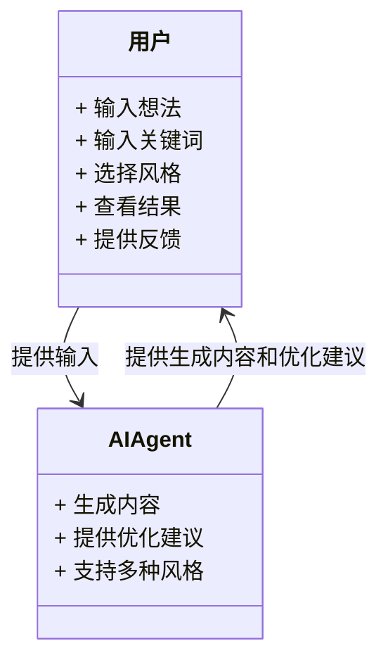
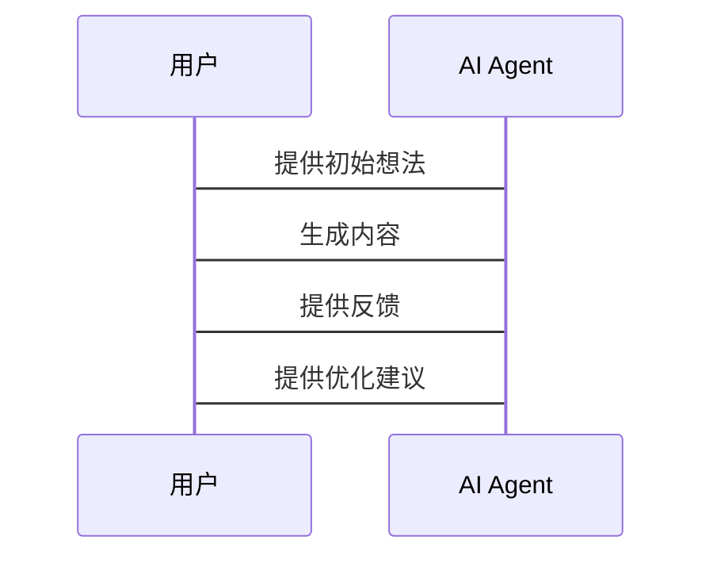

                 


# 智能写作AI Agent：LLM辅助的创意内容生成

**关键词**：智能写作，LLM，创意内容生成，AI Agent，大语言模型

**摘要**：本文探讨了如何利用大语言模型（LLM）设计一个智能写作AI代理，通过人机协作模式高效生成多样化的内容。文章详细分析了LLM的工作原理、系统架构，以及如何在实际项目中实现创意内容生成，并提供了丰富的代码示例和系统设计图。

---

## 第1章: 智能写作的背景与需求

### 1.1 内容创作的智能化趋势

#### 1.1.1 传统写作的局限性

传统写作依赖人工创作，效率低，灵感枯竭时容易停滞，且风格单一，难以满足多样化的市场需求。随着信息量的爆炸式增长，单纯依赖人工创作已经难以满足内容生产的高效需求。

#### 1.1.2 AI技术在内容创作中的潜力

AI技术，特别是大语言模型（LLM），能够高效生成高质量文本，提供多样化的风格选择，帮助创作者突破创作瓶颈。LLM通过预训练掌握了海量数据，能够理解和生成自然语言，适用于多种内容创作任务。

#### 1.1.3 LLM在创意写作中的应用前景

LLM在创意写作中的应用前景广阔，可以辅助生成小说、文章、广告文案等多种类型的内容。通过与用户的互动，LLM能够提供实时反馈和优化建议，显著提升创作效率和内容质量。

### 1.2 LLM的基本概念与特点

#### 1.2.1 大语言模型的定义

大语言模型（LLM）是基于Transformer架构的大型神经网络模型，经过大量数据的预训练，能够理解和生成自然语言文本。LLM具有参数量大、预训练、上下文理解能力强、生成能力强等特点。

#### 1.2.2 LLM的核心技术特征

- **参数量大**：通常拥有 billions 级别的参数，能够捕捉复杂的语言模式。
- **预训练**：通过在海量数据上的预训练，模型掌握了广泛的知识和语言规律。
- **生成能力强**：能够生成连贯、高质量的文本内容。

#### 1.2.3 LLM与传统NLP模型的区别

与传统NLP模型相比，LLM是通用模型，适用于多种任务，而传统模型可能针对特定任务训练。LLM能够处理复杂的上下文关系，生成多样化的内容。

### 1.3 智能写作AI Agent的定义与功能

#### 1.3.1 智能写作AI Agent的概念

智能写作AI Agent是一个智能代理，利用LLM技术辅助用户进行创意写作，提供内容生成、风格调整、灵感建议等功能。

#### 1.3.2 其主要功能与应用场景

- **功能**：内容生成、风格匹配、自动纠错、灵感激发等。
- **应用场景**：小说创作、广告文案、技术文档、新闻报道等。

#### 1.3.3 与传统写作工具的对比分析

传统写作工具可能只能提供基本的拼写检查，而AI Agent能够生成高质量内容，提供个性化建议，显著提升创作效率和质量。

---

## 第2章: LLM辅助创意内容生成的核心概念

### 2.1 智能写作的关键技术

#### 2.1.1 大语言模型的文本生成原理

LLM通过概率模型生成文本，基于上下文预测下一个词的概率分布，选择最高概率的词生成内容。生成过程可以通过贪心解码、随机采样或Beam Search等策略实现。

#### 2.1.2 人机协作模式

人机协作模式是用户和AI共同完成写作的过程。用户输入初始想法或关键词，AI生成相关内容，用户进行修改和调整，形成互动式创作过程。

#### 2.1.3 创意写作中的AI辅助机制

AI辅助机制包括内容生成、风格调整、实时反馈优化等功能，帮助用户高效生成多样化的内容，突破创作瓶颈。

### 2.2 LLM在创意写作中的优势

#### 2.2.1 高效的内容生成能力

LLM能够快速生成大量内容，显著提升创作效率。通过预训练掌握了广泛的知识和语言规律，能够生成高质量的文本内容。

#### 2.2.2 多样化的风格适应

LLM可以根据用户需求生成不同风格的内容，帮助用户打破创作瓶颈，提供多样化的创作选择。

#### 2.2.3 实时反馈与优化能力

AI能够实时分析生成内容，提供优化建议，帮助用户改进写作质量，提升创作效果。

### 2.3 创意写作中的AI Agent角色

#### 2.3.1 AI Agent在创作过程中的作用

AI Agent在创作过程中充当辅助者、学习者和反馈者的角色，帮助用户高效生成内容，提供个性化建议，实时优化写作质量。

#### 2.3.2 人机协作的写作模式

人机协作模式通过结合人类的创造力和AI的高效生成能力，显著提升创作效率和内容质量。

#### 2.3.3 创意写作中的伦理与边界

在创意写作中，AI Agent需要尊重用户的创作意图，保护用户隐私，避免生成侵权或不适当的内容，确保生成内容的合法性和伦理性。

---

## 第3章: 大语言模型的训练与生成机制

### 3.1 LLM的模型结构与训练方法

#### 3.1.1 基于Transformer的模型架构

LLM基于Transformer架构，包括编码器和解码器，通过自注意力机制捕捉上下文信息，实现高效的文本生成。

#### 3.1.2 预训练任务与损失函数

预训练任务如Masked Language Model（遮蔽语言模型），任务是预测被遮蔽的词，训练模型理解上下文。损失函数通常采用交叉熵损失函数，用于衡量预测值与真实值的差异。

$$
\text{交叉熵损失} = -\frac{1}{N}\sum_{i=1}^{N} \sum_{j=1}^{M} y_{ij}\log(p_{ij})
$$

其中，\(N\) 是样本数量，\(M\) 是词表大小，\(y_{ij}\) 是真实概率，\(p_{ij}\) 是预测概率。

#### 3.1.3 巨量数据的训练策略

巨量数据的训练策略包括数据清洗、数据增强、分布式训练等，确保模型能够充分学习语言规律，提升生成质量。

### 3.2 文本生成的解码过程

#### 3.2.1 解码策略

解码策略包括贪心解码、随机采样、Beam Search等。贪心解码选择概率最高的词生成，随机采样引入随机性以增加多样性，Beam Search通过生成多个候选取最高概率的序列。

#### 3.2.2 温度参数

温度参数用于调整生成的创造性。温度越高，生成越多样化，但可能降低连贯性；温度越低，生成越保守，连贯性更强。

$$
\text{生成概率} = \frac{p_i}{\sum p_j^{\text{温度}}}
$$

其中，\(p_i\) 是原始概率，温度参数通过调整指数影响概率分布。

---

## 第4章: LLM辅助创意内容生成的系统设计

### 4.1 项目背景与目标

#### 4.1.1 项目背景

随着内容需求的增加，需要高效、智能的写作工具。传统写作工具功能单一，无法满足多样化的创作需求。

#### 4.1.2 项目目标

设计一个基于LLM的智能写作AI Agent，辅助用户高效生成创意内容，提供多样化的风格选择和实时反馈优化。

### 4.2 系统功能设计

#### 4.2.1 领域模型

通过Mermaid图展示领域模型，包括用户交互、内容生成、反馈优化等核心功能模块。



#### 4.2.2 系统架构设计

通过Mermaid图展示系统架构，包括前端界面、LLM服务、后端逻辑等模块。


#### 4.2.3 系统交互设计

通过Mermaid序列图展示系统交互流程，包括用户输入、生成内容、反馈优化等步骤。



### 4.3 项目核心代码实现

#### 4.3.1 环境安装与配置

安装必要的库，如TensorFlow、Keras、Hugging Face的库等。

```bash
pip install transformers torch
```

#### 4.3.2 核心功能实现

使用Python代码实现一个简单的LLM驱动的内容生成器，如加载模型、生成内容等。

```python
from transformers import AutoTokenizer, AutoModelForCausalLM
import torch

model_name = "gpt2"
tokenizer = AutoTokenizer.from_pretrained(model_name)
model = AutoModelForCausalLM.from_pretrained(model_name)

def generate_text(prompt, max_length=500):
    inputs = tokenizer.encode(prompt, return_tensors="pt")
    outputs = model.generate(inputs, max_length=max_length, do_sample=True)
    text = tokenizer.decode(outputs[0], skip_special_tokens=True)
    return text

# 示例使用
prompt = "写一篇关于人工智能的科普文章"
result = generate_text(prompt)
print(result)
```

---

## 第5章: 项目实战

### 5.1 实际案例分析

通过实际案例分析LLM在创意写作中的应用，如生成小说章节、广告文案等。

#### 5.1.1 案例1：生成小说章节

用户输入：“主角发现了一间神秘的房间。”

AI Agent生成内容：

“主角推开门，眼前是一个充满神秘感的房间。墙壁上挂满了古老的画作，空气中弥漫着一股诡异的气息。主角的心跳加速，一种不安的预感涌上心头。”

#### 5.1.2 案例2：生成广告文案

用户输入：“设计一个吸引人的咖啡品牌广告。”

AI Agent生成内容：

“品味时光，每一口都是经典。选择我们的咖啡，感受独特的风味与品质。”

### 5.2 系统实现与代码解读

详细解读代码实现，展示如何通过Python代码实现内容生成功能，并分析每一步的作用。

#### 5.2.1 加载模型与tokenizer

```python
tokenizer = AutoTokenizer.from_pretrained("gpt2")
model = AutoModelForCausalLM.from_pretrained("gpt2")
```

#### 5.2.2 生成内容的函数实现

```python
def generate_text(prompt, max_length=500):
    inputs = tokenizer.encode(prompt, return_tensors="pt")
    outputs = model.generate(inputs, max_length=max_length, do_sample=True)
    text = tokenizer.decode(outputs[0], skip_special_tokens=True)
    return text
```

#### 5.2.3 示例使用

```python
prompt = "写一篇关于人工智能的科普文章"
result = generate_text(prompt)
print(result)
```

### 5.3 项目小结

通过实际案例分析和系统实现，展示了LLM在创意内容生成中的强大能力。代码示例帮助读者理解如何在实际项目中应用这些技术。

---

## 第6章: 最佳实践与总结

### 6.1 最佳实践

- **模型选择**：根据具体需求选择合适的LLM模型，如较小的模型适合资源有限的场景，较大的模型适合需要更高生成质量的任务。
- **参数调整**：如温度、重复率等，以优化生成效果。
- **用户反馈**：收集用户反馈，持续优化系统。

### 6.2 项目小结

通过本项目，我们成功设计并实现了一个基于LLM的智能写作AI Agent，能够高效辅助用户进行创意内容生成。系统的实现展示了LLM在实际应用中的潜力和效果。

### 6.3 注意事项

- **数据隐私**：确保用户输入和生成的内容符合隐私保护要求。
- **计算资源**：运行LLM需要较高的计算资源，需做好资源规划。
- **模型更新**：定期更新模型，保持生成内容的时效性和准确性。

### 6.4 拓展阅读

- 推荐阅读《Effective Modern Python》、《Python机器学习实战》等书籍，深入理解Python和机器学习的应用。

---

## 作者信息

作者：AI天才研究院（AI Genius Institute）& 禅与计算机程序设计艺术（Zen And The Art of Computer Programming）

---

通过以上章节，我们详细探讨了智能写作AI Agent的设计与实现，从背景、原理、系统设计到项目实战，全面解析了LLM在创意内容生成中的应用。希望读者通过本文能够理解并掌握如何利用大语言模型辅助创意写作，提升创作效率和质量。

