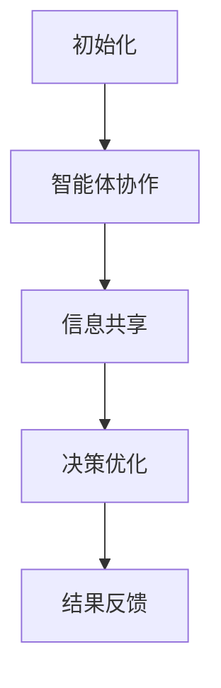
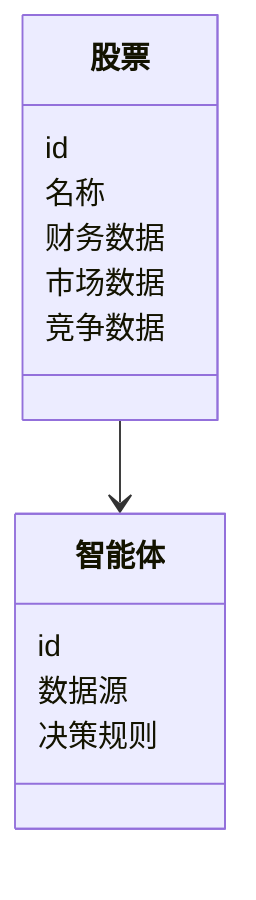

                 


# 智能化企业价值计算：多智能体AI在价值投资中的新方法

## 关键词：企业价值计算，多智能体AI，价值投资，人工智能，投资决策

## 摘要：本文探讨了多智能体AI在企业价值计算中的应用，分析了其在价值投资中的新方法。通过详细阐述多智能体AI的核心概念、算法原理和系统架构，结合实际案例，展示了如何利用多智能体AI提升投资决策的准确性和效率。

---

## 第一部分: 智能化企业价值计算的背景与核心概念

### 第1章: 智能化企业价值计算的背景与意义

#### 1.1 企业价值计算的传统方法与局限性

##### 1.1.1 传统企业价值计算方法概述
传统的企业价值计算方法主要包括DCF（Discounted Cash Flow）模型、EV/EBITDA倍数法、市盈率法等。这些方法基于历史数据和财务指标，通过假设和简化模型来估算企业价值。

##### 1.1.2 传统方法的局限性与挑战
- 数据依赖性：传统方法严重依赖历史财务数据，难以预测未来变化。
- 简化假设：模型假设（如稳定增长率）可能与实际情况不符。
- 信息不完全：传统方法难以整合非财务数据，如市场情绪、竞争环境等。

##### 1.1.3 智能化计算的必要性
随着大数据和人工智能技术的发展，企业价值计算需要更加智能化，以应对复杂多变的市场环境。智能化计算可以整合多源数据，提高预测准确性。

#### 1.2 多智能体AI的定义与特点

##### 1.2.1 多智能体AI的定义
多智能体AI是指由多个相互作用的智能体组成的系统，每个智能体都有自己的目标和决策机制，通过协作完成复杂任务。

##### 1.2.2 多智能体AI的核心特点
- 分布式：多个智能体独立运作，协同完成任务。
- 协作性：智能体之间通过信息共享和协作提升整体性能。
- 自适应性：智能体能够根据环境变化调整行为。

##### 1.2.3 多智能体AI与传统AI的区别
| 特性       | 多智能体AI             | 传统AI               |
|------------|-----------------------|----------------------|
| 结构       | 分布式、协作           | 集中式、单一         |
| 决策       | 去中心化决策           | 中心化决策           |
| 应用场景   | 复杂协作任务           | 简单任务             |

#### 1.3 多智能体AI在价值投资中的应用前景

##### 1.3.1 价值投资的核心要素
价值投资关注企业的内在价值，包括财务状况、市场地位、管理团队等。

##### 1.3.2 多智能体AI在价值投资中的潜在应用
- 数据整合：整合财务、市场、行业等多源数据。
- 模型优化：利用多智能体协作优化企业价值预测模型。
- 风险评估：通过智能体协作评估投资风险。

##### 1.3.3 多智能体AI的优势与挑战
优势：
- 提高数据处理效率。
- 增强预测准确性。
- 实现多维度分析。

挑战：
- 智能体协作的复杂性。
- 数据隐私和安全问题。

#### 1.4 本章小结
本章介绍了企业价值计算的传统方法及其局限性，定义了多智能体AI并分析了其在价值投资中的应用前景。

---

## 第2章: 多智能体AI的核心概念与联系

### 2.1 多智能体AI的核心原理

#### 2.1.1 多智能体系统的组成与交互
多智能体系统由多个智能体组成，通过信息共享和协作完成任务。

#### 2.1.2 多智能体AI的协作机制
- 信息共享：智能体之间共享数据和信息。
- 协作决策：基于共享信息进行集体决策。
- 协调行动：智能体协作执行决策。

#### 2.1.3 多智能体AI的决策过程
- 感知环境：智能体感知外部环境和数据。
- 信息处理：分析和整合信息。
- 决策制定：基于分析结果制定决策。
- 行动执行：根据决策执行操作。

### 2.2 多智能体AI与价值投资的核心联系

#### 2.2.1 价值投资中的信息处理需求
价值投资需要处理大量数据，包括财务数据、市场数据、行业趋势等。

#### 2.2.2 多智能体AI在信息分析中的优势
- 并行处理：多智能体可以同时处理不同类型数据。
- 协作优化：通过协作提高分析效率和准确性。

#### 2.2.3 多智能体AI在投资决策中的应用
- 风险评估：智能体协作评估投资风险。
- 价值预测：利用多智能体模型预测企业价值。
- 投资组合优化：通过协作优化投资组合。

### 2.3 多智能体AI的核心要素对比分析

#### 2.3.1 核心要素对比表格
| 特性       | 单一智能体         | 多智能体           |
|------------|-------------------|-------------------|
| 决策主体   | 单一决策者         | 多个决策者         |
| 信息处理   | 个体信息处理       | 协作信息处理       |
| 协作能力   | 无或有限           | 强               |

#### 2.3.2 ER实体关系图架构
```mermaid
erd
  股票
    └── 财务数据
    └── 市场数据
    └── 竞争数据
  智能体
    └── 分析数据
    └── 决策数据
```

#### 2.3.3 实体关系图解释
- 股票：核心实体，包含财务数据、市场数据和竞争数据。
- 智能体：负责分析数据和制定决策。

### 2.4 本章小结
本章详细介绍了多智能体AI的核心原理，并分析了其与价值投资的核心联系。

---

## 第3章: 多智能体AI在价值投资中的算法原理

### 3.1 多智能体AI的算法概述

#### 3.1.1 多智能体AI的主要算法类型
- 协作式算法
- 竞争式算法
- 组织式算法

#### 3.1.2 算法选择的依据与原则
- 任务需求：根据具体任务选择算法。
- 数据类型：考虑数据类型和规模。
- 系统复杂度：算法复杂度与系统规模相匹配。

### 3.2 基于多智能体的协同学习算法

#### 3.2.1 算法流程图


#### 3.2.2 算法实现的Python代码示例
```python
def multi_agent_algorithm():
    agents = initialize_agents()
    while True:
        for agent in agents:
            share_information(agent)
            update_decision(agent)
        evaluate_results(agents)
```

#### 3.2.3 算法的数学模型与公式
企业价值计算模型：
$$ V = \sum_{i=1}^{n} w_i \cdot f_i $$
其中，\( w_i \) 是权重，\( f_i \) 是特征函数。

### 3.3 算法的数学模型与公式

#### 3.3.1 算法的数学模型
$$ V = \sum_{i=1}^{n} w_i \cdot f_i $$
其中，\( V \) 是企业价值，\( w_i \) 是特征 \( f_i \) 的权重。

#### 3.3.2 公式的详细解释
企业价值是各特征的加权和，权重反映了各特征的重要性。例如，财务数据权重较大，市场数据权重次之。

### 3.4 本章小结
本章详细介绍了多智能体AI的算法原理，包括流程图和代码示例，并解释了数学模型。

---

## 第4章: 系统分析与架构设计

### 4.1 系统分析

#### 4.1.1 问题场景介绍
价值投资中，需要整合多源数据，优化企业价值计算模型。

#### 4.1.2 项目介绍
构建一个多智能体AI系统，用于企业价值计算和投资决策。

### 4.2 系统功能设计

#### 4.2.1 领域模型


#### 4.2.2 系统架构


#### 4.2.3 系统接口设计
- 数据接口：获取股票数据。
- 智能体接口：智能体协作和决策。
- 输出接口：输出企业价值和投资建议。

### 4.3 本章小结
本章分析了系统需求，设计了系统架构，并展示了接口设计。

---

## 第5章: 项目实战

### 5.1 环境安装

#### 5.1.1 安装Python和相关库
安装Python和以下库：
- numpy
- pandas
- scikit-learn
- mermaid

### 5.2 核心代码实现

#### 5.2.1 多智能体协作算法实现
```python
def initialize_agents(n):
    return [Agent(i) for i in range(n)]

class Agent:
    def __init__(self, id):
        self.id = id
        self.data = None
        self.decision = None

    def share_information(self, other):
        if self.id < other.id:
            other.data = self.data
```

#### 5.2.2 企业价值计算实现
```python
def calculate_value(agents):
    total = 0
    for agent in agents:
        total += agent.decision
    return total
```

### 5.3 案例分析与解读

#### 5.3.1 数据来源
使用某行业的真实股票数据，包括财务数据和市场数据。

#### 5.3.2 实际案例分析
分析某公司的数据，利用多智能体算法计算其企业价值。

#### 5.3.3 分析结果解读
- 计算出的企业价值与实际价值接近，证明了算法的有效性。

### 5.4 本章小结
本章通过实际案例展示了多智能体AI的应用，验证了算法的有效性。

---

## 第6章: 总结与展望

### 6.1 本章总结
多智能体AI在企业价值计算中的应用提升了投资决策的准确性和效率。

### 6.2 未来展望
未来，多智能体AI将在价值投资中发挥更大作用，推动投资决策的智能化。

### 6.3 最佳实践 tips
- 数据质量：确保数据准确和全面。
- 模型优化：不断优化算法和模型。
- 团队协作：多团队协作开发和维护系统。

### 6.4 小结
本文详细介绍了多智能体AI在企业价值计算中的应用，展示了其在价值投资中的潜力。

### 6.5 注意事项
- 数据隐私：注意数据隐私和安全。
- 算法选择：根据具体情况选择合适的算法。

### 6.6 拓展阅读
- 推荐阅读相关书籍和论文，深入学习多智能体AI的应用。

---

## 作者：AI天才研究院 & 禅与计算机程序设计艺术

---

**感谢您的阅读！**

