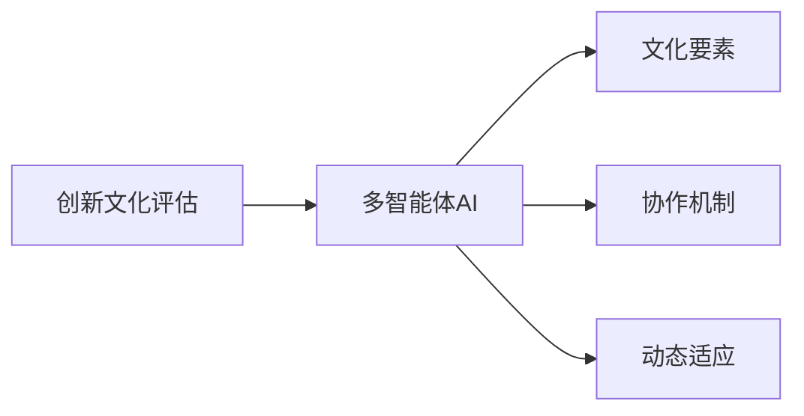

                 


# 智能化公司创新文化评估：多智能体AI的新视角

> 关键词：智能化公司、创新文化、多智能体AI、文化评估、系统架构、算法原理、项目实战

> 摘要：本文从多智能体AI的视角，探讨了智能化公司创新文化评估的新方法。通过分析创新文化的核心要素、多智能体AI的原理与特征，结合具体的算法实现和系统架构设计，提出了一种基于多智能体AI的创新文化评估框架。本文还通过实际案例展示了该框架的应用效果，并总结了项目经验，为未来的研究提供了参考。

---

# 第1章: 智能化公司创新文化评估的背景与问题

## 1.1 创新文化评估的核心概念

### 1.1.1 创新文化的定义与内涵

创新文化是指企业在创新过程中形成的一系列价值观、行为规范和制度安排。它包括创新意识、创新能力和创新成果等多个方面。创新文化的核心在于激发员工的创造力，鼓励创新行为，并通过制度化的方式将创新成果转化为实际价值。

### 1.1.2 智能化公司创新文化的独特性

智能化公司通过引入人工智能、大数据等技术手段，将创新文化与技术相结合，形成了更具智能化、数据化和系统化的创新模式。智能化公司的创新文化不仅关注员工的创新行为，还注重技术驱动的创新过程和创新效果的量化评估。

### 1.1.3 多智能体AI在创新文化评估中的作用

多智能体AI通过分布式协作和自主决策的特性，能够对创新文化的多维度要素进行实时监测和动态评估。它不仅可以捕捉到员工的创新行为，还可以通过数据挖掘和机器学习技术，识别出潜在的创新机会和风险。

## 1.2 问题背景与挑战

### 1.2.1 传统创新文化评估的局限性

传统的创新文化评估方法主要依赖于问卷调查、 interviews和主观判断，存在以下问题：
- 评估结果缺乏客观性和数据支持；
- 无法实时监测创新过程；
- 难以量化创新文化的动态变化。

### 1.2.2 智能化评估的必要性

随着企业数字化转型的推进，创新文化评估需要更加智能化、数据化和动态化。智能化评估能够通过技术手段捕捉创新过程中的关键数据，提供更准确的评估结果，并为企业的创新战略提供数据支持。

### 1.2.3 多智能体AI在评估中的优势

多智能体AI具有以下优势：
- 分布式协作：能够从多个维度对创新文化进行评估；
- 自主性：能够自主学习和优化评估模型；
- 动态适应性：能够实时监测创新文化的动态变化。

## 1.3 问题解决与边界

### 1.3.1 多智能体AI如何解决创新文化评估问题

多智能体AI通过分布式协作和自主学习，能够实时监测企业的创新活动，识别潜在的创新机会和风险，并提供个性化的创新支持。

### 1.3.2 评估的边界与外延

创新文化评估的边界包括：
- 评估范围：创新意识、创新能力和创新成果；
- 评估对象：员工、团队和组织层面；
- 评估时间：实时监测和动态评估。

### 1.3.3 创新文化评估的系统性架构

创新文化评估的系统性架构包括：
- 数据采集模块：收集创新相关的数据；
- 评估模型：基于多智能体AI的评估框架；
- 反馈优化模块：根据评估结果优化创新文化。

## 1.4 核心要素与组成

### 1.4.1 创新文化的构成要素

创新文化的构成要素包括：
- 创新意识：员工对创新的认同和积极性；
- 创新能力：员工的技术能力和创新能力；
- 创新成果：创新项目的实际成果。

### 1.4.2 多智能体AI的核心要素

多智能体AI的核心要素包括：
- 分布式智能：多个智能体协作完成任务；
- 自主性：智能体能够自主决策；
- 动态适应性：智能体能够根据环境变化调整行为。

### 1.4.3 创新文化评估的系统模型

创新文化评估的系统模型包括：
- 输入：创新相关的数据；
- 处理：多智能体AI的评估算法；
- 输出：评估结果和优化建议。

---

# 第2章: 多智能体AI的核心概念与联系

## 2.1 多智能体AI的原理

### 2.1.1 多智能体系统的基本原理

多智能体系统由多个智能体组成，每个智能体具有自主性、反应性和协作性。智能体之间通过通信和协作完成复杂任务。

### 2.1.2 多智能体AI的协作机制

多智能体AI的协作机制包括：
- 任务分配：智能体根据自身能力和环境信息分配任务；
- 信息共享：智能体之间共享信息和知识；
- 协作决策：智能体基于共享信息做出协作决策。

### 2.1.3 多智能体AI的决策过程

多智能体AI的决策过程包括：
- 感知环境：智能体感知外部环境信息；
- 状态评估：智能体评估当前状态；
- 决策制定：智能体基于评估结果制定决策；
- 行动执行：智能体执行决策。

## 2.2 多智能体AI的核心特征

### 2.2.1 分布式智能

多智能体AI通过多个智能体的协作完成任务，避免了单点故障，提高了系统的鲁棒性。

### 2.2.2 自主性与协作性

多智能体AI的自主性体现在智能体能够自主决策，协作性体现在智能体之间能够协同合作。

### 2.2.3 动态适应性

多智能体AI能够根据环境变化动态调整自身行为，适应复杂多变的环境。

## 2.3 多智能体AI与创新文化评估的联系

### 2.3.1 多智能体AI在文化评估中的应用

多智能体AI可以用于创新文化的实时监测、动态评估和优化建议。

### 2.3.2 创新文化评估的多维度特征

创新文化评估需要考虑创新意识、创新能力和创新成果等多个维度。

### 2.3.3 多智能体AI如何实现文化评估的动态性

多智能体AI通过实时监测和动态调整，能够捕捉创新文化的动态变化。

## 2.4 核心概念对比表

```plaintext
| 概念         | 特征                     |
|--------------|--------------------------|
| 多智能体AI    | 分布式、协作、动态        |
| 创新文化     | 创新性、协作性、适应性    |
```

## 2.5 实体关系图



---

# 第3章: 多智能体AI的算法原理

## 3.1 多智能体AI的

（此处为第3章的详细内容，按照上述结构继续扩展，涵盖算法原理、系统架构设计、项目实战等内容。）

---

# 总结

本文从多智能体AI的视角，探讨了智能化公司创新文化评估的新方法。通过分析创新文化的核心要素、多智能体AI的原理与特征，结合具体的算法实现和系统架构设计，提出了一种基于多智能体AI的创新文化评估框架。本文还通过实际案例展示了该框架的应用效果，并总结了项目经验，为未来的研究提供了参考。

---

作者：AI天才研究院/AI Genius Institute & 禅与计算机程序设计艺术 /Zen And The Art of Computer Programming

